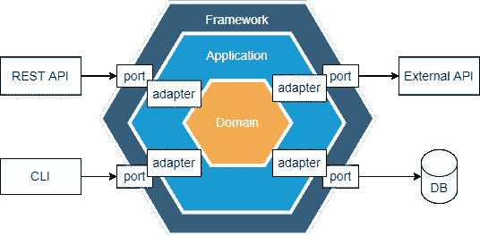
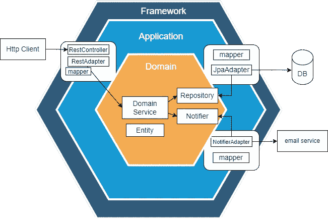

# 导致框架独立性的架构

> 原文：<https://levelup.gitconnected.com/the-secret-design-that-leads-to-complete-framework-independence-12aa8cbd852c>

让我们讨论六边形架构背后的想法，看看它能提供什么。

由 [Lenstravelier](https://unsplash.com/@lenstravelier?utm_source=medium&utm_medium=referral) 在 [Unsplash](https://unsplash.com?utm_source=medium&utm_medium=referral) 上拍摄的照片

# 1.概观

*、【六角形架构】、【干净架构】、【端口和适配器】、【洋葱架构】——都是关于应用程序理想设计的同一组概念和想法的不同名称。*

在本文中，我们将讨论这些概念，并了解它们如何帮助我们构建可测试、可移植和独立于框架的应用程序。

# 2.原则

六边形架构是一种设计，它允许我们专注于应用程序的业务逻辑，并在核心域和它周围的组件之间保持松散耦合。

为了实现这种松散耦合、可测试和可移植的设计，我们需要定义一系列逻辑边界。

因此，我们的应用程序将被分成小的、分离的组件。这些组件中的每一个都属于三个主要层之一:

*   **框架层** —保存特定于框架的配置，并允许利用*外部世界*
*   **应用层** —充当域层的中介:验证和映射传入的数据
*   **域层**——负责*所有*业务逻辑

主要原则是让每一层都独立于外层。因此，我们将能够在不影响业务逻辑的情况下更改外层的任何组件。

# 3.端口和适配器

这种架构也被称为*端口和适配器*。让我们看下图，观察这些端口和适配器的作用。

## **3.1 端口**

在六边形的边缘，我们可以观察到*端口。*所有与外界的交流都将通过他们来完成。它们不应该包含任何逻辑。

图左侧的端口也称为*主端口:*它们驱动应用程序。

在我们的例子中，客户端可以使用 REST API 或 CLI 通过它们访问应用程序。

另一方面，图中右侧的端口称为*二级端口*，它们由应用程序驱动。

*二级端口*用于与外部 API、数据源等其他组件通信。

## 3.2 适配器

*适配器*的目的是通过验证来自外层的数据，将其转换为业务对象，并将其传递给内层，从而处理来自外层的数据。

适配器还可以包装外部依赖项，提供更好的 API 和更适合调用者上下文的返回类型。

# 4.领域层

领域层应该用从业务角度来看有意义的对象来构建。这些对象可以分为 3 类:

*   实体
*   价值对象
*   域服务

## 4.1 实体

**实体持有数据，它们用包含业务逻辑的方法来丰富数据，以验证和更新它们的内部状态。**

从商业角度来看，它们应该总是有效的。我们可以通过构造函数级别的自我验证来实现这一点。

而且要保持很强的封装性。如果我们只允许通过方法改变实体的内部数据，我们可以很容易地在改变状态之前添加验证。这将确保在任何给定的时间，我们都将拥有有效的业务数据。

## 4.2 价值对象

如果有几组字段通常在方法之间一起传递，或者在我们的实体中一起声明，我们可以将它们提取到小类中。他们将被称为*价值对象。*

*例如，我们可以想到像*、“全名”、“地址”、“电子邮件”这样的对象。****值对象*理想情况下应该是小的、不可变的对象。***

***此外，我们应该能够只根据两个值对象的内部状态来比较它们。**换句话说，如果它们有相同的数据，它们应该是相等的。*

## *4.3 域服务*

*最后，“*域服务*”是负责更复杂的业务逻辑的对象。*

*这些用例通常需要多个实体或者与外部世界的通信。*

*当与外部组件通信时，我们需要使用依赖倒置原则。这意味着我们的域层将公开一个接口，该接口需要由来自应用层的类来实现。这个类最终将调用外部组件 map，并将响应传递回域服务。*

*这种抽象对于实现领域层的完全独立至关重要。因此，我们的域服务不知道数据是如何持久化和检索的。例如，它可以是到数据库的直接连接、HTTP 调用或任何其他实现:无论哪种方式，域的行为都是一样的。*

# *5.单元测试*

*这种方法的最大好处之一是它将导致真正可靠和快速的单元测试。*

*这是因为我们可以测试核心域和其中的所有业务，而无需执行任何框架配置、启动 web 服务器、数据库等。*

**

*是时候测试这个业务逻辑了！—[国立癌症研究所](https://unsplash.com/@nci?utm_source=medium&utm_medium=referral)在 [Unsplash](https://unsplash.com?utm_source=medium&utm_medium=referral) 上拍摄的照片*

***然而，我们的目标是将领域逻辑与外部组件完全分离:这也将包括单元测试！***

*因此，我们应该避免通过从外层调用方法来测试核心逻辑。*

*换句话说，最好不要通过 HTTP 调用、DTO 对象来测试应用程序的用例..等等。*

*如果我们决定改变其中一个适配器，这不应该破坏我们领域逻辑的任何测试。例如，迁移到 API 的*“v2”*不应该影响任何业务规则测试。*

# *6.结论*

*在本文中，我们讨论了六边形架构背后的主要思想。*

*可以使用各种名称来指代这组设计原则:“干净架构”、“洋葱架构”和“端口和适配器”都可以互换使用。*

*我们了解到主要的概念是让源代码依赖指向内部:从*框架层* = >到*应用层* = >再到*领域层*。*

*因此，我们的领域逻辑将与外层完全分离。这意味着我们将能够单独测试它，而不需要网络服务器或数据库。*

**

*Marc Mintel 在 [Unsplash](https://unsplash.com?utm_source=medium&utm_medium=referral) 上拍摄的照片*

# *谢谢大家！*

*感谢你阅读这篇文章，请让我知道你的想法！欢迎任何反馈。*

*如果你想阅读更多关于干净的代码、设计、单元测试、函数式编程以及许多其他内容，请务必查看我的其他文章。*

*如果你喜欢我的内容，可以考虑[关注或者订阅](https://medium.com/@emanueltrandafir)的邮件列表。*

*最后，如果你考虑成为一名中等会员并支持我的博客，这里是我的[推荐人](https://medium.com/@emanueltrandafir/membership)。*

*编码快乐！*