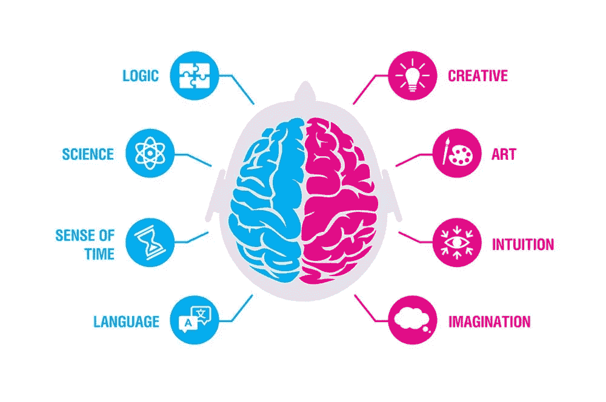

# 伟大软件工程师的秘密武器

> 原文：<https://levelup.gitconnected.com/the-secret-weapon-of-great-software-engineers-22d57f427937>

逻辑和推理是软件工程的支柱，但创造力同样重要，如果不是更重要的话。但是似乎没有人谈论这个。

[克劳斯·延森](https://unsplash.com/@clausjensen?utm_source=unsplash&utm_medium=referral&utm_content=creditCopyText)在 [Unsplash](https://unsplash.com/s/photos/problem-solving?utm_source=unsplash&utm_medium=referral&utm_content=creditCopyText) 上拍照

50 年前，我的一个朋友开始了他的编程生涯。

他今天仍然是一名软件工程师。

我正在写一篇完整的文章，讲述他在职业生涯中学到的东西，以及他对软件工程师整体的建议。

但是这个外卖值得一篇独立的文章。

他称之为:

> **秘密武器**

让我们来探索为什么创造力是

## 人们期望工程师是什么样的？

正如我在上一篇文章中所写的，成为一名工程师有着刻板的性格特征。“原型”工程师的概念存在于工程界，并且普遍存在。这是工程师和其他人认为软件工程师应该分析而不是创造的主要原因。

## 软件工程中真正需要的是什么？

要编写软件，您必须

1.  有条不紊的
2.  好奇的
3.  分析的
4.  逻辑学的
5.  **创意**

有条不紊和好奇:有条不紊和好奇是软件工程师的天性。这些形容词描述了处理和接受问题的方式。

**分析和逻辑**:分析技能和逻辑推理是编程的先决条件，因为编码的核心是有效地解决逻辑问题。算法是最好的例子，因为它们基本上是用代码来表达某种逻辑推理。如果没有这两个特征，成为一名软件工程师会很困难，但是这些都是可以通过实践提高的技能。

创造力:强大的创造力并不像分析和逻辑推理那样需要，但创造力是“你的王牌”。强大的创造力让你从其他*优秀的*程序员中脱颖而出，并让你达到卓越。原因是因为在某种意义上，解决问题完全是分析性/逻辑性的，但在其他情况下(在编程中经常如此)，它实际上是*创造性的解决问题——逻辑/创造性的结合*。

创造一个没有路线图或说明的东西需要你思考和巧妙。当然，一个 React 组件可以包含一个状态，但是你如何利用/管理这个状态会使你的生活变得更容易或更困难。在如何使用你的 ***逻辑工具*** 成为超级程序员方面，你必须具备 ***创造力*** 。

TLDR:

> **每个人都是分析型的；**这还不够。你必须具备很强的创造性解决问题的技能，才能成为杰出的人。

## 创造性和艺术性的区别

创造性常常被误认为是艺术性的。人们倾向于认为创意是当你能画一幅美丽的作品或创作一首神奇的歌曲时，但那实际上是艺术。所有的艺术家都有很强的创造力，但并不是所有创造力很强的人都是艺术家。

这种对话通常源于经典的右脑对左脑理论。

以下是 healthline.com 关于左脑、右脑理论的说法:

> 如果你的思维主要是分析型和系统型的，理论上说你是左脑型的。如果你更有创造力或艺术感，你是右脑型的。这个理论是基于大脑的两个半球功能不同这一事实。

图片来自[单纯心理学](https://www.simplypsychology.org/left-brain-vs-right-brain.html)

如图所示，创造力在大脑的右侧，而大多数分析性的大脑活动在左侧。

这就是为什么优秀的创造力让你从其他软件工程师中脱颖而出。你不仅具有出色的分析能力，而且你还是一个拥有源自你创造性思维的新颖、聪明的想法的人。

> 如果说逻辑是发动机，方法论就是燃料，创造力就是增压器！

## 结论

逻辑推理和分析技能对于一名软件工程师来说是完全必要的，但这并不是你成为杰出人士的全部条件。

所以，逻辑就像编程的入门壁垒。如果你刚刚开始，请提高你的逻辑推理能力，以便正确理解如何让程序运行。

如果你已经编程一段时间了，那就努力提高你的创造性技能。创造力长期以来被认为是一种无法学习的天赋，但它确实是思想开放和自由的一种功能。发挥你的创造力:尝试新事物，做让你感觉自由的事情，尽可能少地墨守成规。([Penguin.co.uk](https://www.penguin.co.uk/articles/2018/how-to-be-more-creative-anthony-burrill.html)

保重。

[**通过电子邮件获取我的文章**](https://anthonycg_.medium.com/subscribe) **|** [**购买 5 美元中等会员**](https://medium.com/@anthonycg_/membership)

*大家好，我是安东尼！我当然希望你喜欢这个故事，更重要的是，我希望它能让你思考，这一直是我的目标。我目前正在进行成为一名熟练软件工程师的个人旅程，我希望你能加入我的行列。给我一个关注(和一两个掌声)，我们下次再见！*

这里有一篇关于如何作为一名软件工程师保持积极性的文章。

这里有一篇关于编码最难的部分的文章。

# 分级编码

感谢您成为我们社区的一员！更多内容见[升级编码出版物](https://levelup.gitconnected.com/)。
跟随:[推特](https://twitter.com/gitconnected)，[领英](https://www.linkedin.com/company/gitconnected)，[通迅](https://newsletter.levelup.dev/)
**升一级正在转型理工大招聘➡️** [**加入我们的人才集体**](https://jobs.levelup.dev/talent/welcome?referral=true)