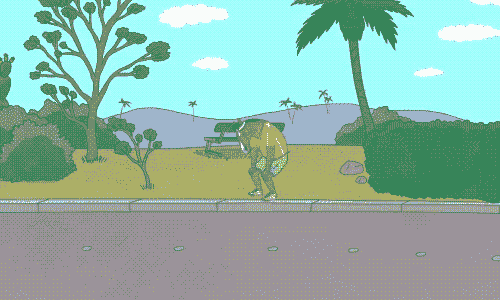

# 初学者学习 Java 游戏开发的秘密

> 原文：<https://levelup.gitconnected.com/the-secrets-to-learning-java-game-development-with-beginner-coding-skills-e5341eca74f8>

埃里克·麦克林在 [Unsplash](https://unsplash.com/s/photos/game?utm_source=unsplash&utm_medium=referral&utm_content=creditCopyText) 上的照片

谁不喜欢玩游戏？有符合每个人口味和预算的游戏机、电脑和手机游戏。它们为我们提供了一种有趣的打发时间的方式。想象一下游戏开发者有多少时间。

这就引出了一个问题，你会选择哪种编程语言来创建一个游戏？我个人最喜欢的是 Java。

Java 不仅仅是一个大银行账户的前景。它是引领技术进步的 OG 语言之一，拥有大量的追随者——一个伟大的同行社区，他们喜欢用简单的面向对象的语言编码。

如果你考虑成为一名 Java 程序员或者你已经开始学习它，开发简单的游戏可能是一种练习知识的有趣方式。当然，Java 游戏开发是一个东西。尝试《我的世界》，忍者外传，蠕虫:一个空间的古怪，吉他英雄移动系列，或国际足联 11，看看用 Java 做的好游戏确实存在。

# 为掌握 Java 制定一个好的计划

“熟能生巧”这句话在这种情况下也适用。每一点理论都应该有实践经验，即使你只是重新输入一段源代码。

所以当你开始学习 Java 时，无论出于什么目的，你想做的第一件事就是安装开发工具包或 JDK。这是一套用 Java 开发的工具，包括运行时环境、编译器、解释器和文档生成器。你可以在甲骨文官方网站下载 JDK。

# 解决基本问题

如果你从基础开始，会对你有好处。即使你不是编程新手，也要了解基本的语法和核心概念，这样你 a)就和 Java 在同一页上，b)在编写代码时不会把任何元素和其他语言混淆。

作为一名初学 Java 的程序员，您的课程大概是这样的:

## 基本语法

*   **对象** —程序的基本元素，包含状态(属性)和行为(它如何与其他元素交互)
*   **类** —像模板一样描述对象的元素
*   **方法** —准确描述对象行为的元素
*   **变量** —赋予对象的值

## 核心 Java 概念

*   OOP——Java 程序是相互交互的对象的集合
*   **数据类型** —可以分配给对象的值的类型，如整数(int)或字符(char)
*   **集合** —一个用于操作和存储对象组的框架
*   **多线程**——同时执行两个或多个进程，最有效地利用 CPU
*   **模式** —针对特定编程任务的工作解决方案
*   **单元测试**——在小单元中测试您的应用程序

# 学习游戏开发 Java 的有用资源

这里有一些关于 Java 编程，特别是用 Java 创建游戏的好的信息来源。

## 书

*   安德鲁·戴维森的 Java 杀手游戏编程
*   Kathy Sierra 的第一个 Java
*   James S. Cho 的《Android 游戏开发入门指南》
*   游戏编程模式

## 论坛

*   [Java 论坛](https://www.java-forums.org/java-gaming/)有一个游戏主题，你可以在这里与社区就 Java 游戏开发进行交流
*   Java 游戏是一个专门致力于 Java 游戏编程的社区

## 课程

*   [Gitconnected](https://gitconnected.com/learn/java) —利用网上最好的教程资源学习 Java
*   [CodeGym 游戏](https://codegym.cc/projects/games)——在创建简单游戏的同时学习 Java
*   Udemy——温习 Java 处理库的一些理论
*   [GameCode School](http://gamecodeschool.com/java/java-game-coding-level-1/) —探索游戏编程新手教程

# 自学还是课程？

问题是，两者你都无法选择。如果你想成为一名专业人士，你需要不断地学习，所以自学总是摆在桌面上。然而，当你是初学者时，有很好的理由使用课程:

*   课程为学习提供了有利的环境。它们有助于区分学习和其他事情。
*   **课程有助于激励。**他们一口一口地给你信息，你一直和课程导师保持联系，你也可以和同学交流。

# 学习游戏开发 Java 的 7 个步骤，并且不要失去动力

# 1.找到适合你生活方式和预算的课程

有很多课程，所以你应该权衡利弊，找到最适合你的。所有课程可以大致分为三类:

*   **免费或付费:**付费课程，让维护课程的人有资源来维护、升级课程，并为你提供更好的服务。虽然如果你没有预算，一些免费课程可以让你开始。
*   **实时或自定进度:**实时课程对于时间管理和与老师或导师的交流非常有用。另一方面，自定进度的课程不会将你限制在特定的时间表内。
*   在线或离线:在线课程不会限制你在本地的选择。他们提供聊天室和论坛，促进学生社区内部的交流。但有些人可能更喜欢或发现更多的动机时，在网上学习小组。

# 2.设定可实现的目标

你知道，像一些公司声称的那样，在两周内从零知识成为某方面的专家是不可能的。这是一个渐进的过程，需要设定里程碑。如果你给自己定了一个太大的目标却没有实现，你可能会挫伤自己的积极性。另一方面，你在完成一个目标后获得的满足感对你的精神有很大的促进作用。

# 3.不要长期坚持复杂的任务

这与前一点有联系。如果一个大任务需要你花很长时间去解决，在这个过程中会让你的大脑崩溃，如果你不停下来休息一下，它可能会让你失去学习的动力。在这种情况下，更好的做法是阅读相关主题的理论，去论坛，做几个简单的作业，当你感觉更有信心时再回到复杂的问题上。

坚持从小处着手，然后逐渐转向更复杂的任务。

# 4.一次专注于一门课程/一本书/一个主题

你可能会兴奋地想在短时间内学到尽可能多的东西，但是在读完前一本书之前跳到一个新的话题或者一本书会造成混乱。你也可能被太多的信息轰炸，失去注意力，很快就精疲力尽。

# 5.不要介意批评家

人们可能会告诉你，Java 不是游戏开发的正确语言，或者编程作为一种职业已经走到了尽头。或者，你可能会遇到一些人，他们会说你做得不够，或者你不如其他专家。可能很难忽视他们，所以记住这是他们自己的不安全感在说话。去论坛和你的同龄人交流，增强自信。

# 6.深入社区(不要孤立地编码)

在聊天和论坛中与你的同龄人交谈总是一个巨大的动力助推器。尤其是如果你在解决某个特定问题时遇到困难，你可以向他们或更有经验的开发人员寻求帮助。

# 7.不要为成为专家设定期限

技术不会停止进步，所以你不可能成为专家就完事了。专家是一个不断学习的人，可以很容易地掌握一个新概念。

# 包裹

学习游戏开发 Java 是一个循序渐进的过程，需要耐心和付出。如果你加快学习速度，与同龄人交流，设定容易实现的目标，在学习更复杂的东西之前从基础开始，你很快就能编写一个简单的 Java 游戏。