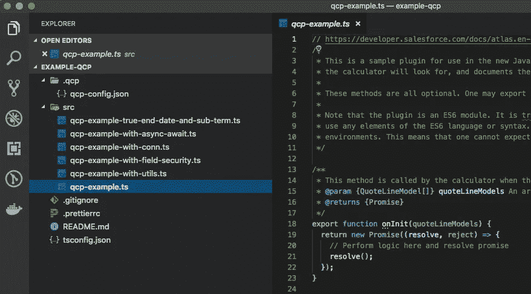

# 成为认真的 Salesforce 开发人员

> 原文：<https://levelup.gitconnected.com/the-serious-stack-behind-salesforce-developers-f7ee8979f940>

# 我的 Salesforce 开发者之旅

我开发软件已经有三十五年了。在 2000 年代末，我是一名埋头苦干的开发人员，用微软技术为我的客户编写业务应用程序。十年前，我在使用早期的 HTML、JavaScript、Java、ColdFusion 和 Lotus Notes。整个 20 世纪 90 年代，我都在用 FoxPro 和 Visual Basic 开发桌面数据库应用程序。

大约十年前，当我偶然发现了当时被称为 Salesforce 的 Force.com(现在被称为闪电平台)时，我开始精疲力竭。就像发现了新的爱情。那时，云计算刚刚开始流行，很少有平台服务提供类似的功能。没有一家公司能与 Salesforce 的规模、灵活性、深度和广度相媲美。

与当时的其他技术不同，使用 Salesforce，我可以在一天内构建一个应用程序，并几乎立即将其部署到成千上万的用户。我可以在数据模式、逻辑和用户界面处于生产状态时修改它们，而不会干扰任何用户。我可以使用现有的、健壮的安全机制和行业标准的 SOAP 和 REST APIs 与其他系统集成。作为一名开发人员，我甚至无法计算所有那些我不再需要担心的讨厌的 IT 任务。这很有趣！在这个平台上工作是令人愉快的，并且作为一名开发人员很容易获得成功。

简而言之，我疯狂地爱上了这项技术，再也没有回头。

# 今天

快进到 2020 年。我仍然沉浸在 Salesforce 技术中，自从十年前发现这个平台以来，我一直在那里构建业务应用程序和解决方案。随后，我作为一名讲师和导师，帮助其他人学习和掌握 Salesforce 技术，专注于帮助其他开发人员利用该平台取得成功。

在我担任 Salesforce MVP 的八年时间里，以及作为 Salesforce 培训合作伙伴的十年时间里，客户、学生和社区成员问我，究竟是什么迫使我迁移到 Salesforce。毕竟，我是以数据为中心的业务应用程序开发人员，而 Salesforce 是负责 CRM 的。我当时都不知道 CRM 是指客户关系管理！

通过这一系列文章，我将回答这个问题。我将讨论为什么您应该将 Salesforce developer 视为职业，以及经验丰富的*和*新手开发人员都可以获得的独特职业机会(包括技术和个人机会)。我将谈一谈这个平台是如何[在财务上回报](https://www.indeed.com/career/salesforce-developer/salaries)的，因为不断扩大的客户基础，不断发展的技术，以及缺乏有经验的开发人才。最重要的是，我将解释这个平台是如何演变成一个需要严肃开发者的深度技术开发平台的。

销售力量经济

# 但是 Salesforce 不就是为了 CRM 吗？

首先，让我们来解决一个问题，这个问题一直是一个巨大的困惑点，也是许多开发人员利用该平台的一个主要障碍。不，Salesforce 不仅仅是 CRM。是的，客户关系管理(或 CRM)是 Salesforce 的核心，这是事实。然而，在构建和发展 CRM 平台的过程中，随之而来的副作用是企业级、元数据驱动的多租户云架构，该架构允许开发人员快速、轻松地构建几乎任何类型的业务应用程序。客户数据是 Salesforce 的核心，也是大多数业务应用程序的核心。已经使用 CRM 的 Salesforce 客户现在拥有一个完整的应用程序开发平台，可用于快速构建他们能够想到的任何创新业务应用程序:财务、任务管理、合同管理、文档工作流、电子商务、移动应用程序等等。它支持快速构建应用程序，具有由现代系统中预期的严肃开发框架支持的云优先堆栈:开源 web 组件 UI 层(Lightning Web Components)，与 CI/CD 管道和容器等 DevOps 工具的集成，AI 引擎(Einstein)，平台消息总线(Platform Events)，以及使用 node.js、Redis、Kubernetes 等的无服务器微服务的不断发展的技术( [Evergreen](https://developer.salesforce.com/blogs/2019/11/introducing-salesforce-evergreen.html) )。

# 您应该成为 Salesforce 开发人员吗？

所以我们来看看市场。市场对 Salesforce 开发人员的需求强劲且不断增长。 [Salesforce developer 被 Indeed 评为 2019 年十大工作，同比增长 129%](https://www.indeed.com/lead/best-jobs-2019)，平均工资超过 11.7 万美元[。为什么？](https://www.indeed.com/career/salesforce-developer/salaries)[超过 90%的财富 500 强公司使用 Salesforce。](http://annualreports.com/HostedData/AnnualReports/PDF/NYSE_CRM_2020.pdf)越来越多的公司将其非 Salesforce 应用程序迁移到其 Salesforce 生态系统中。为了取得成功，这些公司需要熟悉 Salesforce 和传统开发堆栈的开发人员，这是我发现巨大机会的地方。

与传统开发一样，Salesforce 平台需要兴趣广泛的开发人员。让我们看看它如何与你的技能相匹配。

# 前端/JavaScript 开发人员

你是使用 HTML5、CSS3 和模块化 JavaScript 的前端 web 开发人员吗？您是否对 web 组件感兴趣，并希望构建美观且响应迅速的业务应用程序，并在桌面和移动设备上保持一致？Salesforce 生态系统非常需要这些技能。在过去的几年中，该平台已经为其 [Lightning web 组件](https://developer.salesforce.com/docs/component-library/documentation/en/lwc)框架和其 Lightning 用户体验背后的基于组件的模块化架构采用了 Web 组件和现代 JavaScript 行业标准。顺便提一下——他们也已经通过创建各种各样的开源项目接受了开源标准，如 [Lightning Web Components](https://lwc.dev/) 项目、[o clif](https://oclif.io/)——一个在 Node.js 中构建 CLI 的框架，以及[Apache prediction io](https://predictionio.apache.org/)——一个机器学习服务器，等等。

# 全栈开发人员

也许你已经迷上了 Node.js 和 JavaScript 库和框架。如果是这样，那么位于 Salesforce 云之下的应用程序堆栈就有很大的需求。他们的电子商务、营销和报价产品中的这些专有应用程序利用此类 web 技术进行定制，而 Salesforce 就是关于定制的。

Salesforce CPQ 公司的 JavaScript 插件

也许您对关系数据库、存储过程和面向对象的服务层更感兴趣。Heroku 平台支持托管数据存储，如 Postgres、Apache Kafka 和 Redis，支持各种 web 应用程序，并易于与 Salesforce 数据库集成。虽然 Salesforce 元数据驱动的云架构允许非程序员配置核心 Salesforce 数据对象架构和配置无代码逻辑流程，但更复杂的业务需求通常需要使用 [Apex 面向对象编程语言](https://developer.salesforce.com/docs/atlas.en-us.apexcode.meta/apexcode/apex_intro_what_is_apex.htm)编写的编程触发器和服务逻辑。

*Visual Studio 中的 Apex 代码*

# 微服务或无服务器架构师

虽然入站和出站 web 集成已经内置到 Salesforce 中十多年了，但 Evergeen toolkit 将允许 Salesforce 开发人员不仅使用 Apex，还使用 Java 和 Node.js 编写小函数和微服务逻辑。这允许使用声明式和基于代码的工具从 Salesforce 内部本地调用它们。Heroku 云平台已经支持能够轻松与原生 Salesforce 云集成的多语言 web 应用和服务，Evergreen 将进一步扩展这些功能，为开发人员提供全新的机会渠道。

*常青树系统图*

# 移动开发者

也许你是 iOS 或 Android 手机开发者。虽然原生 Salesforce 可配置为无需代码即可在移动设备上立即呈现，但可用的 SDK 允许为跨各种业务领域的定制业务案例开发真正的原生移动和设备应用程序。

# 人工智能/数据科学家

或者你可能倾向于商业分析、分析或人工智能。Salesforce Einstein 为对数据科学、分析、人工智能和跨外部交易业务系统的集成感兴趣的开发人员提供了机会。Salesforce 最近还收购了 Tableau Software，并与 IBM 和微软建立了长期合作关系。

*画面*

# 解决方案架构师

即使使用高度可配置的集成云工具，如 [Mulesoft](https://www.mulesoft.com/) ，仍然非常需要具有集成和身份识别技能和经验的解决方案架构师。该平台遵循 API 优先的方法，内置的基于标准的身份管理机制支持高度安全的应用和服务集成。再说一遍，即使可以用无代码可配置工具完成很多工作，仍然需要扎实的开发人员技能来构建和维护跨任何企业环境的有效集成。

综合

# 物联网开发者

也许你喜欢玩有联系的东西。一家以 API 为先的公司将成为物联网(IoT)应用的一个伟大平台。Salesforce 一直在发展其[物联网](https://www.salesforce.com/eu/learning-centre/tech/internet-of-things/)产品，以支持在制造、农业、医药和能源等各种行业中需要机器对机器通信的客户的机会——这些都是具有“创客”倾向的开发人员的成熟机会。

我的重点是，尽管 Salesforce 作为一个无代码平台而闻名，但现实是，行业需要传统的开发人员能够在生态系统中有效地应用他们的技能。虽然对于开发人员来说，将编程逻辑与声明性机制相结合是一个挑战，但这也是对那些能够掌握这种技能的人产生如此高要求的一个方面。

# 下一步是什么？

在本系列接下来的几篇文章中，我将深入其中的一些技术领域。在此过程中，我将提供一些链接，您可以在这些链接中找到更深入的信息、在线教育内容和文档。我坦率地承认，我的目标是诱使你学习更多东西——而且[甚至可能说服你加入](https://www.salesforce.com/products/platform/products/force/)。

在我的下一篇文章中，我将重点介绍该平台的核心方面以及它对 Salesforce 业务应用程序开发人员的意义。我们将了解该平台的一些应用程序开发功能、元数据驱动架构的功能和优势、在这种架构中以声明和编程方式工作所需的复杂开发技能，等等。

我希望您能和我一起踏上 Salesforce 开发人员之旅，我希望(甚至更希望)它能像改变我的生活一样改变您的生活。

经[唐·罗宾斯](https://www.linkedin.com/in/donaldrobins/)许可出版