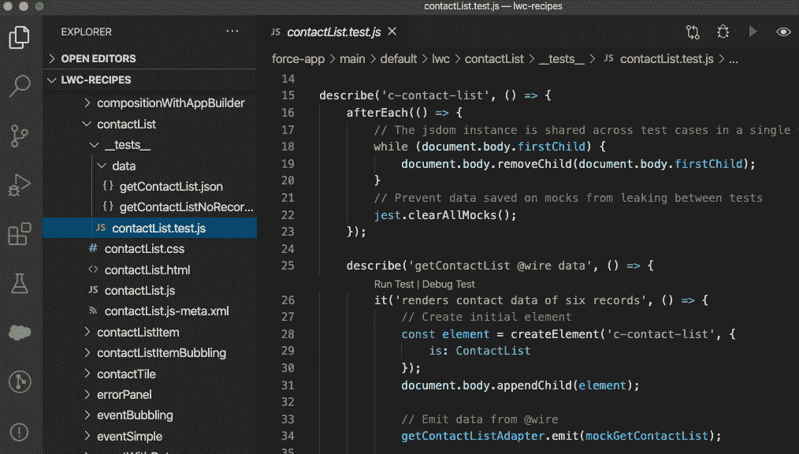

# Salesforce 开发人员背后的重要堆栈—第 2 部分

> 原文：<https://levelup.gitconnected.com/the-serious-stack-behind-salesforce-developers-part-2-14dea2649e76>

# 什么是 Salesforce 应用程序开发人员？

[在我之前的帖子](/the-serious-stack-behind-salesforce-developers-f7ee8979f940)中，我提出了为什么传统开发人员应该考虑将 Salesforce 开发人员作为职业的问题。我还回顾了 Salesforce 多年来如何发展成为一个需要严肃开发者社区的深度技术开发平台的一些方面。

在这篇文章中，我将重点介绍成为一名 *Salesforce 业务应用程序开发人员*意味着什么，并了解该平台的功能，这些功能需要复杂的开发技能才能通过声明式和编程式架构获得成功。

简而言之，我将看看为什么你作为一个认真的开发人员将作为一个 Salesforce 业务应用程序开发人员茁壮成长，无论你侧重于前端、后端、全栈、web、移动或数据库技术。无论您是使用面向对象语言(如 Java 或 C#)还是喜欢使用 JavaScript 和 web 技术(如 NodeJS)以及 web 组件框架(如 React 或 Angular ),您都会发现大量的机会。

# 传统的定制开发很难——不要让它变得更难

复杂的业务系统包含许多活动的部分。无论是在浏览器、桌面还是移动设备上运行，几乎所有应用都需要数据存储、用户界面、导航和调用幕后逻辑的操作。更复杂的业务系统需要报告和分析，全球企业客户需要本地化。

不要忘记安全性，因为所有这些定制页面及其逻辑都必须执行规则，规定谁应该看到什么，谁应该被允许与哪些数据和流程进行交互。您还需要一些后台功能来管理所有这些安全设置。

*业务应用架构—甲骨文公司提供*

不幸的事实是，因为这些元素在任何复杂的业务应用程序中都是普遍存在的，所以您经常会在每个项目中一次又一次地构建它们。特定于您的业务的定制是最大的价值所在，并且通常是需要最大开发努力的地方。这是一项艰巨的任务，需要付出大量的努力来维护和增强。

如果您可以利用一个允许快速、轻松且无需任何代码地配置这些公共元素(比如说系统的 80%或更多)的平台，会怎么样？如果您可以利用一个平台，让您将开发技能集中在应用程序的更复杂和独特的方面，甚至提供开箱即用的大部分元素，会怎么样？为什么不呢？重要的是要记住，成功的应用程序开发不仅仅是作为一名成功的编码员，或者针对某个问题编写代码。

# Salesforce 是一个为您处理无聊事务的平台

这就是 Salesforce:一个无代码/低代码平台，它为您处理那些可重复的部分，同时仍然允许您根据需要以声明和编程方式定制您的应用程序。

# 平台是如何运作的？

让我们看看 Salesforce 堆栈的关键部分如何为业务应用程序开发人员协同工作。这一切都始于为客户提供 Org(Salesforce 客户实例)，它本质上是 sales force 云中的一个专用空间。拥有管理员权限的用户使用基于浏览器的开发人员环境，称为[设置](https://trailhead.salesforce.com/content/learn/modules/starting_force_com/starting_tour)区域，来配置他们的应用程序及其安全性的所有方面。

[sales force 设置 ](https://trailhead.salesforce.com/content/learn/modules/starting_force_com/starting_tour)

# 点击数据和自动化

Salesforce 中的所有数据库表(称为 [Salesforce 对象](https://trailhead.salesforce.com/en/content/learn/modules/data_modeling))都属于一个组织，并自动提供基本用户界面。导航、菜单、搜索对话框、页面布局、列表视图、详细视图以及编辑和数据输入表单等功能都是为每个实体自动创建的。此外，还创建了标准的数据管理 CRUD(创建、读取、更新、删除)操作和特定于每个实体的任何附加处理逻辑。

所有这些都是为大量预先存在的表(Salesforce 标准对象)现成提供的，这些表通常支持核心 CRM 功能，如客户、联系人和机会。还可以创建自定义表(Salesforce 自定义对象)来表示任何业务实体。实体模式、数据关系、自定义验证规则和用户界面安全规则等等都是配置的，而不是编码的。

[*闪电模式构建器*](https://trailhead.salesforce.com/content/learn/modules/data_modeling/schema_builder)

新一代的声明性逻辑工具 [Lightning Process Builder](http://pages.mail.salesforce.com/gettingstarted/lightning/process-builder/) 和 [Lightning Flow](https://trailhead.salesforce.com/en/content/learn/modules/business_process_automation) 允许极其复杂的自动化处理，并且可以包括内置用户界面的具体化，或者提供添加自定义用户界面的能力。Lightning Flow 模拟结构化编程，尽管在其构建器中有一个可视化的隐喻。

【https://jenwlee.com*闪电流构建者:珍妮弗·李提供的流示例— Salesforce MVP —*

*该平台还提供了一个可扩展的消息总线([平台事件](https://developer.salesforce.com/docs/atlas.en-us.platform_events.meta/platform_events/platform_events_intro.htm))，它促进了一个事件驱动的架构模型，并且它支持声明性处理工具以及编程逻辑。*

*通常，当客户功能超出声明性工具的能力时，就需要编写自定义用户界面或编码自动化逻辑。Salesforce 开发人员必须知道何时超越声明性工具，以及如何正确设计和实施他们的 Apex、Lightning Web 组件或 Visualforce 页面。他们的目标是有效且高效地与声明性元数据驱动的功能进行交互。这里是坚实的开发技能，如果适当磨练，将发现高需求。*

# *超越点击-逻辑*

*Apex 编程语言已经存在了十多年。虽然在外观和语法上与 Java 和 C#相似，但它有很大的不同。它主要是为了在 Salesforce 云平台上处理 Salesforce 数据而设计的。它知道您组织的所有元数据、所有声明性元素和流程以及所有数据实体。*

**

**VS 规范中的 Apex 等级开发—闪电组件的等级和服务方法**

*Apex 绑定到所有数据对象，可以管理对象级、字段级和记录级安全性。此外，它可以处理入站电子邮件和发送出站电子邮件，执行出站 web 服务调用，以及处理来自外部应用程序的入站 web 服务请求。Apex 能够运行异步作业，被安排运行大容量批处理数据流程，作为声明性流程的低代码服务被调用，等等。*

*尖端而复杂的 Apex 已经从一个简单的类似存储过程的脚本模型([触发器](https://developer.salesforce.com/docs/atlas.en-us.apexcode.meta/apexcode/apex_triggers.htm#!))发展成为一个[完全面向对象的丰富编程语言，具有类、继承、接口](https://developer.salesforce.com/docs/atlas.en-us.apexcode.meta/apexcode/apex_classes.htm?search_text=Inheritance)、属性和异常处理。它提供了特殊的数据类型、操作符和内置的系统类，以促进高效编写的代码能够在[多租户环境](https://developer.salesforce.com/wiki/multi_tenant_architecture)中安全地执行和共享扩展的资源。*

**

**在 VS 代码中开发 Apex 类**

*虽然 Apex 上的多租户处理约束([调控器限制](https://developer.salesforce.com/docs/atlas.en-us.apexcode.meta/apexcode/apex_limits_intro.htm?search_text=Governor))在过去几年中已经大大放松，但当前正在发展的无服务器运行时容器( [Salesforce 函数现在处于测试版](https://developer.salesforce.com/blogs/2019/11/introducing-salesforce-evergreen.html))将允许开发人员用 Node.js、Java 和其他语言编写粒度微服务。预计这些将允许以您选择的语言弹性地流动低或高计算流程，完全感知您的 Salesforce 组织的上下文，目标是真正的弹性和可伸缩性，易于从声明式自动化中调用。*

# *超越点击——用户体验*

*Salesforce 用户界面，无论是 Classic 还是 Lightning，也会在运行时由平台架构自动具体化。*

**

**sales force Lightning 体验中的标准联系人记录页面**

*最初的以页面为中心的 web 应用程序架构(Salesforce Classic)仍然允许使用专有标记语言( [Visualforce](https://developer.salesforce.com/docs/atlas.en-us.pages.meta/pages/pages_intro_what_is_it.htm#!) )构建自定义页面，现在已经增加了基于标准的、[开源](https://lwc.dev/)、HTML/CSS 和模块化 Javascript (ES7) web 组件框架模型( [Lightning Web 组件](https://developer.salesforce.com/docs/component-library/documentation/en/lwc))。*

**

**VS 代码中的 Lightning Web 组件开发— HTML 和 Javascript mod**

*该架构继续像以前一样具体化一组广泛的标准组件，但现在开发人员可以使用自定义配置或自定义创建的组件来扩充页面，使用支持该平台的相同 web 组件框架( [Salesforce Lightning](https://trailhead.salesforce.com/en/content/learn/trails/lex_dev) )。)开发人员还可以增加内置对象或全局级动作，并可以配置它们以[调用支持 Apex 和 JavaScript 客户端自定义功能的自定义 Lightning 组件](https://trailhead.salesforce.com/content/learn/modules/lex_javascript_button_migration/javascript_buttons_to_lightning_actions)。*

*客户为其组织的 UI 配置的、在桌面 web 浏览器中呈现的所有内容也会在基准级别自动配置，以便在所有外形规格的移动设备上运行的 Salesforce 移动应用程序中呈现。额外的无代码配置可以定制外观和行为，并且可以通过对基于现代 Web 标准和模块化 JavaScript 的 Lightning Web 组件进行编码来添加可选的响应 UI 和功能。*

**

**Lightning 页面也在 Salesforce 移动应用程序中显示**

*您的定制组件可以利用强大的标准组件库，并利用所有相同的安全数据服务。它们也可以添加到任何 Lightning 应用程序或记录页面中，遵循类似的低代码开发模式来构建强大的用户体验。您甚至可以使用开源版本的 [Lightning Web 组件框架](https://trailhead.salesforce.com/quests/web-components)在平台外构建应用程序，无论它们是否与任何 Salesforce 数据或逻辑集成。*

**

**在 Lightning App Builder 中定制联系人记录页面**

# *开发人员体验—工具和流程*

*即使只有一两个开发人员的团队也需要工具和支持来进行健壮的开发和应用程序生命周期管理(ALM)。在早期，构建 Apex、Visualforce 或任何其他元数据组件需要使用流行且公开可用的 Eclipse IDE。Salesforce 提供了一个免费插件([Force.com](http://force.com/)IDE)，允许开发者使用 [Salesforce 元数据 API 创建、修改和部署他们的元数据文件。](https://developer.salesforce.com/docs/atlas.en-us.api_meta.meta/api_meta/meta_intro.htm)随着 Salesforce 构建其 API 以更好地支持开发人员工具，其他第三方 IDE 产品也在发展。虽然功能正常，但早期的 Salesforce 开发人员体验总的来说…嗯，我们只能说…与更传统的开发人员实践相比是次优的。*

*快进到 2020 年，更新的 [Salesforce 开发者体验](https://developer.salesforce.com/docs/atlas.en-us.sfdx_dev.meta/sfdx_dev/sfdx_dev_intro.htm) (SFDX)现在是支持开发和 DevOps 的现代工具和标准实践的集合。有大量的内置选项，都通过可扩展的命令行界面(CLI)和各种支持 Git 的免费和第三方 ide 进行管理，为开发人员提供了许多工具选择。目前推荐的 IDE 是来自微软的免费轻量级 [Visual Studio 代码，以及不断增长的支持扩展集合](https://developer.salesforce.com/tools/vscode/)。许多由 Salesforce 构建，其他由社区构建。您也可以使用 TypeScript(JavaScript 的超集)来构建它们。)*

**

**FDX 应用生命周期管理:由 Salesforce 提供**

*该平台一直提供隔离的沙盒环境。此外，他们最近引入了短暂的开发环境( [Scratch Orgs](https://developer.salesforce.com/docs/atlas.en-us.sfdx_dev.meta/sfdx_dev/sfdx_dev_scratch_orgs.htm) )，可以快速、轻松地加载元数据和模拟数据内容。SFDX 模型的灵活性和可编程性极大地增强了 Salesforce 开发人员的体验，并明显加快了开发工作。*

*这些相同的工具支持和促进[单元测试，包括 Apex 的服务器端](https://developer.salesforce.com/docs/atlas.en-us.apexcode.meta/apexcode/apex_testing_unit_tests.htm#!)和 Lightning Web 组件的客户端[JEST](https://developer.salesforce.com/blogs/2019/03/unit-test-lightning-web-components-with-jest.html)。它们还提高了元数据部署和检索的性能，这是平台上编程开发所需的迁移过程的一个组成部分。*

**

**JEST 在 VS 代码中测试 Lightning Web 组件:由 Salesforce 提供**

**

**VS 代码中的 Apex 单元测试:由 Salesforce 提供**

*Salesforce 开发人员体验只会变得越来越好，其发展速度在过去几年中确实令人瞩目。缺点主要是要跟上快速变化和增强的挑战。*

# *超越应用程序开发*

*当然，虽然您当然可以尝试将您在平台上的开发活动限制为编码，但 Salesforce 开发人员通过掌握平台的声明性功能获得了最大的成功。在如何最好地集成编程和声明功能方面获得的技能和专业知识越多，您在不断扩大的 Salesforce 生态系统中的价值就越大。*

*信不信由你，AppDev 只是个开始。虽然平台有这么多优势，但没有一个平台应该是一个封闭的孤岛，Salesforce 平台也不例外。当 Salesforce 应用程序需要在广阔的企业系统环境中超越系统边界进行集成时，事情变得非常有趣。*

# *下一步是什么？*

*在我的下一篇文章中，我将提供 Salesforce 提供的许多工具和机制的高级概述，以在集成的企业系统环境中利用他们的开放架构。我将展示，虽然这些机制中的许多确实无需代码即可配置，但 Salesforce 集成架构师的角色从对通用声明性平台、编程性平台、围绕身份和安全性的开放标准的深入了解，以及需要集成的各个领域的技术经验中受益匪浅。我希望您能继续加入我的 Salesforce 开发人员之旅。*

**经* [*唐知更鸟*](https://www.linkedin.com/in/donaldrobins/) *许可出版。**