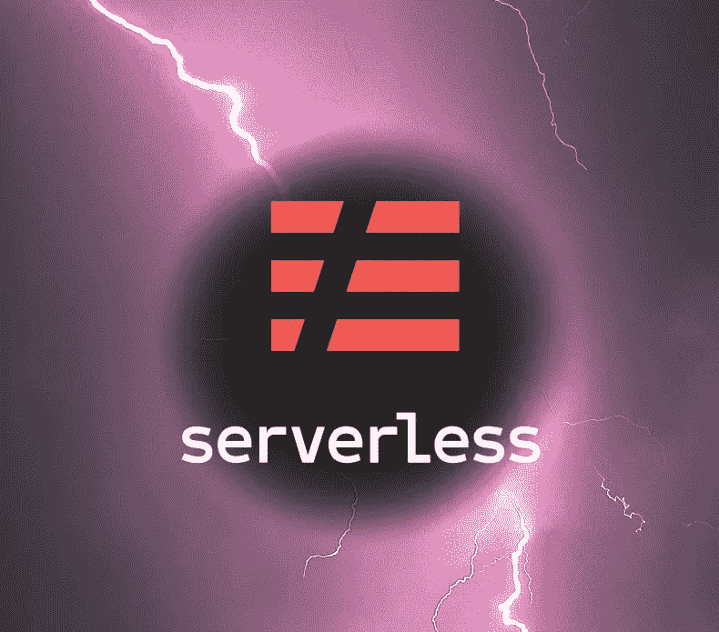

# 无服务器框架—简化

> 原文：<https://levelup.gitconnected.com/the-serverless-framework-streamlined-1bfebe3c67a9>

我是如何为部署在 AWS 上的 Typescript 应用程序消除了这些年来我在无服务器框架方面遇到的棘手问题的。

无服务器框架是构建无服务器应用程序的绝佳工具。它抽象了很多复杂性，让我可以将更多的时间放在应用程序的业务逻辑上，这通常是编写 lambda 函数。但是正如我在[之前的一篇文章](/my-journey-with-pulumi-and-the-serverless-framework-2b1398ee581a)中提到的，我发现它有一些不太理想的地方。

在本文中，我将向您介绍我是如何构建我的最新应用程序的，以便提高我的基础设施代码的质量。更具体地说，我将讨论如何

*   创建可重用的基础结构块，以减少需要编写的代码量，并提高应用程序的可维护性
*   隐藏讨厌的云形成函数(如`Ref`、`Fn::GetAtt`等)以提高可读性
*   将您的资源组织成逻辑代码块

本文中找到的所有代码都来自于[资源库](https://github.com/louislatreille/serverlessStreamlined)，可以有效地用作模板，帮助 kickstart 任何用 Typescript 编写的无服务器应用程序，并部署到 AWS。

# 基线设置

要开始使用无服务器框架，您应该做的第一件事就是使用 Typescript 进行配置。我以前说过，并将继续说下去。不知何故，它在 YAML 并没有太多的宣传，但是这在我使用这个框架的过程中带来了巨大的改进。这将为您提供一个更好的环境来编写 IaC，也将作为本文中我将向您展示的所有其他内容的基线。您甚至可以在编写 IaC 时，直接在配置中使用类型来帮助捕捉一些错误。在这里看看所有可用的类型[。](https://github.com/serverless/typescript/blob/master/index.d.ts)

此外，我强烈推荐使用[无服务器捆绑插件](https://github.com/AnomalyInnovations/serverless-bundle)。安装非常简单，这将消除*大量*来自正确打包 Typescript Lambda 函数的认知负荷。不再需要考虑配置 Webpack、Babel、ESLint 等。插件会给你一些合理的缺省值，你会得到很小的，非常快的函数，只包含他们需要的东西(比如正确的树摇动)。

最后，我还建议您使用 [MiddyJS](https://middy.js.org/) (我不会详细介绍它是如何工作的；你可以在他们的网站上阅读。这个模块提供了一系列中间件来增强 Lambda 函数的功能，比如为 CORS 提供适当的头，验证 HTTP 端点的输入和输出模式，自动反序列化 JSON 和其他内容类型，适当的 HTTP 错误等等。

# 可重复使用的基础设施

你会发现自己在应用程序中反复添加的主要内容可能是 Lambda 函数，所以我们在这里将重点讨论它。但是，这个原则可以应用于任何其他要复制的资源块或配置，比如 IAM 角色、SQS 队列等。使用这种模式，您将能够拥有如下所示的*功能*部分:

如您所见，此时我们只获得了我们需要的信息。函数名及其依赖项。

深入研究 *postMessage* 函数，我们会发现:

特定于 *postMessage* 功能的更多信息，例如端点路径、策略和环境变量。

然后，泛型 *createFunctionHandler* 包含所有 Lambda 函数共有的所有配置。

总而言之，3 个抽象层次，每个层次都有你需要的细节。 *createFunctionHandler* 函数是唯一需要修改的代码，它会影响所有的 Lambda 函数。如果您需要关于 *postMessage* Lambda 函数的具体细节，您可以在它自己的文件中找到它。然后，您可以清楚地看到您的 *serverless.ts* 中概述的 Lambda 函数的依赖关系。

# 隐藏讨厌的云形成功能

由于无服务器框架支持 CloudFormation 模板，如果您想在框架为您处理的资源之外创建资源，这通常是一个好方法。

CloudFormation 支持非常好，因为您可以使用 AWS 为每个服务的 API 提供的所有文档，并轻松地向您的应用程序添加新资源。但是如果你需要资源之间的链接，你需要使用像`Ref`和`Fn::GetAtt`这样的云形成函数。我总是发现云形成函数很大，不透明，是代码块，这使得很难理解发生了什么。

这就是为什么我喜欢把它们藏起来，靠近它们所属的资源。正如你在上面看到的，我的 Lambda 函数的依赖项是很好的、命名良好的变量。如果我必须使用 CF 函数，它看起来会像这样:

在我看来可读性差得多。在我的 *serverless.ts* 中，我希望能够快速看到我的不同资源之间的依赖关系，而 CF 函数让这变得更加困难。

不过，在它们所属的资源附近，它们确实更有意义。这就是为什么我把它们放在定义资源的函数中。这是创建我的 DynamoDB 表的函数的样子:

在我的 DynamoDB 表函数的内部，我可以看到 arn 是使用一个`Fn::GetAtt`函数检索的，但是外界不需要关心这些。他们只是在调用函数后使用`arn`变量。

如果你想知道 *varToString* 函数是什么，它只是将我的变量名输出为一个字符串(即上面代码中的`“mainTable”`)。好奇的话看这里[的代码](https://github.com/louislatreille/serverlessStreamlined/blob/92f7d59d697c0a9404ea6e2e1e929fa9154ecd39/resources/utilities.ts#L3)。因为我需要在 CF 函数中使用变量名，所以这个函数通过重命名我的变量但忘记改变 CF 函数中的字符串来消除引入错误的可能性。通过使用 *varToString* ，编译器会通知我这个错误。

# 将您的资源组织成逻辑代码块

我将向您展示的最后一个模式将允许您的 *serverless.ts* 在应用程序变大时保持可读。通常，随着时间的推移，你的配置中的*资源*部分会变得很大，以至于你不得不滚动浏览它。这种情况经常发生，因为当您需要添加一个东西时，比如说为您的应用程序添加一个 Cognito 用户池，您不是创建一个，而是创建大量的 AWS 资源。

再说一次，我喜欢保持我的 *serverless.ts* 干净，并把它放在我可以很容易看到我的资源之间的链接的地方。然后，我将把我的资源块的内部隐藏到单独的函数中。

下面是创建我的 Cognito 用户池的函数的样子(在这里查看完整的):

所有需要的资源都在那里定义，每当我需要了解用户池的细节时，我都可以在那里找到它们。需要注意的一点是，我返回一个包含所有要创建的资源的 *resources* 对象。这样，我就可以在我的 *serverless.ts.* 中使用 JavaScript 良好的对象析构特性

啊，看起来真不错！一行代码表明我在该应用程序中有一个 Cognito 用户池。不需要滚动数百行云信息资源定义，也不需要试图弄清楚每个单独的资源属于什么！

# 结论

你有它！部署在 AWS 上的 Typescript 无服务器函数的模板！请随意浏览 Github 库,因为那里有一些其他更小的东西，让我的编程生活变得更容易。

如果你有任何问题，请提出来！如果你有自己的一套实践来帮助你在无服务器框架下保持高效，请在评论中分享它们！我一直在寻找改进的方法！

编码快乐！