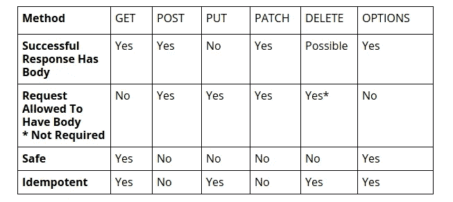

# 简单的六种 HTTP 方法:ELI15 版

> 原文：<https://levelup.gitconnected.com/the-simple-six-http-methods-eli15-edition-53f336b1ebd>

## 前言:

这些是基本的 HTTP 方法。从技术上讲，互联网工程任务组(IETF)标准 [RFC 7231，section 4: Request methods](https://tools.ietf.org/html/rfc7231#section-4) 定义了八种方法(GET、HEAD、POST、PUT、DELETE、CONNECT、OPTIONS、TRACE ),而 [RFC 5789，section 2: Patch method](https://tools.ietf.org/html/rfc5789#section-2) 定义了第九种方法(Patch ),但是本文只涉及最基本的六种方法，没有配置请求头之类的特殊内容。好的。

在我们深入了解每种方法的细节之前，这里有一个比较它们的表格:



重要概念:

Body —我们希望发送到服务器的数据。

安全—如果方法导致只读操作，则该方法是安全的。在调用一个安全的方法后，有问题的数据不会被修改。

幂等的—如果一个方法可以被重复调用而没有副作用，那么这个方法就是幂等的。副作用只在服务器端考虑。例如，DELETE 方法是幂等的，因为无论我们发出多少次删除请求，我们都只能删除一次资源，但 POST 方法不是幂等的，如果我们再次发出 POST 请求，我们将创建另一个资源。

POST 方法不是等幂的:

```
 POST /add_status -> Adds a status Change on Server side
 POST /add_status -> Adds a 2nd status Change on Server side
 POST /add_status -> Adds a 3rd status Change on Server side
```

删除方法是幂等的:

```
DELETE /delete?:id -> Returns 200 Change on Server side
DELETE /delete?:id -> Returns 404 No Change on Server side
DELETE /delete?:id -> Returns 404 No Change on Server side
```

所有安全的方法都被认为是等幂的，但并不是所有的等幂方法都被认为是安全的。记住哪些方法是幂等的很重要。“为什么？”你会问，考虑这样一种情况，我们向服务器发送一个请求，在服务器有机会向客户端发送响应之前，客户端和服务器之间的连接被关闭，如果方法是幂等的，我们就可以重新发送请求，而不用担心意外的影响，如创建重复的帖子或推文。

下面的例子是使用[获取 API](https://developer.mozilla.org/en-US/docs/Web/API/Fetch_API) 制作的。如果我们使用另一个 HTTP 客户端包，如 [Axios](https://www.npmjs.com/package/axios) ，请求的配置会有所不同

现在让我们进入细节。

# 得到

当我们想要获取远程服务器上的资源时，使用 Get。用 Fetch 发出 GET 请求非常简单。我们需要提供的唯一信息是我们资源的 URL。它是这样叫的:

```
fetch(‘http://example.com/movies.json')
.then((response) => {
return response.json();
})
.then((data) => {
//Do Something with response data
console.log(data);
});
```

# 邮政

当我们想要创建资源条目时，会发送一个 POST 请求。在这个方法中，我们必须提供资源所在的 URL 以及我们想要添加到服务器的数据。

```
const data = { username: 'example' };
fetch('https://example.com/profile', {
  method: 'POST',
  body: JSON.stringify(data),
})
.then((response) => response.json())
.then((data) => {
//Do Something with response data
  console.log('Success:', data);
})
.catch((error) => {
  console.error('Error:', error);
});
```

# 修补

当我们想要修改资源时，就使用补丁。它是这样发送的:

```
const data = { username: 'example' };
fetch(‘https://example.com/profile/id, {
method: ‘PATCH’,
body: data
})
.then((response) => response.json())
.then((result) => {
console.log(‘Success:’, result);
});
```

假设我们有一个场景，其中我们有一个具有以下属性的资源:

```
{
“hasCar”: true,
“hasHelicopter”: true,
“numberOfDogs”: 10,
}
```

我们希望使用一个补丁请求来用这些数据更新资源:

```
{
“numberOfDogs”: 12,
“numberOfCats”: 1,
}
```

该请求的结果将是:

```
{
“hasCar”: true,
“hasHelicopter”: true,
“numberOfDogs”: 12,
“numberOfCats”: 1,
}
```

请注意，该资源不仅更新了“numberOfDogs”属性，它现在还有一个“numberOfCats”属性。

在不存在的资源上发送修补请求将会失败，并且不会创建任何资源。

# 放

当我们想要完全替换一个资源时，我们发送一个 PUT 请求。看跌期权将如下发送:

```
// Example of a PUT method
const data = { username: 'example' };
fetch(“https://example.com/profile/id”, {
method: ‘PUT’,
body: data
})
.then((response) => response.json())
.then((result) => {
console.log(‘Success:’, result);
})
```

PUT 是 PATCH 的大锤版。发送 PUT 请求会用请求中发送的正文覆盖以前的资源，而发送 PATCH 请求只会更新现有的资源。补丁不能删除资源，放可以。例如，假设我们有一个位于服务器数据库中的资源，它具有以下属性:

```
{
“hasCar”: true,
“hasHelicopter”: true,
“numberOfDogs”: 12,
}
```

然后，我们决定在 PUT 请求的主体中发送数据:

```
{
“numberOfCats”: 1,
}
```

这样，资源将只有一个名为“numberOfCats”的属性，其整数值为 1。

对不存在的资源发送 PUT 请求将创建具有这些属性的资源

# 删除

当您想要删除资源时，可以使用 DELETE。了解此方法将删除整个资源，而不仅仅是特定资源的属性，这一点很重要。删除请求可以这样发送:

```
const data = { username: 'example' };
fetch(‘https://example.com/profile/id, {
method: ‘DELETE’,
body: data
})
.then((response) => response.json())
.then((result) => {
console.log(‘Success:’, result);
})
```

# 选择

选项请求通常用作预检请求，用于查看服务器支持哪些方法。预检请求由浏览器自动发送，在大多数情况下，我们不需要手动发出这些请求。通常，浏览器发送的选项请求如下所示:

```
OPTIONS /resource/:id
Access-Control-Request-Method: DELETE
Access-Control-Request-Headers: origin, x-requested-with
Origin: [https://foo.bar.org](https://foo.bar.org)
```

浏览器基本上是在说“嘿，服务器，我将尝试删除/resource/:id 上的一个资源。我从[https://foo.bar.org](https://foo.bar.org)发出这个请求，并且我发送这个带有来源和 x-requested-with 标题的请求”

假设服务器端一切正常，服务器将做出如下响应:

```
HTTP/1.1 204 No Content
Connection: keep-alive
Access-Control-Allow-Origin: [https://foo.bar.org](https://foo.bar.org)
Access-Control-Allow-Methods: POST, GET, OPTIONS, DELETE
Access-Control-Max-Age: 86400
```

在这个响应中，服务器说“嘿，浏览器，我收到了你来自 https://foo.bar.org[的请求。我支持的方法有 POST、GET、OPTIONS 和 DELETE。您可以将此响应缓存 24 小时，这样您只需每 24 小时打一次电话。”](https://foo.bar.org)

# 结论

好了，这是所有的基础知识。感谢您的阅读！！

如果您有任何问题、建议或其他任何事情，请随时发表评论！你可以在我的[网站](https://zachcodes.com/)了解更多关于我的信息