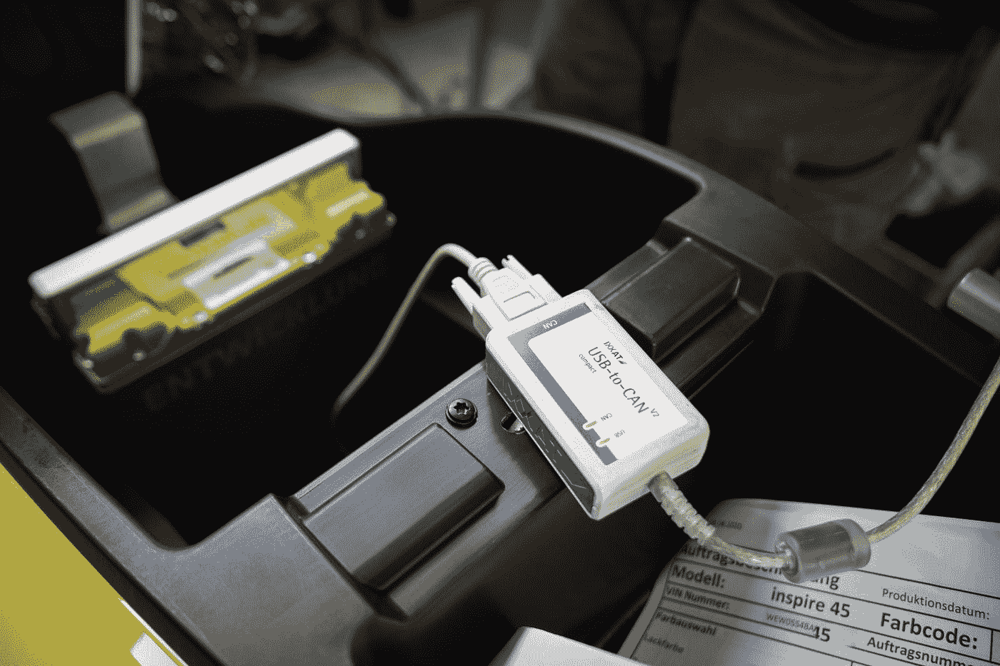
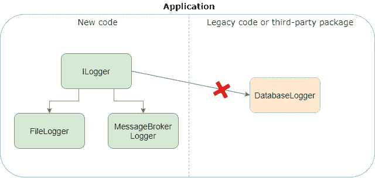
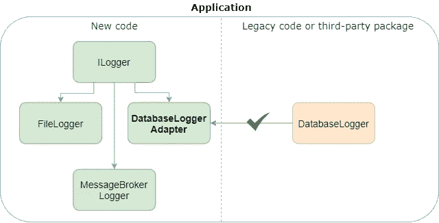

# 适配器设计模式的最简单解释

> 原文：<https://levelup.gitconnected.com/the-simplest-explanation-of-adapter-design-pattern-cd37f02bfecd>

## C#中的真实世界示例



由 [Unsplash](https://unsplash.com?utm_source=medium&utm_medium=referral) 上的 [Kumpan Electric](https://unsplash.com/@kumpan_electric?utm_source=medium&utm_medium=referral) 拍摄的照片

*前面我描述了* [*5 种方式来实现原型设计模式*](/5-ways-to-clone-an-object-in-c-d1374ec28efa) *，现在轮到适配器了。*

适配器设计模式的目的是将一个类的接口转换成客户端期望的另一个接口。

适配器设计模式最初是在 Erich Gamma 写的书*Design Patterns:Elements of Reusable Object-Oriented Software，* 中描述的… **停！看来我答应给你的是模式最简单的解释，而不是无聊的理论。我会努力为你信守承诺。**

让我们从一个简单的例子开始我们的旅程。

假设您的应用程序可以使用 ILogger 接口:

```
public interface ILogger
{
    void Log(LogEntry entry);
}public class LogEntry
{
    public string Text { get; set; }
    public DateTime Time { get; set; }
}
```

该应用程序有许多 ILogger 接口的实现，其中之一是 FileLogger。您的所有日志都可以保存到文件系统上的一个文件中。

```
public class FileLogger : ILogger
{
    public void Log(LogEntry entry)
    {
        //log {entry.Text} and {entry.Time} to file
    }
}
```

如果有向消息代理发送日志的新需求，您应该简单地创建一个名为 MessageBrokerLogger 的新类，并像 FileLogger 那样实现 ILogger 接口。你应该做的另一件事是在你的应用程序的**复合根**中注册一个 MessageBrokerLogger 实例，而不是 file logger(DI 容器被配置的地方)。

可能还需要将消息记录到数据库中。突然，您发现您的系统已经包含了一个名为 DatabaseLogger 的对应类，它满足了所有新的需求。

```
public class DatabaseLogger
{
    public void Log(string text)
    {
        //log {text} to database table
    }
}
```

此外，DatabaseLogger 类的实现相当复杂，因此您应该重用它，以避免从头开始编写数据库记录器的耗时工作。但是即使你从头开始写，你的系统中也会有两个类做同样的工作。第一类的变化应该反映在第二类中，反之亦然。这令人沮丧，因为:

*   同样的工作必须做两次。
*   两个实现之间有可能存在不一致。

我们有所谓的[技术债](https://esashamathews.medium.com/technical-debt-management-best-practices-for-software-engineers-871a315ac812)，总是导致可维护性差。

好了，我们需要重用 DatabaseLogger 类来避免不必要的麻烦。为此，我们需要在 DatabaseLogger 上实现 ILogger 接口并执行重构。这是它理想的样子:

```
public class DatabaseLogger : ILogger
{
    *//public void Log(string text)* **public void Log(LogEntry entry)**
    {
        //adjust the logic to work with {entry} parameter
    }
}
```

但是，您不能总是更改现有的代码。想象一下，DatabaseLogger 类在您的应用程序的遗留部分中被大量使用，日志方法签名中的每一个变化都会导致数小时的返工和回归问题。此外，DatabaseLogger 可以是一个单独的库的一部分，您不能访问它的代码。



这就是适配器设计模式可以帮助我们的地方！

我们需要创建一个名为 DatabaseLoggerAdapter 的类，并实现 ILogger 接口。接下来，我们需要将 DatabaseLogger 类注入 DatabaseLoggerAdapter。最后一部分是将 LogEntry 对象转换为字符串，并在 DatabaseLogger 实例上调用 Log 方法。

代码如下:

```
public class DatabaseLoggerAdapter : ILogger
{
    private DatabaseLogger _databaseLogger = new DatabaseLogger(); public void Log(LogEntry entry)
    {
        string text = $"{entry.Text} logged at {entry.Time}."; _databaseLogger.Log(text);
    }
}
```

以下是我们取得的成果:



我们解决了代码重用的设计问题，而不需要发明复杂繁琐的东西。通常，所有好的解决方案都很简单，这个故事很快证明了这一点。

# 摘要

*   适配器解决了接口不兼容的问题。
*   适配器类充当需要重用的对象的包装器。
*   适配器有助于遵循开放封闭原则，因为开发人员不需要修改现有代码(DatabaseLogger)，而只需扩展其行为(DatabaseLoggerAdapter)。
*   适配器有助于遵循单一责任原则，因为开发人员将转换逻辑保存在一个单独的类中(DatabaseLoggerAdapter)。
*   如果有办法调整类(DatabaseLogger)使其与代码的其余部分相匹配，就不应该使用适配器模式。否则，模式滥用将导致冗余的适配器类，甚至适配器多于适配器。