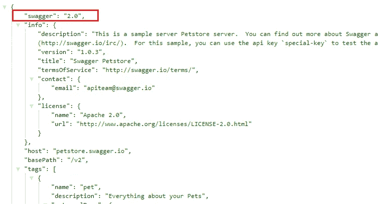
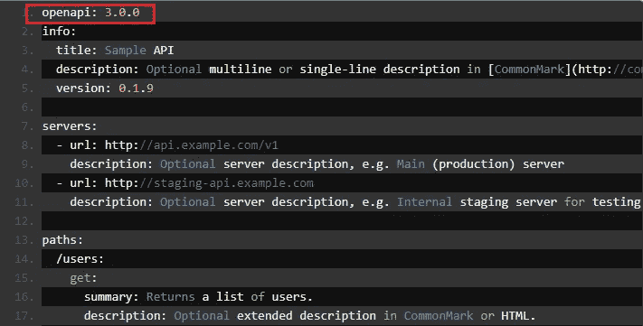
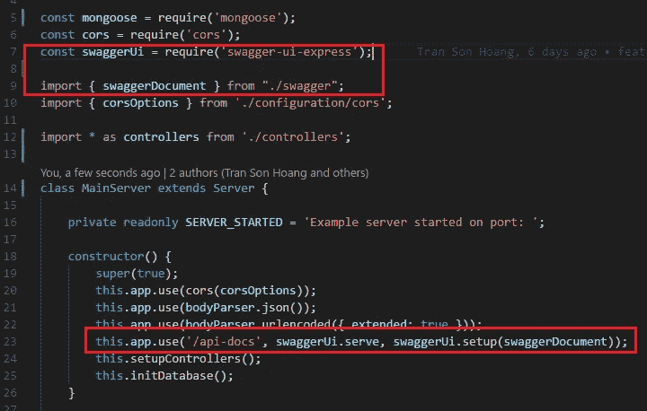

# 向 Node.js 项目添加 Swagger 的最简单方法

> 原文：<https://levelup.gitconnected.com/the-simplest-way-to-add-swagger-to-a-node-js-project-c2a4aa895a3c>

## Nodejs

## 为 Node.js 项目添加和编写可维护 REST API 文档的端到端指南。


安妮·斯普拉特在 [Unsplash](https://unsplash.com/s/photos/coffee?utm_source=unsplash&utm_medium=referral&utm_content=creditCopyText) 上的照片

本文是关于安装 OpenAPI 以及如何使用 [Express](https://expressjs.com/) 和 [Typescript](https://www.typescriptlang.org/index.html) 在 [Node.js](https://nodejs.org/en/) 项目中使用它的简单指南。

1.  什么是 Swagger 和 OpenAPI？
2.  在现有项目中安装 OpenAPI
3.  编写优秀文档的简单指南

*更多类似内容，请查看*[*https://betterfullstack.com*](https://betterfullstack.com)

# 什么是 Swagger 和 OpenAPI？

什么是霸气？

> **Swagger** 是一套围绕 **OpenAPI 规范**构建的开源工具，可以帮助你设计、构建、文档化和消费 REST APIs。

什么是 OpenAPI？

> **OpenAPI 规范**(原 Swagger 规范)是 REST APIs 的 API 描述格式。

根据上面的定义，你可以看到 Swagger 和 OpenAPI 之间的不同点。

在 OpenAPI 之前，我们使用 swagger 作为 API 描述格式。



[https://petstore.swagger.io/v2/swagger.json](https://petstore.swagger.io/v2/swagger.json)

然而，现在我们对文档使用 OpenAPI 规范。



[https://swagger.io/docs/specification/basic-structure/](https://swagger.io/docs/specification/basic-structure/)

# 将 OpenAPI 安装到现有项目中

本节将指导您使用 [Swagger UI Express](https://www.npmjs.com/package/swagger-ui-express) 在 Node.js 项目中安装 Swagger。

我们有如下一些步骤:

1.  安装库
2.  添加 Swagger 文档
3.  将文档注入到项目中

**安装库**

运行`npm i swagger-ui-express`安装 **Swagger UI Express。**

**添加招摇文件**

这里有两种格式可供选择:

*   JSON
*   打字稿扩展

我更喜欢使用 Typescript 扩展来创建一个良好的可重用和可读的 swagger 文档。

第一版 swagger.ts

**将文件注入到项目中**

我们只需要将库`swagger-ui-express`和你的`swagger.ts` 文件导入到你的服务器。

在这里，我按照[他们的包](https://www.npmjs.com/package/swagger-ui-express)中的指导方针，使用 URL `/api-docs`将它添加到项目中。



初始化当前服务器/服务的 swagger 文档

# 编写优秀文档的简单指南

在这一节中，我将向您展示为什么我对 Swagger 文件使用 TypeScript 格式——它允许您根据业务逻辑将大文件分解成小文件。

为了给服务器添加更多信息，我们为我们的 API 服务准备了开发、测试、UAT，也许还有预生产环境。

API 的特定服务器信息

如果您想要动态端口、环境名和基本路径，该怎么办？这个我们可以申请`variables`。

使用服务器变量对象设置 API 文档的环境、端口和基本路径

如何给 Swagger 添加授权？

添加 JWT 的授权

上面的示例代码用于将 JWT 添加到请求头中，以授权用户的权限。

我们还有其他身份验证类型，如:

*   基本认证

```
{
  "type": "http",
  "scheme": "basic"
}
```

*   API 密钥

```
{
  "type": "apiKey",
  "name": "api_key",
  "in": "header"
}
```

*   隐式 OAuth2

```
{
  "type": "oauth2",
  "flows": {
    "implicit": {
      "authorizationUrl": "https://example.com/api/oauth/dialog",
      "scopes": {
        "write:pets": "modify pets in your account",
        "read:pets": "read your pets"
      }
    }
  }
}
```

最后，我们将这个大摇大摆的文件分割成更小的文件。

*   在`src/openAPI`中创建一个名为`pets.swagger.ts`的文件

getPets inside `pets.swagger.ts`

*   将`getPets`导入到`swagger.ts`

将 getPets 导入 swagger.js

通过使用 Typescript，我们可以根据业务逻辑将文档分割成许多小文件。这使得我们的 swagger 文档更具可读性和可维护性。

# 结论

在本文中，我们看到了如何使用 Express 和 TypeScript 在节点项目中安装 Swagger

通过使用 TypeScript，我们发现可以根据业务逻辑将一个大文件分割成较小的文件，然后将它们导入主 Swagger 文件。

我希望这篇文章对你有用！可以跟着我上[媒](https://medium.com/@transonhoang?source=post_page---------------------------)。我也在推特上。欢迎在下面的评论中留下任何问题。我很乐意帮忙！

[](https://betterfullstack.com/stories/) [## 故事-更好的全栈

### 关于 JavaScript、Python 和 Wordpress 的有用文章，有助于开发人员减少开发时间并提高…

betterfullstack.com](https://betterfullstack.com/stories/)