# 模拟人生 4 现代 Python 建模:第 1 部分——设置

> 原文：<https://levelup.gitconnected.com/the-sims-4-modern-python-modding-part-1-setup-83d1a100c5f6>

# 我为什么写这篇文章

我已经编程很多年了，但我对模拟人生 4 的修改非常陌生，对模拟人生 4 在线脚本教程的状态感到羞愧和困惑。大多数教程来自 2014 年至 2018 年，写得很糟糕，用糟糕的教学实践拼凑起来，非常过时。解释也非常缺乏。你不能只是被告知该做什么，你显然想成为一个伟大的模特，要做到这一点，你必须明白你在做什么。

教程太差了，在过去的 6 年里，所有人都在谈论教程有多差，他们的教程有多少。我将有希望在一段时间内写出更好的文章，我非常了解编程，我只需要在没有太多在线帮助的情况下搞清楚模拟人生 4 的修改。我的目标是将我所学到的东西记录到教程中，并提供很好的解释，这样你就可以独立完成并更进一步。

# 开始前你需要什么

我在帮助你学习如何用 Python 编写模拟人生 4 的脚本模块，这是过去 6 年来互联网上非常缺乏的东西。*这意味着你至少需要了解一点 python 的知识*。我也是 python 的新手，所以你不需要知道太多就可以开始，但是我不打算占用文章空间解释如何编程以及应该使用什么编程工具。我假设你至少知道最基本的东西，因为如果你不知道，有太多的工具和资源可以帮助你。

如果你好奇的话，我使用的工具是免费版的 PyCharm ,因为它提供了很好的代码支持和提示，可以很好地与不同的 Python 版本配合使用。我鼓励你想用什么就用什么。每个人都有自己的喜好，我希望你能自立。其他伟大的工具还有`VisualStudio Code`、`Notepad++`、`Sublime`等…

我也使用 Windows，很久以前我使用 mac，但我现在没有 Mac 了，所以我不知道如何将这些步骤翻译成 Mac OSX。如果你用的是苹果电脑，希望这不会太难。

# python 版本极其重要

我只是想说，EA 可以让这一切变得简单十亿倍，但他们不这样做让我很生气。

> 你不能声称支持修改社区，让修改游戏变得如此容易，却对你创建的修改过程毫无帮助。

也就是说，在撰写本文时，获得 Python 3.7 的最新版本至关重要。我用的是 3.7.9。它不能是 3.8 或任何更高版本，也不能是 3.6 或任何更低版本。必须正好是 3.7。这一点非常重要。这也假设 EA 没有升级模拟人生 4 使用的 python 版本(他们有时会升级)。在未来，这可能会过时，但只要知道，如果 EA 在未来改变它，它必须是他们改变它的确切版本。

你可以从这里找到所有当前最新的 python 版本，在撰写本文时，你需要下载最新的 3.7 版本。我安装了多个 python 版本，所以我只是将它下载到`C:\Python37`中，并选择不将其添加到系统路径中，因为我讨厌在系统路径中处理多个版本。

通常情况下，我建议你不要公然抄袭我，因为这有助于你更好地学习，而不是复制/粘贴/复制每个步骤。然而对于 Python，我建议将其安装到`C:\Python37`或任何没有空格的路径中。如果你不能下载到`C:\Python37`，你可以下载到`C:\Users\Python37`、`C:\Users\YourName\Python37`(如果你的名字里没有空格)，或者`C:\Users\Public\Python37`。如果你在路径的任何地方有一个空格，我们下面要做的一个步骤将不起作用。

# 模拟人生 4 python 库

记得我说过这让我很生气，EA 说一套做一套，对修改社区来说却是另一套。嗯，这就是我要说的。

为了给模拟人生 4 写 python 脚本，你需要知道如何与游戏互动。要做到这一点，你需要知道游戏中有哪些代码可供你使用。通常 EA 会为你提供一个特别许可的 zip 文件夹，其中包含你为了开发目的而查看和使用的文件。就像 Android、Bukkit、Skyrim 和其他一系列公司和项目所做的那样。这是相当标准的做法，电子艺界没有得到超过 6 年的备忘录。这一点都不直观，也不容易，但它非常关键，所以这是我们需要做的第一件事，很抱歉 EA 让这变得如此困难。

> 想象一下，有人给了你一份特定的食谱，但他们实际上只是把食物递给你，并希望你自己找出食谱。你需要食谱来制作或修改它，但是你只能靠自己用一种非常缓慢、糟糕且容易出错的方法来解决。这正是我们下一步要做的。

## 选项 1:自动设置

这是我最近推出的新东西。我创建了一个样板/模板项目，你只需下载它，做一些快速设置，放入脚本文件，它会为你处理一些事情，比如反编译库和编译/打包你的模型。

我建议通读教程的结尾，最好是第 1 和第 2 部分，但至少是第 1 部分。这个想法是，在你知道你正在做的事情的来龙去脉之前，不要依赖别人制作的模板。

如果你更愿意跳到自动模板，你可以在这里查看[教程](https://medium.com/swlh/the-sims-4-modern-python-modding-part-5-project-template-c9ffee48ab4e)，一定要在你完成后回来完成这个教程**跳到步骤 5** 。

## 选项 2:手动设置

这教你如何形成你自己的项目，这样你就不会每次都依赖于模板，我建议从这里开始，这样你就可以先了解发生了什么，然后再转向模板项目。

## 步骤 1:创建一个开发文件夹来存放所有东西

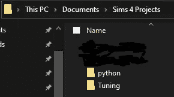

我在`Documents\Sims 4 Projects`创建了我的文件，里面有`Tuning` 文件和`python` 文件，这超出了本文的范围。你不必这样做，它只是让一切变得美好而有条理。

## 步骤 2:将 python 库复制到工作区

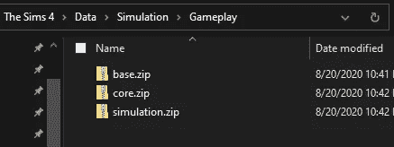

如果你复制我，你可以在你的主文件夹里创建一个文件夹，我把它命名为`python`。您可以在您的 Sims 4 安装中找到这些文件，在 Windows 上通常位于

`C:\Program Files (x86)\Origin Games\The Sims 4\Data\Simulation\Gameplay`

但是，如果您有不同的安装，它们可能会在不同的位置。复制你看到的三个 zip 文件 **base.zip** 、 **core.zip** 和 **simulation.zip** 。将来如果它们还存在，我也会复制它们。

这些文件夹里面是`pyc` 文件。这意味着它们是编译的 python 文件，也就是说你不能看到它们里面的任何内容。如果你看不到它们的内部，那么你就不能制作 python mods，没有 EA 的任何帮助，我们只能自己打开它们，这很容易出错，所以要提前警告你。

## 第三步:解压它们

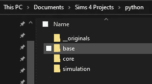

解压工作目录中的文件，之后你可以删除复制的 zip 文件，但是我选择将它们保存在一个名为`__originals`的文件夹中。这取决于你。

## 第四步:将它们转换回你能看到的 python

这个过程实际上不应该发生，反编译一个 python 文件是不正常或不自然的。它容易出错，而且耗时很长。在我的机器上需要一个小时。许多 python 文件将无法成功反编译。对于每一个不能被反编译的文件，这意味着在 mods 中你可以在游戏中使用的文件就少了 1 个，这很令人沮丧，因为要创建令人惊讶的 mods，你需要知道所有你可以使用的潜在特性，而不仅仅是那些你可以反编译的。

多年来，人们一直在尝试制作反编译程序。在线教程中列出的那些经常是过时的，并且经常使用自制的反编译程序，它不是很好，如果它运行的话，经常会有很多问题。你需要使用最新的反编译器，它对每个文件都有最高的成功率。

在撰写本文时，这个反编译程序还没有被编译，很容易通过 pip 安装。

`pip install uncompyle6`

因为我没有使用系统路径，所以我是这样安装的

`C:\python37\python.exe -m pip install uncompyle6`

将这个安装到 python 3.7 非常重要

现在你需要开始反编译，**这将花费很长时间**并且几个文件将不会反编译！该程序有能力遍历所有的 python 文件并反编译它们，但它非常容易出错，经常崩溃，所以我强烈建议使用 Windows Powershell 来代替。

打开 python 文件夹内的 powershell 并执行以下命令，以下命令是特定于 powershell(蓝色背景)而非命令提示符的。它在 Comamnd 提示符下无法工作(这是一个较老的提示符，背景是大多数人熟悉的黑色)。

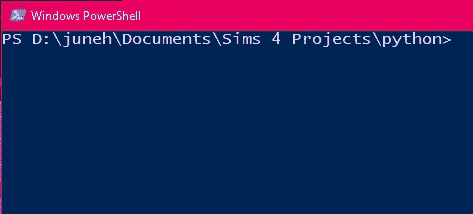

```
dir -recurse -include *.pyc | %{C:\python37\python.exe C:\python37\Scripts\uncompyle6.exe -o “$_.py” “$_”}
```

这个庞大复杂的命令是这样的:

*   `dir -recurse -include *.pyc`告诉 PowerShell 遍历所有文件夹和文件，寻找以`.pyc`结尾的文件
*   下一部分是 PowerShell 在找到的每个文件上运行什么，在我们的例子中，我们希望运行上面刚刚安装的`uncompyle6`。它运行`uncompyle6`并传递`pyc`文件，告诉它将它反编译为相同的文件名，但在末尾添加了一个`py`，这意味着我们将在每个`pyc`文件旁边有一个`py`文件。

永恒之后，它终于结束了

我们需要做的下一个重要步骤是修复文件命名。在同一个 PowerShell 中也运行这个。这将所有文件从类似于`__init__.pyc.py`的文件重命名为`__init__.py`，这对 python 工具提供适当的帮助很重要。

```
Get-ChildItem -File -Recurse | % { Rename-Item -Path $_.PSPath -NewName $_.Name.replace(“.pyc.py”,”.py”)}
```

*   `Get-ChildItem -File -Recurse`再次循环浏览文件夹和文件，但所有文件除外。它不仅仅是对每个文件运行一个命令，它还传递我们需要重命名的文件和路径的附加信息
*   另一部分告诉 PowerShell 将`.pyc.py`重命名为`.py`，如果文件以此结尾的话。

你应该有这样的东西

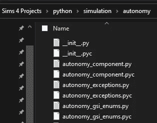

**恭喜**，你现在已经完成了最难也是最长的部分，在他们进行大更新之前，你再也不需要这样做了！！！

## 步骤 5:设置编辑器

这可以是像 Notepad++这样简单的东西，也可以是像 PyCharm 这样大的东西。也许像 Visual Studio 代码这样的中间地带。

我不能为每个编辑写帮助，所以我将介绍 PyCharm。它是完全免费的，下载链接就在我第一次提到它的时候。不要只是抄袭我，使用你觉得最舒服的编辑器。很多人更喜欢 Sublime 或者 Notepad++这样简单的。

对于 PyCharm，无论何时创建新项目，都需要选择 Python 3.7。通常第一次它不会知道在哪里，如果你的已经指向 3.7，你可以跳过这一部分。

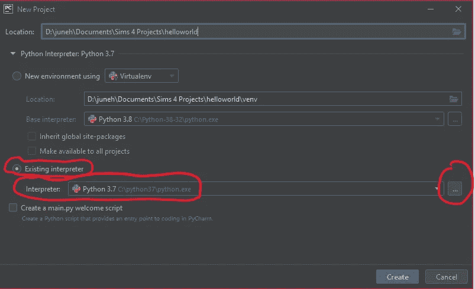

单击上图所示的 3 个点，调出另一个窗口。再次点击系统解释器和 3 个点。

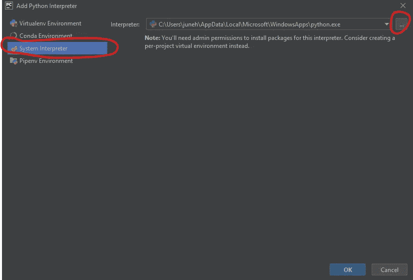

只需从 Python 3.7 中选择“python.exe”

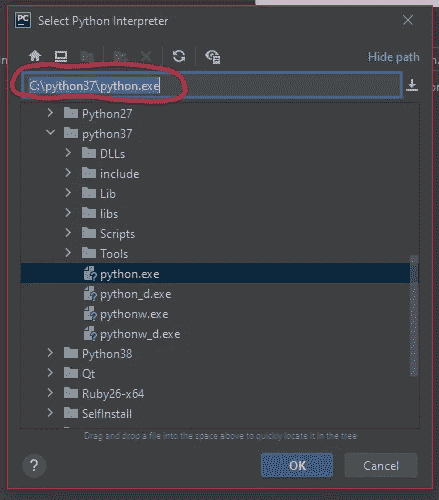

现在我们需要添加我们反编译的 python 库，你必须在每个新项目上做一次。打开设置

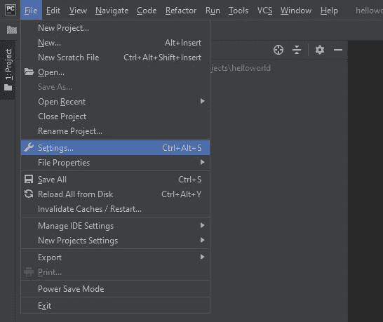

然后转到项目结构。点击“添加内容根目录”

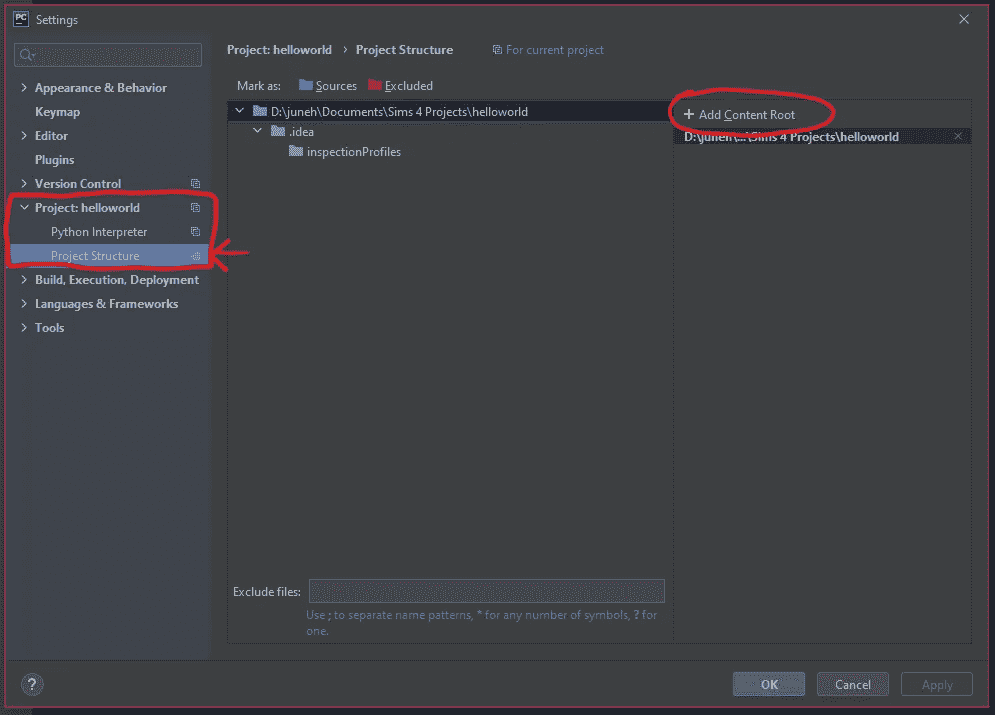

你需要加上`base/lib`、`core`和`simulation`。您可以按住`**ctrl**`键并选择多个来一次完成所有操作。

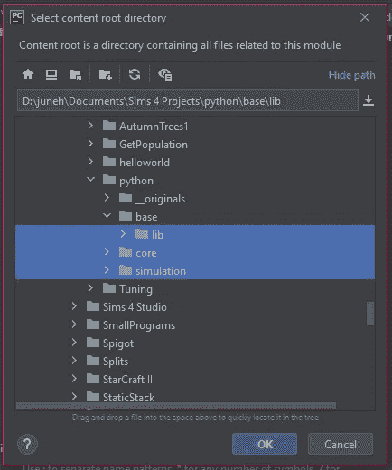

确保你选择了`base` 中的`lib` 文件夹，如上图所示。`base` 文件夹有点不一样。现在将这 3 个文件夹标记为源文件夹。

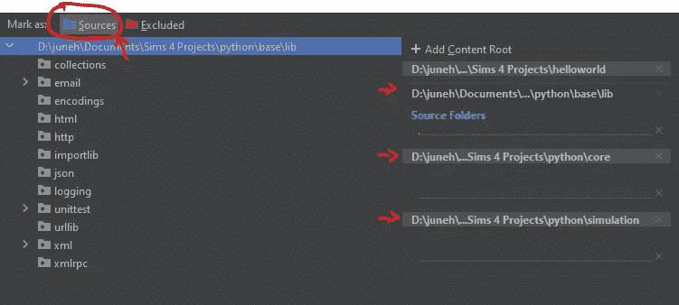

您已经准备好开始编写 python 代码了

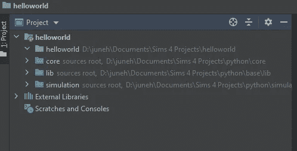

# 我知道这是一个很长的教程

EA 使得这很难开始，一些文档和适当的 zip 文件会容易得多。我们用我们所拥有的来凑合，不幸的是，这是目前必须要做的。

我很感谢你花时间来通过这一初步教程。它奠定了重要的基础，我尽了最大努力来解释这些事情，以便你们理解我们为什么要做这些事情。“为什么”帮助你独立自主，明白如何做出自己的决定，而不是依赖别人做的东西，这些东西可能做得不好，经常坏掉。

我希望你能跟随我进入后面即将到来的教程，希望不会像这次这么糟糕和漫长。

# 3 个不同文件夹的用途是什么？

*   基本—包含低级代码。简单地说，这意味着你不会经常使用它。想象一下，请你的朋友递给你一个苹果。你有各种不同的步骤，比如交流和手势，但实际上你并不关心得到苹果的所有步骤，你只是想要苹果。“贱”就是这样。它包含了成百上千的小步骤，让不同的事情发生，大多数时候你关心的是更大的图景。你唯一一次进入这里是在你制作一个 mod 的时候，这个 mod 的一些小步骤有点不同，所以你需要借用一些预先存在的步骤，然后自己制作其他的步骤(比如用西班牙语向你的朋友要一个青苹果，这两个步骤可能都不在“基础”中，但仍然有一些相同的步骤)…..同样，这种情况通常不会发生。
*   核心——这类似于基础，但将“基础”中的小步骤组合成一般任务。您将会更频繁地使用该文件夹。你是愿意写下向你的朋友要一个苹果所需的 50 个步骤(基础)还是仅仅一个步骤(核心)？
*   模拟——这是你会经常用到的最大的文件夹！它包含各种各样的编码来控制和操纵游戏的几乎每一个方面。虽然“核心”是为了更通用的代码，“模拟”是为了实际的游戏和界面。

# 第 2 部分再见

接下来我们将制作一个“你好，世界”节目，希望到时能见到你。[点击此处查看第二部分](https://medium.com/@junebug12851/the-sims-4-modern-python-modding-part-2-hello-world-77c5bfd3ce4e)。