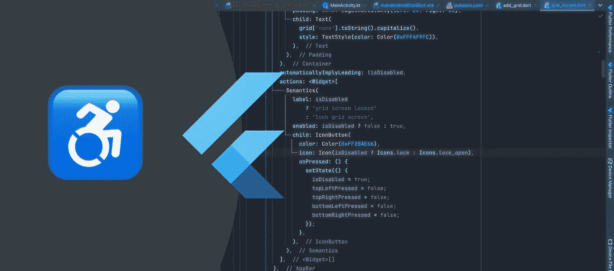

# 一个最有用的颤动可及性技巧

> 原文：<https://levelup.gitconnected.com/the-single-most-useful-flutter-accessibility-trick-ecf547cd71ad>

## 现在 Android 开始在 Play Store 中添加可访问性标签，你真的需要打磨一下你的可访问性技能了…



作者照片和编辑

从我的角度来看，Flutter 的主要好处之一就是能够为开发者提供简单有效的解决方案。我非常肯定，我们许多软件工程师都会同意，通常解决方案不一定要复杂才能伟大。事实上，开发人员中有一种日益增长的趋势——我完全同意这种趋势——简化事情。我认为 Flutter 在某种程度上做到了这一点。这种典型的简单性的一部分也是它如何迎合可访问性。

虽然我不会深入到与应用程序可访问性相关的所有细节，但我将专注于一个方面，或者更准确地说是一个小部件，我认为它几乎是构建 Flutter iOS 和 Android 应用程序时可访问性的瑞士军刀。**这尤其及时，因为谷歌刚刚宣布他们将在 Play Store 中添加可访问性标签。**你可以在下面的文章中了解更多。

[](https://medium.com/offmessageorg/google-does-what-apple-didnt-ad3354e46f1a) [## 谷歌做了苹果没有做的事情…

### 永远改变我们开发应用程序方式的最微小的 Android 功能。

medium.com](https://medium.com/offmessageorg/google-does-what-apple-didnt-ad3354e46f1a) 

另外，如果你对所有关于可访问性的东西都感兴趣，请查看本文末尾的完整文章列表。另外，欢迎你关注我不久前和[安德鲁·格里本](https://medium.com/u/5265a6f1b5b9?source=post_page-----ecf547cd71ad--------------------------------)一起发布的可访问性出版物。

[](https://medium.com/offmessageorg) [## 关闭消息

### 辅助工具专业人员和辅助技术用户的辅助工具出版物。软件可访问性…

medium.com](https://medium.com/offmessageorg) 

但是让我们回到**这个给予 Flutter 应用可访问性超能力的小部件——**[**语义小部件**](https://api.flutter.dev/flutter/widgets/Semantics-class.html) 。让我澄清一下，这不是一个新的小部件。它至少存在了两年多，但可能更久。它很少受到关注的唯一原因是——说得委婉一点——[大多数开发人员根本不关心可访问性](https://medium.com/offmessageorg/software-accessibility-no-comment-9872f802849b)。但是让我不要跑题。

**语义小部件使用起来和 Flutter 中的其他小部件一样简单**，事实上，它实际上是最简单的部件之一，因此我建议您尽可能使用它，因为它只给项目增加了很少的额外工作量和代码。让我们看一个我计划在 2022 年发布的应用程序的例子。

```
Semantics(
       label: isDisabled ? 'grid screen locked':'lock grid screen',
       enabled: isDisabled ? false : true,
       child: IconButton(
         color: Color(0xFF2BAE66),
         icon: Icon(isDisabled ? Icons.lock : Icons.lock_open),
                        onPressed: () {
                          setState(() {
                            isDisabled = true;
                            topLeftPressed = false;
                            topRightPressed = false;
                            bottomLeftPressed = false;
                            bottomRightPressed = false;
                          });
                        },
                      ),
                    ),
```

我在这里所做的基本上是将 IconButton 包装到一个语义小部件中，并指定当按钮被启用和未启用时屏幕阅读器应该读出的文本。如您所见，`label`和`enabled`属性的值都可以有条件地设置，它们不必是静态的。它们甚至可以是方法或函数的返回值。除了上述属性，你还可以设置`readOnly`、`obscured`、`focused`等等。**您可以在语义属性构造器文档页面** **查看完整列表。**

对于那些更熟悉语义 HTML 和 ARIA 的人来说，嗯，Flutter 的语义小部件实际上是两者在一个工具中的结合——因此我称它为瑞士军刀。**我认为在某些方面，确保小部件正确含义的 Flutter 解决方案比我们在网络上拥有的要好。虽然语义 HTML 非常强大，但具有可访问性意识的开发人员经常发现自己不得不求助于 ARIA，这在实际环境中很快就会变得难以控制。再加上大多数软件工程师在易访问性方面的低水平培训，你已经得到了一个即使有最好的意图也无法访问的产品。我认为 Flutter 在某种程度上减轻了这种风险，因为它依靠一个小部件来为所有用户提供可访问的应用程序。**

在此基础上，继续前进，编写可访问的代码！♿ 👩‍💻 👨‍💻

## 如果你想了解更多关于可访问性的信息…

这是我过去几年写的一系列文章。有些是技术性的，有些不那么技术性，但我可以向你保证，你会从他们每一个人身上学到一些东西。

[](https://attilavago.medium.com/membership) [## 通过我的推荐链接加入 Medium-Attila vágó

### 作为一个媒体会员，你的会员费的一部分会给你阅读的作家，你可以完全接触到每一个故事…

attilavago.medium.com](https://attilavago.medium.com/membership) 

Attila Vago——软件工程师，一次改进一行代码。永远的酷呆子，代码和博客的作者。网络无障碍倡导者，乐高迷，黑胶唱片收藏家。喜欢精酿啤酒！