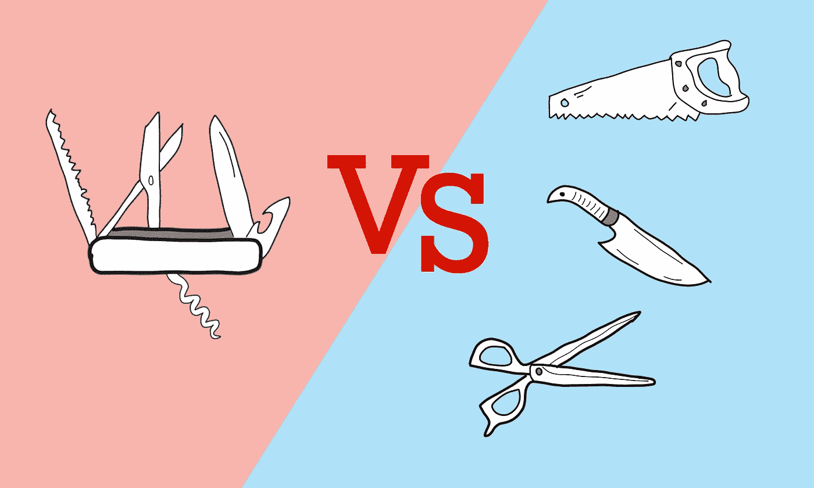
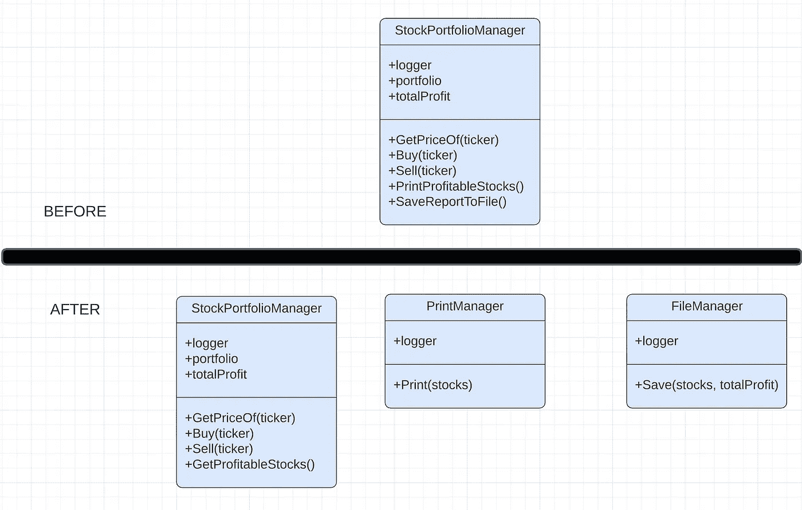

# 单一责任原则变得简单

> 原文：<https://levelup.gitconnected.com/the-single-responsibility-principle-made-simple-4e1597a44d7d>

## 为什么这个原则经常被误解，以及应该如何在现实世界的代码中应用它。



米海三都

在上图中，你更愿意拥有什么，瑞士军刀还是右边所有的工具？旅行的时候，便携性是最重要的。瑞士军刀是合适的工具。

但是在日常生活中，你会切面包、修理汽车或者用瑞士军刀开罐头吗？大概不会。你可以做，但用面包刀、一套螺丝刀或开罐器更容易。

现实生活中的代码应该被同样对待。一个万能类(上帝对象)没关系，它可以让你在旅途中完成工作(比如原型或脚本)，但不适合日常使用。

神器第一次写起来很容易，以后每次修改都很恐怖。每一项新功能或更新都会成倍增加复杂性。这反过来使得新程序员很难理解和理解其中的逻辑。

但是上帝物品最大的问题是它们产生的错误数量。因为所有东西都紧密耦合在同一个类中，所以每次更新都会影响几乎所有东西。这使得保持代码无 bug 变得困难。对于客户来说，没有什么比要求一些东西并破坏代码的其他部分更令人恼火的了。

# SRP 前来救援

> 单一责任原则(SRP)规定每个软件模块应该有且只有一个变更的理由。
> 
> 罗伯特·马丁

换句话说，当应用这个原则时，我们应该确定变化的可能原因，并把它们分成不同的对象。

遵循这个原则应该给我们:

*   可维护的代码→因为当新的需求进来时，代码是细粒度的，我们应该能够只更新负责设计变更的类
*   易于测试的代码→因为我们没有破坏一个大的对象，而是一个小的对象，所以大多数的测试应该还是可以通过的
*   可读代码→较小的对象比“上帝”对象更容易理解
*   可重用代码→重用粒度级的类比重用大型类的机会更大

让我们来看看这个原理的实际应用。

# 真实世界的例子

快速看一下下面的代码(不用担心编程语言，里面没什么具体的):

如果代码太长，请长时间阅读方法签名:

```
public double GetPriceOf(string ticker)public void Buy(string ticker)public void Sell(string ticker)public void PrintProfitableTransactions()public void SaveReportToFile()
```

你能识别 SRP 违规吗？

乍一看，这段代码似乎还不错。但有一个问题，我们想保存到文件，也打印一些数据都来自一个单一的类。

在生产代码中，这意味着我们需要依赖于文件管理器、打印管理器、web API 管理器、日志管理器等对象。由于所提供的功能相当简单，像复杂报告、新类型的股票订单这样的新特性可能会使该类变得臃肿。事情很快失去控制。

## 解决方案



作者截图

或者如果你喜欢代码:

## 发生了什么事？

神级被分成了三个等级。架构代码被提取为两个类:FileManager 和 PrintManager。这样，如果需要“股票组合”的新功能，我们可以在不影响打印或文件逻辑的情况下进行更新。另外，打印和文件类可以在其他组件中重用。

从 StockPortfolio 类中，我们删除了两个方法(print 和 save ),但是添加了一个新的 getter 方法来提取必要的数据。

代码的整体大小增加了，但是我们获得了关注点的分离。划分逻辑还允许多个开发人员在同一个项目上工作。

# 当心

SRP 很容易被过度使用。该原则背后的思想是使您的代码易于维护。不多不少。

在 [StackExchange](https://softwareengineering.stackexchange.com/questions/150760/single-responsibility-principle-how-can-i-avoid-code-fragmentation) 上有一个很好的例子，它详细描述了当程序员将这个原则发挥到极致时会发生什么。简而言之，它使得代码如此原子化，以至于理解和调试代码是一场噩梦。

回到瑞士军队的例子，你可以很容易地把“瑞士军刀”分解成剪刀、螺丝刀、小刀之类的东西。如果你做得太过分，你可能会用面包刀、黄油刀、鱼刀、猎刀来代替刀子。对于厨师来说，所有这些刀都是有意义的，但在几乎所有其他情况下，一把通用刀就可以完成这项工作。

将 SRP 与 KISS 原则结合使用。保持简单和愚蠢。如果你觉得代码过于分散，那么你可能是对的。

> 把因为同样的原因而改变的东西聚集在一起。把那些因为不同原因而改变的东西分开。罗伯特·马丁

类原子性使得原理很容易被讨厌。项目中的类太多，理解逻辑、调试和维护它们变得越来越困难。

遵循您在构造函数中注入的参数数量。如果超过五个，停下来分析你的代码。你可能过度应用了这个原则。

回到 StockPortfolioManager 代码示例，看看代码，我们很容易想到将所有日志提取到不同的类中。这就说得通了。例如，如果我们想要改变日志行为，那么只有一个负责日志管理的类会对我们有所帮助。

但是在实践中，在 95%的情况下，您可能不会对日志工具进行太多的修改。也许永远不会。所以不要在这上面浪费时间。大多数程序员使用一个库来记录日志，所以在它上面做一个包装器对我来说是一种浪费。

# 如何确定变革的原因

理论上，SRP 原则是所有坚实原则中最容易理解的。实际上，这是最难应用的方法之一。

因为我们应该基于“改变的原因”来分离代码，程序员必须预测那些原因可能是什么。

初级程序员得靠想象力。有经验的程序员可以依靠他们过去的经验。高级程序员了解客户的业务，并据此编写代码。它们价值连城。

但是这里有一些让你开始的建议:

*   保持业务逻辑与基础设施分离 1→通常业务规则比基础设施更容易改变。在 StockPortfolio 示例中，StockPortfolioManager 类中的逻辑可能会比我们打印或保存信息的方式更频繁地变化
*   与客户交谈，了解他们对未来应用的设想。特别注意他们可能会问的潜在特征。
*   看看他们过去的要求。在请求之前知道系统的状态，你会预见到吗？

有时我们会把事情做好，但有时不会。尽管我很想预测未来，但这是不可能的。我们只能分析和发挥概率。

# 外卖食品

*   找出变化的可能原因，并根据这些原因打破你的代码
*   如果你了解商业领域，你就能更好地应用这个原则。花一些时间，了解客户的需求是什么。
*   不要过度→需要它而没有它比其他方式更好

**坚实的原理制作简单的系列:**

*   单一责任原则
*   [开合原理](/the-open-closed-principle-made-simple-cc3d0ed70553)
*   [里斯科夫替代原理](/the-liskov-substitution-principle-made-simple-5e69165e7ab5)
*   [界面偏析原理](/interface-segregation-principle-made-simple-990da495441c)
*   [依存倒置原则](/the-dependency-inversion-principle-made-simple-70108b88dc76)

# 进一步阅读

 [## 清洁编码器博客

### 1972 年，戴维·l·帕纳斯发表了一篇经典论文，题为《关于将系统分解为……

blog.cleancoder.com](https://blog.cleancoder.com/uncle-bob/2014/05/08/SingleReponsibilityPrinciple.html) [](https://hackernoon.com/you-dont-understand-the-single-responsibility-principle-abfdd005b137) [## 你明白单一责任原则吗？

### 单一责任原则是关键的软件工程原则，它决定了我们应该如何模块化…

hackernoon.com](https://hackernoon.com/you-dont-understand-the-single-responsibility-principle-abfdd005b137)  [## 单一责任原则:伟大代码的秘诀

### 阅读这篇文章的西班牙语版本，由玛丽塞拉·奥尔达斯翻译，不管我们认为什么是伟大的代码…

www.toptal.com](https://www.toptal.com/software/single-responsibility-principle)