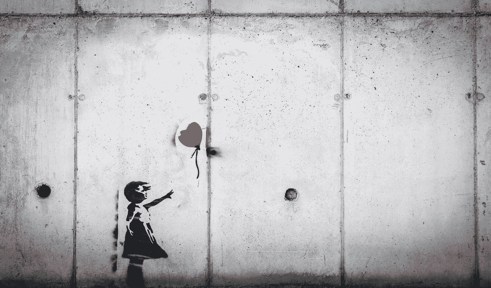

# 第六阶段调试

> 原文：<https://levelup.gitconnected.com/the-sixth-stage-of-debugging-20d245172ffd>

## 停止悲伤，开始表现得像个高级工程师

卡里姆·曼吉拉在 [Unsplash](https://unsplash.com?utm_source=medium&utm_medium=referral) 上的照片

你听说过调试的六个阶段吗？十五年前，我在硅谷做初级工程师的时候了解到了它们。我在工作的地方看到一面墙上挂着下面的列表。

# 调试的六个阶段

1.  那不可能发生。
2.  我的机器上不会发生这种事。
3.  那不应该发生。
4.  为什么会这样？
5.  哦，我明白了。
6.  这是怎么回事？

*功劳:* [*麦克·w·克雷默*](http://mwcremer.blogspot.com/2007/06/six-stages-of-debugging.html)

我想大多数人在这个列表中看到了幽默。如果你已经调试软件足够长的时间，你可能也体验过它的真相。

我认为这个列表的幽默之处在于它呼应了另一个流行文化的阶段列表——悲伤的五个阶段。这五个阶段也被称为[库伯勒-罗斯模型](https://en.wikipedia.org/wiki/K%C3%BCbler-Ross_model)，分别是**否认、愤怒、讨价还价、沮丧和接受**。

库伯勒-罗斯模型不是普遍真理，但它确实描述了不同人在悲伤时可能会有的一些感受。我不认为悲伤的阶段直接映射到调试的阶段，但当我看着它们时，我看到了一些相似之处。我不认为这是巧合。我相信调试和悲伤是有联系的。我们对失去我们认为你拥有的理解感到悲伤。处理你认为你理解的代码，可能需要一些重大的精神调整，以你从未想象过的方式来表现。

调试的第一阶段，“那不可能发生”，是否认阶段。被报告的错误不符合我们的心理模型，我们断然拒绝它的有效性。

一旦我们通过了第一个调试阶段，进入第二个阶段，“那不会发生在我的机器上”，我们就变得有所防备，一种愤怒和讨价还价的混合物。我们对呈现给我们的不方便的事实感到不安，我们正在寻找一个解释，让我们在面对矛盾的证据时保持正确。

当我们到了第三阶段，“那不应该发生”，我们就进入了抑郁症。我们承认有些事情正在发生，但我们仍然用旧的思维模式来判断它，还没有接受新的现实。在此之前，我们无法修复 bug。

第四和第五阶段，“为什么会这样？”和“哦，我明白了”，是接受错误存在的结果，并且有一个现实的模型可以理解它。我们已经抛弃了我们的偏见和先入之见，现在能够创建一个新的叙事来描述我们的软件如何工作，一个允许我们修复 bug 的叙事。

但是调试的第六阶段呢，“那是怎么工作的？”那个阶段对应什么概念？我相信它映射到了好奇心——一个成功的高级软件工程师的关键特质。想要了解事物工作的原因，而不仅仅是让它们工作。

我想起了下面这段话:

> “业余爱好者练习，直到他们得到它的权利；专业人士练习到不会出错为止。”

仅仅达到第五个阶段，接受并修复 bug 是不够的。一个成功的高级软件工程师努力达到第六阶段。他们被好奇心所驱使，想知道为什么最初会引入这个 bug。

错误可能不是完全可以预防的，但其中一些是可以避免的。当你不再为自己的错误悲伤时，就要好奇了。学会如何避免犯你过去犯过的同样的错误将会让你在将来犯更多有趣的错误。