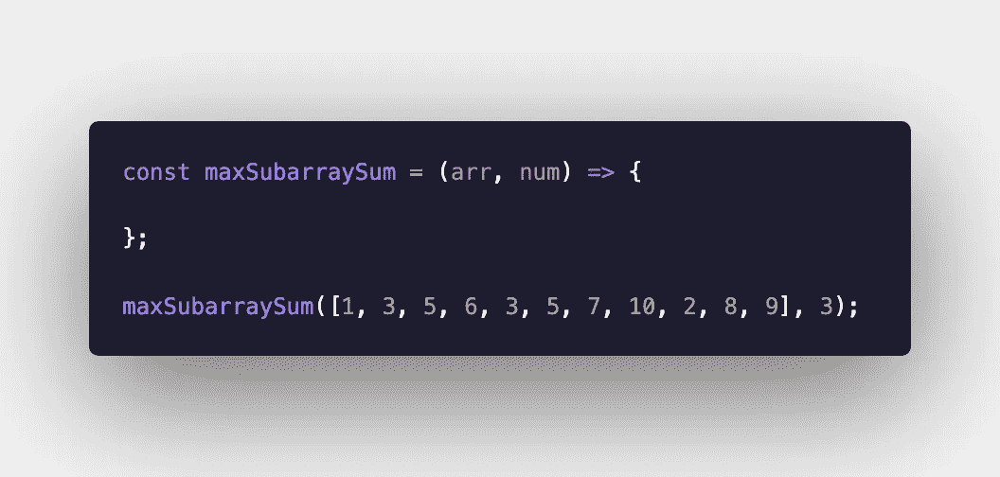
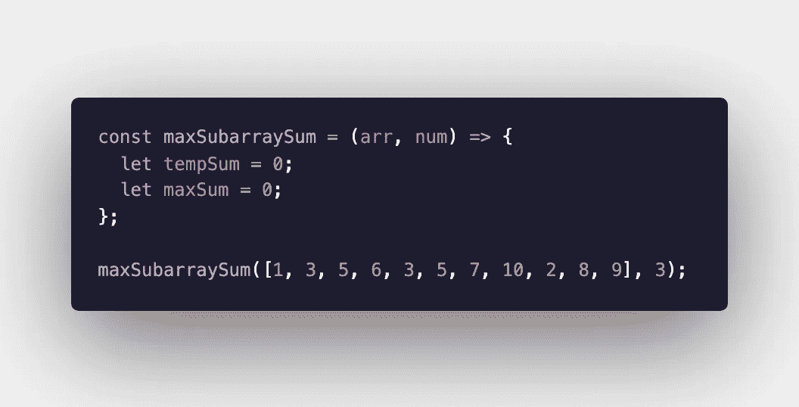
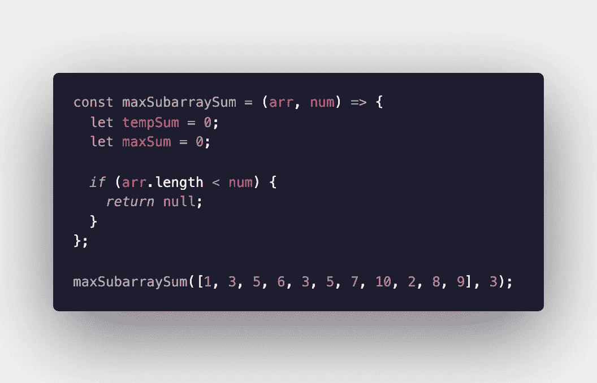
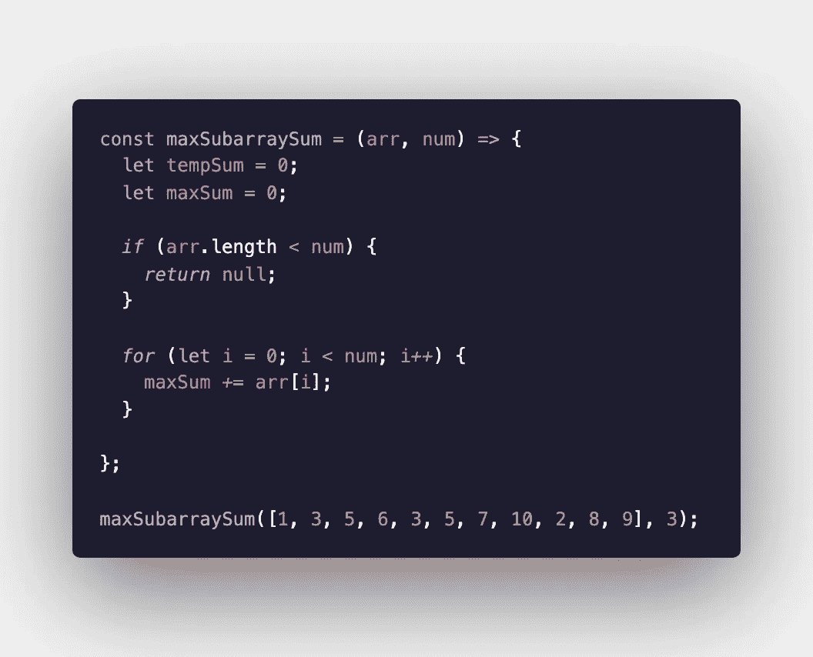
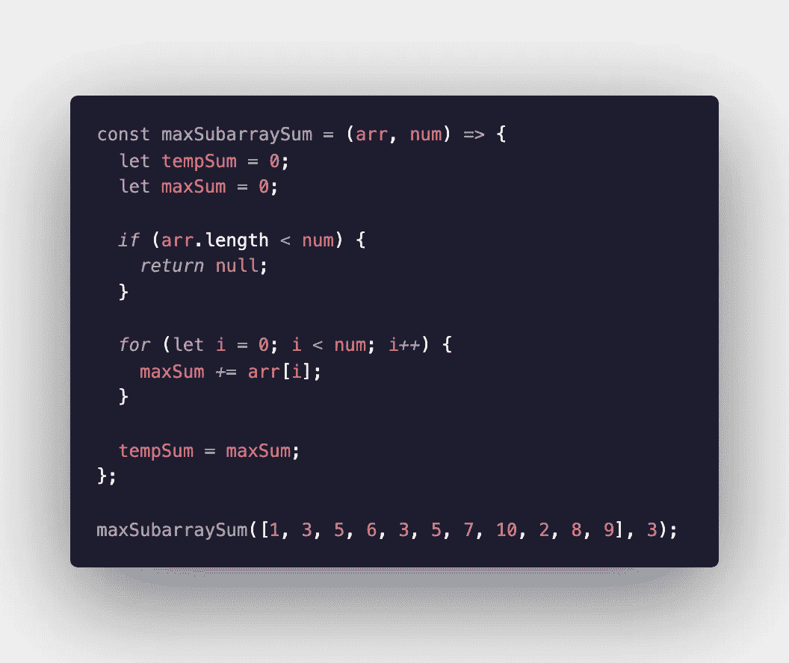
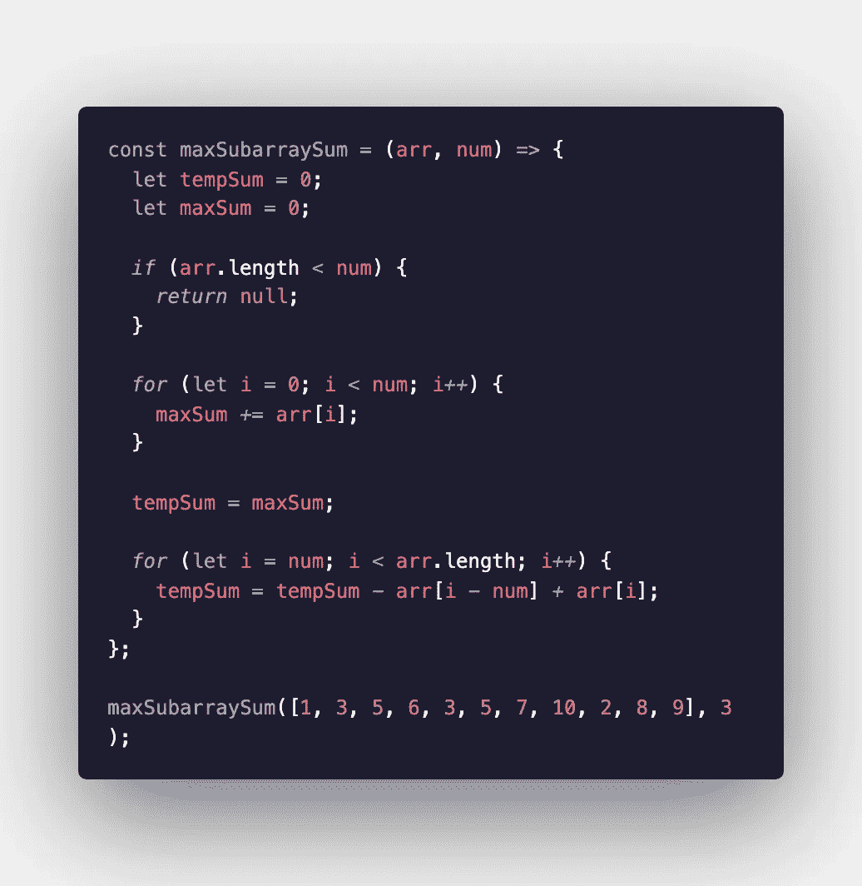
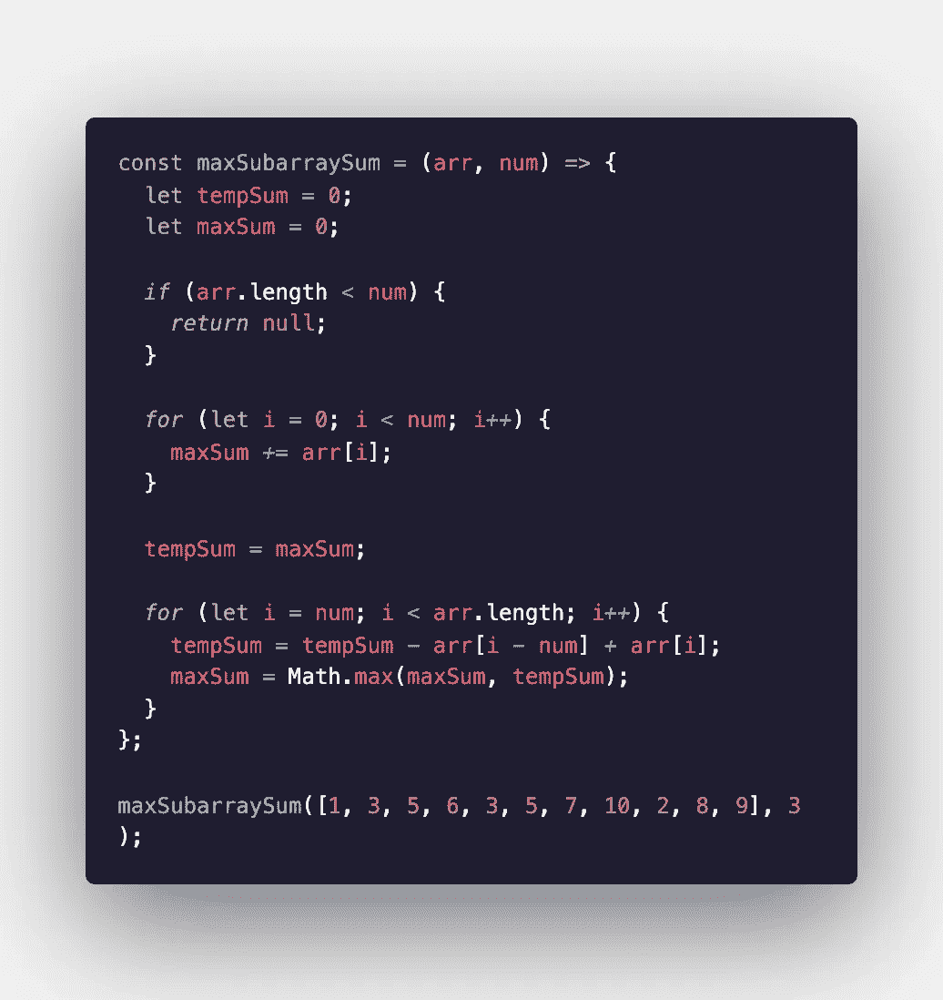
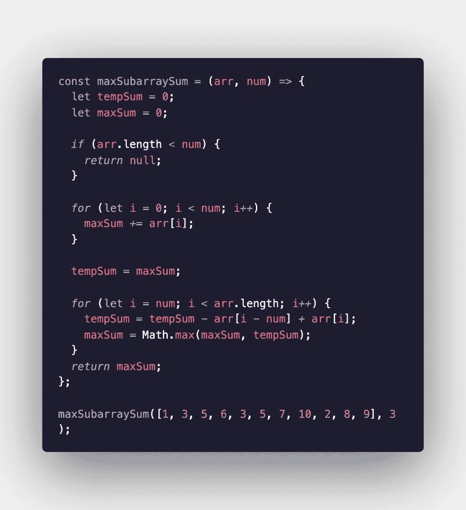

# 求解算法的滑动窗口策略

> 原文：<https://levelup.gitconnected.com/the-sliding-window-strategy-for-solving-algorithms-34c95c80c506>

如果你想学习如何解决算法，滑动窗口技术是首先要熟悉的工具之一。[频率计数器](/how-to-solve-an-anagram-algorithm-using-a-frequency-counter-5bb1f0b817ef?source=friends_link&sk=ba35bb0ca601145b6f7e7dc5803eaed3)、[递归](/solving-a-palindrome-algorithm-using-recursion-f228ac816bcd?source=friends_link&sk=662a97867a517a187deccf4697f054d2)和[多重指针](/using-the-multiple-pointers-strategy-to-solve-algorithms-b90a98f854db?source=friends_link&sk=269d62783f47e3cc37af28503c9c3a6d)是其他一些需要尽早掌握的策略。掌握算法的一个重要技能是知道在什么情况下使用哪种技术。上面提到的所有策略都是解决许多不同算法的有用和有效的方法，但是滑动窗口技术对于不同类型的问题是重要的。

这个策略包括创建一个窗口，或者一个数组的子集，并根据你写的条件上下移动它。这是跟踪数据的一个小子集的一种有用的方法，当您在数组中移动时，您可以将它与下一个数据子集进行比较。

我将在本指南中使用的算法称为 maxSubarraySum。该算法的目的是找到数组中连续数字的最大可能和。这是一个相当简单的滑动窗口算法的例子。我将在本指南中使用 JavaScript。

和往常一样，我们要做的第一件事是声明一个函数并传入参数。这个函数接受两个参数:一个未排序的正数数组和一个整数，它告诉我们应该检查子数组的长度以得到总和。在这个例子中，我们寻找一个长度为 3 的子数组。

接下来我们要做的是声明两个变量，一个是临时变量，另一个是保存当前最大总和的变量。我们希望将它们都设置为零，因为算法的参数指定这些数字都是正数。

一个边缘案例可以马上处理。如果数组的长度比我们应该检查的项数短，我们可以返回 null。

接下来我们需要做的是遍历数组，并将这些数字添加到运行总和中。如果我们从零开始 **i** 并让它增加到 num 的长度，我们已经有效地增加了正确长度的子数组的总数。

一旦我们找到了当前最高的和，我们希望将 tempSum 和 maxSum 都设置为等于这个数。

在下一个循环中，我们将创建滑动窗口。这一次，我们从第一次循环中已经达到的长度(num)开始迭代 **i** 。当我们在整个数组的长度上循环时，我们不断地将 tempSum 设置为等于一个新的子数组的和，这个新的子数组是通过从前一个子数组中减去第一个数字，然后加上前一个子数组末尾之后的索引中的数字而得到的。每次子阵列向前递增时，我们减去被移出子阵列的那个，加上它前面的那个，从而创建一个滑动窗口。

然而，到目前为止的编写方式是用每次迭代覆盖 tempSum。我们永远也不可能知道实际可能的最高金额。我们需要做的是取 tempSum 和 maxSum 之间的最大值，并用它来更新 maxSum。我们可以通过 Math.max()轻松做到这一点。

在该循环的每次迭代中，maxSum 将与临时变量 tempSum 进行比较。如果新数字更大，maxSum 将被设置为等于更大的数字。在这个循环结束时，maxSum 将等于给定长度的任何子数组的最大可能和。我们现在需要做的就是返回 maxSum。确保在循环之外执行此操作。

就是这样！希望这有助于你在将来研究算法时利用滑动窗口策略。

阿曼达·特劳特勒