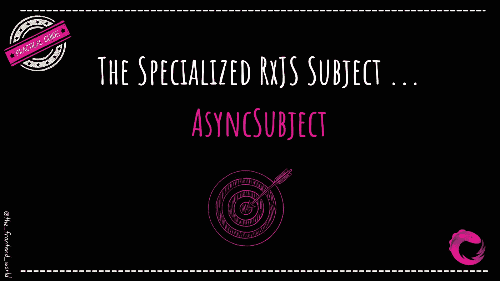

# 专业 RxJS 主题...async 主语

> 原文：<https://levelup.gitconnected.com/the-specialized-rxjs-subject-asyncsubject-e3ec9edcd785>

## RxJS 中关于`AsyncSubject` 的大图

作者:FAM

当您有专门的应用程序需求时，提前知道这些专门主题的存在以一种干净的方式解决问题并且不需要实现堆积如山的代码是非常值得的。

知道如何在你的用例中直接使用这些基础部分真的很有帮助。主题给了你很多关于可观测量如何执行和传递价值的控制。

在本文中，我将向您展示其中一个专业主题的大致情况:

*   `AsyncSubject`

让我们开始吧！

如果你不知道我在说什么，我建议你先从这个开始:

 [## RxJS 像没见过一样！

### 关于 RxJS 你可能想了解或知道的一切！

levelup.gitconnected.com](/rxjs-like-youve-never-seen-it-b99467557a54) 

我假设你有必要的知识跳到 RxJS 的以下高级部分。

# 主题(如果你已经熟悉，跳过这一部分)

为了了解专业`AsyncSubject`，我们首先需要了解`Subject`。

**快速刷新关于** `**Subjects**` **，下面是一个题材的特点:**

*   只不过是一个可观察的(耳语:这个家伙也有一个 subscribe()方法)
*   也是一个观察者。
*   可以产生和接受价值，因为他同时是一个可观察的人和观察者。
*   他可以有一个观察者的列表(不像可观察的物体)
*   他有一种状态(就像 React 应用程序一样)。他可以维护已经订阅他的观察者的列表。
*   可以同时将价值推送给多个观察者(与可观察不同，一次只能推送给一个观察者。如果另一个观察者订阅了相同的可观察值，它将被第二次执行。
*   因此，他是一个多播(不像可观察的)

`Subject`几乎用于所有通常和最常见的用例。但是有时候，你需要一些特殊的行为来实现功能。这就是为什么有些特殊科目存在的原因，其中之一就是`AsyncSubject`。

如果您想了解更多关于主题的信息:

 [## 实用 RxJS 指南终身学习 RxJS！

### 第 3 部分:深入理解 RxJS 模式(高级)

javascript.plainenglish.io](https://javascript.plainenglish.io/practical-rxjs-guide-to-learn-rxjs-for-life-88f2ee508d5c) 

# `AsyncSubject`

> 一个`AsyncSubject`是`Subject`的变体，它只在完成时发出一个值。它将在完成时向它的所有观察者发出它的最新值。

*   仅发出最后接收到的值
*   由`publishLast()`操作员使用

这个操作符一直等到所有的值都被生成，然后确保只有最后一个值被发送给每个观察者。

# 现在就用一些代码行动吧！

> 仅供参考:解释在代码后面

## AsyncSubject 示例:

## publishLast()运算符的示例:

## 说明

正如我们在结果中看到的，这个专门化主题等待所有值产生(`take(4)` : ***0，1，2，3*** )，然后只将最后一个值发送给每个观察者( ***3*** )。即使是在源观察完成后订阅的最后一个订阅者(4 号),也像其他人一样收到最后一个值。

了解专门化`Subjects`的存在是必要的。首先，因为当你在应用程序中面临特殊需求时，你会有一个使用什么的想法。第二，特定需求的实现将会更加容易和干净！

下一篇文章将介绍以下专门主题:

*   `BehaviorSubject`
*   `ReplaySubject`

请告诉我你是否喜欢这篇文章，以及你是否希望我在以后的文章中给你更多关于`AsynchSubject`和用例的例子。我很乐意把它加到我的待办事项里😉

下次见！

我希望这篇文章对你有帮助！

 [## 如果你喜欢看我的文章… ♥️

### 如果你喜欢读我的文章… ♥️，当我的文章发表时，欢迎你第一个得到通知…

famzil.medium.com](https://famzil.medium.com/subscribe) 

> 谢谢你，❤

如果你有兴趣成为付费会员，你可以使用我的推荐链接。下次见

亲爱的读者，感谢你在我生命中的存在。

**让我们联系一下** [**中**](https://medium.com/@famzil/) **、**[**Linkedin**](https://www.linkedin.com/in/fatima-amzil-9031ba95/)**、** [**脸书**](https://www.facebook.com/The-Front-End-World) **、**[**insta gram**](https://www.instagram.com/the_frontend_world/)**、** [**YouTube**](https://www.youtube.com/channel/UCaxr-f9r6P1u7Y7SKFHi12g) 、**或**

**看我的关于网络要素和一般文化的电子书。**