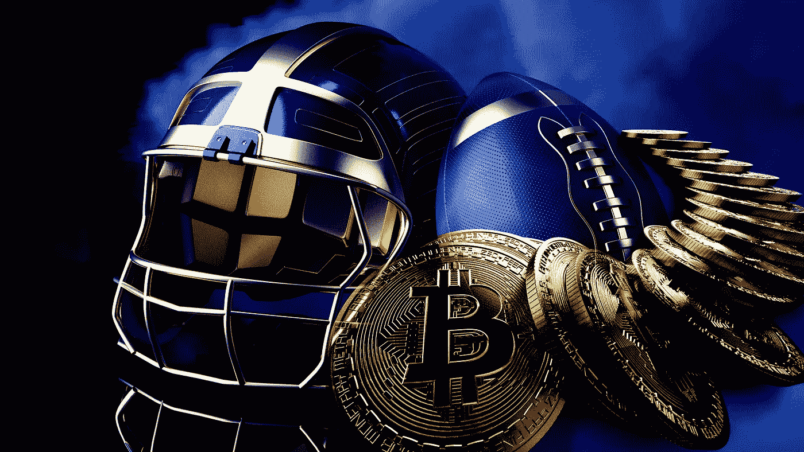
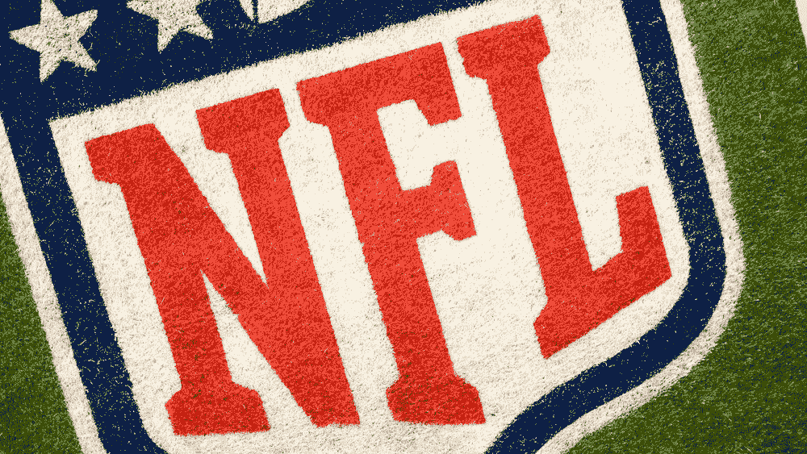

# 选择用比特币支付报酬的体育明星

> 原文：<https://levelup.gitconnected.com/the-sports-stars-opting-to-be-paid-in-bitcoin-770b66bd62ac>

## 它仅限于富人还是向所有人开放的机会？

图片来自 [Shutterstock](https://www.shutterstock.com/image-illustration/virtual-cryptocurrency-money-bitcoin-blackgold-american-1970290145)

在 7 月 14 日于[举行的最佳商业秀上，纽约巨头 Saquon Barkley](https://www.sportskeeda.com/nfl/giants-running-back-saquon-barkley-paid-bitcoin) 宣布，他将接受比特币而不是美元的所有未来代言收入——估计每年 1000 万美元:

来源:[推特](https://twitter.com/JoePompliano/status/1415346064807366658?s=20)

巴克利是众多体育明星中最新一个意识到比特币支付给他们带来的机遇的人。2020 年[卡罗莱纳黑豹队的 Russell Okung 选择用比特币领取他 1300 万美元薪水的一半](https://www.sportskeeda.com/nfl/carolina-panthers-ot-russell-okung-receives-half-salary-bitcoin)汤姆·布拉迪和他的妻子 Giselle Bunchen 已经加入了领先的加密货币交易所，FTX 让加密世界更接近体育世界。

今年 5 月，纽约巨头[与 May Investments](https://www.forbes.com/sites/patriciatraina/2021/05/05/new-york-giants-team-up-with-grayscale-investments-for-nfls-first-cryptocurrency-partnership/)达成合作协议，使 gray 成为该团队的官方加密资产管理合作伙伴。灰度在未来巨人活动的广告中会很明显。

比特币不仅仅出现在 NFL。NBA 萨克拉门托国王队的老板宣布，未来球员如果愿意，也可以选择用比特币支付。这种变化通常需要时间来形成势头，但比特币被视为一个金融机会的早期迹象已经出现。

# 为什么是比特币？

Saquon Barkley 提到的选择接受比特币而不是美元背书的原因似乎主要集中在数字资产上，这种资产在后新冠肺炎时代的全球经济中充当着对冲通胀的作用。美国政府不断印钞，允许支付数万亿美元的个人刺激支票，并资助企业度过经济衰退，这意味着个人美元的购买力实际上被削弱了。

7 月 14 日，美联储主席[杰罗姆·鲍威尔宣布，美国的通货膨胀率达到了 12 年来的最高水平 5.4%](https://thehill.com/policy/finance/562927-powell-inflation-likely-to-remain-high-before-fading-later-this-year) ，这意味着随着人们购买力的下降，物价将会有效上涨。

比特币是一种有限的数字资产，其供应量最多只能达到 2100 万枚。由于数字协议的固有限制，不存在供应泛滥的前景。因此，那些投资比特币的人将它视为一种对冲通胀的手段——一种防止他们的储蓄和投资受到通胀影响的手段。

比特币的价格因波动性而臭名昭著——它可以上下剧烈波动——许多人质疑它是否是一种稳定的资产。例如，在 2021 年，它达到了每枚硬币超过 6 万美元的[历史新高，但目前保持在 3 万美元左右。](https://www.newsbreak.com/@toby-hazlewood-561626/2269934880687/why-many-investors-are-pleased-about-bitcoin-s-recent-price-crash)

对于 Saquon Barkley 和其他选择用比特币支付的人来说，这可能意味着随着时间的推移，收到的钱的价值可能会上下波动，非常剧烈。巴克利似乎很可能指望他的比特币长期升值，保护和增加他的财富。

阿德里安·库利艾尔在 Unsplash 上拍摄的照片

# 比特币只是给有钱的运动员和投资者用的吗？

高调运动员选择用比特币获得部分收入的影响可能是加密货币对许多人来说是正常化的一种方式。每个人都可以安全地购买比特币，与误解相反，它不需要超过几美元的最低投资——你不需要 3 万美元来购买整个比特币，而是可以购买一枚硬币的几分之一(以比特币的假名创造者命名，称为 Satoshis)。

事实上，由于许多因素导致价格暂时下降，包括[中国采取措施禁止比特币相关公司](https://www.theverge.com/2021/6/23/22544367/china-crypto-crackdown-bitcoin-mining-sichuan-ban-hydro-cryptocurrency-trading)在中国运营，现在可能是[以更低价格](/why-im-glad-about-bitcoin-s-recent-price-crash-23241156ffac)购买比特币的一个非常好的时机。

不仅仅是职业运动员可以用比特币支付[——迈阿密市长 Francis Suarez 是全美众多热情拥抱比特币的政治领袖之一](https://www.forbes.com/sites/rogerhuang/2021/02/01/miamis-mayor-leads-the-charge-to-bring-bitcoin-to-americas-largest-cities/?sh=bfc7a2bc6c92)。他宣布了该市投资比特币的意图，并推出了市民使用比特币支付服务和员工使用比特币支付薪酬的设施。

在 Saquon Barkley 的例子之后，越来越多的职业运动员可能开始选择用比特币或其他数字资产支付部分收入。对他们来说，这似乎是一个抵御通胀的机会，同时也是从与资产相关的未来价格上涨中获益的机会。

但每个人都有同样的机会——这仍处于比特币生命的早期，虽然许多人觉得他们错过了投资的机会，但时间总是有的。纽约巨人队和像 Saquon Barkley 这样的运动员是早期采用者，为其他人展示了跟随他们的领导的方式。

你会参与吗？只需要几分钟几块钱[炒一点比特币](/the-exact-process-i-used-to-buy-my-first-bitcoin-in-under-an-hour-bee2df1ee001)。

## 如果你喜欢这篇文章，我希望你能加入我的邮件列表。

注意:*本文仅供参考。不应将其视为财务或法律建议。在做任何重大财务决定之前，先咨询财务专家。*