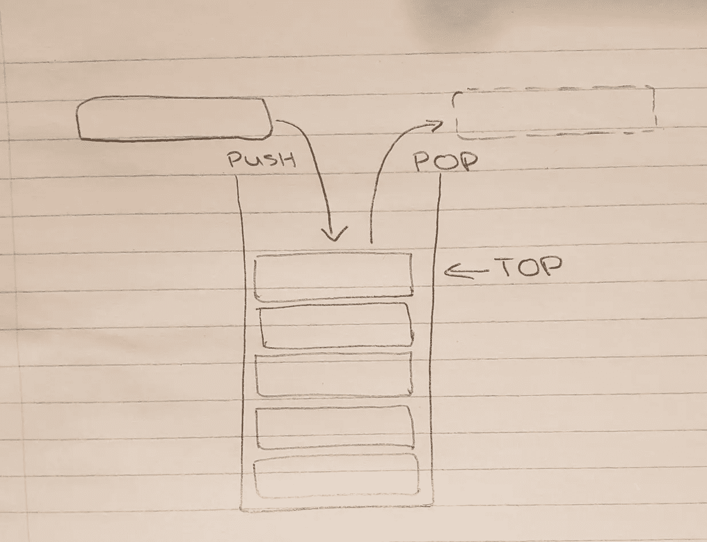
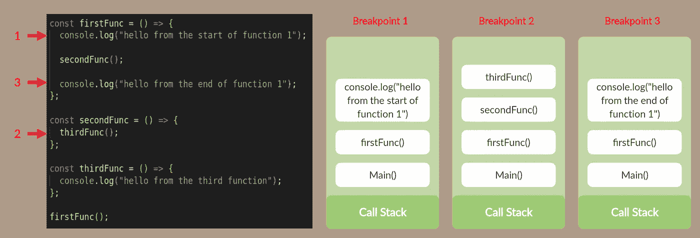
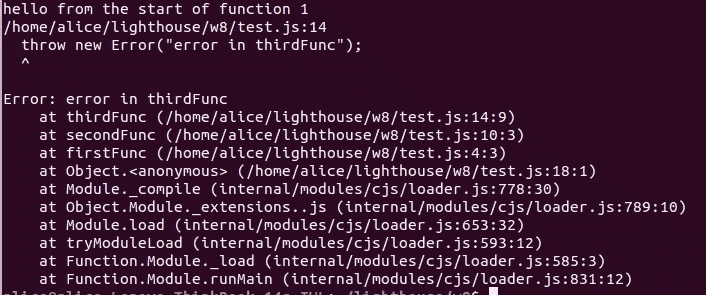
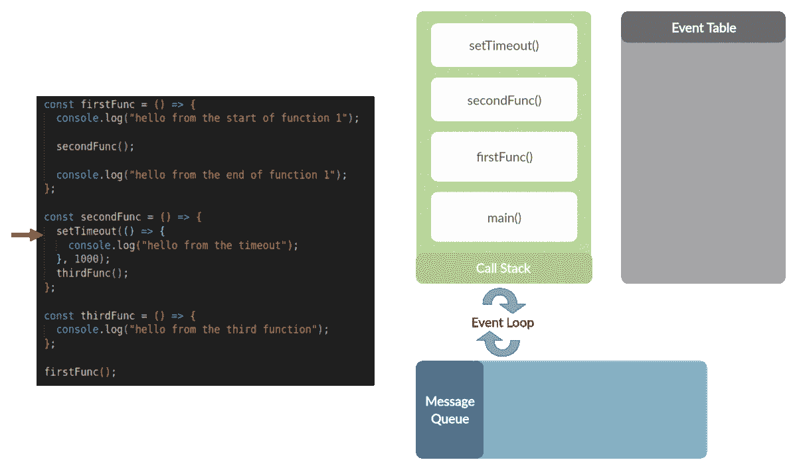

# 堆栈数据结构——它是什么，在 JavaScript 中是如何使用的？

> 原文：<https://levelup.gitconnected.com/the-stack-data-structure-what-is-it-and-how-is-it-used-in-javascript-23562fb8a590>

在本文中，我们将探讨编程中一个非常常见的数据结构——堆栈。我们将研究它是什么以及它的一些常见应用。然后，我将继续提供一些在 JavaScript 运行时如何使用它的上下文。

# 数据堆栈结构

堆栈是一种线性数据结构，元素堆叠在一起。只能访问最后添加的元素，即堆栈顶部的元素。也就是说，堆栈是一种后进先出(LIFO)结构。这与先进先出(FIFO)队列相反。稍后我们将看到 JavaScript 运行时使用了这两者。

数据栈的一个常见类比是一堆(或栈！)的餐盘；盘子叠放在一起。一位顾客从顶部拿走一个盘子。如果出于某种原因，他们想接近第二个板，他们必须先移除上面的那个。

数据堆栈结构的可视化

数据堆栈以同样的方式工作。他们有三项主要业务:

*   Push() —一个新元素被添加到堆栈的顶部
*   Pop() —移除并返回堆栈顶部的元素
*   Top()/peek() —查看堆栈并返回推入堆栈的最后一个元素。此操作不会改变堆栈。

堆栈将有一个最大大小；当超过此限制时，称为**“堆栈溢出”**。这通常是在调用递归函数而没有正确定义基本或终止用例时造成的。

## 履行

1.  排列
2.  链表

## 应用程序

当动作的顺序很重要时，堆栈数据结构很有用。它们确保系统在完成之前的动作之前不会进入新的动作。下面是一些使用堆栈的常见示例:

*   **反转—** 默认情况下，无论输入什么，数据堆栈都会反转。例如，如果我们想反转字符串“Hello World”。我们将把每个字符压入堆栈，然后弹出每个字符。
*   **撤销/重做—** 这种方法可以在编辑器中实现撤销和重做功能。每次发生变化时，程序的状态可以被压入堆栈。为了撤消，使用 pop()删除最后的更改。
*   **回溯—** 这可以在编写算法来解决选择路径的问题时使用，例如迷宫。选择一条路径，如果它导致一个死胡同，则必须移除该路径中的这个最新分支(pop())并选择另一条路由。每次选择一个路径，它就被推送到堆栈中。
*   **调用堆栈—** 编程语言使用数据堆栈来执行代码。当一个函数被调用时，它被添加到调用栈中，并在完成后被删除。

本文的其余部分将更深入地研究调用堆栈示例。

# JavaScript &调用栈

> 一个**调用栈**是一个解释器(就像网页浏览器中的 **JavaScript** 解释器)的机制，用来跟踪它在**调用**多个函数的脚本中的位置。

JavaScript 是单线程语言，这意味着它一次只能做一件事，因此它只有一个调用栈。该过程如下所示:

1.  脚本调用一个函数
2.  将函数添加到调用堆栈中，并执行函数
3.  如果在中调用了另一个函数，它将被添加到调用堆栈的顶部，并一直执行到完成。
4.  一旦完成，当前函数从堆栈中取出，原始函数继续执行。

运行时不同部分的调用堆栈的可视化表示

从上图中我们可以看到，调用栈记录了你在程序中的任何一点。如果代码中有错误，我们会得到堆栈跟踪作为错误消息的一部分。错误消息“thirdFunc 中的错误”下面的行显示了错误发生时调用堆栈的当前状态。理解这一点对于调试和更好地理解代码是如何执行的非常有用。

## 执行上下文

我们现在要深入一点，当一个函数被添加到堆栈中时，实际上会发生什么。为了理解这一点，我们需要了解“执行上下文”。执行上下文是调用堆栈上的每个元素。

当代码在 JavaScript 中运行时，它可以在以下三种环境之一中执行:

1.  全局上下文—这是程序开始时执行代码的默认环境
2.  函数上下文—当解释器进入函数体时
3.  Eval 上下文—在内部 eval 函数中执行的文本(不常用)

总是只有一个全局上下文，但是可以有任意数量的函数/求值上下文。正如我们在上面看到的，每个函数调用都创建一个新的函数上下文(甚至是对自身的调用)。

创建新的执行上下文有两个阶段:

1.  **创建—** 创建一个*执行上下文对象*。它包含三个键:

*   *变量对象* —创建变量、函数和自变量。变量被声明并初始化为 undefined(在这个阶段没有给它们赋值)。函数声明按名字存储，名字在内存中有一个指向函数的引用指针。**
*   *作用域链* —当前上下文的变量对象及其所有父级词法变量对象的集合。这就是函数访问其父变量的方式。
*   *This* —确定上下文中“This”的值

2.**执行**

*   给变量赋值
*   解释和执行代码

* *这就是函数声明可以被“提升”的原因。它是在创建阶段分配的，而函数表达式直到执行阶段才被赋值。

为了帮助解释这一点，请遵循下面的代码示例，我们将查看以下代码的每个阶段的执行上下文对象:

创建阶段的执行上下文对象:

执行阶段的执行上下文对象:

当每个执行上下文被添加到 JavaScript 中的调用堆栈时，希望这能提供对该过程的更深入理解。

单线程进程的一个问题是，如果一个特定的函数需要很长时间，那么在它完成之前，没有其他代码可以执行。这被称为“**阻塞**”。在浏览器中使用时，这可能会导致页面无响应。

JavaScript 中对此的一个解决方案是使用异步回调，它本质上是在异步过程完成后，将要运行的代码块放在一边，但同时继续运行其余的代码。但是这是如何与调用堆栈一起工作的呢？

## 事件循环

> 事件循环负责执行代码，收集和处理事件，以及执行排队的子任务。

一旦异步流程完成，JavaScript 运行时使用一个 ***消息队列*** 来排列包含回调函数的“消息”。这个进程是 FIFO(先进先出)，所以如果有多个异步操作，最快的将在队列中第一个被调用。

当一个异步进程进入堆栈时，它被移动到 ***事件表*** ，所有其他同步函数都通过堆栈处理。当异步流程完成时，它被移动到消息队列中。一旦堆栈为空，事件循环就开始处理队列中的消息；它接受第一个函数并调用回调函数。这将在堆栈上创建一个帧。该函数完成并从堆栈中移除。堆栈现在又是空的，因此事件循环检查消息队列中的下一项。这个过程一直持续到堆栈和消息队列为空。

事件循环优先考虑调用堆栈，它处理它在调用堆栈中找到的所有东西，一旦为空，它就进入消息队列获取任何消息。

下面的动画展示了前一个示例，该示例现在包括一个异步流程:

事件循环事件序列

# 结论

希望这篇文章能帮助你更好地理解 JavaScript 的内部工作原理以及你的代码实际上是如何运行的。要了解更多信息，请看下面的一些资源。

## 关键要点:

*   堆栈是先进后出的数据结构
*   元素只能从顶部推入和弹出
*   数据堆栈的一个主要用途是让 JavaScript 解释器跟踪函数调用——这是一个调用堆栈
*   调用堆栈上的每个元素都是一个执行上下文(全局、函数、eval)。只能有一个全局上下文，但可以有多个函数上下文。
*   JavaScript 只有一个调用栈，但是使用消息队列和事件循环优化了异步操作。

## 资源:

 [## 堆栈数据结构| Studytonight

### 堆栈是一种抽象数据类型，具有有限的(预定义的)容量。这是一个简单的数据结构，允许添加…

www.studytonight.com](https://www.studytonight.com/data-structures/stack-data-structure)  [## 数据结构/堆栈和队列

### 待办事项:队列实现为数组:循环和固定大小堆栈是一个基本的数据结构，可以在逻辑上…

en.wikibooks.or](https://en.wikibooks.org/wiki/Data_Structures/Stacks_and_Queues)  [## JavaScript 中的执行上下文&栈是什么？

### JavaScript 中的执行上下文&栈是什么？-在这篇文章中，我将深入探讨一个最…

davidshariff.com](http://davidshariff.com/blog/what-is-the-execution-context-in-javascript/)