# Magic 和 JavaScript 中的堆栈

> 原文：<https://levelup.gitconnected.com/the-stack-in-magic-and-javascript-47229c148990>

## 什么是栈，在 JavaScript 中是如何使用的？它和魔法聚会有什么关系？

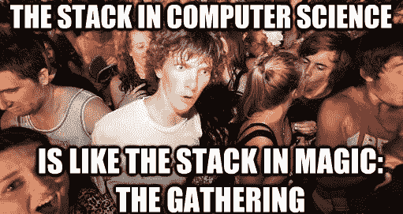

**哇。**

作为广受欢迎的纸牌游戏 [***魔法:聚会***](https://magic.wizards.com/) 的狂热玩家，我已经熟悉了计算机编程之外的一个概念“堆栈”。当我在[***light house Labs***](https://www.lighthouselabs.ca/)参加 web 开发训练营时，有一天听到一位讲师提到了堆栈，我想“*哦，嘿，我以前听说过这个。“我一点也不知道魔术和计算机的概念有多么相似。*

那么，什么是“**栈**”？在魔法中，它是咒语(*召唤魔法生物、施放火球、操纵时间、起死回生、召唤自然、与灵魂交流……像*这样酷的东西)被施放、回应和解决的过程。在计算中，它是存储和解析数据和任务的数据结构。在这两种情况下，堆栈都是一个**先入后出** ( *FILO* )类型数据结构的例子。

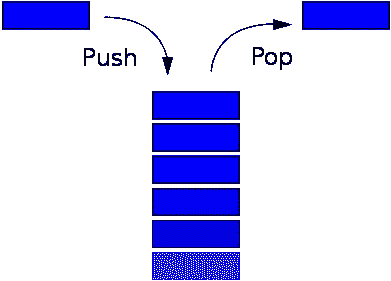

***堆栈的标准可视图像，即先入后出数据结构。***

那是什么意思？典型的类比是想象桌子上有一叠文件或一堆书:你把一本书放在另一本书的上面，如果你想拿走一本，你就从最上面的那本开始，一步步往下。栈的概念在计算中无处不在，指的是用于存储对象的线性数据结构；对象通常通过“*推*动作添加，通过“*弹出*动作移除。也可以使用“ *peek* ”操作在不移除它们的情况下查看它们。在 JavaScript 中，使用的主堆栈被称为**调用堆栈**，它与函数的解析方式有关。

> 对象通常通过“推入”动作添加到堆栈中，通过“弹出”动作移除。

JavaScript 中使用的另一种数据结构是**队列**——或**先进先出** ( *FIFO* )结构——现实生活中一个常见的例子是在银行排队:第一个排队的人是第一个被服务的人。在计算中，一个常见的例子是如何将文件发送到打印机队列进行打印:文件按照发送的顺序打印。在 JavaScript 中，队列或类似于 *FIFO 的*结构用于**事件循环**——异步事件是如何处理的——但我们将在本文的后面讨论这一点(正如您将看到的，它也不是严格意义上的 *FIFO* 系统)。

我们今天要提到的 JavaScript 中使用的最后一个数据结构叫做**堆**，它是一个很大程度上非结构化的内存区域，用于存储对象和变量。至少就本文的目的而言，您不需要了解更多关于堆的知识。

但是回到堆栈，我将会以一种不同于平常的方式来解释这个概念:通过使用魔法咒语被决斗的维度旅行巫师施放和回应的类比。干净利落。

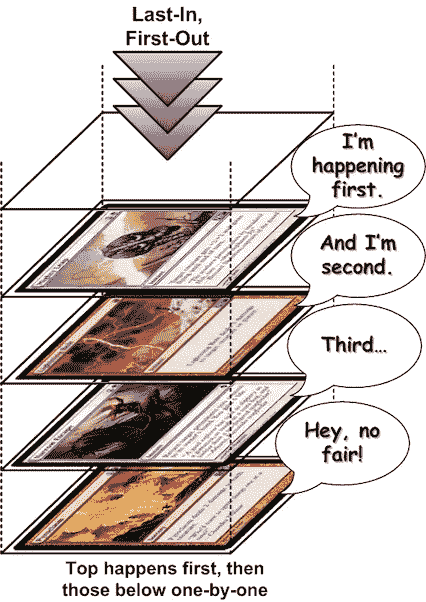

***一种稍微有趣一点的想象堆栈的方式。***

agic:聚会(或简称 MTG)是一种可收藏的纸牌游戏，发明于 1993 年，全球有超过 2000 万玩家玩。它是由美国数学家理查德·加菲尔德创造的，这可能解释了游戏中的概念与数学和计算领域之间的一些重叠。该游戏以其极度的深度和复杂性而闻名，最近被证明是 ***图灵完全***；这超出了本文的范围，但它非常有趣，如果你喜欢 [，你可以在这里阅读它。](https://boingboing.net/2012/09/12/magic-the-gathering.html%29.)我是这款游戏的超级粉丝，它以*彩色轮盘* *l* 的形式包含了一个 [**美丽简单却又深刻的人生哲学，它甚至帮助我在新兵训练营期间理解了某些关键的编程概念。**](https://medium.com/s/story/the-mtg-color-wheel-c9700a7cf36d)

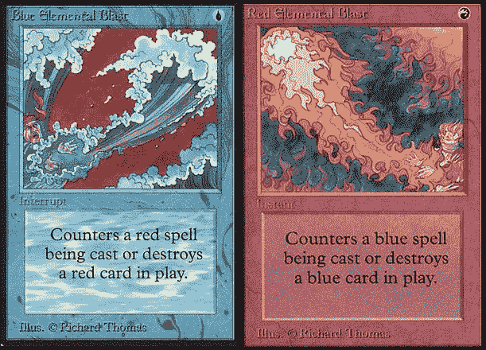

只是几个咒语。

游戏的目标是将对手巫师(被称为*旅法师*)的生命值从最初的 20 或 40 减少到 0(取决于游戏的版本)。这是通过伤害法术和能力的组合，用生物和其他动作攻击来完成的。就本文的目的而言，我将把重点放在施法上，因为这是堆叠在游戏中发挥作用的地方。

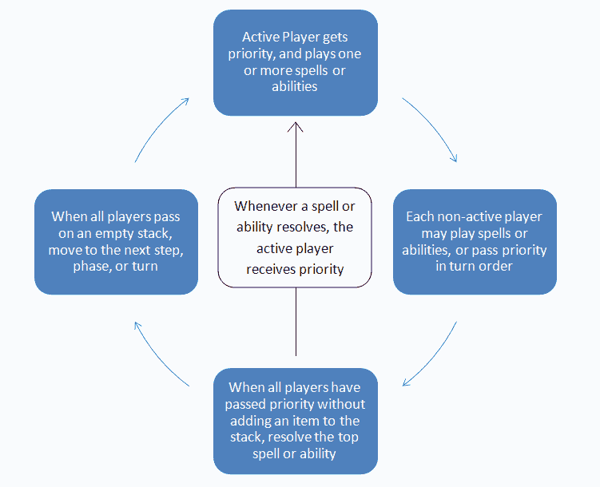

MTG 烟囱流动的可视化。不用担心“优先”。

上图说明了在 MTG 咒语和异能是如何被加入堆叠的。你可以把每个玩家添加咒语到堆栈中，就像 JavaScript *把*函数推到调用堆栈中执行一样。这不是一个完美的类比，但是让我们通过代码进一步探索相似之处。

> T 看看下面的 JavaScript 代码，特别关注一下 **console.log()** 的顺序:

魔术中使用堆栈的经典交换。

*(注意:出于类比的目的，这个例子被稍微简化了。实际上，****console . log()****也被推送到堆栈中，就像所有这些代码在其中运行的****main()****执行上下文一样。要更深入地了解执行的背景，请查看这篇文章* *，这篇文章对执行做了更深入的解释。)*

如果您从上到下阅读这段代码，您可能会认为 **console.log()** 将按照它们在代码中出现的顺序从上到下出现在终端输出中。然而，事实并非如此。让我们看看它们在输出中实际出现的顺序:

> 玩家 1 施放闪电箭！
> 
> 玩家 2 施放反击术，目标是玩家 1 的闪电箭
> 
> 没有更多的法术可以施展。开始解析堆栈。
> 
> 反击解决和反击闪电箭！
> 
> 闪电箭被反击并从堆叠中移除。

这是怎么回事？让我们一步一步来。

最初，调用堆栈是空的。函数已定义但尚未调用。

```
castLightningBolt();
```

在文件的底部，第一个函数被调用，*将*推送到调用堆栈。第一个 **console.log()** 打印:

> 玩家 1 施放闪电箭！

```
function castLightningBolt() {
  console.log('Player 1 casts Lightning Bolt!'); castCounterspell(); console.log('Lightning Bolt is countered and removed from the stack.');
}
```

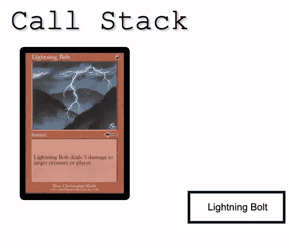

调用栈现在包含一个函数/法术。但是，在第二个 **console.log()** 运行之前，调用了下一个函数: **castCounterspell()** 。

```
function castCounterspell() {
  console.log('Player 2 casts Counterspell, targeting Player 1’s Lightning Bolt.'); resolvePhase(); console.log('Counterspell resolves and counters Lightning Bolt!');
}
```

和前面一样， **castCounterspell()** 被推送到调用堆栈中， **castCounterspell()** 函数中的第一个 **console.log()** 被打印出来:

> 玩家 2 施放反击术，目标是玩家 1 的闪电。

调用堆栈现在看起来像这样:

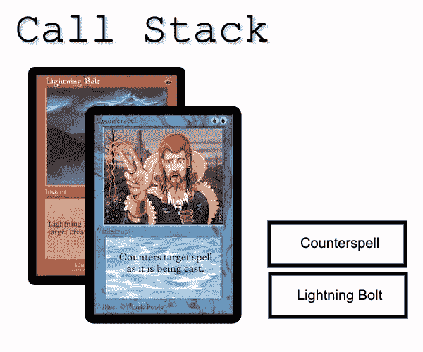

在打印 **castCounterspell()** 中的第二个 **console.log()** 之前，调用函数 **resolvePhase()** 并将*推送到调用栈。*

```
function resolvePhase() {
  console.log('No further spells to cast. Begin resolving the stack.');
}
```

由于函数体中没有进一步的函数调用，它继续打印:

> 没有更多的法术可以施展。开始解析堆栈。

完全执行后， **resolvePhase()** 然后*从栈顶弹出*。

现在，堆栈上剩余的函数开始以调用它们的相反顺序逐一解析，并且*将*弹出调用堆栈。

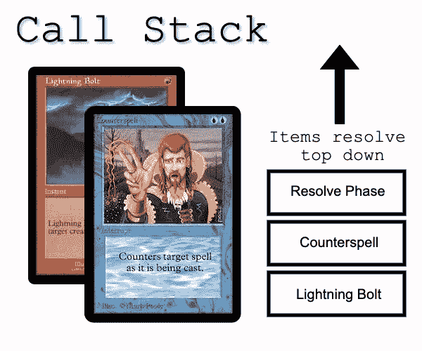

因此，从上面的日志序列中可以看到， **castCounterspell()** 函数将它的第二个**console . log()**——在调用 **resolvePhase()** 之后的一个*——打印到控制台，然后从堆栈中删除，随后是 **castLightningBolt()** 函数执行相同的操作:*

> 反击解决和反击闪电箭！
> 
> 闪电箭被反击并从堆叠中移除。

堆栈现在是空的；在 MTG，这导致阶段结束。在 JavaScript 中，这意味着代码运行完毕。

*(通常函数有一个输出到* ***返回*** *)，但是这个例子中的函数只是简单地将文本打印到控制台。)*

调用栈有一个可以达到的最大大小(在 Chrome 浏览器中是 16000 帧)；如果堆栈大小超过这个，将会抛出一个错误，浏览器将会崩溃，并显示消息**最大堆栈错误达到。**这通常是由函数进入无限循环引起的，也可以通过魔法卡演示。

看看下面的卡片，看看你是否明白了:

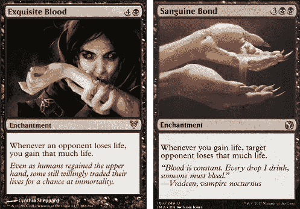

**Magic IMO 中最 cheesiest 的无限循环之一。**

> **现在用代码读出来:**

正如你可能推断的那样，调用 **ping()** 通过调用**excuse blood()**来引发循环，后者调用 **sanguineBond()** ，后者调用**excuse blood()**，后者调用 **sanguineBo** …。你明白了。

> 这导致玩家 2 立即获胜，并且控制台输出为:

```
***...15,995 lines of the same output above...***Player 2 gained one life. Player 1 loses one life.Player 1 lost one life. Player 2 gains one life.Player 2 gained one life. Player 1 loses one life.Player 1 lost one life. Player 2 gains one life.Player 2 gained one life. Player 1 loses one life._stream_readable.js:896Readable.prototype.removeListener = function(ev, fn) {RangeError: Maximum call stack size exceededat WriteStream.Readable.removeListener (_stream_readable.js:896:45)at Object.Console.<computed> (internal/console/constructor.js:245:12)at Object.log (internal/console/constructor.js:282:26)at sanguineBond (/Users/commoddity/lighthouse/w8/d5-writing/mtg-infinite.js:14:10)at exquisiteBlood (/Users/commoddity/lighthouse/w8/d5-writing/mtg-infinite.js:10:2)
```

结尾的那堆代码被称为**堆栈跟踪**，对调试非常有用。它通常包含对程序员有用的信息，帮助他们确定到底哪里出错了。

# 异步函数和事件循环

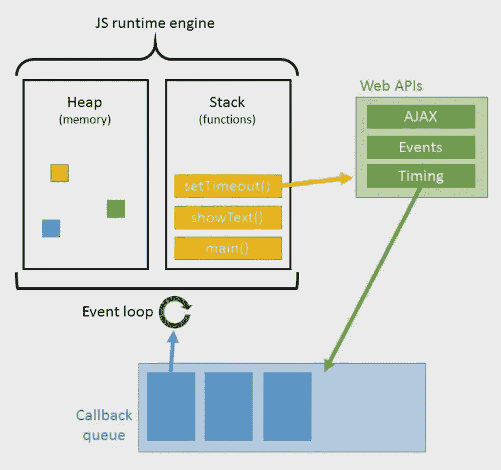

事件循环的可视化表示。感谢[升一级教程。](https://www.leveluptutorials.com/)

我之前提到的**事件循环**是 JavaScript 处理异步函数的方式。如果你不知道那些是什么，你可以在这里阅读[](https://medium.com/javascript-in-plain-english/javascript-async-await-and-promises-explained-like-youre-five-years-old-61733751e9a5)**关于异步概念的精彩介绍。**

**基本上，几乎所有的互联网应用程序都会在某个时候包含依赖于数据或输入的代码，这些数据或输入可能会在不确定的时间返回或出现。由于 JavaScript 是单线程的[](https://dev.to/steelvoltage/if-javascript-is-single-threaded-how-is-it-asynchronous-56gd)****和[**阻塞的**](https://nodejs.org/de/docs/guides/blocking-vs-non-blocking/) ，这意味着它需要一种方法来处理这些代码，而不停止它试图运行的整个代码块。如果在移动到下一行之前，它必须等待每一个不确定的数据或输入，那么它可能需要非常长的时间来运行，*或者可能根本不运行*；这对用户不利，因此对程序员也不利。这就是**事件循环**出现的地方。******

****当一个异步函数被调用时，它被推入一个名为 ***回调队列*** 的队列中，等待程序的其余部分运行。当剩余的(*同步*)代码运行完毕，如果回调队列中的函数所依赖的数据已经返回或者它们等待的事件已经发生，那么这些函数将运行*。还记得我说过**事件循环**使用类似 *FIFO 的*数据结构吗？*****

> *****回调队列*中的函数将按照特定的顺序运行，但是*只有在它们的特定条件被满足时才会运行*。****

****如果函数仍在等待满足某个条件，队列中的下一个函数将改为运行，被跳过的函数稍后将返回。****

****如果这有点令人困惑，那完全没关系。也许另一个*魔法:聚会*的类比可以帮助澄清它(不要担心理解这些卡片上的所有规则文本)。****

****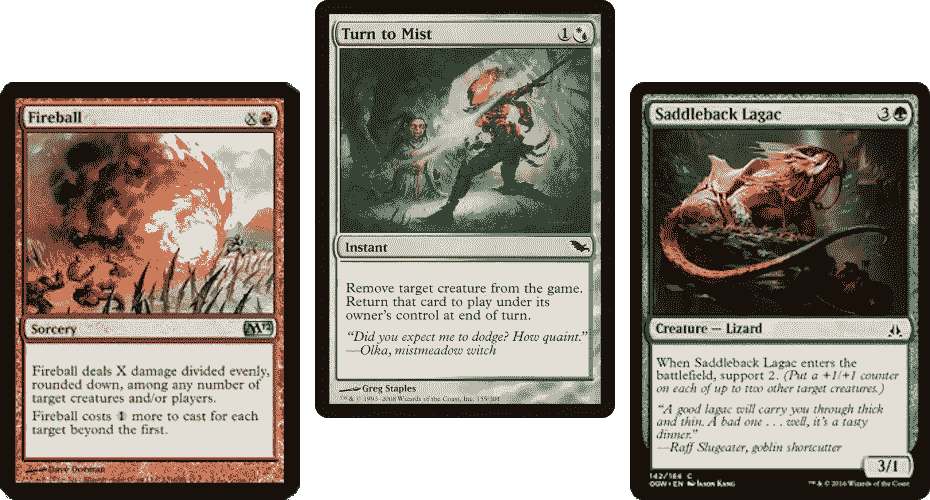****

******化为薄雾**是这里的重要底牌。另外两个只是配角。****

> ******转雾**的效果就像一个异步函数；换句话说，它被推出调用堆栈，放入回调队列。示例中使用了一个 **setTimeout()** 函数来模拟异步行为。****
> 
> ****考虑到这一点，考虑下面的代码:****

****和我们的第一个例子一样，直到程序的最后两行才调用函数。此时， **castTurnToMist()** 被调用，它打印:****

> ****玩家 1 施放变身迷雾。****
> 
> ****将目标生物移出场上。****

****然后变量 **saddlebackLagacInPlay** 被设置为*假。*****

****之后的下一行代码是我们的 **setTimeout()** 函数，它表现得好像是异步的，这意味着它被*推送到 ***回调队列*** 中，并将在至少 5000 毫秒后解析，打印它的 **console.log()** ，并将 **saddlebackLagacInPlay** 设置为 *true* ***。********

```
**setTimeout(() => {
  phase = 'end of turn';
  saddlebackLagacInPlay = true;
  console.log(`Return target creature to play at ${phase}.`);
}, 5000);*// This function simulates the behaviour of an asynchronous function // by pushing its execution outside the call stack and into the 
// event loop. In a real async function, this would be because the // function waits for data from a network request or user input.***
```

****这结束了 **castTurnToMist()的**函数体，因此*将*弹出调用堆栈。****

****现在 **castFireball()** 被调用，针对可怜的鞍背拉加。 **castFireball()** 根据 s **addlebackLagacInPlay，**的布尔值有条件地打印文本，该值当前仍为*假*。****

```
**const castFireball = () => {
  if (saddlebackLagacInPlay === true) {
    console.log('Saddleback Lagac targeted by Fireball.')
  } else {
    console.log('Invalid target. Saddleback Lagac is not in play.');
  }
};**
```

****尽管在代码中 **setTimeout()** 函数在 **castFireball()** 之前被调用，但是它异步地*动作*，因此所有剩余的代码必须在它可以从 ***回调队列*** 解析之前运行。****

****因此 **saddlebackLagacInPlay** 仍然是 *false* 并且 **castFireball()** 将打印:****

> ****无效目标。马鞍峰拉加克没有上场。****

****五秒钟后，当 **setTimeout()** 函数体从其在 ***回调队列*** 中的位置解析时，我们看到以下内容被打印到控制台:****

> ****回合结束时，将目标生物移回场上。****

*****【1】关于确切订单的更多细节，请阅读* [*本文*](https://nodejs.org/uk/docs/guides/event-loop-timers-and-nexttick/) *。*****

*****【2】确切地说:5000 毫秒加上运行* ***同步*** *代码所需的时间，这些代码必须在回调队列开始运行之前执行。*****

*****【3】如果没有了****setTimeout()****函数内的****castTurnToMist()****所有的代码早就同步运行了。这意味着当****cast fireball()****被调用****saddlebackLagacInPlay****就会被求值为 true，而****cast fireball()****就会被打印:*****

> ****被火球瞄准的马鞍峰拉加。****

****我希望这个例子让 JavaScript 中的异步函数和**事件循环**的行为更加清晰。如果没有，不要担心；这是一个复杂的话题，可能需要更多的阅读和经验来弄清楚。如果您想阅读更多内容，整篇文章中链接的文章可能会提供对该主题的更深入理解。****

****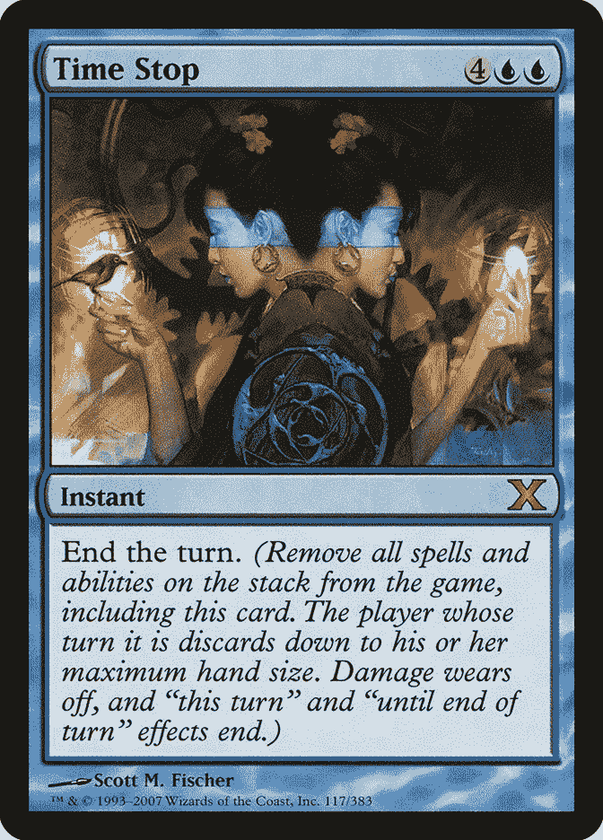****

****结束了。****

> ******2020 年，帕斯卡尔·范·卢文******
> 
> ****pascalvanleeuwen604@gmail.com****
> 
> ****[https://github.com/Commoddity/](https://github.com/Commoddity/)****

******参考文献******

****[了解 Javascript 函数执行—调用栈、事件循环、任务&更多](https://medium.com/@gaurav.pandvia/understanding-javascript-function-executions-tasks-event-loop-call-stack-more-part-1-5683dea1f5ec) — *Gaurav Pandvia* 、 **Medium******

****[调用栈](https://developer.mozilla.org/en-US/docs/Glossary/Call_stack) — **MDN Web Docs******

****[堆栈(抽象数据类型)](https://en.wikipedia.org/wiki/Stack_(abstract_data_type))——**维基百科******

****[栈&队列| JavaScript 中的数据结构](https://www.youtube.com/watch?v=1AJ4ldcH2t4) — *beiatrix* ， **YouTube******

****[栈:后进先出](https://www.youtube.com/watch?v=IWQ74f2ot7E)——*复古游戏力学讲解*、 **YouTube******