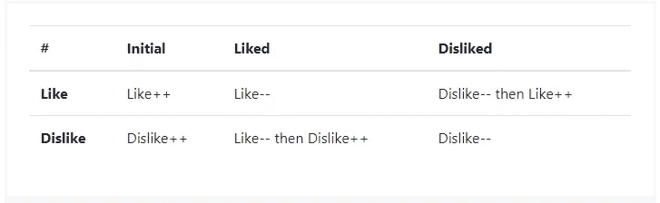

# 如何在 C#中使用状态设计模式实现好恶

> 原文：<https://levelup.gitconnected.com/the-state-design-pattern-to-implement-likes-and-dislikes-958389b379ff>

## 从需求引出开始

由 [CardMapr](https://unsplash.com/@cardmapr?utm_source=medium&utm_medium=referral) 在 [Unsplash](https://unsplash.com?utm_source=medium&utm_medium=referral) 上拍摄的照片

根据对象的状态，对象的行为会有所不同。例如:

*   如果订单被提前取消，则无法发货。
*   音频播放器可以在停止或暂停时播放，但不能在播放时播放。
*   线程对象只有在以前没有启动过的情况下才能启动。

当对象的行为由其状态决定时，开发人员可以考虑使用状态设计模式。

为了向您解释经典的状态设计模式，我选择了“喜欢-不喜欢”功能——您在观看 YouTube 视频或阅读评论后使用该功能来快速表达您的感受。我想马上警告你，在我看来，状态模式的经典实现对于“喜欢-不喜欢”特性来说有点过头了。然而，我发现它非常适合于学习目的，因为现在这个特性是众所周知的，简单并且可以通过状态模式来实现。

在进入模式的实现细节之前，我们需要收集我们将要实现的需求。

# 需求启发

需求必须是可理解的，可行的，明确的等。它们应该在开发阶段之前建立，这样就没有必要做任何多余的工作。

“喜欢-不喜欢”功能的功能要求如下:

*   如果用户点击“喜欢”按钮，增加喜欢的数量。
*   如果用户点击“不喜欢”按钮—增加不喜欢的数量。
*   如果用户在之前点击了“喜欢”的情况下点击了“喜欢”按钮，则减少“喜欢”的数量(不喜欢)。
*   如果用户在之前点击“不喜欢”时点击了“不喜欢”按钮，则减少不喜欢的数量(不喜欢)。
*   如果用户在之前点击“不喜欢”时点击“喜欢”按钮，则减少不喜欢(不喜欢)的数量，增加喜欢的数量。
*   如果用户在之前点击“喜欢”的时候点击了“不喜欢”按钮，则减少喜欢的数量，增加不喜欢的数量。

顺便说一下，这些需求可以用更少的文字写成表格:

通过分析给定的需求，我们可以确定对状态设计模式的需求。第一个和第二个需求没有告诉我们任何关于状态模式的信息。但是请看看这两个要求:

*“如果用户在之前点击了“喜欢”的情况下又点击了“喜欢”按钮——减少喜欢(不喜欢)的数量。”*

和

*"如果用户在之前点击“不喜欢”时点击了“喜欢”按钮，则减少不喜欢(不喜欢)的数量，增加喜欢的数量。"*

在这两种情况下，用户执行相同的类似动作。然而，结果是不同的，因为它们不仅由动作决定，而且由**动作加上当前状态**决定。“点击喜欢”是一个动作，而“当喜欢/不喜欢被点击时”是一种状态。对喜欢的组件执行类似的动作导致喜欢的数量减少，而对不喜欢的组件执行类似的动作导致不喜欢的减少和喜欢的增加。“喜欢-不喜欢”组件根据其当前状态表现不同。这是状态设计模式的一个用例。

# 状态设计模式实现

状态设计模式由三个组件组成:

*   语境
*   抽象状态
*   具体状态

在我们的例子中，上下文将是一个名为 LikeDislikeComponent 的对象，它封装了两个计数器和一个到其当前状态的链接—一个抽象状态。

抽象状态将由 ILikeDislikeComponentState 接口表示，该接口定义了喜欢和不喜欢的动作。

具体状态将由三个对象 InitialState、LikedState 和 DislikedState 表示。每个特定的状态对象对上下文对象执行两个操作:改变喜欢或不喜欢的数量，并将对象转移到新的状态。

下面是完整的实现:

# 结论

正如我在文章开头提到的，经典的状态设计模式对我来说是一个“喜欢-不喜欢”特性的过度工程。我认为是这样，因为只有三种可能的状态，业务逻辑很简单。但是我想在一些简单的同时又是“真实世界”的东西上演示状态模式。我希望你喜欢它。

# 更多设计模式

 [## 适配器设计模式的最简单解释

### C#中的真实世界示例

levelup.gitconnected.com](/the-simplest-explanation-of-adapter-design-pattern-cd37f02bfecd)  [## 原型:用 C#克隆对象的 5 种方法

### 各有利弊

levelup.gitconnected.com](/5-ways-to-clone-an-object-in-c-d1374ec28efa)