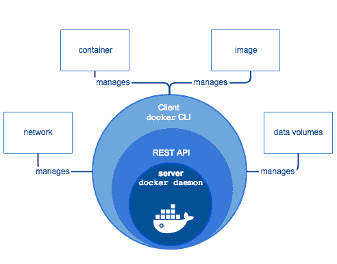

# 2020 年的虚拟机状况

> 原文：<https://levelup.gitconnected.com/the-state-of-virtual-machines-in-2020-22f5d6c8a40d>

照片由[尹英松](https://unsplash.com/@insungyoon?utm_source=medium&utm_medium=referral)在 [Unsplash](https://unsplash.com?utm_source=medium&utm_medium=referral) 拍摄

除非你一直生活在岩石下，否则你可能听说过甚至可能使用过虚拟机。用一个非常简单的定义来说，虚拟机可以被称为操作系统的模拟器。不考虑复杂性，就好比你在智能手机或 PC 上玩 Gameboy 口袋妖怪。Pokemon 最初是打算在 Gameboy 主机上运行的，但由于该主机现在已经过时，你可以使用模拟器在 PC 或智能手机上模拟 Gameboy 的环境。游戏不知道是在主机上运行还是在模拟器上运行。虚拟机和操作系统也是如此。稍后将详细介绍。

# 虚拟机的背景以及为什么需要虚拟机

在 80 年代中期，带有 GUI 的操作系统开始出现，从那时起，为软件和操作系统编写了一个又一个复杂的代码。快进到今天，市场上有`**n**`种软件生态系统，其中有 3 种主要的操作系统需要考虑。

上图显示了 2004 年至今主要操作系统及其版本的市场份额。

*注:以上片段是谷歌趋势截图。它并不提供每个操作系统的实际使用数据，而是提供该术语的搜索流行度。*

## **你问操作系统市场份额与虚拟机有什么关系？**

假设你是 Photoshop 的创造者，现在你希望你的产品被尽可能多的人使用，这意味着它应该在所有主要的操作系统及其仍然受支持的旧版本上都能很好地工作(如果市场份额足够大的话)。

按照我们对虚拟机的超级简化定义，我们可以在我们的 Windows 10 机器上模拟 macOS、Ubuntu、Windows 7，这比使用所有安装了各自操作系统的不同机器要好得多。应用程序可以从一个地方运行和检查错误。VM 也可以用于在切换之前检查其他操作系统，或者如果你像我一样，出于好奇。

# 虚拟机

虚拟任务( **VM** )本质上是真实计算机的模拟，它像真实计算机一样运行操作系统和执行程序。它也可以被称为一个程序，作为一个虚拟计算机运行在一个现有的系统与虚拟硬件。虚拟机使用虚拟机监视器( **VMM** )或通常称为虚拟机管理程序运行在物理机之上。运行具有一个或多个虚拟机的管理程序的计算机被称为*主机*或*裸机服务器*，每个虚拟机被称为*客户机*

## **管理程序**

**管理程序**是运行虚拟机的硬件或固件。主机为虚拟机提供资源，如 RAM 和 CPU。虚拟机管理程序提供的虚拟硬件设备映射到您的主机上的真实硬件。所有资源都在活动虚拟机之间分配。还可以根据虚拟机运行繁重应用程序的需求来分配资源。

在虚拟机管理程序上运行的虚拟机称为来宾机。客户机由应用程序和应用程序运行所需的其他文件组成，如驱动器、系统二进制文件等。由于安全原因，虚拟机不能直接使用主机的硬件，因此它还必须携带自己的整个虚拟化硬件堆栈，这基本上意味着它携带整个操作系统。虚拟机创建了这样一个环境，其中运行的应用程序对虚拟机或主机系统一无所知。

托管虚拟机管理程序的好处是底层硬件不那么重要。主机的操作系统负责硬件驱动程序，而不是虚拟机管理程序本身，因此被认为具有更多的“硬件兼容性”另一方面，硬件和虚拟机管理程序之间的这一附加层会产生更多的资源开销，从而降低虚拟机的性能。

正如您已经看到的，虚拟机需要在现有操作系统上安装一个成熟的操作系统来运行应用程序。这有点铺天盖地，没必要。了解基本组件后，您可能会想到一个问题——对虚拟机管理程序的需求是什么？

虚拟机管理程序在客户机和主机之间扮演着胎盘的角色。它为虚拟机提供了一个平台，既可以管理客户的需求，也可以执行操作系统。虚拟机管理程序允许主机与其连接的所有来宾共享其资源。

更明确地说，让我们回到口袋妖怪的例子。

正如你从口袋妖怪的例子中所能理解的，所有的模拟器都可以被归类为虚拟机。模拟器是虚拟机软件，你可以把口袋妖怪游戏看作是操作系统。游戏在模拟器内部运行，它不知道它是在控制台或模拟器上运行。虚拟机/仿真器上的管理程序确保为操作系统/游戏提供其正常运行所需的所有资源。最好的例子就是模拟器提供的虚拟按钮，它类似于控制台上的真实硬件按钮，你可以用它来控制模拟器。

# **垮台**

在早期引入虚拟机时，它们是一种非常有前途的软件，可以让你在现有的机器上运行另一个程序，但它们带来的问题是速度慢且体积大。

他们挤占了主机的大量资源，使得主机向其上的原始程序妥协。由于当时没有其他更好的选择，用户只好接受了。每个人都可以很好地使用他们的虚拟机，突然有一天 Docker 出现了，它永远地改变了游戏。如果你是一名程序员或技术极客，你很可能听说过 Docker。很难不听说它，因为它最近受到了开发人员、系统管理员甚至像 Google、Amazon 和 VMware 这样的大联盟的关注，他们都建立了自己的服务来支持 Docker。

# Docker 是什么？

Docker 是一个工具，旨在借助容器帮助创建、部署和运行应用程序。容器允许开发人员将应用程序及其所需的所有部分(如二进制文件和依赖项)打包成一个包，可以一次性交付。这样做可以确保应用程序可以在任何运行在 Linux 内核上的机器上运行，而不管该机器的设置是否与最初编写代码的机器不同。

你可以看到 docker 的行为有点像虚拟机，但 Docker 不是创建一个完整的虚拟操作系统，而是允许应用程序在与系统相同的 Linux 内核上运行。应用程序只需要携带主机上不存在的数据，而不是像虚拟机那样携带整个操作系统。这为 Docker 提供了显著的速度和性能提升，同时也减小了应用程序的大小。Docker 最重要的优点是它是开源的，这意味着任何人都可以对 Docker 做出贡献，如果需要 Docker 自带的附加功能，可以扩展它的功能以满足自己的需求。

不管你脑子里是否有 Docker 的直接用例，我仍然认为理解一些关于什么是*容器*以及它与虚拟机相比如何的基本概念是很重要的。

在我们开始介绍 Docker 的工作原理之前，首先您应该对组成 Docker 的组件有一个概念。让我们开始吧

## **集装箱**

容器是旨在将应用程序及其依赖项隔离到一个自包含单元中的程序，它可以在任何地方运行，同时还消除了对硬件的需求，从而允许更有效地使用主机资源。容器的目标与虚拟机的目标是一致的，尽管它们对同一问题的处理方式不同。

## **码头引擎**

Docker 引擎是 Docker 运行和管理容器和其他图像的运行时和工具。它非常轻量级，可以在 Linux 系统上运行。

它们是由

*   Docker 守护进程
*   码头客户
*   用于与守护进程交互的 REST API

**Docker 客户端**

客户是最终用户与您交互的部分。如果你愿意，可以称之为 UI 部分。

**Docker 守护进程**

作为最终用户，当您通过客户端向 Docker 发送命令时，守护程序实际接收并执行命令。这些命令可能包括来自构建、运行或分发的任何内容。守护进程运行在主机上，作为用户，您永远不能直接与守护进程交互。

**Dockerfile**

由创建 Docker 映像的指令组成的文件称为 Dockerfile。一旦 docker 文件设置完毕，使用 ***docker build*** 命令创建 docker 映像。它指的是为图像创建最初始层的基础图像。文件中的后续指令在彼此之上创建更多的层。稍后将详细介绍。

**Docker 图像**

Docker 映像是只读模板，您可以根据 Docker 文件中给出的指令集来构建。简单来说，它是一个模具或蓝图容器，其形状或线框不能改变(*读作不可变*)图像定义了从其生产的容器的外观和功能。映像由 docker 文件、依赖项和应用程序需要运行的所有代码组成，所有这些都捆绑在一起。

如前所述，该映像包含使用 Dockerfile 指令创建的分层系统。docker 文件创建基础层，指令帮助创建后续层。

Docker 的强大结构和速度是通过它创建的分层文件系统实现的。这个系统被称为联合文件系统。docker 文件中的每条指令都在图像中创建了一个新层，或者替换了它下面的一个层。

例如，Python 是一个流行的基础映像。可以通过添加 NumPy 或 Pandas 作为中间层的指令来添加附加层。

**联合文件系统**

Union 文件系统是一个可堆叠的文件系统，帮助 docker 建立图像文件。它可以将不同文件系统(分支)中的文件和目录相互堆叠。具有相同路径的分支被合并到单个目录中，这避免了创建已经存在的层的副本的需要。

(这只是联合文件系统的一个基本要点，它们比上面解释的要多得多)。分层系统有两个主要优点

*   如上所述，它是无复制的。
*   没有分段——因为所有的层都是分离的，所以对不同的层进行更改是非常容易的，因为更改只应用于该层，而不是整个容器。

**卷**

卷是容器的数据部分。它们在创建容器时被初始化。这些卷是容器中独立于联合系统的一部分。这种不依赖的好处是，通过 union 文件系统对容器进行的任何更改都不会影响数据卷。如果要更改卷中的某些内容，它们为您提供了一种直接交互和更改卷的方法。另外，这些卷可以在多个容器之间共享和重用，因为它们包含原始数据。

现在我们已经讨论了所有的技术方面，让我们来谈谈 Docker 技术，主要是关于容器的。如果你挖掘得足够深入，你会发现容器根本不是什么新概念。一些旧的 Linux 容器技术是 BSD jails、Solaris Zones，甚至 Google 多年来也有自己的容器技术。所以现在你的脑海中会出现一个问题:为什么 Docker 现在突然变得如此受关注？？

这个问题的答案是

*   最大的原因是每个人都喜欢码头鲸😜😉

*   关于 Docker，我们得到了 **Docker Hub** 。Docker Hub 是一种 Play Store，在这里你可以获得由社区创建的数以千计的 Docker 图片，并且随时可以使用。正如我们在上面看到的，我们可以使用这些图像，几乎不需要修改。
*   **速度**集装箱重量很轻，因此速度很快。由于容器直接运行在主机的内核上，与 VM 相比，它们只需要很少的资源就可以启动并运行。
*   **模块化** -正如你所见，我们可以轻松地创建容器，并在不破坏功能的情况下随意在机器间移动。我们可以将多种功能隔离到多个容器中，并使它们彼此独立运行。例如，我们可以在一个容器上运行节点服务器，同时在另一个容器上运行 Apache 的实例。容器架构还使得有效地扩展应用程序变得容易，没有太多的麻烦。

# 虚拟机死了吗？

简短的回答是否定的。Docker 带来了一些不错的技巧，但还不是 VM 问题的成熟解决方案。虽然 Docker 肯定获得了很多动力，但它不会很快取代 VM。Docker 和 Containers 都将继续增长，但是在某些情况下使用 VM 会更合适。

例如，如果您希望运行单个应用程序的多个实例，Docker 更合适，而当我们必须在多个服务器上运行多个应用程序时，虚拟机通常是首选。

正如上面所讨论的，容器允许你将应用程序分解成功能性的和离散的部分，让你将应用程序分解成更小的实体，这无疑会产生越来越多的移动部分需要一次管理，这对于一个巨大的应用程序来说会很快失控。

虽然使用 docker 有很多好处，但有一个问题总是困扰着我们。安全。docker 的基础设施使其如此引人注目，这本身就是令人担忧的原因。正如您已经知道的，Docker 容器使用与主机 OS 相同的内核，主机和其他容器之间的壁垒变得更薄了。容器被配置为对主机内核进行系统调用，这只是为攻击者提供了一个扩展的攻击面。另一方面，虚拟机不会面临这个问题，因为它们通过虚拟机管理程序(hypercalls)调用内核，这在虚拟机和主机内核之间提供了一个抽象层，与 Docker 相比，它提供了更安全的解决方案。如果安全性对开发人员来说是一个非常大的问题(90%的情况下),开发人员可能会选择 VM，因为它的基础设施提供了更高程度的安全性，这使得它很慢并且不太受欢迎。

当然，这里出现了一个论点，即 VM 有很多时间来发展/ docker 仍处于婴儿期等，像安全性这样的问题肯定会随着 Docker 和容器越来越多的曝光而发展，并且可能在未来 Docker 是我们唯一需要的东西，但目前争论在于每天使用它们并需要做出决定的第一手用户。但是在目前更普遍的情况下 **Docker 和 VM 需要共存**以迎合行业的不同需求。

# 结论

我希望这篇文章能让你了解并掌握关于 Docker 和 VM 技术的知识。如果您有兴趣了解更多关于它们的知识，或者甚至在项目中使用它们中的一个，那么这篇文章应该作为一个敲门砖。