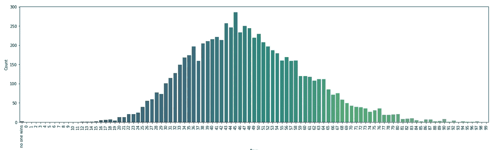

# 詹姆斯·柯登“为你的行而知”游戏部分背后的统计数据

> 原文：<https://levelup.gitconnected.com/the-statistics-behind-james-cordens-rigged-game-segment-f8ee7cf3af9a>

## 使用 Python 中的计算机模拟和可视化来分析詹姆斯·柯登的“为你的行而知”游戏部分。它被操纵了吗？


[来源](https://upload.wikimedia.org/wikipedia/commons/c/ca/James_Corden_at_2015_PaleyFest.jpg):Wikimedia.org

詹姆斯·柯登的“深夜秀”有一个激动人心的游戏片段，叫做“为你的争吵而知”它有一个迷人的统计方面，需要借助计算机模拟和可视化来揭示。

在本文中，我将解释游戏部分的规则并加以说明，同时给出计算机模拟结果和可视化的代码。

我们走吧！

# 游戏

舞台是这样安排的:


其中每个单元代表一个座位。詹姆斯·柯登从座位 1A 开始，标签为*开始*。考登问了 1A 一个小问题，比如“埃菲尔铁塔在哪里”或者“说出四只十几岁的变异海龟的名字”。

如果 1A 答对了问题，考登将其中一个移到右边，问了一个关于 2A 的问题。然而，如果 1A 答错了问题，那么考登就向 1B 移动一排(而观众大喊“移动！那个。钱！”).这种模式贯穿整个观众。

无论哪一排的最后一个座位(第 15 栏)正确回答了正确的问题，那一整排都赢了 100 美元。


例如，在上图中，1A 到 6A 的座位正确地回答了这个问题。因为 7A 回答不正确，Corden 把一个移到 7B，谁回答正确。

因此，Corden 向右移动，直到 10B 回答不正确，因此 Corden 向上移动一行，因此，因为 D 行的最后一个人(15D)正确回答了给他们的问题，D 行的每个人都赢了 100 美元。

如果最后一行(E 行)的人回答不正确，就没有可以向上移动的行，所以没有人得到钱。(这笔钱将被添加到下周的游戏池中，这样下周游戏的获胜者将每人获得 3000 美元或 200 美元)。

另一个注意事项——最后一个正确回答问题的人要么为自己保留 750 美元(这样，他们一行中的其他人都不会得到任何钱)，要么让他们一行中的每个人保留 100 美元。这个细节对我们的模拟并不重要。

这个游戏很有趣，因为不清楚哪一行有优势，或者是否有优势——但是统计和概率可以帮助我们。

# 为什么是计算机模拟？

如果我想花时间做这件事，100%可能计算出每个座位的概率，然后把它们加在一起。

像帕斯卡三角形这样用于计算这些场景的聪明技巧适用于这种场景，但是它更难实现，不考虑随机性，并且容易出现计数错误。

此外，计算非常非常, *v* ery 小概率比简单的 if、elif 和其他单数字语句需要更多的计算空间。

大数定律不是计算出数百个讨厌的概率，而是说随着模拟运行次数的增加，精确度将越接近真实概率。

不要自己去做那些费力且错误百出的工作，让计算机自己来完成它吧！

当你有疑问时，让计算机来帮你做吧…

# 计算机模拟

我做了一个简单的 Python 模拟，可以运行 100，000 次模拟。我留下了 95%的 *P-* 值，或某人正确回答给定问题的概率，以及随机性，随机性是一个系数，它被添加到 *P-* 值，以考虑观众知识的差异，为 3。

达到 1 到 100 之间的随机选择值后，从 *-r* 和 *r* 之间的高斯/正态分布中取出一个数，其中 *r* 代表随机值。

(注:通过改变 *r* 运行多次模拟后，看起来差别不大。这是有意义的，r 值应该抵消掉。)

下面的代码将字典转换成要绘制的熊猫`DataFrame`。

```
import pandas as pd
plot = pd.DataFrame({'Row':list(winning_rows.keys()),'Count':list(winning_rows.values())})
```


使用以下代码，我们可以绘制结果:

```
import seaborn as sns
import matplotlib.pyplot as plt
plt.figure(figsize=(13,5))
sns.barplot(plot['Row'],plot['Count'],palette = 'viridis')
```


第一排几乎总是以 *P* = 0.95 获胜。让我们看看当 *P* 更低时的结果，比如 0.75。


有意思！完全颠倒了。让我们画出 P = 0.85 的结果。


…突然间，第一排明显处于劣势，第三排赢得最多。

下面是每个 *P-* 值的每一行的获胜分布。每个单元值表示导致该行获胜的模拟结果的分数。左边是 P 值。


从 0.94 的*P*-值开始，第一排似乎有巨大的优势。从那里开始，第二行似乎在各种 *P-* 值中具有持续良好的输出值。

在观看 Cordon 的“了解你的排”片段后，问题 *P-* 值平均在 0.8 到 0.9 之间。

以下是每一行的平均值，显示的 *P-* 值在 0.82 和 0.87 之间:


好像第三排胜算最大，第四第二排次之。

# 另一个有趣的注意事项

通过调整座位的大小( *m* 乘 *n* )并适当调整 *P-* 值，可以得到一些有趣的结果——正态分布！



# 感谢阅读！

秘诀:如果你曾经在“知道你的排”期间亲自看过詹姆斯·柯登秀，第三排将是最好的座位！