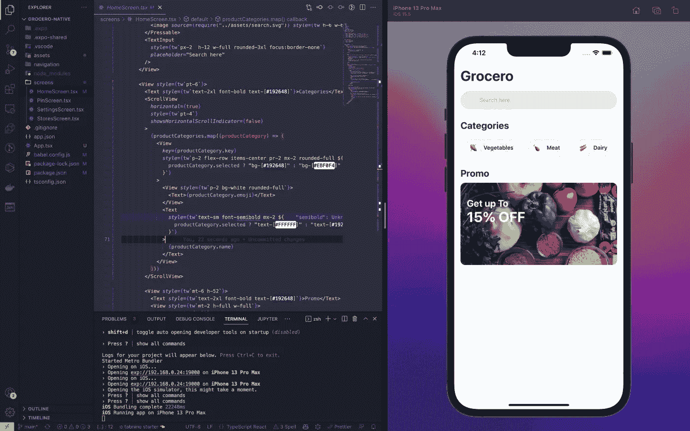
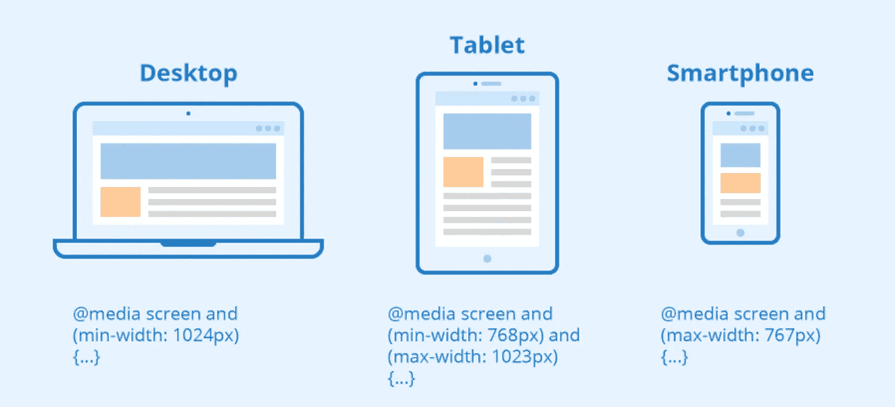
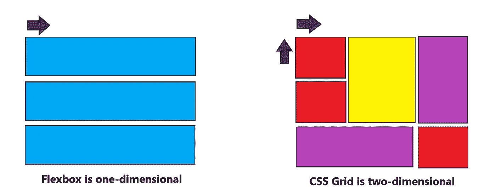
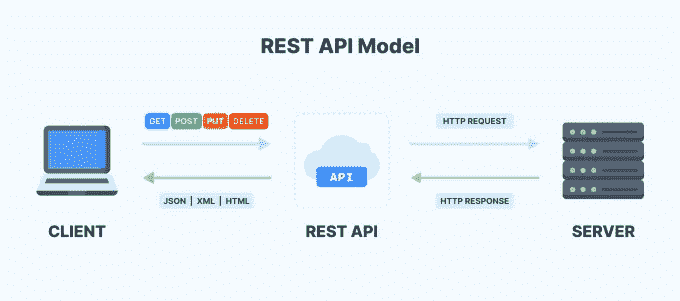
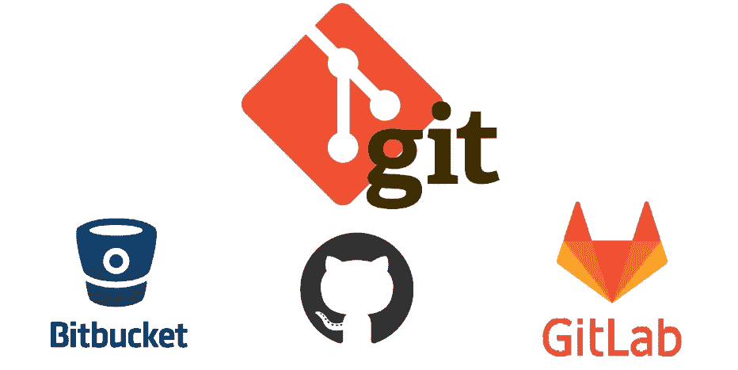
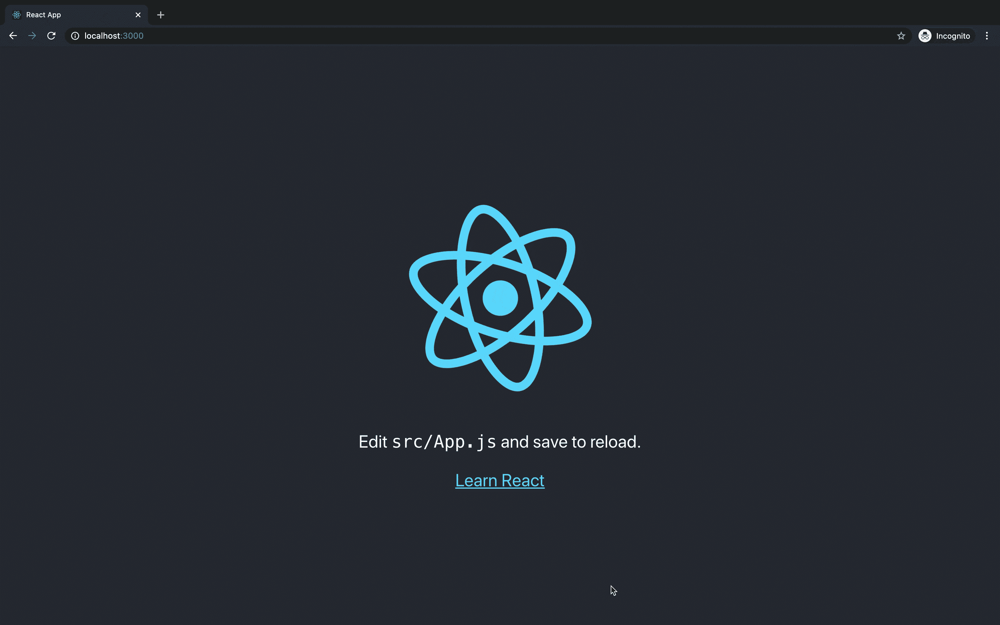
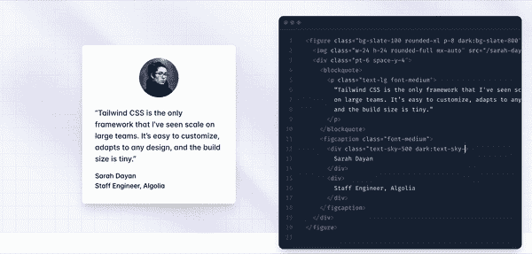
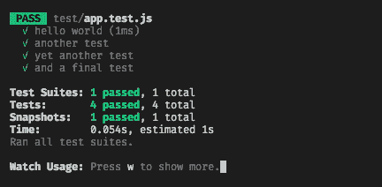
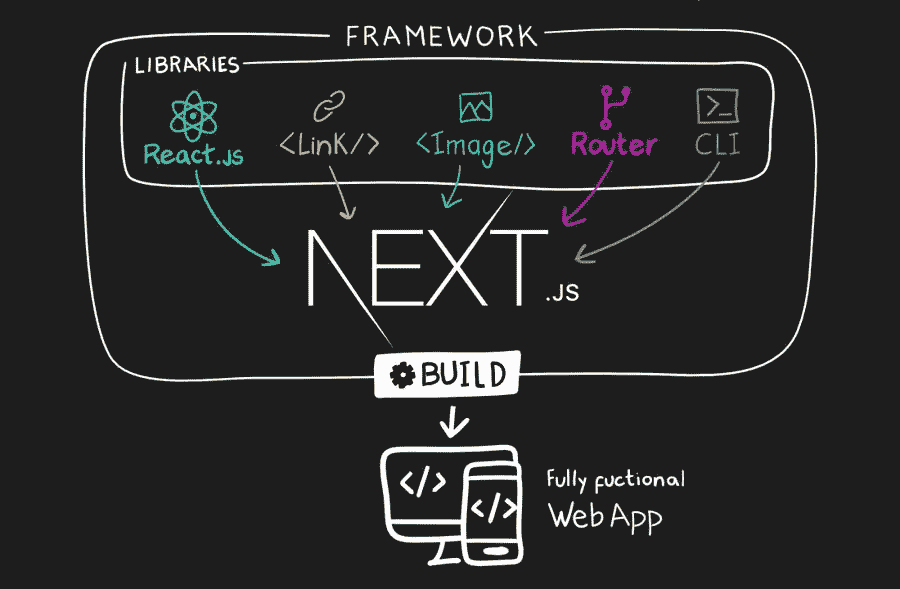
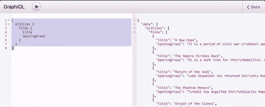

# 一步一步的前端开发人员职业路线图[100%免费]

> 原文：<https://levelup.gitconnected.com/the-step-by-step-frontend-developer-career-roadmap-100-free-e8a539d6f5a2>

## 今年打算成为前端开发者吗？这里有一个路线图，几乎可以肯定让你得到那份工作。

作为一名前软件工程师，我有机会教其他人如何编码。如果你的愿望是在不到一年的时间内成为一名入门级的前端开发人员，本文将试图找出你需要哪些技能。


图片来自 pexels.com 的 [ThisIsEngineering](https://www.pexels.com/@thisisengineering/)

就熟练的前端专业人员的需求而言，还没有出现最好的时期，工资大约在**103，423 美元**到**170，000 美元** ( [玻璃门](https://www.glassdoor.com/Salaries/front-end-developer-salary-SRCH_KO0,19.htm) ) **。**

此外，YouTube 等平台在知识大众化方面做得很好，基本上让全球任何有互联网连接的人都能学习必要的技能。

> **免费。**

在这篇文章中，我将与你分享一个 10 步主题列表，如果你熟悉它们，基本上可以保证你成为一名前端开发人员。让我们开始吧！

## **计算机科学基础:**

作为一名前端开发人员，您需要对计算机科学基础有很好的理解。这包括算法、数据结构和软件设计的原理。

您还应该熟悉前端开发中常用的编程语言和工具。拥有扎实的计算机科学基础，有助于你构建更好的 web 应用，提高解决问题的能力。



我最近使用 React native 开发的一个杂货交付应用程序。

# HTML 和 CSS

前端开发背后的支柱是(仍然)HTML 和 CSS，前者允许你定义一个网页的骨架，而后者将帮助你装扮这个骨架！

围绕 CSS，确保你对以下概念有一个坚实的理解:

**级联、继承、特异性和媒体查询:**

**级联**:这个概念是关于 CSS 规则的顺序，当两个规则具有相同的特性时，CSS 中最后一个规则将被使用。

**继承**:有些 CSS 属性在设置了父元素后会传递给子元素，有些则不会。这对初学者来说可能会很困惑。例如，`colour`和`font-family`等属性由子代继承。

**特异性**:当对一个元素应用多个规则时，导致冲突的规则由*特异性应用。每个选择器都有自己的特异性等级:*

*   身份证明
*   类和伪类
*   元素选择器

为了获得 CSS 的丰富知识，了解这三个概念如何相互作用以控制哪些规则应用于哪些元素是很重要的。

**媒体查询:**

CSS 媒体查询用于根据所使用的屏幕分辨率或设备来改变网站的风格。

媒体查询主要用于为不同的屏幕尺寸开发样式时，能够将某些规则仅应用于特定的屏幕尺寸。



媒体查询的定义和行为示例

媒体询问的引入创造并允许了响应式设计的概念。

# **柔性盒&网格**

多年来，CSS 得到了现代化，引入了 Flexbox 和 Grid 等概念。这两个概念提供了一种使定位和页面布局更容易、更灵敏和更快速的方法。

例如，Flexbox 是一个基于方向的布局系统。它使您能够调整元素的宽度、高度和顺序，以最好地填充网页中的可用空间。



Flexbox 与 CSS 网格

你可以为 [**免费**](https://www.youtube.com/watch?v=mU6anWqZJcc) 熟悉那些话题**，请不要浪费钱在网络课程上，资源已经是免费的了！**

# Javascript:

谈论前端而不提及 Javascript 是不可能的，根据定义，Javascript 是前端语言。以下是你需要掌握的最重要的概念:

*   数据类型以及何时使用它们
*   迭代器和可迭代对象
*   如何操作 DOM(超级重要)
*   对象操作
*   从 API 获取数据
*   复试
*   克-奥二氏分级量表
*   XSS

# REST APIs

REST APIs 用于不同软件系统之间的通信。REST API 定义了创建 API 时必须遵循的一组规则。

这些规则包括应该如何构建数据、应该如何访问数据以及应该如何更新数据。

例如，您可能希望在您的网页上列出来自远程服务器的产品列表:这种通信可以通过 REST API 进行，其中客户端向服务器发出请求，服务器返回以特定方式(JSON)格式化的产品列表。

REST APIs 很好学，网上也有[很多教程](https://www.youtube.com/results?search_query=rest+api+tutorial+javascript)可用。



REST API 是前端和后端之间的“门户”

当面试一个前端开发人员的职位时，准备好回答关于 REST API 的问题。

# 饭桶

版本控制是跟踪和管理代码变更的实践。版本控制的目的是**允许团队跟踪代码库的变更，同时增强团队成员之间的沟通和协作。**

随着时间的推移，版本控制促进了一种持续的、简单的软件开发方式。



一些最流行的 Git 平台

# React.js

许多人会质疑它，它被认为是 web 开发的最佳 javascript 框架。

React.js 是脸书开发的一个库。它正在迅速取代流行的 AngularJS 库。

React.js 的最大优势包括:

*   如果您熟悉 javascript 和 DOM 的工作方式，那么您会发现 ReactJS 的语法非常简单。它快速、灵活、强大。此外，它的学习曲线非常平滑。
*   从各种角度来看，React 是一种更好的方法。使用它的有**脸书**、 **Instagram** 、**纽约时报**、**网飞**、 **AirBnb** 、**苹果**、 **PayPal** 、**特斯拉**等等。
*   它的脸书点赞数比 jQuery 和 AngularJS 加起来还多！这也是做移动应用的最好方法(原生反应)。



React.js 的欢迎页面

# 顺风 CSS

Tailwind CSS 被描述为实用优先的 CSS 框架。Tailwind 关注的不是项目的功能(比如 Materialise CSS 或 Bootstrap ),而是它应该如何显示。

这使得开发人员更容易测试新的样式和改变布局。



顺风 CSS 是一个伟大的替代样式 HTML 和节省时间！(来源:tailwindcss.com)

顺风 CSS 的几个好处:

*   **你少写自定义 CSS** 。使用 Tailwind，您可以通过在 HTML 中直接应用预先存在的类来设计元素的样式。因此，无需编写 CSS 就可以构建自定义设计。
*   **添加新功能的时候不用一直写 CSS。没有 Tailwind，你必须在添加新功能和组件的同时继续编写 CSS。因此，您的 CSS 文件会继续增长，并且越来越难以维护。**
*   你的风格可以重复使用。通过使用像 Tailwind 的 flexbox 和 padding 工具这样的工具，大多数样式都是可重用的。
*   **不用发明类名。**当顺风时，你正在从一个预定义的 [**设计系统**](https://blog.hubspot.com/website/design-system) 中选择职业。这意味着在考虑某些样式和组件的“完美”类名或记住像`container-inner-button-secondary`这样复杂的类名时，你不需要太多的想象力。
*   你可以做出更安全的改变。使用传统的方法，如果你对 CSS 进行修改，你可能会破坏整个网站。与 CSS 不同，HTML 中的实用程序类是本地的。这意味着你可以改变它们，而不用担心破坏其他东西。

> 就个人而言，我发现从 Tailwind CSS 开始，然后转向传统 CSS 更容易。

# 玩笑

如果你的目标是找到一份工作，你就不能回避测试这个话题(是的，如果你建立了自己的创业公司，你可以忽略它)。

Jest 是一个开源测试框架，主要用于 React 和 React 本地 web 应用。通常，单元测试在任何软件的前端运行时都不是很有用。这主要是因为前端的单元测试需要大量耗时的配置。Jest 框架可以在很大程度上降低这种复杂性。



Jest CLI 显示所进行测试的虚拟报告

此外，Jest 可以用来验证几乎所有与 JavaScript 相关的东西，尤其是 web 应用程序的浏览器呈现。Jest 也是自动化浏览器测试的首选，使其成为现存最受欢迎的 Javascript 测试框架之一，每周约有 1700 万次下载。

# 以打字打的文件

TypeScript 是一种编程语言，是 JavaScript 的超集。这意味着所有 JavaScript 代码都是有效的类型脚本代码。

除了能够使用所有现有的 JavaScript 库，TypeScript 还有自己的一套特性。

TypeScript 的主要特性之一是类型。类型允许您定义变量、函数或类的数据类型。这有助于防止代码中出现错误。

例如，如果您尝试将两个数字相加，但其中一个是字符串，您将会得到一个错误。JavaScript 是一种动态语言，这意味着您不必指定变量的数据类型。如果你不小心，这可能会导致错误。

[图片]

使用 TypeScript，您可以通过指定变量的类型来避免这些错误。

TypeScript 的另一个优点是可以编译成 JavaScript。这意味着您可以在任何支持 JavaScript 的平台上使用 TypeScript。

在这里你可以找到一个很棒的(**和免费的**)资源来学习打字。

# 用户界面/UX 的设计原则和基础

作为一名前端开发人员，对设计原则有深刻的理解是很重要的。

设计原则为创造设计良好的产品提供了基础，这些产品既对用户友好又具有视觉吸引力。有许多不同的设计原则，但对前端开发人员来说，一些最重要的原则包括可用性、排版、色彩理论和布局。

通过理解和利用这些原则，你可以创建易于使用且外观精美的网站和应用程序。Figma 是一个有助于学习和应用设计原则的工具。

一个 web 应用程序 UI 概念的例子。

Figma 是一个基于网络的设计平台，提供了丰富的设计原则资源库。此外，Figma 的协作功能使其成为与设计师合作的绝佳工具。如果你想提高自己作为前端开发人员的技能，那就温习一下你的设计原则知识。利用强有力的设计原则将有助于你创造出用户喜欢的更好的产品。

# Next.js

Next.js 是一个服务器端 React 框架，可以轻松构建动态 web 应用程序。它的一个主要特性是允许你在服务器上渲染你的 React 组件，这使得你的应用程序响应更快。

Next.js 的另一个很棒的特性是它自带内置路由，这使得创建单页应用变得很容易。最后，由于其简单的 API 和文档，Next.js 使其易于学习和使用。



Next.js 附带了许多预打包的特性

在许多使用 Next.js 的公司中，有:星巴克、Hulu、优步、Twitch、网飞和[等等](https://pagepro.co/blog/nextjs-websites-examples/)。

# GraphQL

GraphQL 是一种由脸书开发的 API 查询语言。它为客户端提供了一种向服务器请求特定数据的方式。

GraphQL 很重要，因为与其他 RESTful API 架构相比，它允许更大的灵活性。它还使开发人员能够从服务器获得他们需要的准确数据，从而最大限度地减少网络流量。



GraphQL 被很多公司使用，包括 **Meta** 、 **GitHub** 、 **Shopify、**等等。

# 包裹

如果你想成为一名前端开发人员，有很多东西要学。但这绝对是值得的，因为作为一名前端开发人员是非常值得的。

有了正确的技能，你就可以创造出人们喜欢使用的神奇的东西。如果你愿意投入工作，那么学习如何成为一名前端开发人员肯定是可以实现的。

快乐学习！记住:

> 不一定要做对，一定要开始！


享受学习！

我真的很高兴你看到了这篇文章的结尾，我真诚地希望你在这里度过的时光能在未来对你有所帮助！

```
**I have a newsletter 📩.** Every week I’ll send you a brief findings of articles, links, tutorials, and cool things that caught my attention. If this sounds cool to you subscribe. *That means* ***a lot*** *for me.*
```

 [## 🪄5 子弹每周发现

### 编辑描述

无情-创造者-2481.ck.page](https://relentless-creator-2481.ck.page/68d9def351) 

# 分级编码

感谢您成为我们社区的一员！在你离开之前:

*   👏为故事鼓掌，跟着作者走👉
*   📰更多内容请查看[升级编码刊物](https://levelup.gitconnected.com/?utm_source=pub&utm_medium=post)
*   🔔关注我们:[推特](https://twitter.com/gitconnected) | [LinkedIn](https://www.linkedin.com/company/gitconnected) | [时事通讯](https://newsletter.levelup.dev)

🚀👉 [**加入升级人才集体，找到一份神奇的工作**](https://jobs.levelup.dev/talent/welcome?referral=true)