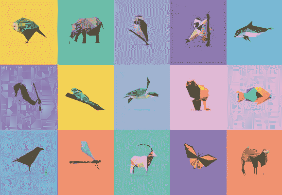
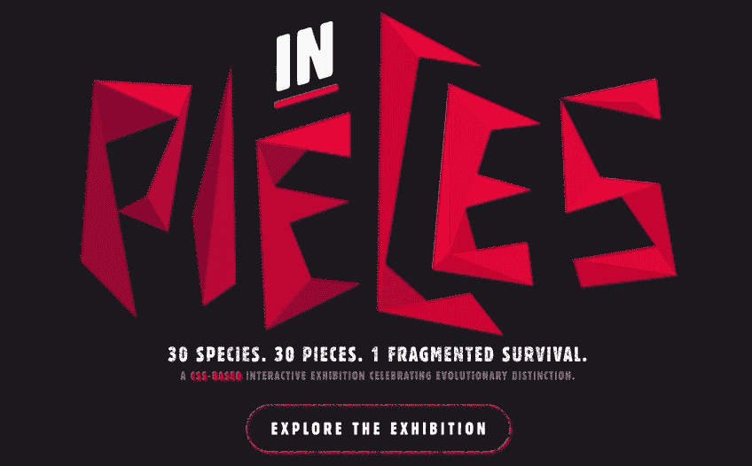
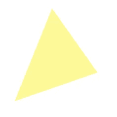
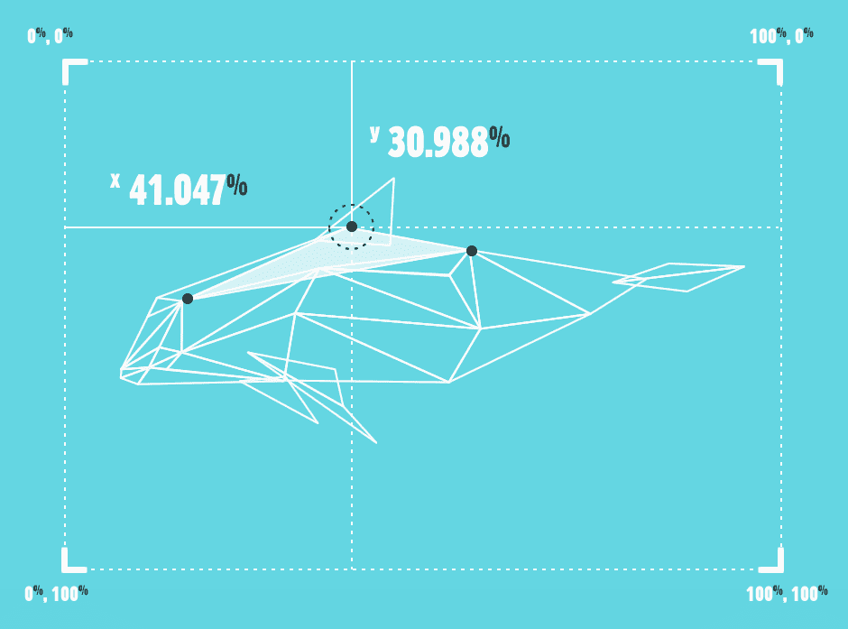
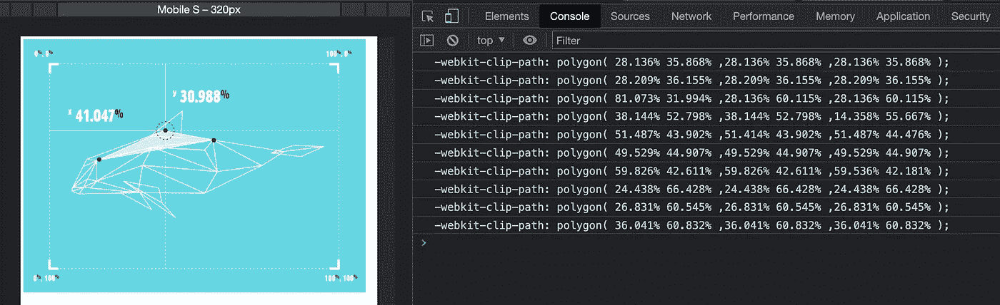
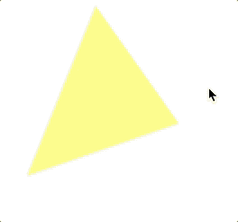
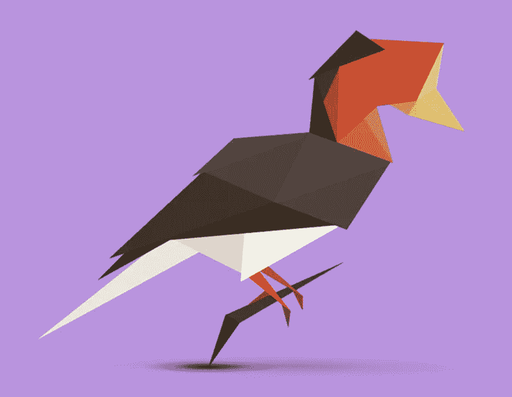

# CSS 中剪辑路径和濒危动物的故事

> 原文：<https://levelup.gitconnected.com/the-story-of-clip-path-and-endangered-animals-in-css-8af987927fc6>

这篇文章是关于`clip-path: polygon`在 CSS 中的应用。我们将通过这个简单的 CSS 创建下图中 30 种动物的拼图图像。这 30 种动物濒临灭绝，今天就让我们一起来探讨一下这个 CSS，以及 30 种濒危动物的故事。在这篇文章中，你不仅将学习 CSS 技术，还将关注濒危动物的现状。



# **简介**

上面这个作品叫做`30 Species, 30 Pieces Puzzle` ( `“Species in Pieces”`互动濒危动物展)，是一个阿姆斯特丹的设计师`Bryan James`用纯 CSS 技术表现 30 种动物碎片的形象，这 30 种动物，都很可爱，可惜都是濒危动物，生存面临危机。`Bryan James`希望用数字技术看似干燥的棱角，创造出一种特殊的美感，来表达生活在地球上的美好生命随时可能消失和剥落的形象。

之所以叫`“30 PIECES”`是因为第一件作品在詹姆斯编程的时候刚好是`30 pieces of triangles`拼接在一起的。



首先，我们来探讨一下这个展览的技术实现，以及如何使用 CSS 来绘制这样一个栩栩如生的动物:

# 技术实现

这项工作没有使用`canvas`进行技术实现，只是使用了`CSS/ clip-path`属性，如下所示:

```
clip-path: polygon(49% 0, 95% 65%, 11% 94%);
```

`clip-path`的前身其实是`SVG`。它使用点的坐标来实现遮罩。只需要一个`div`就可以画出各种奇怪的形状，这是整个项目的基础。



## 图形绘制

知道基本原理后怎么画？原理是在一张空白页上放一张设计图，通过点击每一个点，自动计算到页面左侧和顶部的百分比。然后用`clip-path`把这些点都画出来。



代码如下所示:

click 方法用于获取鼠标点击绘制三角形的三个点形成的相对位置坐标，例如- `webkit-clip-path : polygon(67.3% 25.143%, 68.2% 20.143%, 71.3% 32.714%)`



当然也有很多问题。点击的准确度不如预期，图形绘制有缝隙，只能微调对齐，很考验人的耐心。

## 运动效果实现

如何让它动起来？其实很简单，那就是过渡。是的，这个属性支持`transition tween animation`。只要设置这个，你的`“fragments`就会按照你期望的轨迹移动。



## 动物运动

当动物移动时，它们非常脆弱。不止一个地方在动，有时它们交替运动，非常生动。探究其原理是类名控件，需要设置一个不断循环的定时器，在几种状态之间反复切换。代码如下所示:

微动状态之间的切换是通过在`interval`中嵌套`timeout`来实现的，每个类名对应每种动物不同的微动状态。第二个微动状态也和上面的代码一样，类似相同，这里不再赘述。

## 动物碎片的闪烁

动物展示的时候会发现片段有闪烁的效果，这是通过伪元素实现的。添加`an animation`应该创建宽度和高度为 100%的伪元素，并使其具有透明度的变化，这相当于遮罩层的闪烁。通过 CSS 循环，可以方便的设置动画执行延迟。代码如下所示:

其次，在了解了技术的实现之后，让我们也来看看这些濒危动物的现状。我们需要最基本的`background of creatures and establish emotional connections`。只有这样，当那些未知的生物直观地呈现在我们面前时，我们才会在它们濒临灭绝的时候为它们感到心痛。因此，开始关注其他受到威胁的生物，甚至将这种关注转化为真正的支持和力量。

# 头盔犀鸟

这只光彩夺目的犀鸟在 2015 年末上升了 3 级，从濒临灭绝到极度濒危。

它备受推崇的酒盒是独一无二的，因为它几乎完全是实心的，富含象牙。导致了近年来的过度捕猎，而中国是这种动物的最大消费国。

伐木和农业转换加剧了狩猎带来的不祥压力，犀鸟缓慢的繁殖周期使恢复变得更加复杂。



# 瓦基塔

剩下的瓦基塔面临的最大威胁是渔具造成的意外死亡。

众所周知，在为鲨鱼、鳐鱼、鲭鱼和鲭鱼设置的刺网中，以及在非法和偶尔允许的为一种叫做托托巴的濒危鱼类设置的刺网中，鲭鱼会死亡。

据信，每年大约有 30 个瓦奎塔人因这些威胁而丧生。


# 金狮绢毛猴

在一个重要的栖息地，金狮绢毛猴的数量一度低至 150 只，它们受到了一系列人类活动的影响。

广泛的项目在扭转主要由栖息地丧失引起的趋势**方面取得了相当大的成功，但伐木、采矿、偷猎和动物贸易也是原因之一。**

砍伐森林限制了重新引入倡议的所谓成功。只有 8%的原始森林栖息地大小保留下来，导致了近亲繁殖等行为效应。


其余的 27 种动物还没有具体介绍，我相信你想知道更多，请访问以下网站了解更多关于濒危动物的信息。

[](http://species-in-pieces.com/) [## ◆30 种濒危物种

### 30 种，30 件。《碎片》是一个互动展览，展示了世界上 30 个最有趣但不幸的…

species-in-pieces.com](http://species-in-pieces.com/) 

**感谢阅读。**期待期待您的关注和阅读更多高质量的文章。

[](https://javascript.plainenglish.io/identify-javascript-data-types-two-methods-are-enough-882e2c238e6b) [## 识别 JavaScript 数据类型:两种方法就足够了

### 引入一个实用方法来识别所有数据类型

javascript.plainenglish.io](https://javascript.plainenglish.io/identify-javascript-data-types-two-methods-are-enough-882e2c238e6b) [](https://javascript.plainenglish.io/the-difference-between-pseudo-classes-and-pseudo-elements-of-css-properties-e408fcbd68a0) [## CSS 属性的伪类和伪元素的区别

### 伪类和伪元素的清晰解释

javascript.plainenglish.io](https://javascript.plainenglish.io/the-difference-between-pseudo-classes-and-pseudo-elements-of-css-properties-e408fcbd68a0) 

# 分级编码

```
Thanks for being a part of our community! More content in the [Level Up Coding publication](https://levelup.gitconnected.com/).
Follow: [Twitter](https://twitter.com/gitconnected), [LinkedIn](https://www.linkedin.com/company/gitconnected), [Newsletter](https://newsletter.levelup.dev/)Level Up is transforming tech recruiting👉[**Join our talent collective**](https://jobs.levelup.dev/talent/welcome?referral=true)
```