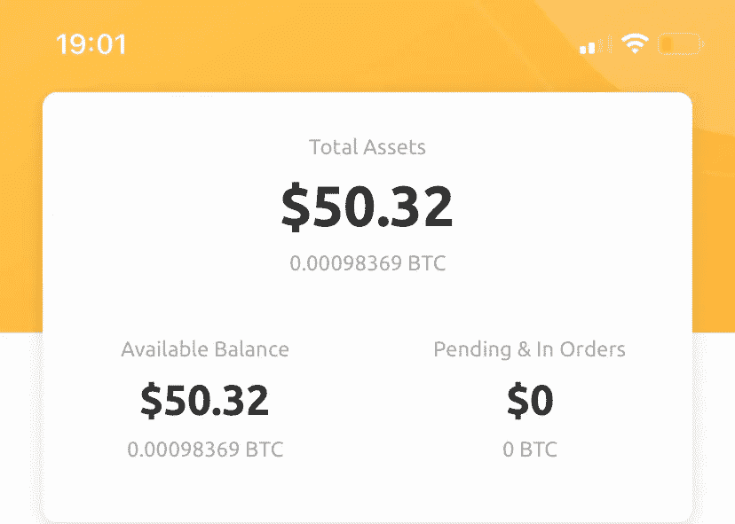

# 2017 年我的比特币钱包的故事

> 原文：<https://levelup.gitconnected.com/the-story-of-my-bitcoin-wallet-from-2017-52557212cbd2>

## 加密货币/投资

## 以及为什么你会误判你的错误决定

[Bermix 工作室](https://unsplash.com/@bermixstudio?utm_source=medium&utm_medium=referral)在 [Unsplash](https://unsplash.com?utm_source=medium&utm_medium=referral) 拍摄的照片

比特币取得了令人难以置信的发展。每个人都听说过那些几年前购买，现在富得离谱的人。我第一次接触比特币是在 2016 年 1 月——我发现这种货币很有趣，并告诉了我的父亲。然而，在 14 岁的时候，我还太小，不能自己买比特币(或者至少我认为自己是。).当时，一个 BTC 大约值 350 美元。

在 2017 年底，有一个我们都记得的秘密炒作。当时我就决定自己去挖矿比特币。我在电脑上安装了必要的软件，然后开始工作。我的父母不是很热心——电费太高，采矿不值得。所以只运行了几天就停了。

事实证明，这是一个大错误。那个时候，采矿几乎不值得。我只赚了几块钱，刚好够交电费。几天前，我发现了我的第一个钱包，震惊了。

来源:作者

我当时工作的几个小时，按现在的价格计算，价值不到 50 美元。当我在 2017 年采矿时，BTC 的价格要低得多——但最重要的是，支出是现在的两倍。

当然，我深深后悔当时没有继续。可能会有更多的美元，当然是数百美元。我所要做的就是让我的电脑保持运行。

我能更好地理解吗？也许吧，但不总是这样——这种情况让我想起了我在股市上做出的类似决定。

买入一股，卖出获利，开心就好。但后来，我意识到我可以卖更高的价格。这听起来像是一个奢侈的问题，但会导致严重的心理后果。

这方面最好的例子可能是罗伊·雷蒙德。创立“维多利亚的秘密”的人以荒唐的一百万美元卖掉了公司。应该清楚的是，内衣品牌现在的价值要高得多。雷蒙德自杀了。据他的前妻说，购买他的公司的错误决定极大地伤害了他的精神健康。

许多投资者以前也有过同样的感觉——但有一个好消息:
你不应该为许多糟糕的决定责怪自己。原因是我们不加批判地看待成功。

我的许多朋友总是吹牛说他们通过购买个人股票战胜了市场。但实际上，这是不正确的——要公平地战胜市场，你也必须创造同样的条件。投资一只股票的风险要高很多倍。与其赢，你还不如失去一切。

对损失的利润感到不安是愚蠢的——这很容易出错。

我原谅我的过去，我没有挖掘更多的比特币，也没有过早卖掉股票。一点点运气总是其中的一部分——尤其是根本不卖股票可能会出错。

帮你自己一个忙，不要跟进你已经卖出的投资。后悔对你没有任何好处。你唯一应该感到遗憾的是没有对投资给予足够的重视——但永远不要忘记，你不可能无所不知。有些决定纯粹是个性问题。

# 来源

【1】:[https://bitcoinvisuals.com/chain-block-reward](https://bitcoinvisuals.com/chain-block-reward)

[2]:[https://www . Washington post . com/news/morning-mix/WP/2014/12/10/how-victorias-secret-go-from secret-to-prime time-after-its-founder-killed-his/](https://www.washingtonpost.com/news/morning-mix/wp/2014/12/10/how-victorias-secret-went-from-clandestine-to-primetime-after-its-founder-killed-himself/)