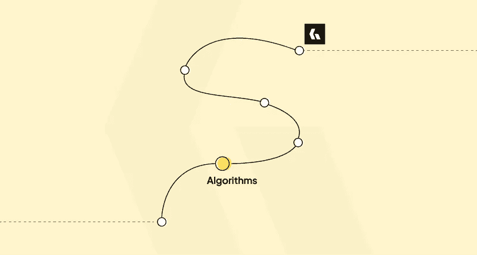

# 我的代码之旅——第二部分

> 原文：<https://levelup.gitconnected.com/the-story-of-my-journey-to-codeguage-part-2-87fa914c3a4d>

## 进入算法的世界

在这个系列的第一部分，我讲述了我是如何通过一本七年级的书进入编程和 web 开发的。

下面我会留下一个链接，这样你就可以在继续第二部分之前阅读它，如果你还没有的话:

 [## 我如何学会代码语言的故事——第一部分

### 通过 7 年级书上提到的链接进入编程。

levelup.gitconnected.com](/my-story-on-how-i-got-to-codeguage-part-1-62313a880f10) 

在这一部分中，我讲述了我是如何通过 Khan Academy 上的一门关于算法的入门课程以及在加拿大计算竞赛中失败后进入算法世界的。

我们开始吧。

# 进入算法的世界

在将近 3 年的时间里，我继续学习 HTML、CSS、JavaScript、PHP 和 MySQL，以及围绕这些的一些更简单的技术。

在这三年里，我从未接触过算法——甚至二分搜索法也没有！

*这难道不令人惊讶吗？*

现在，我已经忘记了除此之外的一些时间细节，除了我第一次看到编程中算法的巨大世界的时候。

让我们谈谈那个…

## 可汗学院简介

在寻找一个给定的数学概念时，我想，当我在为我的 CAIE O 级考试学习它时，我遇到了这个叫做 KhanAcademy.org 的超棒的网站。

在那里，当我学习数学的时候，我看到了一个关于计算机算法的部分。

 [## 算法|计算机科学|计算|可汗学院

### 如果您看到此消息，这意味着我们在网站上加载外部资源时遇到了问题。如果你是…

www.khanacademy.org](https://www.khanacademy.org/computing/computer-science/algorithms) 

我已经有了一些编程经验，我想试一试。

那时候，这门算法课程没有大量的章节要复习——它们只有几个章节。但它制作得非常精美。我仍然记得一个基于 pacman 的类比来理解广度优先搜索(BFS)。

无论如何，当我完成这个短期课程(实际上，我不会称它为'*课程*，而是作为'*快速介绍*')时，我意识到了计算机科学中算法的美丽和广阔的世界。

但是在这里等一下…真正的赞赏将来自于一本最著名的算法书籍，也就是 CLRS。

## 加拿大计算机竞赛报名

在我参加 CAIE 高级考试的第一年，学院里的所有学生都收到了一封关于编码竞赛的电子邮件。

那是滑铁卢大学举办的一场网上竞赛，简称 [***加拿大计算竞赛***](https://cemc.uwaterloo.ca/contests/ccc-cco.html) ，简称 ***CCC*** 。

 [## 加拿大计算机竞赛

### 加拿大计算竞赛(CCC)对于对编程感兴趣的学生来说是一个有趣的挑战。旨在…

cemc.uwaterloo.ca](https://cemc.uwaterloo.ca/contests/ccc-cco.html) 

> 顺便说一句，每年滑铁卢大学仍然举办这项比赛。我不知道个人如何报名参加。我所知道的是，学校/学院报名参加，然后允许他们的学生成为竞赛的一部分。

感兴趣的学生被要求通过电子邮件中发送的表格进行注册。

现在收到邮件，二话没说，就在 CCC 的[官网上看到了比赛的消息。很明显，我有入学的欲望，所以我就去了。我报名参加了我的第一次竞争性编程竞赛。](https://cemc.uwaterloo.ca/contests/ccc-cco.html)

现在你可能会想，作为一个熟悉 JavaScript 和 PHP 的人，我是如何进入竞争性编程的。

是吗？

嗯，我的音乐是 CCC 接受了 PHP 的解决方案。这是促使我说服自己参加比赛的一个驱动因素。

> 如果比赛只要求 C、C++和 Java，这是“真正的”竞争性编程比赛的标准，我就不会参加了。

无论如何，现在是时候开始练习 CCC 过去的问题了。这是我第一次通过一段代码阅读要求解决逻辑/数学问题的问题。

对我来说这是一个新的领域。

正如我之前说过的，在选择这个竞赛之前，我对算法的想法很熟悉(回想一下 KhanAcademy)，但是，理解一个给定的 CCC 问题中陈述的问题，然后编写代码来解决它，仍然是一种全新的体验。

事实上，它太新了，我甚至不知道*标准输出*和*标准输入*！🙂

> 我花了大量的时间寻找 PHP 中的标准输入和输出，以及如何通过 PHP 程序从特定的 CCC 问题中检索一行输入。

接下来，在阅读了几个高年级的问题后，我选择了初级水平的比赛。

*为什么？*

嗯，我相信你会知道有两种问题，我们称之为困难问题:

*   那些你能理解却找不到解决方法的问题。
*   你不仅不能理解问题文本中的任何内容，更不用说思考解决方案了。😑

高层问题是后一种情况的一个例子。这完全超出了我的能力范围，甚至无法理解这些问题在问些什么。它们充满了数学的严谨，特别是几何和图形。

所以回到讨论，我去了初级水平，并开始练习初级水平的问题，从 CCC 网站，直到比赛的一天。

## 一个有趣的故事

有一个非常有趣的故事，我认为值得在这里与你们分享。

比赛前，学院行政办公室的一名人员召集办公室的所有参与者，简要介绍比赛当天的情况，例如，我们在哪里、什么时间、带什么东西等等。

不知怎的，我设法在所有其他参与者之前到达了那里。

在那里，我知道有 4 个初级(包括我)和 1 个高级参与者。高年级的那个在学院里学过这门课，是这门课的助教，是学院里有名的数学天才。

当我知道他是高年级学生时，我很惊讶，因为我从来不知道这个人也做编码。

总之，过了一段时间后，当我在管理办公室等待其他参与者到来时，召集我们的人问了我一个问题:

"你是计算机科学的学生吗(在大学里)？"

我说“不”

“那你怎么能参加比赛呢？”她回答道。

我笑了笑，回答道:“别担心，我会处理好的。”

我们可能会倾向于认为计算机科学学位(大学)或计算机科学科目(CAIE O 和 A 水平)是在该领域表现良好并能够解决计算问题的先决条件。

但现实是，这是**而不是**的情况。

> 要在这个领域表现出色，并不需要计算机科学学位。

我没有把计算机科学作为我的 A-Levels 的科目，但我知道我不需要它来参加编码比赛并取得好成绩。

所需要的只是良好的数学背景和良好的推理和逻辑意识。*就是这样*。

## 比赛当天

在比赛的那天，正如所介绍的那样，我们聚集在学院的另一个分部，用我们的笔记本电脑和一直以来最喜欢的笔和纸摆好桌子，耐心地等待比赛开始。

开始的时候，房间里一片寂静，能听到的只有敲击键盘的声音。我们都急于编码，因为我们只有 3 个小时来完成比赛，有 5 个问题要解决。

这看起来似乎需要很多时间，但实际上并不多——考虑阅读问题、用笔在纸上乱涂乱画来思考解决方案、键入代码(当时我们当中没有人打字很快)、调试程序、查找给定函数的语言文档等等所花费的时间。

竞争性编程总是与时间赛跑！⏰

第一个问题很简单，所以我在几分钟内就解决了。第二个也相当简单。第三个问题是另一个基本问题，在很短的时间内就解决了。

第四个问题是关于数组旋转，这是我以前从未做过的，还有一些更复杂的数组处理。这个问题花了我大部分时间。但最后，我还是解决了。

第五个，也是最后一个问题是最具挑战性的，但我似乎也想到了它的解决方案。我认为这个问题可以用广度优先搜索来解决，同样，我也根据问题的场景编写了一个 BFS 算法来解决这个问题。

我只剩下几分钟了，所以越来越紧张。但是编码还在继续。

*当你知道自己能解决某个问题，但又害怕时间会阻止你解决时，你知道那种感觉吗？*

最后，在只剩下 2-3 分钟的时候，我完成并提交了解决方案。当盯着评分系统告诉我我的答案是否正确时，我看到了我不希望看到的东西——一个“*错误答案*的裁决。

意识到现在什么也做不了——只剩下 1-2 分钟了——我不得不放弃这个问题。此后比赛到达了它的终点。

总的来说，我能够解决 5 个问题中的 4 个。我的朋友坐在我旁边(但保持一定距离，以防止任何形式的作弊)，用 C++编写代码，也解决了 4 个问题，但不是最后一个。

一个用 Java 编程的朋友连第三个问题(关于数组旋转)都解决不了，更别说第四个和第五个了。至于第四个初级参与者，我不记得他的分数，但他也不能解决第五个问题。

至于高级水平的家伙，他只答对了前两个问题。第三个问题让他节省了所有的时间，尽管如此，还是以一个“*错误答案*的判决结束。

回想一下，这位高年级学生是一名数学专业的学生，但这不足以给他工具来解决 CCC 高年级课程中介绍的如此复杂的计算问题。

> 在我们大学的时候，人们普遍认为只有真正杰出的人才可以进一步学习数学，而数学是非常难处理的。(你甚至可以在这里 *查阅进一步数学* [*的教学大纲)。*](https://www.cambridgeinternational.org/Images/414957-2020-2022-syllabus.pdf)
> 
> *暂且让我们接受进一步的数学是乏味的这个事实(我并不觉得它是乏味的)。*
> 
> 那么计算机科学中使用的真正的数学是什么呢？
> 
> *想到数论、布尔代数、关系论、图论、组合学、自动机理论、概率论等等。这些主题在整体上比纯粹的数学概念要复杂得多。*
> 
> 今天，我毫不犹豫地坚信这样一个事实:如果一个人以正确的方式接近计算机科学，那么与计算机科学中使用的数学相比，进一步的数学是微不足道的。
> 
> 我觉得人们通常没有意识到计算机科学确实需要一些复杂的数学知识。
> 
> 但是请不要误会我。我不是说编程需要复杂的数学——一点也不！
> 
> 一个人可能是一个熟练的前端 web 开发人员、后端 web 开发人员、桌面应用程序开发人员或类似的人员，而不需要真正了解欧拉的 totient 函数、RSA 密码系统的内部原理或 Cantor 的对角化方法。
> 
> 我要说的是，计算机科学领域要求一个人在数学上有坚实的基础。
> 
> 如果外面的人说事实并非如此，那是他们的决定。如果不运用数学的精髓，我真的看不出如何充分利用计算机。
> 
> 你怎么想呢?

再一次，回到比赛，这就是比赛。我无法解决最后一个问题，尽管我看起来 100%确定这个问题是通过 BFS 解决的。

我没有在比赛中获得任何奖励，只是一张参赛证书。

> 顺便说一句，奖励是给解决了所有五个问题的人的。我希望我也能解决它。

但是我所取得的成就不仅仅是一个奖励——我现在有了学习算法的意愿。

从这一点开始，在我的记忆中，我开始阅读《算法导论》第三版——CLRS。

在写这篇文章的时候，这本书的第四版也已经出版了。

 [## 算法导论，第四版

### 算法导论，第四版:9780262046305:计算机科学书籍@ Amazon.com

www.amazon.com](https://www.amazon.com/Introduction-Algorithms-fourth-Thomas-Cormen/dp/026204630X/) 

这就是我如何进入算法世界的。

# 继续前进

但是故事并没有到此结束…

在下一篇文章中，我将谈论我是如何以及为什么放弃阅读 CLRS 的书，并拿起另一本书，然而不是为了学习算法，而是为了学习数学。

在那之前，祝你编程和学习愉快！🙂

顺便说一句，如果你喜欢读这篇文章和 CodeGuage 的内容，你可以给我买一杯☕.咖啡来支持我