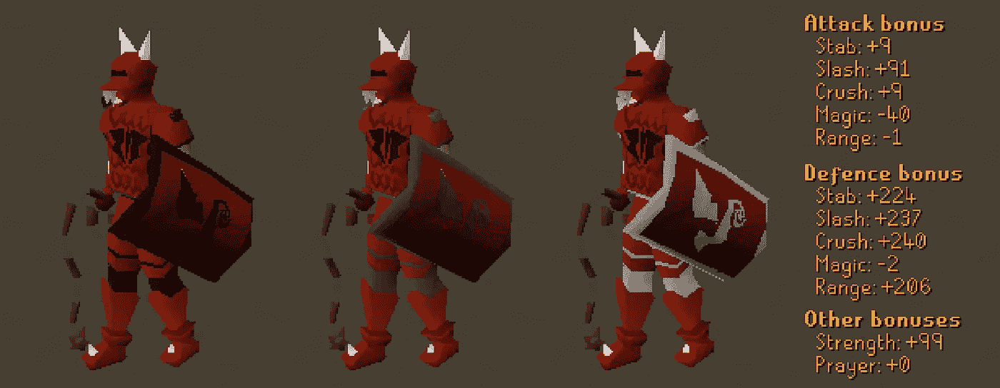
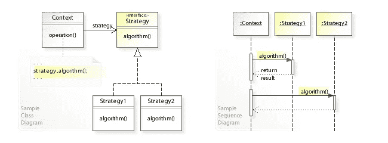

# 围棋中的战略模式

> 原文：<https://levelup.gitconnected.com/the-strategy-pattern-in-go-2072d2b9d6ae>

动态地为您的程序添加功能！



图片来自 [Reddit](https://www.reddit.com/r/2007scape/comments/2bpopj/alternate_trim_ideas_for_dragon_armor/)

策略模式无疑是我最喜欢的设计模式之一。它允许您在程序运行时动态地向对象添加功能。这种设计模式的一个很好的用例是视频游戏，比如我一直最喜欢的游戏之一——老派江湖。在这个游戏中，你可以通过装备一把弓来增加你的攻击范围，用一根棍子和符文来改变你的伤害类型为魔法，或者用一件武器比如花岗岩巨锤来获得一次特殊的攻击！

在本文中，我们将研究真实世界的例子、UML+序列图以及 Go for the Strategy 模式的实现。该代码将基于能够装备不同的武器，以改变他们的攻击能力。

我们开始吧！

## 真实世界的例子

策略设计模式非常灵活，适用于许多类型的项目。包含它的主要原因是为了能够在运行时向对象动态添加新的行为。策略模式类似于装饰器模式，但是策略模式改变了对象的功能，而装饰器增加了该对象的现有行为。当您有一个需要以多种方式执行某个操作的对象时，这尤其有用。

例如，如果您想为一个应用程序动态地选择不同的排序方法，您可以使用策略模式来实现。如果您想为排序方法添加日志记录功能，可以通过将排序方法包装在日志记录对象中来实现。您没有从根本上改变排序算法本身，但是您通过记录速度、使用的空间等增加了排序算法。

策略模式的其他用例包括:

*   方向应用程序-您可能只需要从 A 点到 B 点，但是您需要根据您是开车、骑自行车还是走路来修改路径算法。
*   文件加密—行为要求可能会根据文件的大小而变化。较小的文件可以直接在内存中加密，而较大的文件可以在加密过程中部分存储。
*   数据存储——您的程序目前可能只输出到 JSON，但是如果您发现您实际上也需要输出到 XML 呢？

使用策略模式的另一个主要好处是，它可以让您为不明确的业务需求的变化做好准备。如果客户要求一些特性功能，但他们不知道他们希望它如何实现和/或您期望该功能发生变化，策略模式可以帮助您保持领先地位，并动态地满足这些功能！

## UML 和序列图

从 UML 图开始，我们有需要方法`operation()`的上下文结构。上下文结构将引用包含要实现的`algorithm()`方法的策略接口。上下文可以给出所选算法所需的背景。

然后我们有实现策略接口的策略 1 和策略 2，以及调用方法`algorithm()`的实际逻辑。



来自[维基百科](https://en.wikipedia.org/wiki/Strategy_pattern)

此外，序列图简单地描述了当我们从调用链的顶端调用`algoritm()`方法时，我们将使用选择的策略逻辑来执行算法并返回一些结果。

如你所见，策略模式简单、简洁、灵活！

## Go 中的实现

策略模式就是能够为给定的操作交换不同的功能。在这个例子中，我们将创建一个 RPG 游戏的基本结构，其中角色可以使用策略模式装备不同的武器。

这是我们需要的文件:

```
$ mkdir strategy-pattern-go
$ cd strategy-pattern-go
$ touch main.go character.go weapon.go sword.go bow.go
```

我们必须实现的策略接口将是一种武器。具体的实现将是角色可以装备的实际武器。界面如下:

## 武器，走

接下来，我们需要实现一些这样的武器。在这个例子中只有两个，但是它们应该清楚地说明如何在`useWeapon()`方法中实现不同的行为。

## 剑，走

## 鞠躬，走

虽然这两个结构几乎相同，但是你可以很容易地添加额外的行为，比如给每个武器一个攻击范围。如果你在游戏中加入了某种形式的位置属性，那么弓就可以远距离攻击角色。

现在是时候给我们的策略一个参照的背景了，也就是一个新角色。注意角色攻击另一个对手，留下实际的武器行为和对武器本身的伤害之间的分离。这种委托允许角色使用不同类型的武器，给出不同的行为，而只需要调用`attack()`方法。

## 人物. go

现在我们有了背景(角色)和策略界面(武器)以及最终的具体策略(剑和弓),我们可以调用我们的对象来组织游戏的基础结构。

## main.go

这绝对不是你想离开游戏的方式，因为它很快就会变得非常重复，但主要目标是让你理解策略模式如何给你的程序带来灵活性。

如果我们用`go run *.go`运行这个程序，我们将得到以下输出:

```
The Champion has 100 health left.
The Cave Troll has 100 health left.
The Champion slashes the Cave Troll with a Armadyl Godsword!
The Cave Troll has 55 health left.
The Cave Troll slashes the Champion with a Giant's Sword!
The Champion has 45 health left.
The Champion shoots the Cave Troll with a Dark Bow!
The Cave Troll has 20 health left.
```

你有它，战略模式与 Go！如果你想实际构建一个 RPG 游戏，我首先会建议你甚至不要使用 Go。上面的例子也可以和另一种模式搭配，比如工厂模式，它可以让你在飞行中制造武器。你也可以添加装饰图案来给你的武器附魔和额外的能力。

如您所见，如果您想继续本文中的示例，有许多可能性。我希望你能够更好地理解策略模式，并且学到一些新东西。感谢阅读！