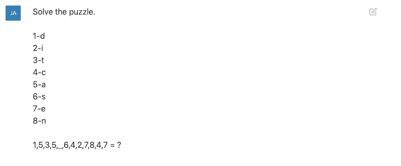
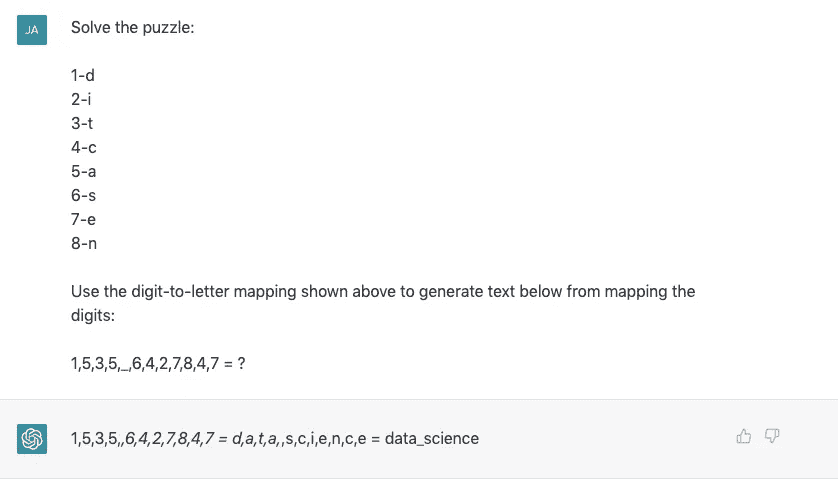
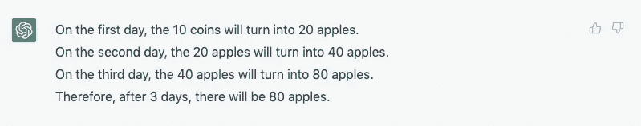
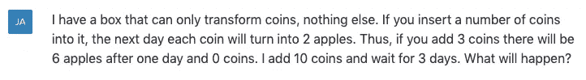

# ChatGPT 还做不到的令人惊讶的事情

> 原文：<https://levelup.gitconnected.com/the-surprising-things-chatgpt-cant-do-yet-4362842da5b7>

## 人工智能

由[雅各布·费罗斯](https://medium.com/@dreamferus)生成的图像

至此，我们大多数人都已经看到了 ChatGPT 及其能力的惊人例子。每个人都渴望知道它*能*做什么。但是要了解你可以和应该在哪里使用它，也有必要看看它目前的局限性和它可能失败的地方。在这篇文章中，我向 ChatGPT 提出了不同的问题，看看它*不能*做什么。让我们开始吧:

# 谜题

我之前用命令行为 GPT 3 制作了几个谜题:

 [## GPT-3 带命令行:它能解谜吗？

### 使用 GPT-3 的一个新趋势是让它与外部工具互动，如维基百科或命令行。这样的…

medium.com](https://medium.com/@dreamferus/gpt-3-taking-on-the-command-line-can-it-solve-puzzles-befcedfa006a) 

令我失望的是，它大部分时间都无法解决其中一个谜题，还有一个根本无法解决*。现在，轮到 ChatGPT 了。我决定在 GPT 3 号完全没有解决的难题上测试它。我还删除了涉及命令行的部分，并简单地立即显示了拼图的各个部分:*

**

*在这里，将数字映射成字母应该形成单词**数据科学**。ChatGPT 回答什么？*

******

**甚至没有关闭*。让我们看看，如果我为需要做的事情添加清楚的说明，会发生什么:*

**

*现在，它做对了。对于一个人来说，不需要任何指导就能解决这个难题应该很容易，因为没有那么多选项可供选择。ChatGPT 似乎无法推断出这一点。*

# *阅读测试*

*在这个实验中，我决定测试 ChatGPT 是否能从对话中得出逻辑结论:*

**

*由于最初的声明说，其中一个人，他的谈话是他的父亲，唯一的人可能是道格拉斯或乔希。第一个相当明显的线索是乔希说“干得好，儿子”。此外:*

*   *乔希说“告诉你妈妈”和“我们应该吃了它们”*
*   *道格拉斯回答“我希望我的家人今晚能吃鱼，我的父亲正在做煎饼”，暗示他不属于吃鱼的家庭。*

*然而，问了 ChatGPT 几次，它总是回答:*

**

*奇怪的是，它坚持猜测道格拉斯是父亲。我想知道为什么。*

# *棘手的问题*

*接下来，我提出了一个棘手的问题:*

**

*诀窍是在第一天之后，10 个硬币会消失，变成 20 个苹果。此后，就没有可以变形的硬币了。因此，3 天后答案仍然是 20。ChatGPT 能搞清楚这个吗？*

******

*4 个答案中，全部都错了。其中三个是不同的(如上所示)。可以说，这个问题可以被视为模棱两可。因此，我试图改变这个问题，用如下的公式使它更清楚:*

**

*问了它无数次，没有一个公式能让它总是回答正确。它的正确回答率只有 20%,因此，大多数答案都是不正确的。*

# *摘要*

*虽然有很多关于 ChatGPT 能力的讨论，但是理解它的局限性也是有用的。显然，从这些例子来看，它还远远没有达到人类的水平。*

*然而有趣的是，它有时可以对困难的问题给出令人难以置信的复杂答案，而其他时候却无法完成简单的任务。我的猜测是，ChatGPT 主要是插值，即它可以很好地解决它所看到的或接近它所看到的东西。*

*但是，提出需要推断的新问题，即超出其训练数据的问题，似乎会导致它更经常地失败。人工通用智能还有很长的路要走。*