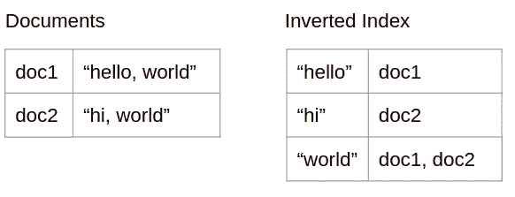
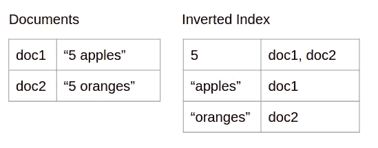
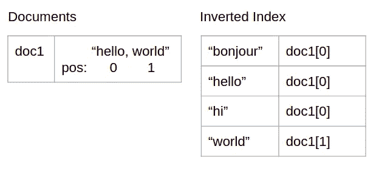
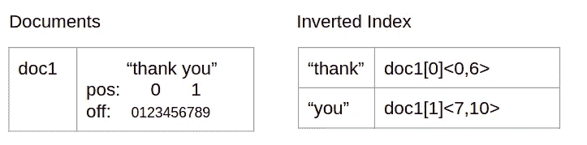
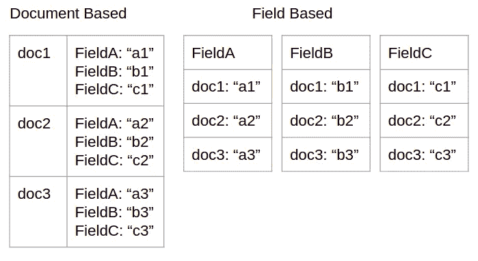
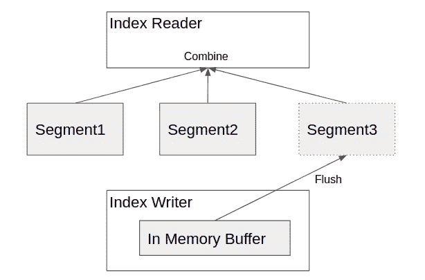

# 高级搜索功能背后的系统设计思想

> 原文：<https://levelup.gitconnected.com/the-system-design-ideas-behind-advanced-search-functions-fa9c7d9010a3>

资料来源:developers.google.com

> **背景**

最基本形式的搜索可以实现为普通的倒排索引。参见图 1 中的图解。我们在添加/删除/更新文档时构建索引，并在搜索期间使用它从一个搜索词转到包含它的文档。那都很好。但是如果你比建立一个简单的关键字查询系统更有野心，请继续读下去。这篇博文温和地介绍了一些高级搜索功能背后的核心思想。顺便说一下，你可能认识到这里的许多想法都是基于 [lucene](https://lucene.apache.org/) 索引。

图一

> **数字搜索**

功能的第一个自然扩展是允许通过数字进行搜索。一个天真的设计是像我们通过文本搜索那样做——简单地把数字当作文本。但这很少是正确的做法。我们经常希望支持对数字的比较/范围搜索。所以我们希望将数字项索引为实数而不是文本。见图 2 的概念化。

图 2

然而，我们需要解决的一个实际问题是，文档中可能有太多唯一的数字(仅整数就很多了，更不用说浮点了)，导致了大量不同的术语，这在实际实现的许多方面都存在问题。例如，我们希望在内存中加载唯一的术语或者至少是一组稀疏的术语指针，这样我们就可以在磁盘上更大的倒排索引中快速查找给定的术语。

规范的解决方案是按照用户定义或系统决定的粒度对数字进行分类。例如，如果粒度为 1，像 5、5.2、5.9 这样的数字都属于[5，6]桶。如果我们真的关心精确搜索，我们还必须将实际数值存储在某个地方，以便我们可以进行搜索后过滤，消除由于分桶化而产生的近似结果。只要我们将日期时间转换为 epoch 时间戳，并在索引中为其配置适当的粒度，就可以用相同的方式处理按日期时间的搜索。

**短语搜索**

功能的第二个扩展是允许短语搜索。我们希望通过短语“hello，world”进行搜索。一种天真的方法是简单地分解短语，独立地搜索术语，然后取结果的交集。但问题是它失去了这个短语的语义。只要文档在其文本中的任何地方包含单词“hello”和单词“world ”,该文档就是命中的。所以我们可以得到一个文本为“你好，美丽的世界”的文档。这里缺少的是术语的位置信息。当我们搜索短语“hello，world”时，我们期望单词“hello”正好出现在单词“world”之前。因此，为了方便短语搜索，我们需要存储每个文档中每个术语的位置信息。参见图 3 中的图解。

图 3

然后，当我们检索这些术语的搜索结果时，我们将看到对于 doc1，“hello”和“world”出现在位置 0 和 1；对于文档 2，“你好”和“世界”出现在位置 0 和 2。因此，应该只返回 doc1。

**预处理**

注意，在上面的例子中，我们忽略了“hello”后面的逗号。看似武断，实则细致入微。我们假设存在一些预处理步骤，在索引和搜索过程中删除标点符号并标记输入。所以，“你好，世界”和“你好，世界”是一回事。除了这种方法之外，还有许多其他预处理技术用于各种用例场景。

最简单的是无操作预处理——按原样存储文本。这对 ID 或 URL 等内容很有用。如果我们想更多地关注内容的语义，我们可以删除像“a”和“the”这样的停用词，因为它们通常对语义没有太大贡献。通过删除它们，我们减小了索引的大小，并避免了一些奇怪的情况，例如术语“the”指向索引中的所有文档。

词干化也是一种常见的预处理技术，它减少了词形的变化。有了词干，“爱”、“爱”、“被爱”、“爱”都变成了正义的“爱”。另一个流行的预处理思想是 n-gram。该文本被分成长度为 n 的子字符串。例如，具有 2-gram 的“love”将生成术语“lo”、“ov”、“ve”。n-gram 的方差是最小-最大-gram，它生成更多的术语。例如，由 1-3 个字母组成的“you”将生成术语“y”、“yo”、“you”、“o”、“ou”，从而实现子串搜索。显然，在冗长的文本上使用它是非常昂贵的。

**模糊搜索**

可以采用更高级的预处理技术来支持模糊搜索。如果我们在文本中看到“hello”，我们可以将它的同义词如“hi”和“bonjour”放在索引中。我们也可以在搜索过程中即时完成，并扩展查询中的术语。但是我们通常更关心搜索延迟而不是索引大小。因此，我们在索引过程中进行这种复杂的扩展。支持模糊短语搜索的一个技巧是用与原始术语相同的位置信息来注释扩展的术语。参见图 4 中的图解。在这种情况下，短语搜索“你好，世界”和“你好，世界”的效果与“你好，世界”相同。

图 4

**片段**

有时我们可能想要检索包含搜索词的文档片段。该片段提供了周围文本的预览，允许用户快速浏览并评估结果的相关性。这种特性可以通过存储原始文档的术语偏移量来实现，以便我们可以在搜索时快速定位原始文档内容中的一段周围文本。参见图 5 中的图解。

图 5

**逐场搜索**

到目前为止，我们一直假设一个文档只有一个字段，这是它的全部内容。那太局限了。考虑到一本书，是的，大部分是它的文本内容。但是它也有标题、作者、出版商、出版日期、ISBN 等等。一个有用的搜索系统应该允许用户指定他们想要在书名中搜索“hello ”,而不是它的内容。这就是场的概念出现的地方。一个文档可以有多个字段，每个字段都有不同的用途、语义和搜索能力。例如，用户可能希望对出版日期进行范围搜索，对 ISBN 进行精确匹配，对完整作者姓名进行短语搜索，对标题进行模糊短语搜索。当谈到底层索引结构时，它在概念上包括多个独立的索引，每个字段一个。字段由其名称和类型来标识。出于管理目的，有些系统要求预先声明所有可能的字段。其他人没有。但是在这两种情况下，我们都不应该有过多的不同字段，因为需要将大量与字段相关的数据结构加载到内存中以进行更快的查找。基数太大会损害整体系统性能。

**得分和排名**

得分和排名是另一个有趣的领域。一个搜索查询可能会找到许多文档。应该有一种方法对结果文档进行排序，让用户最关心的文档出现在顶部。用户关心的是情境。因此，提供一个好的默认排名和一个插入特定于用户情况的排名的机制是很重要的。值得注意的是，排名可以在索引时间进行。

在上面的所有例子中，每当一个术语有多个文档时，我们只是按 id 的升序排列文档。事实上，如果我们知道按照创建时间降序排列是一个常见的搜索用例，我们可以在索引中按照这个顺序列出文档。这将是排列文档最有效的方式。但是它不够灵活，因为它需要先验知识。如果我们想要一个以上的索引时间顺序，我们必须创建多个索引副本。

更强大的排名将不得不在搜索时完成。本质是为搜索查询计算文档的分数。计算分数时要考虑很多因素。例如，系统可以提供一般的相关性分数，包括诸如文档中的术语频率、文档长度等。据推测，如果它是一个短文档，但该术语出现多次，则其相关性应该更高。显然，所有关于词频和文档长度的额外信息都需要与索引一起存储。

文档中的不同字段可能具有不同的重要性。例如，点击一本书的标题可能比点击书的内容中的一些随机单词更重要。因此，我们可以定义每个字段的“提升”因子，赋予书名更多的权重。我们甚至可以做搜索时间项提升。这对于我们想要搜索“hello world”的情况很有用，但是我们认为“world”这个词比“hello”更重要。一些系统允许将提升因子标记到搜索项的查询语法，这将在分数计算期间被考虑。

**刻面**

另一个高级搜索是 faceting。这只是获取前 n 名直方图的一种奇特方式。在 SQL 中，这是经典的 GROUP BY 操作。分面可以被限定到由特定搜索查询命中的文档的特定领域。它允许用户沿着感兴趣的领域对相关文档进行统计。了解有多少结果共享相同的字段值也有助于用户缩小未来的搜索标准。例如，我们想要搜索标题中包含“hello word”的书籍；与此同时，我们想知道有多少产品属于 0 美元到 50 美元、50 美元到 100 美元和 100 美元以上的价格范围。

就实现而言，没有魔法。我们需要查看搜索查询找到的每个文档中感兴趣的字段，并增加各个字段值类别的计数。字段值需要存储在系统中。说到字段值存储，我们在前面的讨论中忽略了一些东西。有两种存储字段值的方法。一种是基于文档的，命名文档的所有字段都存储在一起。给定一个文档 ID，我们可以快速加载它的所有字段。它有自己的使用场景，比如返回文档的完整视图。另一种方法是基于字段的，它将给定字段的所有文档的值存储在一起。概览见图 6。第二种格式更适合刻面使用。我们可以快速检查所有文档(或文档子集)的字段值，因为分面一次只关心一个特定的字段。其紧凑的布局也使文件系统能够更有效地缓存字段值。

图 6

**指数突变**

最后，值得考虑的是，当根据用户请求添加、更新和删除文档时，索引是如何维护的。我们的第一直觉应该是，为每个突变就地更新磁盘上的索引是不切实际的。因为数据通常被很好地打包甚至压缩成文件。一个简单的变化，比如插入一个新的术语或向一个术语添加一个新的文档 ID，可能会对磁盘上整个索引的排列产生显著的连锁反应，从而对系统性能造成极大的损害。解决这个问题的规范方法是将索引分成段。突变在内存中缓冲，并批量刷新到磁盘。每次刷新都会创建一个新的索引段。索引段是逻辑上独立的子索引。在搜索时，系统将需要查询所有的段。参见图 7 中的图解。这种模式在大数据时代被反复采用，它被称为 LSM 树[ [链接](https://eileen-code4fun.medium.com/log-structured-merge-tree-lsm-tree-implementations-a-demo-and-leveldb-d5e028257330) ]。

图 7

较新的段包含新的文档和旧段中仍然存在的已删除文档的墓碑。在搜索时，来自所有段的结果将被组合以包括所有文档。新删除的将从结果中删除。更新本质上是一个删除，然后是一个添加。后台任务将监控数据段并对其进行压缩，以保持健康的数据段计数。

这里有许多经典的权衡，比如内存批量大小、刷新频率、搜索新鲜度、压缩标准。但是我们没有时间详细讨论它们。基于分段的组织的一个好处是，只要分段仍然是活动的，搜索结果总是可再现的。因此，另一种观点是，每次刷新都是一次提交。我们可以在当前或前一个提交点执行搜索查询，前提是我们保留了组成段的记录。这有很多用处，比如调试和使分页稳定。

**后记**

在一篇博文中，这是一个相当大的脑残。我们主要讨论了核心思想，但没有深入细节。这并不是说细节不重要。事实上，如果你想成为一名真正伟大的工程师，它们是至关重要的。希望这篇博文能成为你自己探索更多的起点。我有更多系统设计相关的博文[ [链接](https://github.com/eileen-code4fun/SystemDesignInterviews)，如果你想看的话。