# 第一人称 Hitboxes 背后的理论

> 原文：<https://levelup.gitconnected.com/the-theory-behind-first-person-hitboxes-d593ecc6de9>

## 选择正确的 hitbox 是成为优秀射手的关键。这是它们之间的区别以及它们为什么重要

反恐精英更新了生命值

几乎所有的现代游戏都以某种方式模拟物理。从 roguelike 中最基本的碰撞到 Kerbal Space Program 等复杂的计算模拟，如果你想构建一个 3D 游戏，你需要让世界感觉是实心的。这就是为什么你的游戏需要 hit boxes——虚拟物体实体的行业术语。

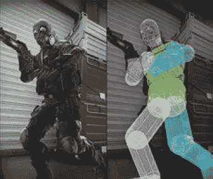

**图 1:**CS:GO 玩家的 Hitboxes 由几个胶囊组成，以紧密匹配角色模型，因为重点是准确性而不是移动速度。

点击框是不能与其他点击框重叠的形状的表示。这个世界有一个 hitbox，每个玩家都有一个 hitbox，风景，房子，几乎所有你在游戏中能看到和触摸到的东西都有一个 hitbox。为了给玩家一种真实感，他们必须被阻止直接穿过那个对象，并且经常会看到两个对象连接时的物理反应——反弹是 hitboxes 之间碰撞的常见效果。

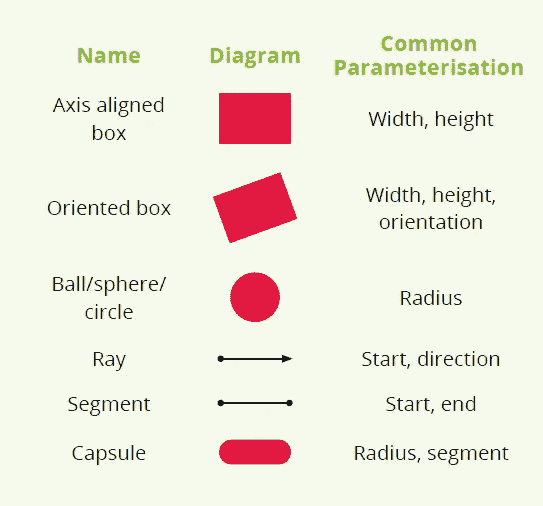

这将解释您将在本文中遇到的一些术语，更重要的是，您需要设置参数来定义它们。

为什么我们在这个功能中选择了第一人称射击游戏？因为这种类型包含了最多的热门话题，而热门话题对动作有着最切实的影响。你选择的 hitboxes 必须与你想制造的射手携手合作。你希望你的游戏感觉缓慢和深思熟虑，强调准确性，还是快速和街机一样，抽搐反应决定赢家？

这里理解一点几何学是有用的，因为我们将讨论三维的形状和线条:球体、盒子、射线和线段。你可以在左下方的图表中清楚地看到这些。

今天最受欢迎的两个游戏引擎，Unity 和 Unreal，都有开箱即用的工具来处理简单的胶囊和关节式 hit box(我们将讨论的最复杂的一种)。Unreal 允许您在物理资源编辑器中编辑模型的点击框，而 Unity 为您提供了用于完全定制的布娃娃向导和用于单个胶囊点击框的角色控制器。

## 基元

“Hitbox”实际上有点用词不当，因为它们的形状不仅仅是盒子。制作 hitbox 最常见的方法是使用一组图元，如球体、射线和胶囊等更复杂的对象，它们可以有效地进行一对一的相交测试。盒子(或长方体)不经常在 shooters 中使用，因为它们与彼此和其他图元相交的计算成本更高。轴对齐和方向是 hitbox 的一个重要考虑因素。如果点击框是轴对齐的，这意味着主轴不会相对于世界/地图轴旋转:框上的“向上”方向将始终是相同的向量。盒子、圆柱体和胶囊通常是轴线对齐的。

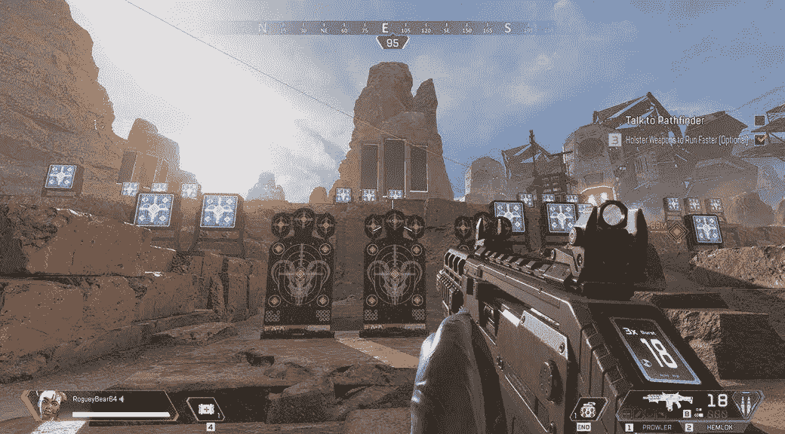

Apex Legends 的武器使用分段轨迹，这意味着它的射弹都受物理影响。

当涉及到将 hitbox 应用到角色模型时，该过程通常包括将盒子或胶囊排列到模型的关节上。例如，如果围绕玩家上臂骨骼的三角形网格沿着骨骼的半径大约为 10 厘米，那么该骨骼的击中框将具有 10 厘米的半径和与该骨骼相同的长度(图 1)。

## 投射命中盒

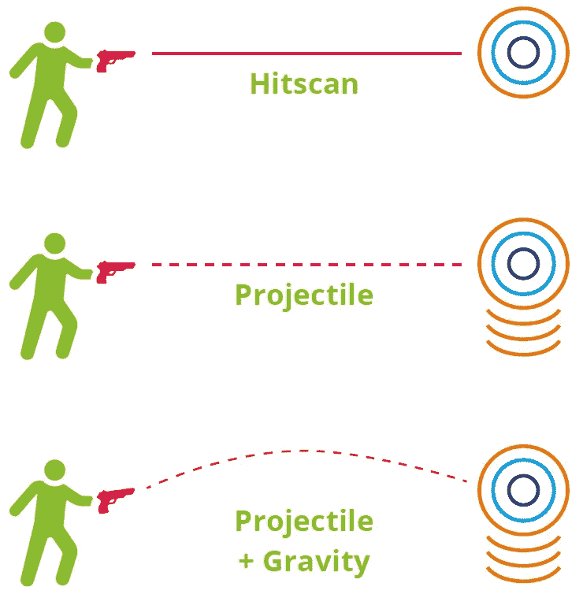

图 2:hit scan 武器和投射武器的对比。与 hitscan 武器不同，投射武器还可以模拟重力的影响。

一旦你建立了一个玩家 hitbox，一个非玩家对象如何与之交互？这里还需要考虑其他基本元素:光线和线段。射线是从空间中的一个点开始到无穷远的直线，而线段是有起点和终点的直线。这两者都可以用于射弹的命中目标。射线将用于以无限速度运动并立即击中目标的物体，而线段可能用于以有限速度运动的物体(图 2)。

如果射线的起点和方向向量与武器枪管的位置和方向相同，那么沿射线的第一个交点就是射弹将要击中的地方。光线可能会沿着它的路径与许多对象相交，但是您主要感兴趣的是光线首先击中的对象。对于分段来说也是如此，除了它会在每次“滴答”(或游戏循环的迭代)时改变它的位置，直到它到达终点。这两种方法通常被称为“命中扫描武器”和“投射武器”。

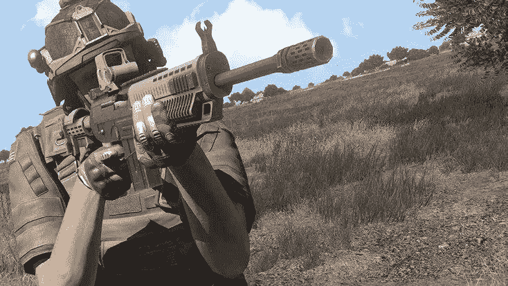

对于军事射击游戏《Arma 3 》,开发商 Bohemia Interactive 对物理细节进行了深入研究，射弹甚至会受到风速的影响。

第一人称射击游戏经常对大多数武器使用 hitscan，因为开发者假设子弹移动速度足够快，可以立即击中目标。这可能是出于游戏性和模拟的原因，因为玩家可能希望他们的射击击中一个物体，而不管他们或目标移动得多快。然而，如果你计划建造一个更真实的射手，你可能不想做这个假设。在这种情况下，您应该分段抛射体的轨迹，并在每次跳动时模拟一个分段，给它一个有限的速度。战场和 Arma 游戏都是这种方法的例子:两者都模拟了由于重力造成的远距离投射。Arma 甚至模拟了风引起的横向运动。在《反恐精英:全球攻势》中，如果投射物的伤害随着飞行距离的增加而降低，那么掉落会对游戏产生更大的影响。

手榴弹是另一种射弹。它们的速度有限且相对较小，因此受重力影响更大。许多线段通常用于近似它们的路径，描绘出一条忽略风阻的完美抛物线(见**图 3** )。

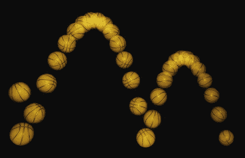

**图 3** :线段可以用来近似手榴弹或弹跳炸弹等抛射体的路径。

为了增加低速射弹的衰减，段的长度应该是*速度*每节拍的时间增量。*对于每个刻度，还应该根据重力改变线段的方向。通过将***g***
(= 9.81m/S2)加到每个节拍的向下速度上来实现这一点(或者通过在每个节拍施加力 ***F=mg*** 来实现这一点，其中 ***m*** 是抛射体的质量——当力施加到加速度上时，这将抵消)。
抛射体的主要决定归结于抛射体相对于模拟 tickrate 的移动速度，重力和/或风是否影响路径，以及它是否反弹。这里有一个有趣和现实主义的权衡，很可能现实主义是你的游戏的特殊吸引力的一部分。

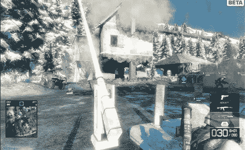

战场中的场景是由几个 hitboxes 构建的，所以破坏可以带走墙壁，地板等等。在《使命召唤》这样的游戏中，墙壁通常由一个生命盒组成，而不是几个。

## 爆炸和飞溅损坏

低速射弹通常有一个作用区域，通常称为“飞溅伤害”。这不仅仅发生在光线/片段击中的空间中的一点，而是向外辐射。模拟这种效果的最佳方式是使用球体或圆柱体(您也可以使用椭球体或椭球体，尽管后者并不常见，因为它通常有助于效果向所有方向均匀辐射)。

这可能就像找到碰撞点半径内的所有对象并应用效果一样简单。这种方法的一个问题是，如果没有非常复杂的计算，厚墙或其他物体可能不会阻挡这种效果——想想 FPS 玩家在手榴弹投向他们时是如何躲在“掩护”后面的。

此问题的解决方法是将光线从击中点投射到球体的边缘，然后在这些光线与对象相交的地方应用效果。这可以避免飞溅破坏效果穿过墙壁，但缺点是计算成本更高。

## 速度与准确性

在你继续用胶囊和球体构建一个近似的玩家模型之前，你需要考虑一下游戏性。当建造一个射手时，你必须做出一个有趣的决定，玩家和 NPC 的命中率与游戏的移动机制和速度密切相关。玩家移动得越快，就越难被击中；将这一点与“模型紧密”的点击框结合起来，可能会使游戏要么太难，要么让玩家认为碰撞检测不好。

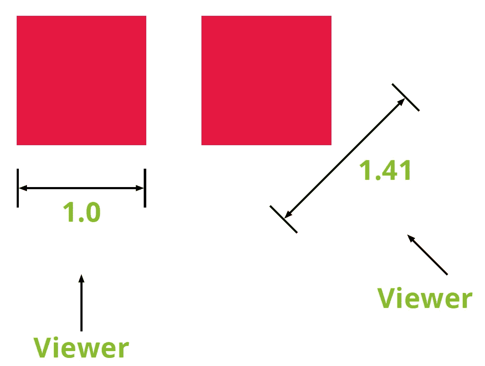

**图 4** :虽然
轴对齐的包围盒在计算速度上很棒，但是它们在命中精度上很差。击中框根据另一个玩家的视角改变大小，这意味着应该“错过”的球会击中。

《雷神之锤》系列就是一个很好的例子。直到并包括雷神之锤 3，玩家的点击框是轴对齐的边界框，包含整个模型。id 软件的优势在于计算速度，但就命中精度而言，它可能是最差的解决方案。盒子的角比玩家的渲染模型更突出，这意味着即使附近的射击“错过”了模型也将被算作命中。这种方法也是方向相关的，这意味着如果你围绕另一个玩家垂直移动 45 度，可击球区域可能会扩大一个系数 ***√2 ≈ 1.41*** ( **图 4** )。但这对玩家来说仍然很有趣！因为移动速度是疯狂的，hitboxes 需要稍微补偿一下。

> 地震效应
> 快速移动和竞争，地震启动了竞技场射击游戏的子类别，如 Warsow，Reflex Arena，Xonotic 和 OpenArena。每个都倾向于紧密遵循雷神之锤的 hitbox 设计:模型完全是装饰性的，玩家可以选择为其他玩家使用什么模型——每个玩家都有完全相同的 hitbox，无论他们看起来像什么。这些设计决策是专门为高水平的竞争而制定的——这种竞争力是 hitbox 重要性的主要驱动力之一。

在《雷神之锤冠军》中，有几个有趣的区别。它的创建者在早期试验了使用三角形网格 hitbox 几乎完全匹配渲染模型的 hitbox，但是，据一位开发人员说，它被证明是令人沮丧的难以命中。然后他们转移到一个 hitbox，这个 hitbox 包括一个用于头部的球体和用于躯干和四肢的胶囊。这个球体和胶囊模型随后被扩大了大约一倍，用于更轻的玩家模型，以使玩家更容易击中，并符合玩家对他们应该能够击中的东西的期望(**图 5** )。

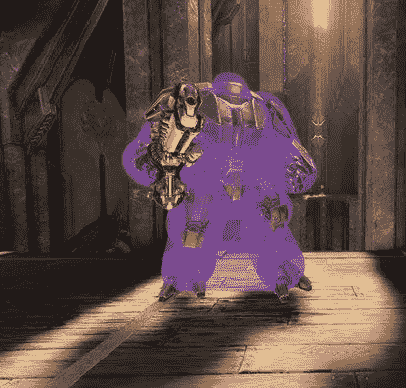

**图 5:** 《雷神之锤》的冠军们使用了厚重的 hitboxes 来让角色更容易被拍摄。

开发人员选择这种方法是因为雷神之锤游戏是竞技场射击游戏，强调快速移动技术，如兔子跳，所以拥有准确的击中目标不如玩家能够击中他们在地图上高速弹跳的对手重要。想想《反恐精英》，尤其是《反恐精英:全球攻势》,那里的移动速度被减慢，兔子跳跃被大大削弱。CS: GO 的较慢速度意味着两件事情发生:玩家发现更容易瞄准准确的击中目标，当击中没有击中而是“应该”击中时，这对玩家来说变得更加明显。

## 反恐精英

反恐精英是一个很好的例子，说明为什么 hitboxes 在射手中如此重要。它的玩家很清楚它的 hitbox 与渲染模型不匹配，甚至在游戏历史上也出现过一些 hitbox 错误，每次都会导致社区主导的调查。其中一个较大的是快速蹲伏的 bug，玩家可以快速站立和蹲伏，看到敌人，但 hitbox 会比模型更快地变回蹲伏，这意味着其他玩家即使能看到模型，也无法击中蹲伏的玩家。

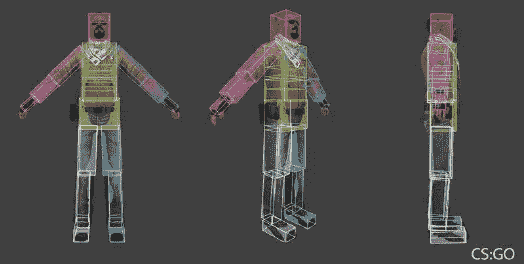

**图 6** :《反恐精英:全球攻势》的早期版本使用长方体的生命盒，后来为了更精确，大部分改用球体和胶囊。

如果一个玩家可以通过开一枪来暴露他们的位置，并且这可以极大地改变一轮的结果，那么这个玩家需要确切地知道这一枪是否击中了目标。做到这一点的唯一方法是确保 hitbox 与他们看到的内容准确匹配。因为这种准确性对于像《CS: GO》这样节奏较慢、每一枪都算数的游戏来说非常重要，所以它的开发者已经花了相当多的时间来微调它的 hitboxes。与 CS: Source 或 CS 1.6 相比，CS: GO 的起点更高。开发人员还决定从一个盒子模型(**图 6** )转移到一个主要的球体和胶囊模型，并努力确保 hit box 准确反映所有动画姿势的角色模型的骨骼。

然而，hitbox 变得越复杂和精确，你为你的网络代码做的工作就越多。增加关节的数量既增加了游戏的带宽，也增加了互联网延迟导致 hitbox 对一些玩家不同步的机会。

## 应用点击效果

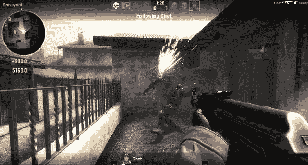

《反恐精英:全球攻势》中的生命值更小，因为这个游戏强调的是准确性而不是速度。

检测击中只是让游戏感觉真实的第一步。第二部分是将一个真实的效果应用到玩家身上。在一些游戏中，这意味着不同的伤害会被应用，这取决于击中了 hitbox 的哪个部分。例如，CS: GO 对腿和脚的伤害比对头部的伤害要小。

爆头是反恐精英系列的关键，以至于武器是由能否一枪干掉戴头盔的敌人来定义的。能做到这一点的最知名的武器是 AK-47，相比之下，替补队的 M4A4 和 M4A1-S 不能“一枪命中”。这里可以应用的另一种机制是装甲穿透和表面穿透。您可能希望投射物沿其轨迹影响多个对象，并根据它们通过的对象改变行为，这有时被称为“撞墙”。在这种情况下，点击框交集应该返回沿射线的所有对象或曲面，而不仅仅是第一个。要在游戏中实现这一点，您可能需要一个通用系统，它可以根据厚度、穿透角度和材质来计算每个表面的适当修改器。

> 在 Unity 和 Unreal 中，你可以使用布娃娃向导(Unity)或物理资源编辑器(Unreal)来调整你的 hitbox 大小。从 playtests 收集反馈在这里可能是有价值的；你的玩家可能会告诉你，你的高命中率快速移动的玩家模型太难击中，或者你的高命中率慢速移动的玩家觉得不公平地容易受到攻击。

通过检测射线或线段首先与击中框的哪个部分相交，然后从损害表中选择应用什么，可以根据材料和位置改变损害。当射弹已经击中并穿过薄木墙时，可以通过降低射弹的伤害来实现因材料而异。你的游戏引擎和地形 hitbox 需要检测这些碰撞，并告诉你一个物体是由什么材料制成的，然后你可以在一个材料表中查找有多少东西穿透了该材料，或者通过检测和计算进入点和退出点之间的距离，根据墙壁的厚度降低伤害。

## 毁灭

车辆是另一个需要考虑的方面。战地有一个系统，其中一辆车有多个组件生命盒，当它们被损坏或摧毁时有独特的效果。举例来说，除了彻底炸毁它，摧毁坦克一侧或两侧的履带可能会限制它的移动或完全停止它。损坏炮塔可能会使它失效，当然，通过装甲上的一个洞击中玩家也会伤害他们。如果您的 hitboxes 是细粒度的，并且与模型匹配良好，这些都是可能的。

车辆的生命盒可能与玩家/NPC 和地图的生命盒完全不同。因为车辆有许多平坦的表面，所以用定向盒子而不是胶囊来制造它们更有意义。

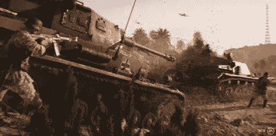

战地 V 的交通工具，包括它的坦克，有多个生命盒，根据玩家射击的位置允许不同的伤害效果。

可破坏的环境可以为玩家提供一个伟大的奇观。在战场系列中，大多数建筑都可以被损坏或完全摧毁，而景观本身可以通过在其中炸出洞来摧毁。这需要 hitbox 系统中的一些新东西，强大武器的命中可以改变大型物体的 hitbox。这可以通过一个房子的结构来实现，比如说，在每面墙上安装一些小的机顶盒。墙段可以以开/关的方式被破坏，或者在击中时被分裂成更小的墙段。这些细节有助于让玩家沉浸其中，但是应该小心平衡，这样利用建筑物作为掩护就不会完全没用。

允许玩家创造他们自己的掩护是平衡毁灭方面的一种方法。在堡垒之夜，玩家可以建造和修复带有预制墙和楼梯的建筑。玩家可以在游戏中建造比其他任何东西都更高更大的建筑，但如果这些建筑不再与地面相连，就会倒塌，从而达到平衡。如果他们爬得太高，其他玩家就有机会用坠落伤害杀死他们的对手——尽管这种战术略有削弱，因为允许玩家在足够高的高度使用他们的滑翔机。

## 考虑

在开发你的游戏时，有太多的决定要做，也有射手们用各种不同的 hitboxes 获得成功的例子。《堡垒之夜》、《雷神之锤》、《反恐精英》和《战地》都很受欢迎，这至少部分是因为在为玩家、NPC、地图和物品设计 hitboxes 时考虑到了这些因素。通过把时间和思想放进你的 hitboxes，你会大大增加成为一个成功的射手的机会。