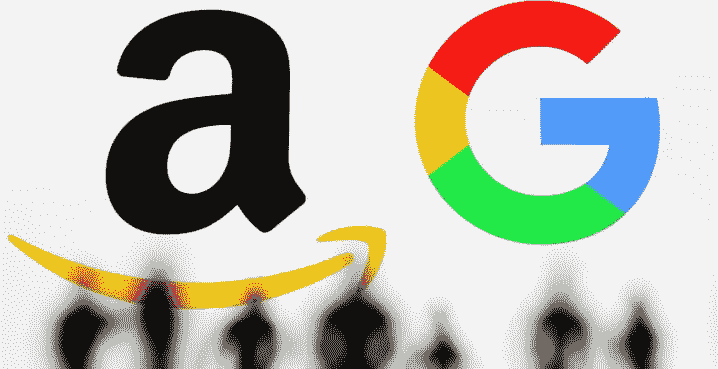
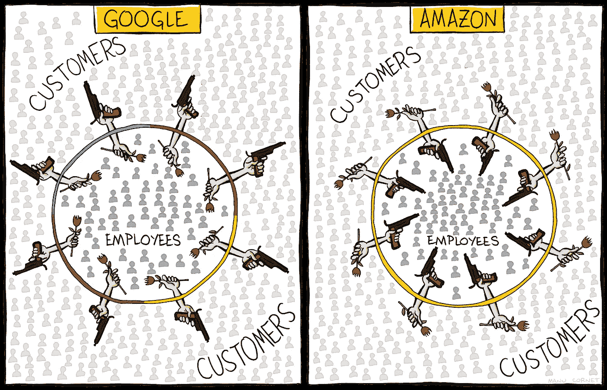

# 我喜欢谷歌的地方也是我不喜欢的地方

> 原文：<https://levelup.gitconnected.com/the-things-i-love-about-google-are-the-things-i-dislike-about-google-b539be11ab0b>

## 谷歌如何雇佣梦想家，亚马逊如何雇佣建设者

我在亚马逊工作了 11 年(作为开发工具的首席工程师)，在谷歌工作了 2 年半(作为集成测试开发基础设施的高级员工工程师)。这两个职位都是公司范围内的工程生产力角色，让我接触到大量的团队，并让我深深地接触到两种文化。

我得到了以下的顿悟和悖论:

> 我喜欢谷歌的地方就是我不喜欢谷歌的地方
> 
> 我喜欢亚马逊的地方就是我不喜欢的地方

如果你来这里希望找到一个有趣的故事，讲述亚马逊是一个多么糟糕的地方，或者谷歌是一个多么糟糕的地方，或者一个比另一个好，抱歉让你失望了。我真诚地热爱我在亚马逊的时光，今天我也真诚地享受在谷歌的快乐。我会推荐这两家公司中的任何一家，它们都是理想的工作场所。在这两个地方，你将与极其聪明的工程师一起工作，你将为数百万人设计、编写、测试、部署和维护顶级软件。但他们看待世界的方式截然相反。我在这里，处于两种文化的中间。我是一名自豪的谷歌人，不可否认，我有着浓重的亚马逊口音，这种口音挥之不去。某个古怪的混血儿试图理解生活。

但这并不是我第一次成为混血儿。我在阿根廷出生并长大，15 岁时来到美国，此后一直住在这里。*我是阿根廷人和美国人，但我既不是阿根廷人也不是美国人。*我是个行走的矛盾体。不管我在美国呆了多少年，我都不会真正成为 100%的美国人(不过没关系，我妻子说她喜欢我的拉丁风格)。我内心深处有一些特征、信仰和行为，有些甚至是下意识的，清楚地暗示我是南美人(例如任何一届 FIFA 世界杯期间在电视前尖叫和哭泣的次数)。但是[1991 年那个寒冷的雨天，当我乘坐的飞机从布宜诺斯艾利斯起飞时，不可逆转地改变了我的生活。我再也不是 100%的阿根廷人了。西雅图是家。这是我想度过余生的地方。](https://link.medium.com/pDZytGgTBib)

我开始接受这个悖论，甚至欢迎它。拥有两种文化让我对世界有了更广阔的视角。我可以从每种文化中挑选对我来说重要的东西。在与另一种文化的互动中，我可以从一种文化中吸取一些东西。我可以从多个角度看待一个情况。请不要认为这是关于公司间差异的权威指南:你的经历可能会有所不同；这是这位前亚马逊人对谷歌的看法。

# 谷歌雇佣梦想家，**亚马逊雇佣建设者**

第一个区别是在入口处。你选择带谁进公司会影响你的 DNA。我为亚马逊做了 813 次采访，目前为止为谷歌做了 55 次。两家公司都有具有挑战性的面试循环，你会想花几百个小时在 leetcode 上为本质上非常相似的技术探查做准备。*但谷歌非常注重智力和原始智商，而亚马逊则注重交付和实用主义。*亚马逊很重视[行为问题](https://hire.trakstar.com/business-guides/recruiting-and-hiring/asking-situational-and-behavioral-questions-in-job-interviews)，而不是情境问题，这往往会吸引那些在过去表现出*对送货很务实的人。*

**我喜欢谷歌的什么**

在谷歌，我周围的原始智商和智力是惊人的，也是令人羞愧的。我周围的人都比我聪明。人们经常解决困难的或者几乎不可能的技术问题，纯粹是因为解决了这些问题而获得的智力成就。这些是*梦想家*。世界需要他们。

**我不喜欢谷歌的地方**

由于解决问题的自我激励往往是“因为它们在智力上具有挑战性”，一旦问题被解决，人们有时对接下来的事情就没有动力了。*发射*东西和*降落*东西有很大的区别。一旦你将一段代码投入生产，你就必须使它社会化，教育你的客户，培养它并使它进化。亚马逊在这一点上非常务实和自律。解决问题的主要动机不是智力上的挑战，而是一旦问题解决了，你能达到的效果。这些是*建设者*。我们也需要他们。

**判决结果？**

我喜欢中间路线，公平地说，我在两家公司都遇到过很多平衡的人。但最终我认为，这确实归结于面试过程，让两种截然不同的性格类型进入一家公司。

# 谷歌提供同理心，亚马逊慷慨开火

这看起来似乎是显而易见的。谁愿意为一个解雇人的公司工作？不可否认，亚马逊是一个恶劣的环境。这并不适合所有人。当我在那里的时候，我们通常会解雇底层的 5%的工程人员。当我是经理的时候，我解雇人。当我不是经理的时候，我求身边的经理炒掉他们的人。正因为如此，亚马逊的运营极其精简。另一方面，谷歌的招聘门槛很高，但一旦你成为谷歌人，你就会有一个巨大的心理安全网。

**我喜欢谷歌的地方**

不必担心明天是否会被解雇，这让你如释重负。我工作时身体不那么紧张了。人们自然有全力以赴的时候，也有不全力以赴的时候，而谷歌的方法更全面，更着眼于长远。同理心是一个公司的良好品质。我相信谷歌关心我这个人。

就在几天前，我和一个朋友在午餐时讨论了这个话题，他问我，“*你是不是同时处于前 5%和后 5%？*“是的，是的，我吃过了。在我在微软、亚马逊和谷歌的 25 年职业生涯中，出于各种原因，我曾在不同的时间处于最底层的 5%和最顶层的 5%。他接着说，“当你跌到谷底的时候，你难道不庆幸自己没有被解雇吗？”

**我不喜欢谷歌的地方**

我认为扩展到系统提供的任何自由只是人类的本性。你可以默认做最少的工作而不被解雇。你甚至可能不是有意或恶意地这样做，而是下意识地这样做。这正是我在[倒数 5%](https://link.medium.com/sqb2uNpikhb) 的时候所做的。我当时看不到，但现在回想起来，我能清楚地看到。我伤害了我的职业生涯，我的团队和我的公司。

这种惰性非常容易传染。它可以在任何公司的团队中传播，谷歌或其他地方。一个平庸的人可以让平庸正常化，并重新设定整个团队的标准。在那之后重新校准它是极其困难的。我不是一个人。谷歌的首席执行官 Sundar 最近非常明确地谈到了加强我们的关注:“我们确实担心我们的整体生产力没有达到我们需要的水平。”

**判决结果？**

这只是我的个人理论，但我开始认为*对低绩效者的同理心*转化为*对高绩效者缺乏同理心*，反之亦然。我希望在这里看到一个中间地带，在这里我们不怕把挣扎的个人放在绩效改进计划中，并适当地解雇，同时我们不坚持例行公事地仅仅解雇底层的 x%的人。心理安全网让人们可以更好地工作，但制衡是有益的。

亚马逊称之为“第一天”vs“第二天”。这个视频是一个宝石。那天我在体育场，离前面很近，所以我记得就像是昨天一样！

# 谷歌彬彬有礼，亚马逊直言不讳

亚马逊的沟通风格是直率、坦诚和原始的，很少顾及人们的感受。它重视事实和数据，而不是观点和情绪。很简洁:非常切题。*我在亚马逊的第一年，就发现这令人不快。最终我明白了，没有人批评我这个人，这从来都不是针对我个人的。我也开始喜欢我确切地知道我在人们心目中的位置:当他们认为我是个白痴时，他们当着我的面说出来——然后，解决了这个问题，我们就像老朋友一样一起去吃午饭或喝啤酒。*

谷歌营造了一种环境，在这种环境中，人们真正包容，彼此更加友好和礼貌。这让我耳目一新。人们带着完整的自我去工作，不用担心被批评，这是一种解放。这为你的工作环境提供了一个更大的心理安全网。

**我喜欢谷歌的地方**

我在谷歌遇到“混蛋”的可能性极低。人们互相喜欢。在这里，我对同事微笑的次数更多，他们也会对我微笑。[我每天都在亚马逊遇到“混蛋”](https://link.medium.com/kOhCaVK0tkb)，最终我脸皮厚了，甚至没有察觉。

此外，一个人与人之间更友好的环境会带来更多不同的观点和经历。亚马逊的苛刻导致一些人要么退出，要么因为害怕被惩罚而保持沉默。我喜欢在更包容的环境中工作。

**我不喜欢谷歌的地方**

我有时觉得我不能说些什么，因为在谷歌文化中没有礼貌的表达方式。我一直在努力调整自己内心的冲动，让自己仍然能够说出一些为了业务需要说的话，并适当而尊重地挑战我的同事。我有时会开玩笑地以免责声明开头，“如果我的‘亚马逊’出现在这里，我很抱歉，但是……”人们知道我会在一分钟内滑回亚马逊式的直率风格。我确实认为人们有时只是出于礼貌而回避一个问题，我希望人们不要那么担心社会凝聚力和人们的感受。这是生意。

**判决结果？**

再说一次，我想降落在中间的某个地方。我不断调整我的沟通方式，在尊重他人的同时保持坦诚。我没有灵丹妙药——有时候两者兼而有之是极其困难的。但是我每天都在努力。我鼓励我周围的人也能坦然地对我坦诚相待。

# 谷歌提供自由，亚马逊有纪律

在亚马逊，我花了几个月的时间写了一份白皮书，提出一种产品并寻求资金。我的文档有 345 处修改。我与多位董事和副总裁进行了辩论，但最终，我的小 6 页纸找到了 Jassy 的领导，并获得了批准。我们雇佣工程师建造了这个东西。太棒了，但也很累。我的论文受到了如此多的审查，这可不适合胆小的人。[我差点辞职了。](https://link.medium.com/ysp1PAxXamb)

我在谷歌的第一周，我的老板就告诉我，这里有 N 名工程师，去想办法用他们做什么，我相信你。我的[亚马逊爬虫脑](https://link.medium.com/ysp1PAxXamb)差点爆炸。我没有做好心理准备去接受那么多的自由！

**我喜欢谷歌的什么**

谷歌的文化是，如果你雇佣真正聪明的人，并给他们极大的自由，就会有好的事情发生。它获得了丰厚的回报，推出了 9 款产品，每款都有超过 10 亿的用户。我自己也很享受这种自由。一年前，我们发现了工程生产力中的一个小问题，我们认为可以将机器学习应用于这个问题(更多详细信息[在这里](https://www.tdcommons.org/dpubs_series/4665/)和[在这里](https://www.tdcommons.org/dpubs_series/4666/))，我的主管给了我们六个月的时间来解决这个问题。这是一个模糊的空间，不清楚到底该走哪条路，所以我很欣赏去追逐它的自由，没有领导每隔一天盯着我们。今天，它正在成为谷歌范围内基础设施的一个关键部分。在亚马逊，我可能很难做到这一点。

**我不喜欢谷歌的地方**

伴随自由而来的是责任。还记得我之前告诉过你亚马逊雇佣建造者，谷歌雇佣梦想家吗？仅仅因为你是一个超级聪明的工程师，并不意味着你有坚实的商业头脑。有时候，事情没有经过更深入的长期思考就建立起来了。或者他们周围的生态系统。或者是否应该从一开始就建造它们。

在我在谷歌的最后两年半时间里，我扮演了一个令人讨厌的家伙的角色，他出现在技术设计审查会上，像钟表一样，一开始就只问两个问题:“*为什么*你要建立这个？”接下来是“*在您之前还有谁*建造了这个，为什么您的与众不同？”

**判决结果？**

我想看到我们在中间的某个地方。雇佣聪明的工程师，给他们很大的自由，但提供一些制衡，一些护栏和纪律，让我们的公司保持清晰的焦点。

# 谷歌爱员工，亚马逊爱顾客

对一个企业影响最大的有两件事:**客户、**和**员工**。你经常听到一张图胜过千言万语。我可以用这位 15 年前谷歌员工的话来总结我的整篇文章:

信用:[https://bonkersworld.net/guns-and-roses](https://bonkersworld.net/guns-and-roses)

像所有的迷因一样，这里有讽刺，但也有一些真相。

[亚马逊擅长从顾客那里逆向工作](https://link.medium.com/LWnh5nBYisb)。顾客至上被列为第一[领导原则](https://www.amazon.jobs/en/principles)并非偶然。但这往往是以牺牲员工的生活/工作平衡为代价的。

从一开始，谷歌就开始惊人地对待员工。谷歌一次又一次地出现在《财富》杂志(Fortune)评选的[最佳雇主的榜首，这并不是巧合。](https://fortune.com/best-companies)

**我喜欢谷歌的地方**

作为一名雇员，额外津贴是惊人的。美味的食物、按摩、健身房、娱乐室、商务旅行，我可以继续下去。生活/工作平衡非常健康。我被宠坏了。有什么不喜欢的？

**我不喜欢谷歌的地方**

亚马逊对员工之上的业务的关注有一个积极的方面:它可以代表客户非常快地创新。它可以用激光聚焦任何东西，交付速度是世界上任何其他公司的 2 倍。亚马逊做任何事情的效率都高得吓人。日期不是可有可无的，它们是被认真对待的承诺。你周围的每个人都有一种紧迫感和实现目标的热情。我怀念其中的一些——但我意识到，这种文化并不总是尊重你工作之外的生活。

**结果如何？**

再说一次——我们能在中间的某个地方着陆吗？我在谷歌接触的每个人都非常关心他们的客户，所以我一直试图将亚马逊的一些客户至上的机制引入我周围的团队，比如[逆向工作](https://link.medium.com/LWnh5nBYisb)。人们很容易接受，一切都很顺利，所以我很高兴有机会结合我的两种文化！