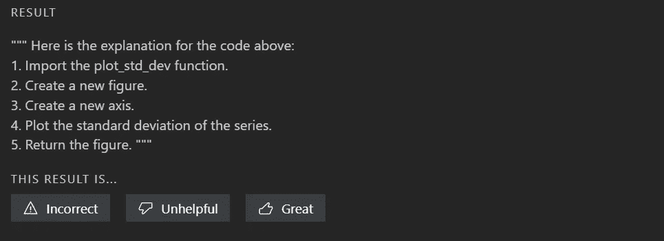

# 试图解释代码如何工作的工具

> 原文：<https://levelup.gitconnected.com/the-tool-that-tries-to-explain-how-your-code-works-39a0a3dcfbd>

Github 继续沿着简化编码的道路前进。Copilot extension 在效率上是一个巨大的变化(至少对我来说)，现在软件工程过程的另一个重要方面将被处理。我说的是文档。

这就是 Copilot 实验室的用武之地。Copilot Labs 是一个工具，可以帮助您或其他人了解您的代码是如何工作的。它为你提供了机器学习生成的解释，就像这样:

最近，我被加入了 Copilot 项目的测试组，所以我决定尝试一下，请它解释一下我以前教程中的一些代码片段。

# 网页抓取

 [## 我如何用一个 python 脚本抓取大量网站

### 代码可配置执行的能力。

levelup.gitconnected.com](/how-i-scrape-lots-of-sites-with-one-python-script-9fba09d5c9be) 

在上面的文章中，我分享了一个带有可配置脚本的知识库链接，它帮助我解析了很多网站，是一个很好的开始模板。人类对代码的主要部分[的解释是它:](https://github.com/destilabs/webtric/blob/main/spider.py)

1.  加载所有配置变量
2.  创建 Selenium 驱动程序
3.  转到目标页面并根据选择器抓取数据
4.  保存数据
5.  退出驱动程序

机器给出的解释并不乐观:

如果我不再试一次，我会是一个糟糕的测试者。Copilot Labs 允许您更改解释的开头，以便您可以稍微引导它。以下是获得更多人类可读描述的一些尝试:

靶心！

# 情节

 [## 金融时间序列图的五个有用的熊猫脚本

### 分享就是关爱，为什么不继续呢？

levelup.gitconnected.com](/five-useful-pandas-scripts-for-financial-time-series-plots-99693c4025b2) 

在上面的文章中，我创建了五个 Python 方法来可视化各种财务数据。虽然在主 Copilot 扩展的帮助下，它已经被很好地记录了，但我想看看实验室能告诉我些什么。

我从最简单的方法开始，即绘制标准差的方法:

这是机器生成的解释:

虽然这看起来不自然，但它非常精确，并解释了该方法的每一步。我想，如果人类能够以这种方式交流——软件开发中的错误和沟通失误就会减少。

尽管如此，这可能是对文章中分享的代码片段的最好解释。更复杂的方法使 Copilot 实验室变得重复，并且它显然不理解该方法的价值——它更多地谈论技术细节。下面是一个函数的例子，[在同一个图形](https://gist.github.com/theDestI/3d5f877b2db9697ad99df69c1d390c88)上绘制两个线图:

# 码头工人

剧本呢？这似乎可以成为 Copilot 实验室的一个好地方。例如，下面是它如何处理一个简单的 Docker 文件:

[https://github.com/destilabs/ethscan/blob/main/Dockerfile](https://github.com/destilabs/ethscan/blob/main/Dockerfile)

在这种特殊情况下，很明显 Labs 扩展不仅仅是翻译代码和学习命令的实际含义。也许，这与那些命令实际上被记录得有多好有关。

# 结论

Copilot Labs 是记录结构化脚本(如 Docker 构建文件)和提供代码片段简要说明的绝佳工具。然而，当涉及到提供大量文档时，它就显得不够了。它仍然有一个用例，因为它提供了一个足够好的解释，如果得到一个相关的开始话语，它可以把你的代码翻译成其他语言。

如果你喜欢这篇文章，一定要订阅这个博客来获取更多类似的文章。