# 学习编码的 15 大网站

> 原文：<https://levelup.gitconnected.com/the-top-15-websites-to-learn-to-code-693cb88a8dd>

## 免费学习如何成为一名程序员

## 这是能让你成为开发者的前 15 个网站

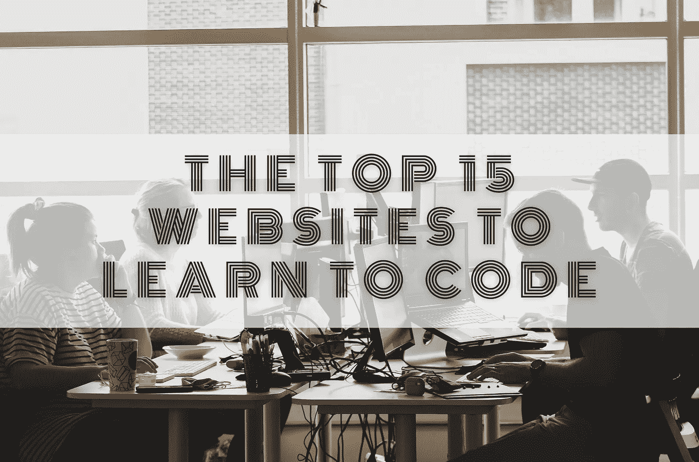

在网上工作时，编码是一项重要的技能，但这不仅仅是新一代必备的技能。拥有编码知识有助于更好地管理网站，但也让你更加独立于开发者。

就像如果你在你的项目中有一个小问题，你没有必要联系开发人员，因为如果你知道一点编码，你可以自己解决问题。

> 如果你正在寻找一份新工作，或者如果你想改变职业生涯，编程可能是一个很好的开始或继续不同道路的方式。

如今学习编码一点也不贵。有很多免费的资源可以利用——从学习编程一门新语言到开始一个基于代码的项目，你可以在网上找到所有这些信息。

在这篇文章中，我们将浏览一些网站，在那里你可以学习如何编码并开始编码。学习编码有许多不同的方法，这些网站提供了不同的学习方法。有些要求你付钱，有些则不要求。所以让我们来看看我们列出的学习编码的 15 大网站。

# 学习编码的 15 大网站

# 1.代码集

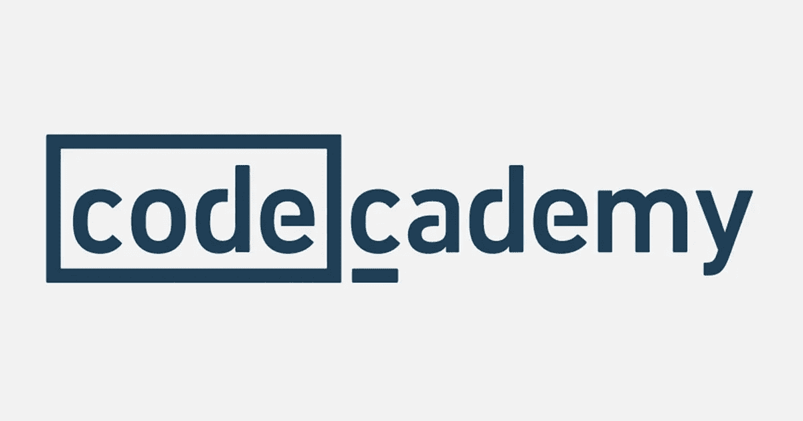

Codecademy 是学习编程语言的绝佳资源。它提供免费课程和付费课程，学生可以根据自己喜欢的语言或对技术领域特定职业的兴趣来选择课程。

如果你不确定从哪里开始，Codecacademy 有一个小测验，可以确定什么样的工作最适合你，以及你应该首先学习什么课程。

面向初学者的入门和中级编程课程都有。免费的编码课程主要教授初学者课程，但是如果你选择参加他们的计划，也有一些中级课程。

除了基础知识，Codecademy 还包括特定的编程语言，如 Go 和 Swift，分别用于制作谷歌应用和苹果应用。这些课程提供了一套解释和指导，以及供学生练习技能的代码编辑器。

你可以选择参加有互动课程和日常练习的免费计划，但仅限于基础课程。或者，如果您有兴趣了解比专业计划更深入的内容，这正是您想要的。你有专业会员专用的内容、高级课程、结业证书，而且每月只需 15.99 美元。

# 2.Coursera

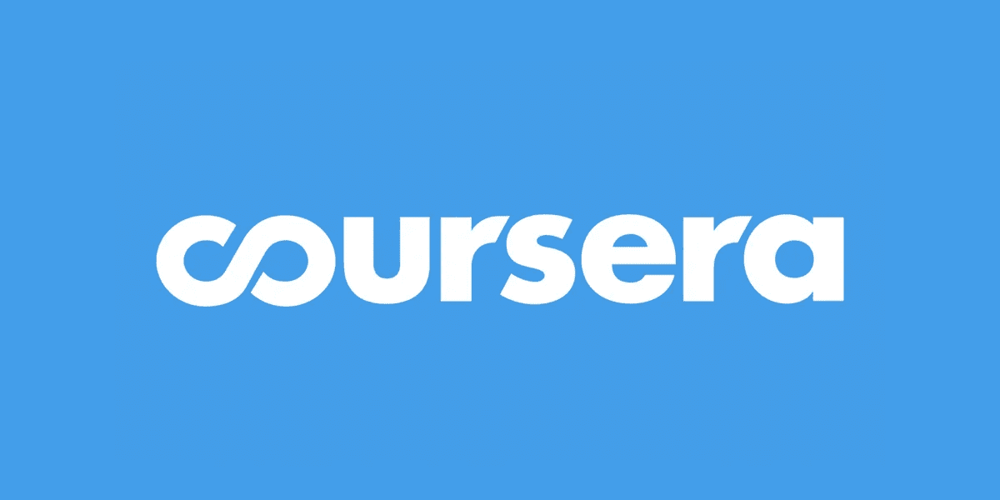

Coursera 是教人们如何编码的最大网站之一。他们提供 100 多门课程，从 Python 到 JavaScript 再到数据科学。每门课程包括讲座、作业、测验和测试。学生可以按照自己的进度学习，他们会收到进度反馈。

平台上有很多免费的课程，但也有一些是需要付费拿证的。付费课程通常每门课程花费 39 美元左右。然而，免费课程通常有一个 7 天的免费试用期，这样你就知道你会得到什么。

学习通常是通过混合视频内容、阅读材料、练习、测验和论坛来完成的。你也可以设定目标，让自己保持动力。

# 3.可汗学院

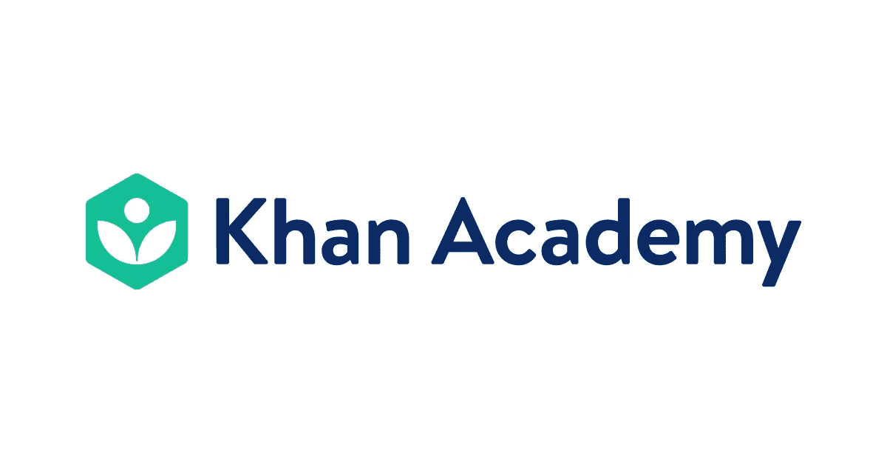

Khan Academy 是一个非营利组织，提供优秀的初学者友好资源，免费教授编码技能。该网站是由萨尔曼·可汗创建的，他想创建一个任何人都可以使用的教育资源。

它提供了与计算机科学和编程相关的各种主题的视频。这些包括从简单的概念如二进制数到复杂的数据结构。

它还提供了 HTML、CSS、Java、Python、Ruby、C++、PHP、Scratch、Logo、Matlab、SQL 等教程。Khan Academy 也有一个小时的代码(HOC ),学生可以通过创建动画、网站或通过 JavaScript 管理数据来学习编码。

教授编程概念的典型方式是通过讲座，然后使用文本编辑器(如 Sublime Text)进行练习。教师讲完后，学生可以使用同一个编辑器练习解决问题。

# 4.乌德米

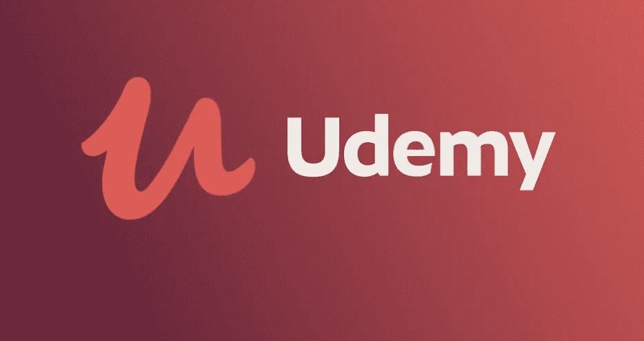

Udemy 为用户提供了世界各地教师讲授的数千门不同课程。它类似于 Coursera，因为它允许其用户免费在线上课。但与 Coursera 不同的是，它更关注真实世界的项目，而不是自定进度的学习。

Udemy 拥有超过 130，000 门在线课程，是你在网上能找到的最好的在线教育门户网站之一。有成千上万的课程可供各种类型的学习者选择，无论他们是初级程序员、高级 web 开发人员，还是希望提高技能的有经验的专业人士。

既然有这么多选择，最好从星级高、反馈多的课程开始。此外，如果老师有相关经验，你最好去找那些以前没有教过网上课程的人。

有了这些免费的在线课程，你可以简单地访问视频，但不能与讲师互动。此外，您无法获得证书或收到他们的任何反馈。

# 5.Code.org

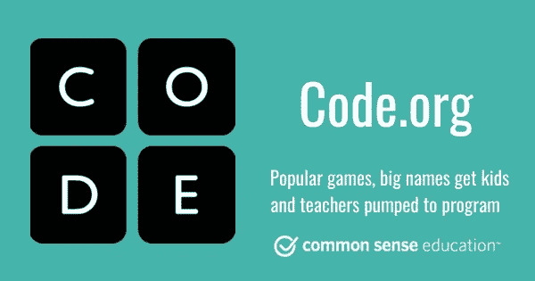

Code.org 是另一个教孩子如何编程的好网站。它由哈迪和阿里·帕托维于 2013 年创建，旨在帮助 6-18 岁的儿童学习计算机科学的基础知识。本网站包含涵盖基本编程概念的课程，如变量、数组、函数和控制流语句。

还包括一些有趣的活动，使这个过程更加有趣。例如，有一个名为“猜我的数字”的游戏，它可以帮助孩子们在玩的同时练习数数。

我们发现课程目录是专门为想学习 Python 编程语言的初级程序员设计的。它是任何年龄和熟练程度的学习者的理想选择。这些课程使用块系统，以便学员可以将块拖入编辑器窗口。

# 6.自由代码营

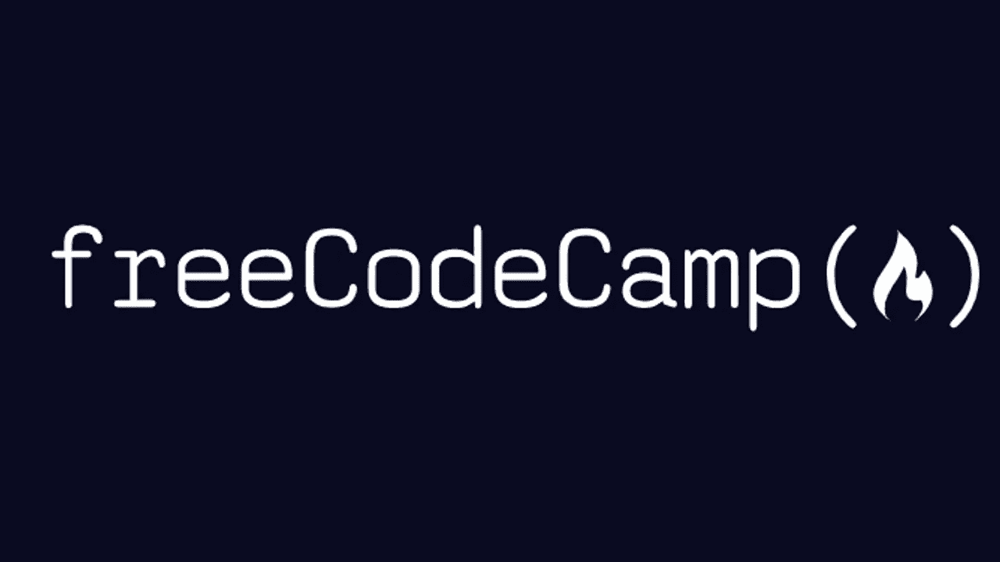

freeCodeCamp 是一个非营利组织，致力于向所有年龄段的人提供计算机科学教育。它的使命是为任何学习计算机科学的人提供免费的开源课程和课外资源，无论性别、种族、宗教、性取向、经济地位、身体能力或先前的知识如何。

该平台采用基于项目的教育方法。每节课都包括一个介绍性的视频、书面材料、测验，然后是一个实际操作的编码作业。学生们被鼓励从事他们自己的项目，并在完成后提交。

FreeCodeCamp 是最受尊敬的在线学习编程平台之一。它有数千名毕业生被包括谷歌、苹果和网飞在内的知名公司聘用。当你注册时，你会得到一系列按难度组织的课程。因此，您可以立即在您所处的水平上学习代码。

# 7.奥丁计划

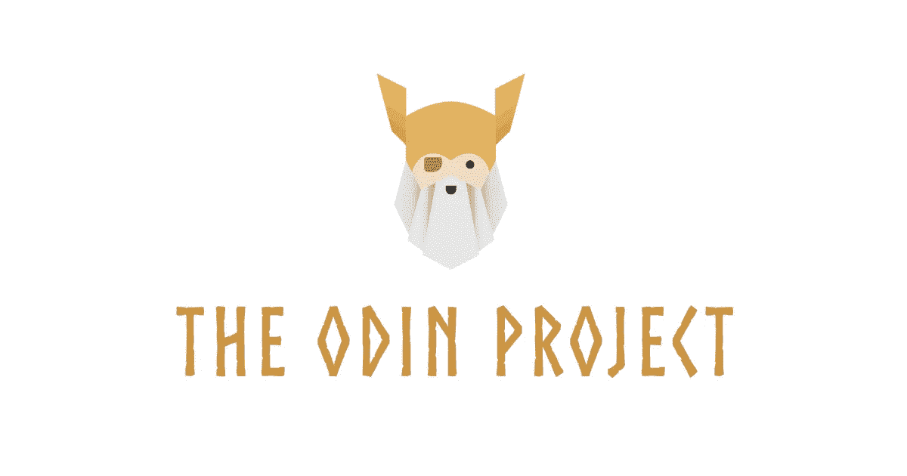

如果你正在寻找一种学习 HTML、CSS、JavaScript 和 PHP 的方法，看看 Odin 项目就知道了。这是一个社区，在这里你可以分享你的创作，并与其他设计师和开发者合作。

Odin 项目通过将所有免费在线资源收集到一个地方，解决了您必须自己发现这些资源的问题。Odin 项目旨在让您在课程结束时成为一名开发人员。

如果你刚刚开始，你可能想利用介绍性编程课程，这将教你一切从零开始。无论你是想学习 HTML、CSS 还是 JavaScript，这个平台都能满足你。

每个部分包括多个作业，允许学生练习材料。然后，成员可以发布他们完成的任务，供其他成员查看和提供反馈。如果在使用该平台时出现任何问题，有一个支持团队可以提供帮助。

# 8.w3 学校

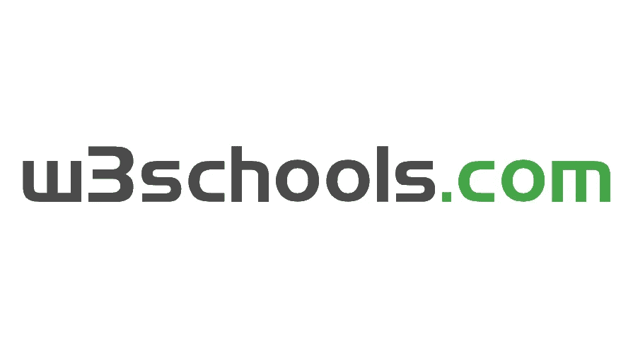

这是我最喜欢的一个平台，在我开始编程生涯的时候，它对我的帮助比其他任何平台都大，所以我强烈建议你去看看它们。W3Schools 提供了大量的教程部分和实践练习，为编程新手提供了很多工具。

它涵盖了从 HTML 到 Python 的 web 开发的各个方面，因此对于想要开发自己的项目的开发人员来说，它也是一本优秀的参考书。即使有人不会说英语，他们也可以学习使用他们最熟悉的语言编写代码，因为这个网站有内置的谷歌翻译。

首先，选择你想学习的编程语言，阅读给定的适当材料。然后，您可以使用该网站来检查编码示例，并查看它们在实时代码编辑器上运行时的样子。

# 9.edX

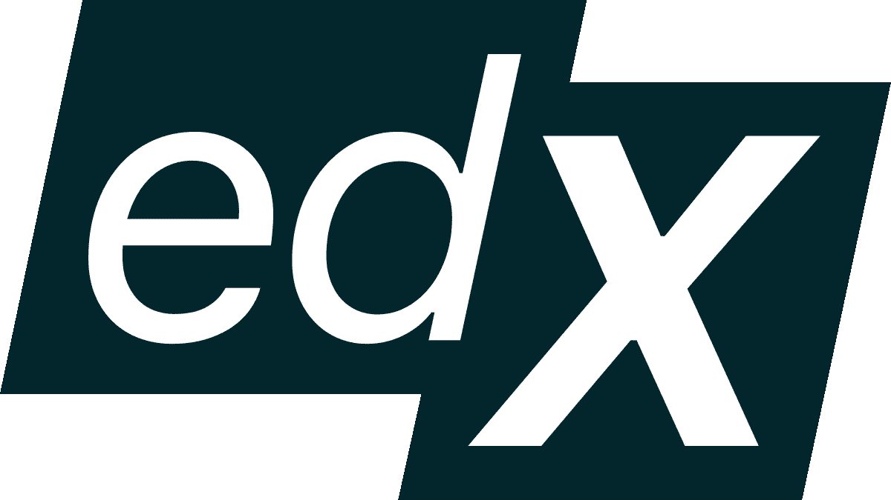

edX 提供 200 多门不同的课程，由世界上一些最好的教授讲授。它们涵盖的主题包括数据科学、计算机视觉、编程语言、人工智能、机器学习等等。

edX 提供许多不同类型的课程，从 MOOCs(大规模开放在线课程)到证书。其中包括:

MOOCs:这些课程通常由大学提供，向世界各地的任何人开放。

证书:这些课程通常针对某些科目，只对通过规定考试的人开放。

你可以参加编程入门课程，它会教你一些基本的编程语言。或者你可以报名参加一个特定主题的项目，比如网页设计或移动应用程序开发，选择权在你。

课程通常附有家庭作业、阅读材料、测验和论坛，供学生们相互交流和与教师交流。免费学生可以免费使用这些资料，直到过期。

# 10.代码战争

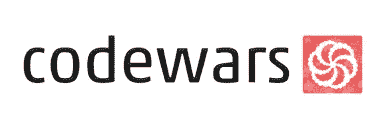

CodeWars 是一个在线平台，程序员可以在这个平台上互相竞争，解决被称为 Kata 的编程挑战。它由一家技术评估公司运营。Codewars 的一个独特之处是它的社区参与——参与者可以相互比较，分析他们的代码，并编写自定义的武士道供其他人练习。

用户从选择一种他们想学的语言开始。然后，他们提交自己的答案进行审核，并被分配一个难度级别。在完成一系列特定难度的挑战后，他们可能会继续下一个挑战。随着他们练习形，任务变得越来越难，直到最后。

这些是你可以学习的一些编程语言；JavaScript，PHP，Java，。NET，Python，Ruby，C#，或者 SQL。

# 11.麻省理工学院开放式课程

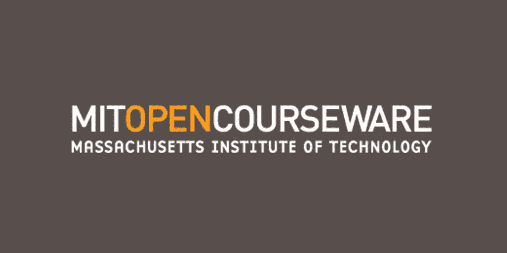

麻省理工学院开放式课程是 YouTube 上数以千计的免费视频讲座的集合。开放式课程网站包含所有麻省理工学院本科生的课程，只要他们有记录。这意味着你不必离开沙发就可以观看麻省理工学院的演讲视频。

初学者可以从入门编程课程开始，在那里他们可以学习开发编程技能的基础知识，包括计算思维和基本语言知识。那些寻找更高级主题的人可以浏览麻省理工学院提供的计算机科学课程列表。

它们包括视频讲座、在线教材(其中一些可能是免费的)、作业、考试和测验。但是他们不提供任何认证项目或学位。

# 12.Sololearn

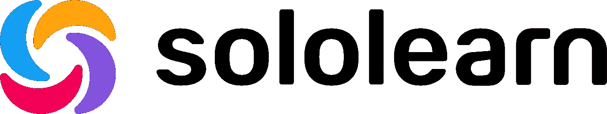

如果你想从事 web 编程、编码和数据分析方面的职业，那么 Sololearn 是你的绝佳资源。它已经帮助数百万人在这些领域开始了他们的职业生涯。Sololearn 专注于小范围的学习。每章只涵盖一个主题，而不是涵盖多个主题。测验和实践测试有助于保留学习者的知识。

学生可以发布他们的代码，让其他人查看和评论。在 Code Playground 页面上，成员可以提交他们一起完成的项目，并从同行那里获得反馈。该网站有一个适用于 iOS 和 Android 设备的应用程序，因此你可以在任何你想去的地方学习编码。你可以从 App Store 或谷歌 Play 商店下载应用程序。

Sololearn 是完全免费的，但如果你想删除广告和访问额外的功能，专业版每月收费 5.83 美元。如果您想在提交之前试用，可以选择获得 14 天的免费试用。

# 13.传授…额外技能

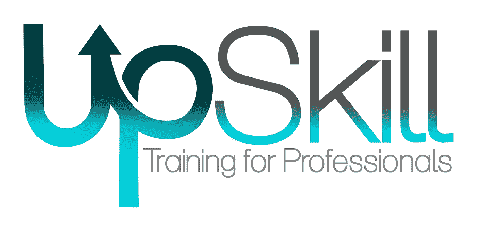

Upskill 是一个面向初学者的免费在线编程平台，使用无术语和简单明了的语言。它的视频涵盖了一些复杂的主题，但使用了简单易懂的语言。

它提供由行业专家讲授的各种课程。你可以参加数据科学、前端开发、后端开发、UX 设计、机器学习、DevOps、区块链、Web 开发等等课程。

每门课程包括课程、测验、家庭作业和项目。学生完成学业后获得证书。还有一个论坛，学生可以就课程内容提出问题。

UpSkill Pro 会员每月仅需 19 美元。有了这个会员资格，学生可以学习 WordPress 主题开发、React 编程和其他 Web 开发技能。还有 30 天退款保证。

# 14.共易

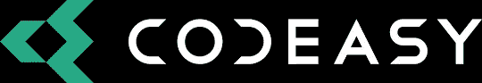

要了解如何使用 C#编程，您可以使用 Codeasy。它是为没有任何编程经验的人设计的。用“冒险故事”的形式来帮助你。

每章都会教你 C#编程的基础。如果你遇到困难或需要帮助，使用提供的提示或在 Slack 频道寻求帮助。

如果你想玩完游戏的所有章节，你需要购买代币。这些对于启用“为我解答”功能也很有用——如果你在某一章卡住了，你可以使用这些令牌跳过它。

# 15.Envato Tuts+

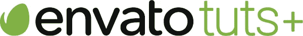

Envato 使其用户能够通过一个名为 ThemeForest 的在线市场创造和销售他们自己的产品。它有超过 29，000 个教程，涵盖了广泛的主题。

有这么多选择，有很多资源可以帮助你学习。您将能够找到流行编程语言的指南，包括 HTML、JavaScript、CSS(级联样式表)、SQL、Python、R 和 TypeScript。

在很大程度上，免费课程是关于 WordPress web 开发的，包括为平台创建插件和学习 PHP。

如果你想充分利用 Envato TUTS+，考虑注册每月 16.50 美元的订阅。您可以访问所有 1，300 多门课程和 120 多种电子书选项。

# 结束语

如果你想学习如何编码，但是不知道从哪里开始，我相信我在这篇文章中提供的资源会对你有很大的帮助。其中一些也帮助了我的写作之旅，所以可以说它们非常有用。

如果你对这篇文章有任何问题，请不要犹豫，在下面留下你的评论，我会尽快回复。此外，如果这是你喜欢阅读的内容类型，订阅我的媒体简讯，这样你就不会错过我未来的任何文章。