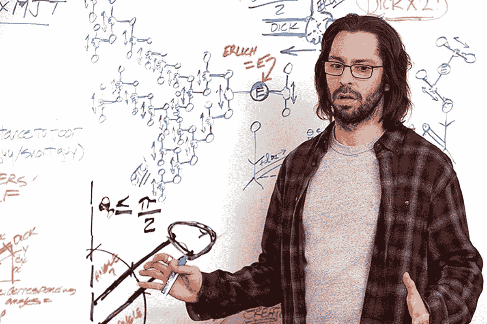
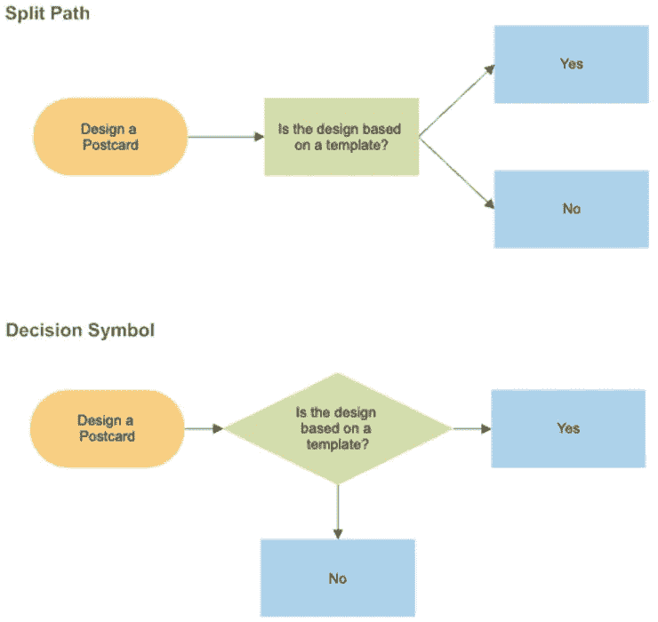

# 高级软件工程师的五大技能

> 原文：<https://levelup.gitconnected.com/the-top-5-skills-of-senior-software-engineers-deadb0bc3bde>

## 你需要提高哪些技能？

提示:不要做这样的人(即使他很搞笑)

我在技术领域呆了六年，其中五年在大学，最近才成为全职软件工程师。然而，在这段时间里，我看到了同学、同事和经理的特质，他们展示了在不断变化的科技世界中“资深”意味着什么。一个高级软件工程师的表面形象类似于“10x 编码员”,他们坐在电脑前全力冲刺开发出一个完整的产品。

**这与事实相去甚远。**

事实上，我知道大学里有许多学生很聪明，但缺乏沟通技巧，也缺乏接受批评的能力，这严重阻碍了他们的发展机会。那些刚从大学毕业就被顶级公司录用或获得高级职位的学生肯定擅长自己的工作，但真正让他们与众不同的是他们与他人合作的能力。

这种趋势在学术界被放大了。那些能够创造出票和功能，却不与人交往的软件工程师很少得到提升。而那些学会分享知识和提升团队的人则处于领导地位。这不是运气的问题，在软件工程中有非常具体和切实的技能，可以让你领导和提升他人，这就是高级的意义所在。

因此，让我们来看看你(和我)成为高级软件工程师所需的技能列表。

***免责声明:*** *我有一个联盟链接列在这篇文章里。该链接通过 bookshop.org 列出，这是亚马逊支持当地书店的替代方案。*

# #1 —所有权

领导者生活中最基本的一个方面是不断拥有的实践。在《极端所有权》一书中，退休的海豹突击队海军军官乔科·威林克详细讲述了他在美国海军海豹突击队队员队 20 多年的经历。在书中，乔科讲述了领导者是一个团队或一个公司能否成功的最终因素的故事。

> “极端所有权的核心是最基本、最重要的真理:没有糟糕的团队，只有糟糕的领导者。”—乔科·威林克

那些实践极端所有权的人的常规做法包括**无论团队是否成功，总是把责任放在自己身上**。这是一个强烈的范式转变，既自由又有约束力，因为当你实践极端所有权时，它不是一个将责任归咎于他人的选项。

如果一个初级工程师不符合一张票据的接受标准，那是因为你作为领导没有花时间解释它并确保它被理解。

如果你的一个队友很难联系上，那是因为你没有明确什么时候有空，以及需要多长时间交流一次。

如果错误的代码进入生产，那是因为你没有花时间去评估代码审查。

> 成为一名高级软件工程师就是要专注于你能控制的事情，并利用这种能力将他人提升到一个更高的水平。

# #2 —沟通

是的，在任何一篇告诉你如何在职业生涯中脱颖而出的文章中，都要抓住最被夸大的技能点。但是如果到处都列出了这一点，你为什么不不断地尝试改进它呢？**随着公司转向完全远程办公，技术领域正在发生根本性的变化**。为了成为一名高级工程师，现在比以往任何时候都更需要磨练你的沟通技巧。

提高你沟通技巧的第一步是**保持你的写作清晰简洁**。通过文本向他人表达你的想法会非常困难——尤其是在工程背景下。你可以通过 slack 这样的渠道积极地进行沟通，但在传达信息时要问:“这有意义吗？”或者，“有没有更好的表达方式？”。你的队友应该乐于提供反馈，因为这会让每个人的生活更轻松。

> 你甚至可以做我现在正在做的事情——开一个博客，这样你就可以提高你的沟通技巧！

改善沟通的另一个技巧是**过度沟通**。你显然不想给你的同事发垃圾邮件，但是你应该总是倾向于过度解释而不是遗漏细节。这里有一个例子:

嘿，我推了我的修改来修复那个 bug。让我知道你的想法。

**VS:**

早上好，我解决了看不到为什么项目 A 中的一个测试一直失败的问题。我将错误返回类型添加到我们的方法中，以便我们可以更容易地调试，并且发现我们没有产生足够的通道来等待我们的 go 例程。如果你有任何建议，这是我的合并请求的链接。

> 提高你的沟通能力是那些能够领导团队的人的关键品质。

# # 3——消除你的自负

没人，我是说没人想和吉尔福伊尔这样的人一起工作。10 倍编码者可以自己解决任何问题的想法被完全高估了。像这样的工程师离开公司的那一刻，很可能会有巨大的知识缺口，因为其他工程师试图找出“不需要任何测试”的代码。

相反，一个伟大的领导者总是能够谦虚地向他人学习。如果你的一个队友告诉你，有一个新的测试框架，它可以做所有你喜欢的定制测试，但以一种标准化和可重用的方式，*不要为你的代码辩护，而是感谢你的队友让团队变得更好*。**这不是关于你的代码，而是关于团队的代码。**

来自 xkcd

说真的，如果你找到了让同事的代码更好的方法，**请在代码评审中发表评论！简单地抱怨对任何人都没有好处。如果你想成为一名高级工程师，让你的队友感觉他们在学习，而不是像他们是哑巴。**

# # 4——学习如何编写出色的文档

听过这句话吗，“代码应该是自文档化的”？这并不完全错误，但也远远不是正确的。你应该总是试着写干净简洁的代码，但是偶尔你会需要留下注释。您还需要记录如何使用新的 API。如果你的新产品没有任何架构文档，看看当需求改变时，你能走多远。

有很多方法可以提高你的文档技能，特别是如果你使用像吉拉这样的软件来跟踪票据或者用 Confluence 来创建程序流程图。研究您自己团队中的高级工程师如何记录他们的架构可以让您学习最佳实践。

此外，如果您想要创建定义更好的票证，您需要关注“谁-什么-为什么-何时-如何”等等。您应该问自己的常见问题，然后在您的票证文档中回答，我们为什么需要此更改？这些变化会发生在哪些项目上？产生这种变化的高级技术步骤是什么？

**创建更好的流程图也很重要。一个快速的技巧是在逻辑中从左向右移动的同时分割流程图的路径。与没有明显路径的决策符号相比，这种方法创建的图表更容易理解。**

您可以在此阅读更多流程图提示:

 [## 改善流程图的五个技巧

### 良好的流程图设计范例在当今世界的实践中，流程图通常用于改善业务…

www.smartdraw.com](https://www.smartdraw.com/flowchart/flowchart-tips.htm) 

# #5 —软件开发原则

很明显，如果你想成为一名高级软件工程师，你必须了解你的东西。高级工程师不一定是编码奇才，但是他们需要全面掌握自己的技能。以下是想成为高级工程师需要学习的一些技术要点:

*   测试—谢天谢地，这已经成为标准。事实上，如果你在一次工作面试中发现这家公司不做测试，你应该把这当成一个危险信号。测试允许你编写出你所期望的代码，它是自我记录的，它允许你扩展你的代码而不用担心你会破坏某些东西。
*   **设计图案**——这是我个人的最爱。设计模式为您提供了一个基础结构来处理满足业务需求的特定行为。你在创建一个社交媒体平台吗？观察者模式可能是一个好的开始。想创建一个防错 UI？使用有限状态机。我在 Go 中写了很多关于设计模式的文章，它们是成为一名更有能力的软件工程师的直接方法。
*   **框架**——如果你正在编写的代码做的似乎是一项普通的任务，那么很可能就有一个适合它的框架。重要的是一名高级工程师**了解最新的框架**,以便知道是否有框架被弃用，或者是否有比你已经在使用的更好的解决方案。

这篇文章是高层次的，但是这些原则的细节并不重要，因为它们会不断变化。作为一名高级软件工程师有太多的事情要做，但归根结底，这真的取决于你是否有能力成为一名自学者、拥有自主权并始终关注团队的进步。我合作过的最优秀的程序员总是乐于分享知识，让我变得更好，从而在这个过程中让自己和团队整体变得更好。

我希望你喜欢阅读这篇文章，并能够找到它的帮助。你认为怎样才能成为一名高级软件工程师？如果你有任何想法，我鼓励你在下面留下评论。感谢阅读！

# 分级编码

感谢您成为我们社区的一员！ [**订阅我们的 YouTube 频道**](https://www.youtube.com/channel/UC3v9kBR_ab4UHXXdknz8Fbg?sub_confirmation=1) 或者加入 [**Skilled.dev 编码面试课程**](https://skilled.dev/) 。

 [## 编写面试问题+获得开发工作

### 掌握编码面试的过程

技术开发](https://skilled.dev)