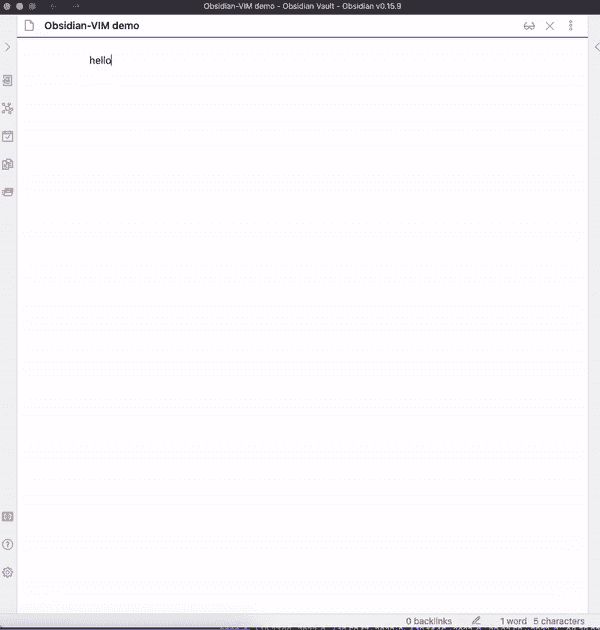

# 我在 PKM 使用黑曜石的首要原因是——释放 Vim 的力量

> 原文：<https://levelup.gitconnected.com/the-top-one-reason-that-i-use-obsidian-for-pkm-unlocking-the-power-of-vim-bb314f20818e>

## 释放 Vim 在黑曜石中的功能，并将其集成到一个高效的笔记系统或个人知识管理(PKM)系统中。


图片由作者使用 Canva。

作为一名软件开发人员，我最终在上个月将我所有的编码工作流程从 VS Code 转移到了 Vim。此外，作为一名科技作家，我开始更加努力地写作。为了方便我的写作工作，我需要建立一个高效的笔记系统。幸运的是，Obsidian 拥有我所需要的——用户友好的 Vim 模式支持。

# 为什么要费心用 Vim 做笔记？

Vim 带来的惊人速度帮助我保持在创作流中。当我在写初稿时，我唯一需要做的事情就是把我的想法打出来，勾勒出我正在写的故事。当我在写作过程中，尤其是在我的博客文章的编辑阶段，我不会费心把我的数字从键盘上拿下来，用鼠标来完成额外的步骤，并把我的注意力再次转移到键盘上。我需要整合这个流畅的流程——从我脑海中的想法到笔记，再到我需要建立的笔记系统。

到目前为止，你可能想知道为什么只使用终端，因为我在我的编码项目中使用它。为什么要用笔记应用呢？嗯，重点是我需要建立一个笔记系统，需要额外的味道，如内容规划，状态跟踪，知识研究等。

我曾经在观念中记笔记，但是观念中枯燥的记笔记过程耗尽了我的精力([作为一名软件开发人员，我从观念转向黑曜石的三大原因](https://amy-juan-li.medium.com/why-i-use-obsidian-for-note-taking-making-system-as-a-tech-writer-e208699e0011))。而且我对 Obsidian 内置的 Vim 模式感到惊讶，更不用说其他很酷的功能，比如离线模式和 markdown 编辑器等。所以，在这篇文章中，如果你还没有尝试过，我想带你了解一下在黑曜石中释放 Vim 力量的过程。

# 利用黑曜石提供的 Vim 模式

之前说过，黑曜石内置了 Vim 支持(可以说是一种 Vim 模式)。所以你可以在 Vim 模式下完美的使用 Obsidian，不需要任何额外的插件进行配置。你只需要在你的黑曜石设置中打开 Vim 支持:设置->编辑器->打开“Vim 键绑定”。


由[李冠仪](https://medium.com/u/9f2dc23bfffa?source=post_page-----bb314f20818e--------------------------------)

现在，我们可以在我们的黑曜石笔记中使用 Vim 命令:



使用黑曜石在 Vim 模式下写笔记。GIF 作者[李冠仪](https://medium.com/u/9f2dc23bfffa?source=post_page-----bb314f20818e--------------------------------)

如果您对学习 Vim 感兴趣，请查看我以前的文章，其中阐述了 Vim 的主要概念:

[](/level-up-your-productivity-with-vim-acfa27afb15a) [## 使用 Vim 提高您的工作效率

### 抓紧 Vim 语法规则，开始你的旅程。

levelup.gitconnected.com](/level-up-your-productivity-with-vim-acfa27afb15a) 

## 黑曜石的 Vim 模式仅提供有限的 Vim 功能

在黑曜石的默认 Vim 模式中，有一些缺失但非常有用的 Vim 命令。例如，我希望有类似的 Vim 键映射来使用`Crtl+o`(向后)和`Ctrl+i`(向前)导航不同的缓冲区，使用`za`切换 Markdown 编辑器中的折叠特性，等等。

从我的终端演示这些 Vim 键映射:


从终端演示一些 Vim 命令——浏览缓冲区、分割窗口等。GIF 由[李冠仪](https://medium.com/u/9f2dc23bfffa?source=post_page-----bb314f20818e--------------------------------)

在下一节中，我们将通过一个为黑曜石构建的社区插件来添加这些很酷的 Vim 键绑定— *黑曜石 Vimrc 支持插件*。

# 使用黑曜石 Vimrc 支持插件来解锁更多的 Vim 的能力

> Obsidian Vimrc 支持插件是 Obsidian.md 笔记软件的一个插件。对于 Obsidian.md Vim 模式的用户来说，这对于保持各种设置(尤其是键映射)非常有用。— [黑曜石 Vimrc 支持插件](https://github.com/esm7/obsidian-vimrc-support)

## 步骤 1:安装并启用插件

设置>社区插件->安装并启用“Vimrc 支持”


[李冠仪](https://medium.com/u/9f2dc23bfffa?source=post_page-----bb314f20818e--------------------------------)截图

## 步骤 2:为特定的 Obsidian Vault 创建 Vimrc 配置文件

这个插件从`VAULT_ROOT/.obsidian.vimrc`加载一个 Vim 命令文件。这是我们将放入我们最喜欢的 Vim 键映射的文件。所以获得插件能力的第一步是在你的根目录下创建一个`.obsidian.vimrc`。

1.  导航到你的黑曜石金库的根目录

打开你的终端，进入你的黑曜石金库所在的目录。如果您有多个存储库，请选择您想要使 Vimrc 配置生效的存储库。

2.创建并保存`.obsidian.vimrc`

运行命令`vim .obsidian.vimrc`创建点文件，不要忘记在正常模式下执行`:w`保存。

3.我们将在下面的步骤中向该文件添加键绑定(**步骤 3** )。

**演示上述过程:**


找到您的 Obsidian Vault 的根目录，从终端使用 Vim 创建一个名为 `*.obsidian.virmc*`的点文件，并首先保存这个空文件。GIF 由[李冠仪](https://medium.com/u/9f2dc23bfffa?source=post_page-----bb314f20818e--------------------------------)

## 步骤 3:配置 Vim 键映射以匹配 Obsidian 命令

让我们首先从开发人员控制台检查一下 Obsidian 命令。

为了更好地理解我们希望将哪些命令映射到 Vim 键绑定，我们可以先看看 Obsidian 命令是如何工作的。要查看黑曜石命令列表，只需从黑曜石应用中键入`:obcommand`，你就会在开发者控制台中看到它们(Windows 的`*Ctrl+Shift+I*`和 Mac 的`*Option+Cmd+I*` )。

**演示如何从黑曜石开发者控制台显示黑曜石命令列表:**


通过运行:obcommand from Obsidian app，从 Obsidian 开发者控制台打开一个 Obsidian 命令列表。GIF 作者[李冠仪](https://medium.com/u/9f2dc23bfffa?source=post_page-----bb314f20818e--------------------------------)

这里是黑曜石命令的列表:


通过运行:obcommand，在黑曜石开发人员控制台中显示黑曜石命令列表。[李冠仪截图](https://medium.com/u/9f2dc23bfffa?source=post_page-----bb314f20818e--------------------------------)

我们可以通过运行你的黑曜石应用程序中的`:obcommand <command name>`来快速计算出命令是什么。一些例子:

```
:obcommand app:go-back
:obcommand app:go-forward

:obcommand editor:toggle-fold
:obcommand editor:fold-all
:obcommand editor:unfold-all
```

**不太喜欢记住复杂的命令和快捷键**

是的，您可以通过运行`:obcommand <command name>`或设置特定命令的热键来执行各种操作。但是，作为一个 Vim 用户，我喜欢为 Obsidian 应用程序重用 Vim 键绑定。记住特定应用程序的复杂热键不是一个好主意，因为它不可跨平台和应用程序转移。因此，让我们在上面创建的`.obsidian.vimrc`文件中创建一些 Vim 键绑定。

*   浏览 Vim 缓冲区(打开的文件)

```
" Go back and forward with Ctrl+O and Ctrl+I
" (make sure to remove default Obsidian shortcuts for these to work)
example back obcommand app:go-back
nmap <C-o> :back
exmap forward obcommand app:go-forward
nmap <C-i> :forward
```

*   切换减价文件中的折叠动作

```
exmap togglefold obcommand editor:toggle-fold
nmap za :togglefold

exmap unfoldall obcommand editor:unfold-all
nmap zR :unfoldall

exmap foldall obcommand editor:fold-all
nmap zM :foldall
```

**演示黑曜石内部的上述按键:**


用黑曜石 Vimrc 支持插件演示 Vim 的功能。GIF 作者[李冠仪](https://medium.com/u/9f2dc23bfffa?source=post_page-----bb314f20818e--------------------------------)

*提示:一旦你对* `*.obsidian.vimrc*` *文件做了一些修改，不要忘记重启黑曜石应用程序。*

按照上面的例子，您可以为自己的目的创建其他 Vim 键绑定。

# 包裹

Vim 不仅是软件开发人员(程序员)的强大工具，它的强大和有用性也在纯文本编辑器中得到了体现。幸运的是，黑曜石提供的 Vim 模式支持 Vim 的一些有限功能。为了释放 Vim 的真正力量，我们只需要利用黑曜石 Vimrc 插件。通过这种方式，Vim 用户在使用黑曜石书写笔记时会有宾至如归的感觉。

祝你过得愉快！

对于那些喜欢视频的人，请从我的 YouTube 频道查看这个视频([https://youtube.com/@amyjuanli](https://youtube.com/@amyjuanli)):

[https://www.youtube.com/watch?v=sHVurWxUHGQ](https://www.youtube.com/watch?v=sHVurWxUHGQ)

[](https://medium.com/@amy-juan-li/membership)**如果你想在 Medium 上阅读来自* [*李冠仪*](https://medium.com/u/9f2dc23bfffa?source=post_page-----bb314f20818e--------------------------------) *以及成千上万其他作家的每一个故事，那就考虑成为 Medium 会员吧。每月 5 美元，你可以无限制地访问媒体内容。如果你* [*通过我的推荐链接*](https://medium.com/@amy-juan-li/membership) *报名，我会得到一点佣金。**

*[](https://medium.com/@amy-juan-li/membership) [## 通过我的推荐链接-李冠仪加入媒体

### 阅读李冠仪的每一个故事(以及媒体上成千上万的其他作家)。你的会员费直接支持李冠仪…

medium.com](https://medium.com/@amy-juan-li/membership)* 

# *你可能也会喜欢*

*[](/why-i-use-obsidian-for-note-taking-making-system-as-a-tech-writer-e208699e0011) [## 作为一名软件开发人员，我从观念转向黑曜石的三大原因

### 使用 VIM 快速输入，使用 Markdown 有效格式化笔记。

levelup.gitconnected.com](/why-i-use-obsidian-for-note-taking-making-system-as-a-tech-writer-e208699e0011) [](/level-up-your-productivity-with-vim-acfa27afb15a) [## 使用 Vim 提高您的工作效率

### 抓紧 Vim 语法规则，开始你的旅程。

levelup.gitconnected.com](/level-up-your-productivity-with-vim-acfa27afb15a)*