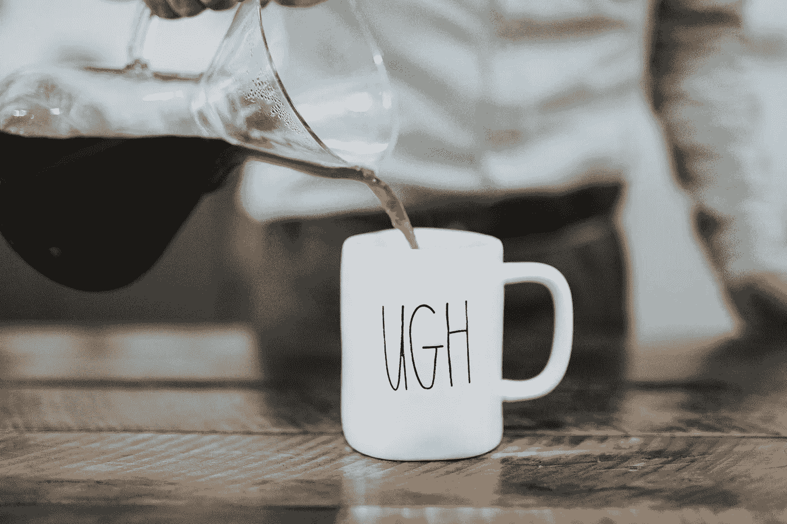
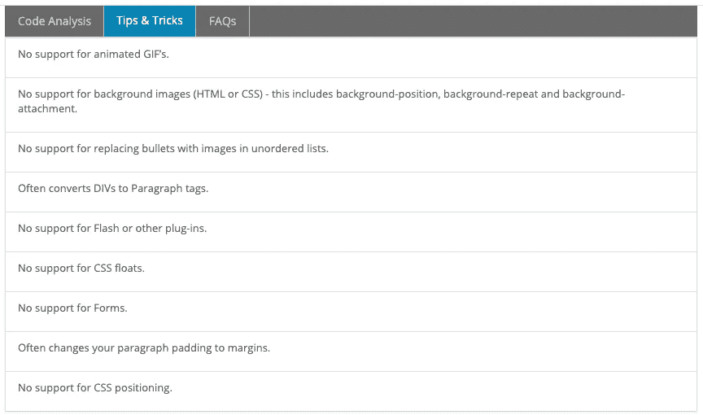

# HTML 时事通讯的考验和磨难

> 原文：<https://levelup.gitconnected.com/the-trials-and-tribulations-of-html-newsletters-92bb5736ec8b>

## 时事通讯是我生存的克星。幸运的是，我们在 Hanely Wood 的团队不再需要研究它们了。以下是我们在管理 HTML 时事通讯设计时学到的一些趣闻。



由[内森·杜姆劳](https://unsplash.com/@nate_dumlao)在 [Unsplash](https://unsplash.com) 拍摄的照片

# 时事通讯测试

时事通讯是保持联系并向订户提供有用和有趣信息的好方法。但是你不想在没有检查它是否在所有设备上都好看的情况下发布你的时事通讯。

测试时事通讯 HTML 是创建电子邮件网页友好版本过程中的重要一步。仅仅在网络浏览器中查看`.html`文件是不够的。

要测试您的简讯并验证它们在当今最流行的电子邮件客户端上是否正确显示，您应该使用电子邮件测试工具。您可以使用下面的工具来测试您的 HTML 新闻稿在不同设备、浏览器和电子邮件客户端上的外观。

## **邮件上酸**

在过去的几年里，我们依靠 Acid 上的[电子邮件来测试我们的时事通讯。](https://www.emailonacid.com/)

**这是我们喜欢它的地方:**

**电子邮件客户端的众多选项** Acid 上的电子邮件允许您使用不同浏览器上的多个电子邮件客户端、不同操作系统上的桌面电子邮件客户端以及不同设备上的移动电子邮件客户端进行测试。你会惊讶(和沮丧)地发现，在相同的电子邮件客户端，但是在不同的操作系统上，你的时事通讯看起来是多么的不同。

**移动模拟器** 浏览器和桌面测试仅提供截图，但是，移动测试可以在移动模拟器中查看，允许您与您的时事通讯进行交互。这有助于确定您的新闻稿在移动设备上的可用性。

**提示和技巧**
此功能对于解决您的简讯问题非常有用。也许你不能使用浮动或者你嵌入的 CSS 被剥离了。以下是 Windows 7 上 Outlook 2010 的提示和技巧部分的示例:



在 Windows 7 上测试 Outlook 2010 的提示和技巧部分

从这里开始将帮助您节省修复新闻稿问题的时间。

**分享结果**
Acid 上的 Email 可以让你分享你的测试结果，这对于和没有账号的人分享很有用。我们用这个来与我们的利益相关者分享，这样他们可以自己看一看，以防我们在 QA 过程中遗漏了什么。

## 石蕊

Acid 上的电子邮件的一个缺点是，截屏并不总是准确地表示时事通讯在特定客户上的样子。有时候，我们会被提醒我们的时事通讯存在视觉问题，但这个问题并没有出现在 EOA 测试中，而是出现在给定操作系统的实际电子邮件客户端上。为了重现这些问题，我们将使用 [Litmus Putsmail](https://putsmail.com/) 向我们的一个电子邮件地址发送一封测试邮件，然后在有问题的操作系统上的电子邮件客户端中打开它(通常使用某种类型的 VM 软件，如 Parallels)。

除了 Putsmail，Litmus 还有一套电子邮件测试功能，可以与 Acid 上的电子邮件相媲美。我自己没有用过 Litmus，但是你可以去 https://litmus.com/的[看看它是否是你更好的选择。](https://litmus.com/)

# 技巧

## 使用样板文件

不要从头开始。使用样板文件，因为它很可能以这样的方式实现，每个电子邮件客户端特有的怪癖已经为你解决了。我们使用了 Emailology.org 的样板文件，并在那里进行了定制。虽然电子邮件学已经不存在了，但我已经能够在 https://gist.github.com/cemerson/4495931[找到样板文件的要点。](https://gist.github.com/cemerson/4495931)

我复制了下面的 HTML，以防要点 URL 也从互联网上消失:

```
<!-- ***************************************************
********************************************************HOW TO USE: Use these code examples as a guideline for formatting your HTML email. You may want to create your own template based on these snippets or just pick and choose the ones that fix your specific rendering issue(s). There are two main areas in the template: 1\. The header (head) area of the document. You will find global styles, where indicated, to move inline. 2\. The body section contains more specific fixes and guidance to use where needed in your design.DO NOT COPY OVER COMMENTS AND INSTRUCTIONS WITH THE CODE to your message or risk spam box banishment :).It is important to note that sometimes the styles in the header area should not be or don't need to be brought inline. Those instances will be marked accordingly in the comments.********************************************************
**************************************************** --><!-- Using the xHTML doctype is a good practice when sending HTML email. While not the only doctype you can use, it seems to have the least inconsistencies. For more information on which one may work best for you, check out the resources below.UPDATED: Now using xHTML strict based on the fact that gmail and hotmail uses it.  Find out more about that, and another great boilerplate, here: [http://www.emailology.org/#1](http://www.emailology.org/#1)More info/Reference on doctypes in email:
Campaign Monitor - [http://www.campaignmonitor.com/blog/post/3317/correct-doctype-to-use-in-html-email/](http://www.campaignmonitor.com/blog/post/3317/correct-doctype-to-use-in-html-email/)
Email on Acid - [http://www.emailonacid.com/blog/details/C18/doctype_-_the_black_sheep_of_html_email_design](http://www.emailonacid.com/blog/details/C18/doctype_-_the_black_sheep_of_html_email_design)
--><!DOCTYPE html PUBLIC "-//W3C//DTD XHTML 1.0 Strict//EN" "[http://www.w3.org/TR/xhtml1/DTD/xhtml1-strict.dtd](http://www.w3.org/TR/xhtml1/DTD/xhtml1-strict.dtd)"><html ae kv" href="http://www.w3.org/1999/xhtml" rel="noopener ugc nofollow" target="_blank">http://www.w3.org/1999/xhtml">
<head>
 <meta http-equiv="Content-Type" content="text/html; charset=utf-8" />
 <meta name="viewport" content="width=device-width, initial-scale=1.0"/>
 <title>Your Message Subject or Title</title>
 <style type="text/css">/***********
  Originally based on The MailChimp Reset from Fabio Carneiro, MailChimp User Experience Design
  More info and templates on Github: [https://github.com/mailchimp/Email-Blueprints](https://github.com/mailchimp/Email-Blueprints)
  [http://www.mailchimp.com](http://www.mailchimp.com) &amp; [http://www.fabio-carneiro.com](http://www.fabio-carneiro.com)INLINE: Yes.
  ***********/
  /* Client-specific Styles */
  #outlook a {padding:0;} /* Force Outlook to provide a "view in browser" menu link. */
  body{width:100% !important; -webkit-text-size-adjust:100%; -ms-text-size-adjust:100%; margin:0; padding:0;}
  /* Prevent Webkit and Windows Mobile platforms from changing default font sizes, while not breaking desktop design. */
  .ExternalClass {width:100%;} /* Force Hotmail to display emails at full width */
  .ExternalClass, .ExternalClass p, .ExternalClass span, .ExternalClass font, .ExternalClass td, .ExternalClass div {line-height: 100%;} /* Force Hotmail to display normal line spacing.  More on that: [http://www.emailonacid.com/forum/viewthread/43/](http://www.emailonacid.com/forum/viewthread/43/) */
  #backgroundTable {margin:0; padding:0; width:100% !important; line-height: 100% !important;}
  /* End reset *//* Some sensible defaults for images
  1\. "-ms-interpolation-mode: bicubic" works to help ie properly resize images in IE. (if you are resizing them using the width and height attributes)
  2\. "border:none" removes border when linking images.
  3\. Updated the common Gmail/Hotmail image display fix: Gmail and Hotmail unwantedly adds in an extra space below images when using non IE browsers. You may not always want all of your images to be block elements. Apply the "image_fix" class to any image you need to fix.Bring inline: Yes.
  */
  img {outline:none; text-decoration:none; -ms-interpolation-mode: bicubic;}
  a img {border:none;}
  .image_fix {display:block;}/** Yahoo paragraph fix: removes the proper spacing or the paragraph (p) tag. To correct we set the top/bottom margin to 1em in the head of the document. Simple fix with little effect on other styling. NOTE: It is also common to use two breaks instead of the paragraph tag but I think this way is cleaner and more semantic. NOTE: This example recommends 1em. More info on setting web defaults: [http://www.w3.org/TR/CSS21/sample.html](http://www.w3.org/TR/CSS21/sample.html) or [http://meiert.com/en/blog/20070922/user-agent-style-sheets/](http://meiert.com/en/blog/20070922/user-agent-style-sheets/)Bring inline: Yes.
  **/
  p {margin: 1em 0;}/** Hotmail header color reset: Hotmail replaces your header color styles with a green color on H2, H3, H4, H5, and H6 tags. In this example, the color is reset to black for a non-linked header, blue for a linked header, red for an active header (limited support), and purple for a visited header (limited support).  Replace with your choice of color. The !important is really what is overriding Hotmail's styling. Hotmail also sets the H1 and H2 tags to the same size.Bring inline: Yes.
  **/
  h1, h2, h3, h4, h5, h6 {color: black !important;}h1 a, h2 a, h3 a, h4 a, h5 a, h6 a {color: blue !important;}h1 a:active, h2 a:active,  h3 a:active, h4 a:active, h5 a:active, h6 a:active {
   color: red !important; /* Preferably not the same color as the normal header link color.  There is limited support for psuedo classes in email clients, this was added just for good measure. */
   }h1 a:visited, h2 a:visited,  h3 a:visited, h4 a:visited, h5 a:visited, h6 a:visited {
   color: purple !important; /* Preferably not the same color as the normal header link color. There is limited support for psuedo classes in email clients, this was added just for good measure. */
  }/** Outlook 07, 10 Padding issue: These "newer" versions of Outlook add some padding around table cells potentially throwing off your perfectly pixeled table.  The issue can cause added space and also throw off borders completely.  Use this fix in your header or inline to safely fix your table woes.More info: [http://www.ianhoar.com/2008/04/29/outlook-2007-borders-and-1px-padding-on-table-cells/](http://www.ianhoar.com/2008/04/29/outlook-2007-borders-and-1px-padding-on-table-cells/)
  [http://www.campaignmonitor.com/blog/post/3392/1px-borders-padding-on-table-cells-in-outlook-07/](http://www.campaignmonitor.com/blog/post/3392/1px-borders-padding-on-table-cells-in-outlook-07/)H/T [@edmelly](http://twitter.com/edmelly)Bring inline: No.
  **/
  table td {border-collapse: collapse;}/** Remove spacing around Outlook 07, 10 tablesMore info : [http://www.campaignmonitor.com/blog/post/3694/removing-spacing-from-around-tables-in-outlook-2007-and-2010/](http://www.campaignmonitor.com/blog/post/3694/removing-spacing-from-around-tables-in-outlook-2007-and-2010/)Bring inline: Yes
    **/
    table { border-collapse:collapse; mso-table-lspace:0pt; mso-table-rspace:0pt; }/* Styling your links has become much simpler with the new Yahoo.  In fact, it falls in line with the main credo of styling in email, bring your styles inline.  Your link colors will be uniform across clients when brought inline.Bring inline: Yes. */
  a {color: orange;}/* Or to go the gold star route...
  a:link { color: orange; }
  a:visited { color: blue; }
  a:hover { color: green; }
  *//***************************************************
  ****************************************************
  MOBILE TARGETINGUse [@media](http://twitter.com/media) queries with care.  You should not bring these styles inline -- so it's recommended to apply them AFTER you bring the other stlying inline.Note: test carefully with Yahoo.
  Note 2: Don't bring anything below this line inline.
  ****************************************************
  ***************************************************//* NOTE: To properly use [@media](http://twitter.com/media) queries and play nice with yahoo mail, use attribute selectors in place of class, id declarations.
  table[class=classname]
  Read more: [http://www.campaignmonitor.com/blog/post/3457/media-query-issues-in-yahoo-mail-mobile-email/](http://www.campaignmonitor.com/blog/post/3457/media-query-issues-in-yahoo-mail-mobile-email/)
  */
  [@media](http://twitter.com/media) only screen and (max-device-width: 480px) {/* A nice and clean way to target phone numbers you want clickable and avoid a mobile phone from linking other numbers that look like, but are not phone numbers.  Use these two blocks of code to "unstyle" any numbers that may be linked.  The second block gives you a class to apply with a span tag to the numbers you would like linked and styled.Inspired by Campaign Monitor's article on using phone numbers in email: [http://www.campaignmonitor.com/blog/post/3571/using-phone-numbers-in-html-email/](http://www.campaignmonitor.com/blog/post/3571/using-phone-numbers-in-html-email/).Step 1 (Step 2: line 224)
   */
   a[href^="tel"], a[href^="sms"] {
      text-decoration: none;
      color: black; /* or whatever your want */
      pointer-events: none;
      cursor: default;
     }.mobile_link a[href^="tel"], .mobile_link a[href^="sms"] {
      text-decoration: default;
      color: orange !important; /* or whatever your want */
      pointer-events: auto;
      cursor: default;
     }
  }/* More Specific Targeting */[@media](http://twitter.com/media) only screen and (min-device-width: 768px) and (max-device-width: 1024px) {
   /* You guessed it, ipad (tablets, smaller screens, etc) *//* Step 1a: Repeating for the iPad */
   a[href^="tel"], a[href^="sms"] {
      text-decoration: none;
      color: blue; /* or whatever your want */
      pointer-events: none;
      cursor: default;
     }.mobile_link a[href^="tel"], .mobile_link a[href^="sms"] {
      text-decoration: default;
      color: orange !important;
      pointer-events: auto;
      cursor: default;
     }
  }[@media](http://twitter.com/media) only screen and (-webkit-min-device-pixel-ratio: 2) {
   /* Put your iPhone 4g styles in here */
  }/* Following Android targeting from:
  [http://developer.android.com/guide/webapps/targeting.html](http://developer.android.com/guide/webapps/targeting.html)
  [http://pugetworks.com/2011/04/css-media-queries-for-targeting-different-mobile-devices/](http://pugetworks.com/2011/04/css-media-queries-for-targeting-different-mobile-devices/)  */
  [@media](http://twitter.com/media) only screen and (-webkit-device-pixel-ratio:.75){
   /* Put CSS for low density (ldpi) Android layouts in here */
  }
  [@media](http://twitter.com/media) only screen and (-webkit-device-pixel-ratio:1){
   /* Put CSS for medium density (mdpi) Android layouts in here */
  }
  [@media](http://twitter.com/media) only screen and (-webkit-device-pixel-ratio:1.5){
   /* Put CSS for high density (hdpi) Android layouts in here */
  }
  /* end Android targeting */
 </style><!-- Targeting Windows Mobile -->
 <!--[if IEMobile 7]>
 <style type="text/css"></style>
 <![endif]--><!-- ***********************************************
 ****************************************************
 END MOBILE TARGETING
 ****************************************************
 ************************************************ --><!--[if gte mso 9]>
 <style>
  /* Target Outlook 2007 and 2010 */
 </style>
 <![endif]-->
</head>
<body>
 <!-- Wrapper/Container Table: Use a wrapper table to control the width and the background color consistently of your email. Use this approach instead of setting attributes on the body tag. -->
 <table cellpadding="0" cellspacing="0" border="0" id="backgroundTable">
 <tr>
  <td><!-- Tables are the most common way to format your email consistently. Set your table widths inside cells and in most cases reset cellpadding, cellspacing, and border to zero. Use nested tables as a way to space effectively in your message. -->
  <table cellpadding="0" cellspacing="0" border="0" align="center">
   <tr>
    <td width="200" valign="top"></td>
    <td width="200" valign="top"></td>
    <td width="200" valign="top"></td>
   </tr>
  </table><!-- End example table --><!-- Yahoo Link color fix updated: Simply bring your link styling inline. -->
  <a href="[http://htmlemailboilerplate.com](http://htmlemailboilerplate.com)" target ="_blank" title="Styling Links" style="color: orange; text-decoration: none;">Coloring Links appropriately</a><!-- Gmail/Hotmail image display fix: Gmail and Hotmail unwantedly adds in an extra space below images when using non IE browsers.  This can be especially painful when you putting images on top of each other or putting back together an image you spliced for formatting reasons.  Either way, you can add the 'image_fix' class to remove that space below the image.  Make sure to set alignment (don't use float) on your images if you are placing them inline with text.-->
  <!-- Step 2: Working with telephone numbers (including sms prompts).  Use the "mobile_link" class with a span tag to control what number links and what doesn't in mobile clients. -->
  <span class="mobile_link">123-456-7890</span></td>
 </tr>
 </table>
 <!-- End of wrapper table -->
</body>
</html>
```

## 讨厌 Outlook.com 的上下文突出显示？

使用以下代码片段覆盖 Outlook.com 的上下文突出显示:

```
/* Overrides Outlook.com Contextual Highlighting */
    span {
        color: #000;
        border-bottom-width: 0;
        border-bottom-style: none;
    }
```

## 避免深度嵌套的表格

在某种程度上，我们的简讯布局比现在要复杂一些。这导致了一些影响 Outlook 的嵌套表。我们最终在简讯中间留下了巨大的空白。我们遵循了电子邮件中关于 Acid 的[提示，然而，没有任何效果。所以不要这样。](https://www.emailonacid.com/tip/outlook-desktop/)

实际上，我不记得我们是否解决过这个问题。不久之后，我们转向了一个更简单的模板。

## 包括嵌入式 CSS 和内联 CSS

**嵌入式 CSS** 嵌入式 CSS 对于移动设计和覆盖电子邮件客户端插入的额外元素的样式非常有用。

考虑到 Yahoo 在所有链接中插入了一个`span.yshortcuts`,这里有一个片段可以确保您的所有链接都是期望的颜色和样式:

```
/*Yahoo adds span.yshortcuts inside all links*/
    a:link,
    span.yshortcuts {
        color: #000; /* Link color must be set inline for Gmail*/
        background-color: none;
        border: none;
        text-decoration: none;
    }p a:link,
    p span.yshortcuts {
        text-decoration: underline;
    }p a:active,
    p a:visited,
    p span.yshortcuts:active {
        text-decoration: underline;
    }a:active,
    a:visited,
    span.yshortcuts:active {
        color: #000;
        background-color: none;
        border: none;
        text-decoration: none;
    }a:hover,
    span.yshortcuts:hover,
    span.yshortcuts:focus {
        text-decoration: underline;
    }
```

**内嵌 CSS**
Gmail 不支持嵌入式 CSS。使用以下任一内联 CSS 工具将嵌入的 CSS 转换为内联 CSS:

*   [https://www . campaign monitor . com/resources/tools/CSS-inliner/](https://www.campaignmonitor.com/resources/tools/css-inliner/)
*   https://putsmail.com/inliner
*   【https://foundation.zurb.com/emails/inliner-v2.html 

## 学会如何走开

根据你的时事通讯的复杂程度，花时间和精力让它在每个平台的每个支持的电子邮件客户端上看起来完全一样是不值得的。也许你的链接在 Gmail 中显示为紫色，尽管样式设置为蓝色。可能 Outlook 2016 中的段落间距比期望的要多一点。如果你的内容仍然是可读的，并且仍然保持基本的布局，如果你不能在合理的时间内解决细微的差别，就去掉它们。

这就是我所拥有的一切，我希望我再也不用经历创建时事通讯模板的痛苦。祝你好运！

# 资源

*   电子邮件测试工具。
*   另一个电子邮件测试工具。
*   [电子邮件的基础(正式的 Ink)](https://foundation.zurb.com/emails.html) —一个创建 HTML 电子邮件的框架。
*   [Emailology 的样板要点](https://gist.github.com/cemerson/4495931) —来自前 Emailology.com 的 HTML 模板。
*   Bojler —一个电子邮件框架，用来减轻创建电子邮件模板的痛苦。
*   [Campaign Monitor 的 CSS 指南](https://www.campaignmonitor.com/css/) —针对最流行的电子邮件客户端的 CSS 支持指南。
*   [关于 Acid 的提示&技巧](https://www.emailonacid.com/tips-and-tricks/)的电子邮件——为最常见的电子邮件客户端收集 CSS 和 HTML 提示和技巧。