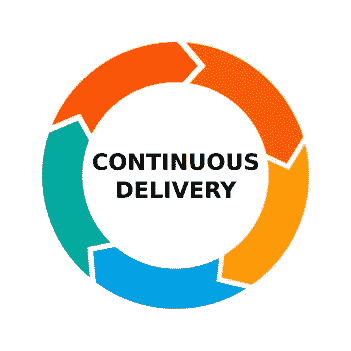
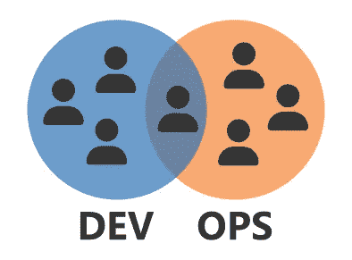

# 持续交付的真相

> 原文：<https://levelup.gitconnected.com/the-truth-about-continuous-delivery-6ea2ac02b775>

连续交货很难。没有简单的方法来学习自动化打包、配置、部署、测试和发布代码所需的所有活动部分。这不是你能在一周内实现的，它需要时间和努力去实现。

连续交货

如果过程中的每一步都是用不同的工具，由不同的团队，或者在不同的地点完成的，那么每天都持续交付可能是不可能的。但事实并非如此。您可以持续地交付代码，而不需要了解 15 种不同的工具，也不需要与您组织内的 5 个不同的团队交谈。

# 什么是持续交付？

持续交付是指有能力以完全自动化的过程快速地从源代码到产品。它支持小规模、频繁的更新，从而最小化风险并最大化反馈。整个行业都很好地理解了这些好处，但是实现方式各不相同。一些团队每隔几分钟就向产品交付变更，而其他团队可能需要几周或几个月才能发布新代码。

将代码投入生产

对于大多数团队来说，每天交付变更应该是可能的，但是为了理解为什么我们需要知道什么问题会阻碍我们。

# 为什么这么难？

**Dev 和 Ops** 文化分离是团队持续交付的重要因素。团队文化中的一个重要因素是资源。

很容易找到想要在笔记本电脑上编写代码的开发人员，但是很难找到想要管理基础设施的开发人员。

很容易找到想要管理基础设施的运营人员，但很难找到想要编写代码的运营人员。

当大部分行业更喜欢将这些任务分成不同的团队甚至组织的不同部门时，找到想要编写、部署、测试、发布和支持服务的团队成员尤其困难。

开发和运营

**工具和供应商**多如牛毛。对于持续交付过程的任何部分，您可以找到一些工具和供应商试图让您使用它们。这使得挑选和增加栈的复杂性变得非常容易，同时提高了所需知识的门槛，并且常常隐藏了软件如何交付的基本原理。

即使在为连续交付中的每一步实现工具时，也经常会发现不支持的差距和集成点，并且需要了解整个堆栈才能解决。这就是为什么我们应该把重点放在最小的堆栈上，并把每一个额外的工具或供应商视为技术和商业意义上的债务。

工具和供应商

**使用供应商提供的工具时，很容易找到指导和培训**，但如果您只是想了解基本原理，就很难找到了。但是我们在哪里以及如何才能学到基础知识呢？

在我的工作中，我被问了很多关于如何实现连续交付的参考，根据我的经验，有很多可用的理论，但没有太多的实现。我相信这是一个需要解决的问题，这也是我的目标。

连续交付培训

# 我们如何能使它变得更容易？

当涉及到复杂的问题时，我们需要对我们的选择进行长时间的认真思考。用肯特·贝克的话说，“让改变变得容易，然后让改变变得容易”。但是我们如何使改变变得容易呢？

首先，我们必须减少我们使用的不同工具的数量，并将我们的努力集中在几个关键的解决方案上。你使用的不同工具越多，知识就越分散，越难分享。

整个行业使用的工具范围很广，从代码、DSL 到 cli 工具等等。然而，我们始终可以依赖的一件事就是代码。我们不应该使用声明性语言或 cli 工具，而应该将精力集中在代码和编写可以与其他任务集成的可重用包上。没有什么好的理由可以解释为什么我们不能在获得依赖关系之后，在一个单一的编程语言中打包、配置、部署、测试和发布代码。

工具越少越简单

其次，我们可以投资了解执行情况。我们不需要学习许多不同的工具，而是可以集中在所需步骤和自动化的基础上。

这在开始时要困难得多，但会带来更好的长期目标，因为工具来了又走，但理解却保留了下来。

持续学习

第三，我们需要迭代您的实现。不管系统有多简单，或者你有多少知识，没有迭代是无法改进的，因为每个环境都是不同的。我们所做的每一个改变可能会也可能不会改善事情，唯一知道的方法就是去尝试。

迭代连续交付

# 摘要

持续交付很辛苦，但也不尽然。通过简化需求，关注我们的理解并投资于学习，我们可以不断提高我们交付软件的能力。

我最近发布了一个教程，尽可能用最简单的方式演示了连续交付的 MVP。它只需要使用 Bash、Python 和 AWS，这应该使任何会编码的开发人员都可以使用它。

我想帮助提高整个行业的软件交付质量，所以如果这对你有价值或者你有什么建议，请告诉我。

点击此处了解更多内容，或通过以下方式联系我:

*   **推特:** [@BenTorvo](https://twitter.com/BenTorvo)
*   **邮箱:**[ben@torvo.com.au](http://torvo.com.au/)
*   **网址:**[torvo.com.au](http://torvo.com.au/)