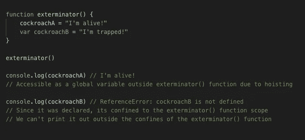

# JS 中关于吊装的真相

> 原文：<https://levelup.gitconnected.com/the-truth-about-hoisting-in-js-8ac79a08a5f9>

## 进入时间死区


本周早些时候，我正准备做一个技术演讲，讲一些技术面试需要知道的基础 JavaScript 概念。像往常一样，当准备分享内容时，我会着魔地检查细节，以确保我所有的事实都是正确的。我不想误导任何人。毕竟，这些文章和谈话是为了帮助人们，而不是阻碍他们！

# var、let 和 const

当我在回顾幻灯片中`var`、`let`和`const`的区别时，我发现自己对`var`是唯一一个被吊起的说法提出了质疑。这个“事实”是一位采访者不久前告诉我的，我想他一定是对的，因为他的头衔和公司声誉卓著。

我知道是的，`var`肯定被提升了，并用一个`undefined`值初始化。我还了解到，如果在函数中有一个未声明的变量，它会在编译阶段自动被提升到作用域的顶部，并被初始化为一个带有假想的`var`的全局变量，如下所示:



在这个例子中，当调用`exterminator()`时，`cockroachA`的 now 全局变量(用`undefined`初始化)用它的新值“我还活着！”。`cockroachA`躲过了灭虫者。他活着！！


# 但是 let 和 const 呢？

当我测试代码示例时，我意识到当我在声明变量的上方引用变量时，带有`let`和`const`的变量并没有抛出“未定义”的引用错误。相反，引用错误称“初始化前无法访问‘a’”。嗯。🤔

```
console.log(a) 
// ReferenceError: Cannot access 'a' before initialization
console.log(b) 
// ReferenceError: Cannot access 'b' before initializationlet a = 'Remy'
const b = 'Linguine'console.log(a) // 'Remy'
console.log(b) // 'Linguine'
```

所以看起来这些变量*被*吊到了某个地方！否则，我们会收到一条错误消息，指出它们不存在，即“未定义”。我们知道`let`和`const`只在执行期间被求值，所以它们不像变量`var`那样用`undefined`值初始化。

**所以如果 let 和 const 变量被提升，但没有给定任何值，它们去哪里了？在未初始化的`let`和`const`变量等待求值的地方，存在着什么样的炼狱？这些可怜的变量被困在什么奇怪的、肮脏的 JavaScript 底层，无助地向它们无情的主人(编译器和运行时)呼喊，让它们沐浴在初始化的阳光下？？**

这个炼狱叫做…

.

.

.


但说真的，这是真的！

据书[你不知道 JS](https://github.com/getify/You-Dont-Know-JS/blob/2nd-ed/scope-closures/ch5.md#uninitialized-variables-aka-tdz) :

> TDZ[时间死区]是一个时间窗口，变量存在但仍未初始化，因此不能以任何方式访问……从技术上讲,`var`也有一个 TDZ，但它的长度为零，因此我们的程序无法观察到它！只有`let`和`const`有可观测的 TDZ。

一旦执行了代码并评估了变量声明，`let`和`const`变量将初始化并离开临时死区，使它们可用于作用域的其余部分。

“为什么时间死区会存在？?"你可能会问。既然`var`、`let`和`const`都被提升了，为什么我们不能像处理 var 那样，用一个`undefined`值自动初始化它们呢？

原因:**都是** `**const**` **的错。**

因为`const`不能用新值重新声明，如果它在编译期间被初始化为`undefined`，然后在执行期间用新值初始化，这将违背`const`所代表的一切！你可能会想，“好吧，我想这是有道理的，但是为什么我们也为`let`做这个呢？”

> 嗯，TC39 做出了决定:既然我们需要为`const`设计一个 TDZ，我们也可以为`let`设计一个 TDZ。事实上，如果我们让`let`有一个 TDZ，那么我们就阻止了所有那些丑陋的吊人变量。所以有一个一致性的观点，也许还有一点社会工程来改变开发者的行为。([你不知道 JS](https://github.com/getify/You-Dont-Know-JS/blob/2nd-ed/scope-closures/apA.md) )

因为`var`和`let`具有相似的属性，所以它们对齐，并且只有`const`有一个时间死区，这不是更有意义吗？是的，这是符合逻辑的，但是我们知道，JavaScript 并不总是如此。

> `let`有一个 TDZ，因为`const`需要一个 TDZ，因为`let`和`const`在它们提升到(块)范围顶部时模仿`var`。给你。太循环了？再读几遍。([你不知道 JS](https://github.com/getify/You-Dont-Know-JS/blob/2nd-ed/scope-closures/apA.md) )


# 那么，我们如何帮助这些无辜的变量避免这种无谓的绝望呢？

避开 TDZ 和避免潜在引用错误的最好方法是在作用域的顶部声明变量。除了避免错误之外，它还通过将所有可用的变量组合在一个地方，使您的代码更具可读性。

我的朋友们，这就是你们不断增长的清单上又多了一个奇怪的 JS！

你遇到过最奇怪的 JS 怪癖是什么？请在下面的评论中告诉我！