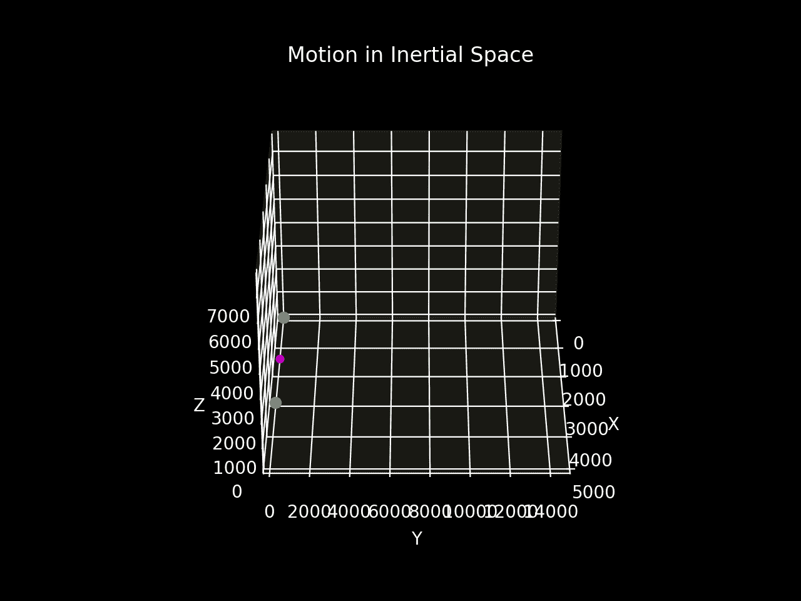
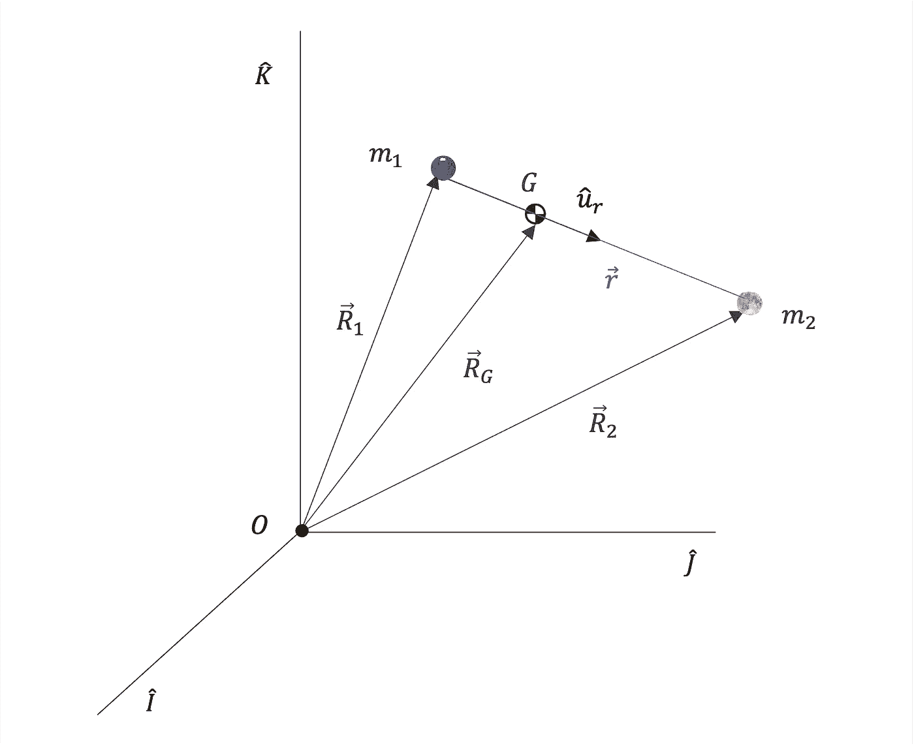
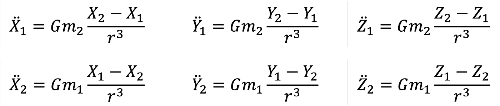
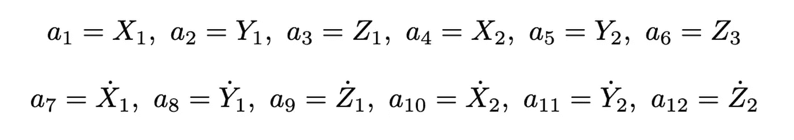
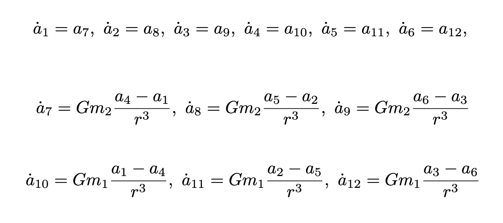
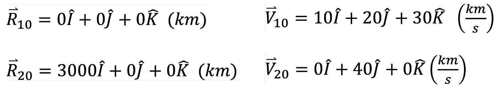
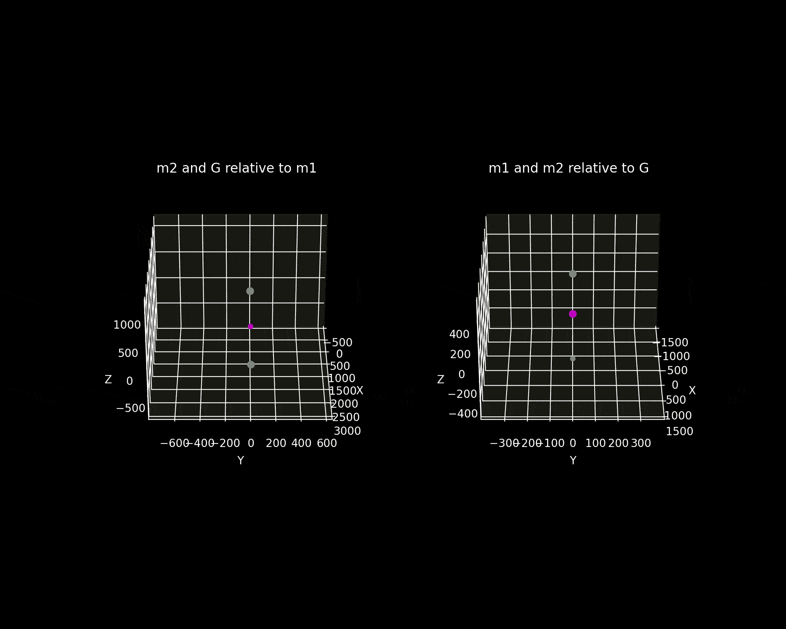
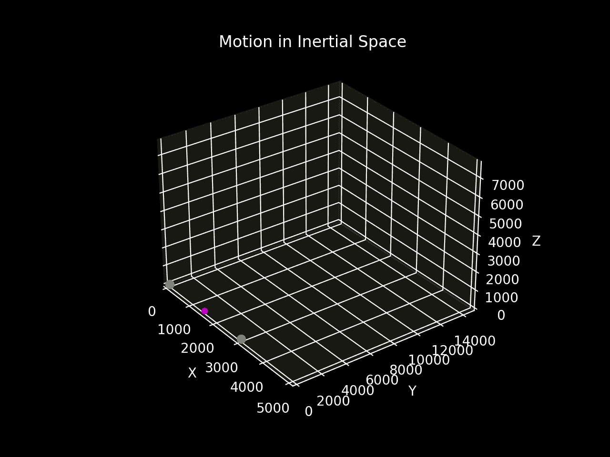

# Python 中的二体问题

> 原文：<https://levelup.gitconnected.com/the-two-body-problem-in-python-6bbe4a0b2f88>

## 想象两个物体由于相互重力吸引而产生的运动

## 介绍

**在*惯性空间*中表示的两个质量**经历一个**相互引力**。

> 两体问题的目标是确定一对物体在重力的影响下如何相对运动。

参见下面的*动画*预览本文中开发的**两体问题模拟**。复习最新[工科学生轨道力学](http://www.nssc.ac.cn/wxzygx/weixin/201607/P020160718380095698873.pdf)教材中的例题 2.2，深入理解理论。



结果预览

## 了解系统

图 1 显示了**两体问题**，两个质量 **m₁** 和 **m₂** 在*惯性参考系*中的示意图。惯性参考系本质上是*不加速*。该系统不受外力影响；两个物体之间只有重力作用。



图 1 —位于惯性空间的两个质量(图片由作者提供)

图表中的重要参数包括:

*   **R₁** :从惯性系原点到 m1 的位置矢量，如公式 1 所示


等式 1-惯性空间中的物体 1 位置向量

*   **R₂** :从惯性系原点到 m2 的位置向量，由等式 2 给出


等式 2——惯性空间中物体 2 的位置向量

*   r:从 m₁到 m₂的位置向量，使用等式 3 找到


等式 3-从车身 1 到车身 2 的位置矢量

*   **G** :系统的质心。如果 **m₁ > m₂** ，通讯器将会更靠近 m₁.
*   **RG** :从惯性系原点到系统的*质心* (COM)的位置向量，使用等式 4 确定。


等式 4——质心的位置向量

## 推导运动方程

应用**牛顿万有引力定律**和**牛顿第二定律**给出*运动方程* (EOM)。知道了 EOM 以及初始位置和速度矢量，就有可能将系统状态随时间传播。

等式 5 是牛顿万有引力定律，代表两个物质粒子之间的吸引力。


等式 5——牛顿万有引力定律

等式 6 显示了**牛顿第二定律**陈述了物质物体的加速度和作用于它的力的总和之间的关系。


等式 6——牛顿第二定律

在两体系统中，唯一考虑的力是重力。因此，从 m₁指向 m₂的**力 f₁₂**是将上述方程组合成方程 7 所示的两体 EOM 的结果。


方程 7 —两体运动方程

牛顿第三定律表明，从 m₂指向 m₁的力与 F₁₂的力大小相等方向相反。等式 8 表示从对象 1 到对象 2 的单位矢量。


等式 8-物体 1 的单位矢量–> 2

将上述单位矢量表达式代入方程 7，给出了运动方程的最终形式。


方程 9 和 10——分别描述物体 1 和物体 2 惯性运动的运动方程

等式 7 是加速度的矢量表达式，在 X、Y 和 Z 方向上具有惯性分量**和**。因此，将等式 9 和 10 分解成它们的组成部分，得到等式 11-16。



等式 11–16—惯性部件的运动等式

## 数值积分

[数值积分](https://python.plainenglish.io/how-is-numerical-integration-done-using-python-4585344e5800)运动方程给出了质量随时间的位置和速度。来自`scipy` Python 库的`odeint`是一个合适的整数解算器。求解器，如**龙格-库塔、**需要**一阶常微分方程** (ODEs)。因此，几个*辅助变量*有助于系统修改，如等式 17–29 所示。



等式 17–29——为数值方法引入的辅助变量

使用上面定义的变量，将六个方程的二阶系统转换为**十二个一阶常微分方程**，如下面的方程 30-41 所示。



等式 30–41—十二个一阶微分方程

[](https://python.plainenglish.io/how-is-numerical-integration-done-using-python-4585344e5800) [## 如何使用 Python 进行数值积分

### 本文旨在演示如何使用 Python 对函数的积分进行数值计算。

python .平原英语. io](https://python.plainenglish.io/how-is-numerical-integration-done-using-python-4585344e5800) 

**初始条件**指定模拟开始时两个物体的位置和速度。等式 42-45 显示了模拟中使用的轨道力学教科书中提供的条件。



等式 42–45-两个物体位置和速度的初始条件


美国宇航局在 [Unsplash](https://unsplash.com?utm_source=medium&utm_medium=referral) 拍摄的[照片](https://unsplash.com/@nasa?utm_source=medium&utm_medium=referral)

## Python 实现

要点 1 显示了定义*模拟线束参数*的 Python 代码。这些参数包括物体 1 和 2 的质量以及在**状态向量** **y₀** 中的初始位置和速度。

要点 1 —模拟线束参数

一阶 ODEs 的两体系统是 Python 中的一个 **Numpy** 数组，用 Gist 2 表示。验证这些等式与等式 11 至 16 相匹配。

通过时间传播初始条件来解决两体问题是使用一行 Python 代码执行的，如下所示。

```
# solve two-body problem
y = odeint(two_body_eqm, y0, time, args=(G, m1, m2))
```

要点 2——作为数字阵列的两体运动方程

`y`包含从时间 *t₀ = 0* 到 *t = 480* 秒，m₁和 m₂的状态向量、位置和速度的历史。

*   `y[0:3]`:tᵢ时 **R₁** 的 x、y、z 分量
*   `y[3:6]`:m₂相对于惯性系的位置

Gist 3 显示了用于确定与关键兴趣点相关的其他位置矢量的 Python 代码，允许从多个角度进行运动可视化，例如从质心或某个物体的中心。

要点 3——查找相对于关键点的位置向量的 Python 代码

## 模拟结果

图 2(a)是两个视角的模拟动画。

1.  从物体 1 看 m₂和质心**的轨迹。COM 和 body two 看起来都以椭圆**的形状移动。****
2.  观察者会看到**位于角**处的两个天体的轨道。*两个轨道都是椭圆*。



图 2(a) —相对运动动画(m₁ =青色，m₂ =黄色，com =洋红色)

图 2(b)显示了这两个物体相对于惯性空间的运动。

> 两体系统相对于惯性系围绕穿过空间的质量中心的直线轨迹建立周期性螺旋运动。



图 2(b) —两体问题模拟

## 结论

在惯性系中，*质心以*匀速直线运动，*证明**系统不受外力。这项动议无限期地继续下去。***

*本文展示了一种方法，可以找到描述两个物体在它们之间的重力作用下单独运动的运动方程，然后对其进行数值积分。*

所提出的求解二体问题的方法可以简化为单体问题。参见下面列出的*参考文献*进行分析。

[](https://medium.com/@andrewdaviesul/membership) [## 通过我的推荐链接加入媒体-安德鲁·约瑟夫·戴维斯

### 作为一个媒体会员，你的会员费的一部分会给你阅读的作家，你可以完全接触到每一个故事…

medium.com](https://medium.com/@andrewdaviesul/membership) [](https://python.plainenglish.io/3d-kinematics-visualisation-25e6b6c53e6c) [## 使用 Python 库 SymPy 和 NumPy 实现 3D 运动学可视化

### 使用 Python 的 SymPy 和 NumPy 库可视化 3D 空间中粒子运动轨迹的教程。

python .平原英语. io](https://python.plainenglish.io/3d-kinematics-visualisation-25e6b6c53e6c) 

在 Gist 4 中找到下面求解两体运动方程的 Python 代码。

要点 4——两体问题整体模拟

## 参考

【1】[工科学生轨道力学](http://www.nssc.ac.cn/wxzygx/weixin/201607/P020160718380095698873.pdf)
【2】将[两体问题](https://youtu.be/lDKnPVCVzSQ)简化为单体问题