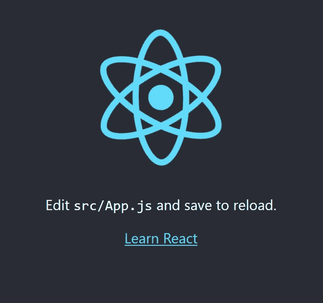
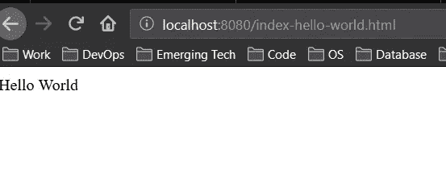
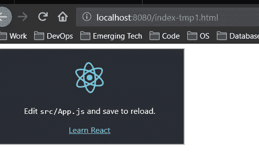

# 将 ReactJS 项目作为小部件共享的两种最简单的方法

> 原文：<https://levelup.gitconnected.com/the-two-easiest-ways-to-share-your-reactjs-project-as-a-widget-971dfef66d98>

尽管开发人员多年来一直在成功地构建 React 应用程序，但我注意到他们中的许多人很难将他们的应用程序作为一个小部件共享，以便其他用户可以嵌入到他们的网站上。

不幸的是，大部分可用的信息都是针对那些要么熟悉黑客 [Webpack](https://medium.com/@sagiv.bengiat/integrate-react-with-other-applications-and-frameworks-94d443e3cc3f) 要么需要大量[第三方库](https://medium.com/@sumn2u/loading-third-party-library-in-reactjs-b01c049df8d5)的开发者。此外，如果您像我一样，在 [Docker 环境](https://www.costansin.com/the-advantages-of-docker/)中运行 ReactJS 项目，那么集成这些类型的解决方案可能并不容易。

因此，本文是我自己的尝试，向您展示两种最简单的方法，使您的 ReactJS 项目或其特定组件作为小部件可用，以便其他用户可以在他们的网站上使用。选择哪一个取决于你是想选择 iFrame 解决方案还是 Javascript 解决方案。在文章的最后，我将分享一些指导方针来帮助你决定哪种解决方案最适合你。

# 先决条件

为了这个项目，让我们使用由 **create-react-app** 创建的样板应用程序创建一个简单的 React 应用程序:

```
$ create-react-app hello-react
$ npm start
```

这将在一个新的浏览器窗口中打开您的应用程序，在`http://localhost:3000`上呈现主要组件:



此外，让我们旋转一个 web 服务器，它将提供一个简单的 html 页面，稍后我们将在其中嵌入我们的小部件。我建议使用 [http-server](https://www.npmjs.com/package/http-server) :

```
$ sudo npm install -g http-server
```

创建一个简单的 html 文件，我们称之为`index.html`:

```
<html>                       
  Hello World
</html>
```

启动 http 服务器:

```
$ http-server
```

这将运行一个本地 http 服务器，您可以在 [http://localhost:8080:](http://localhost:8080:) 上打开一个新的浏览器窗口来查看页面



概括地说，我们有一个运行 spicy React 徽标的 React 应用程序，以及一个呈现静态 html 页面的简单 http 服务器。我们的目标是将 React 应用作为一个小部件嵌入到 html 页面中。酷，让我们继续我们的第一个方法。

# ReactJS 以 iFrame 方式制作小部件

使用 iFrames 既简单又安全。如果您的组件需要特定的维度(比如时钟或日历)，这可能是一个非常可行的方法。这里不打算说太多，所以让我们直接跳到如何使用 iFrames 显示来自另一个网站的相同组件的代码。编辑前面的`index.html`(或创建它的副本)并粘贴以下代码:

```
<html>
  <iframe src="http://localhost:3000"><iframe>
</html>
```

这将把 React 应用程序作为 iFrame 呈现在我们的静态页面中:



完美又轻松！

现在，如果您想将特定组件呈现为小部件，只需将 iFrame 源代码替换为正确的路径。例如，假设我们想要通过以下路径呈现 React 应用程序内部的时钟组件:[http://localhost:3000/parent-component/Clock-component，](http://localhost:3000/parent-component/clock-component,)然后我们简单地引用 iFrame:

```
<html>
  <iframe src="http://localhost:3000/[parent-component/clock-component](http://localhost:3000/parent-component/clock-component,)"><iframe>
</html>
```

# ReactJS 以 Javascript 方式制作小部件

另一种方法，我称之为 Google 嵌入小部件的方式，就是使用 Javascript 标签。这比之前的 iFrame 方法稍微复杂一些。使用这种方法的一个原因是，如果你想让你的用户完全控制你的小部件在他们网站上的混合方式(比如 CSS，dimensions 等等)。

虽然这种方法一开始可能会令人困惑，但实际上，我们将模仿 React 在其主入口点上呈现其组件的方式。让我们快速回顾一下 React 是如何呈现其父组件的。但是首先，让我们构建 React 项目:

```
$ npm run build
```

这将创建一个优化的生产构建，它将分别在`/build`和`/build/static`文件夹中生成一个`index.html`文件(React 应用程序的主要入口点)和一个缩小的 React javascript 文件。让我们仔细看看`index.html`文件:

您可以看到构建操作创建了一个名为`/static/js/main.c9cd54b9.chunk.js`的缩小版 React 应用程序——注意，您环境中的实际名称可能不同。还要注意，这个 Javascript 文件是在`root`元素(`<div *id*="root"></div>`)中呈现的。

这一切意味着什么？基本上，我们可以模仿这种行为，并修改我们的静态 html 文件，如下所示:

默认情况下，Create React App 会生成一个构建，假设您的应用程序托管在服务器根目录下。要覆盖它，请在您的`package.json`中指定`homepage`，例如:

```
"homepage": "http://mywebsite.com/relativepath",
```

这将让 Create React App 正确推断要在生成的 HTML 文件中使用的根路径。这篇文章详细解释了这个过程:[https://create-react-app.dev/docs/deployment](https://create-react-app.dev/docs/deployment)。

或者，在我看来更容易，我会简单地为小部件的需要单独构建同一个项目。然后，我将更改路由逻辑(例如通过 React-Router-v4)来设置小部件的默认路径。

# iFrames 与 Javascript 小部件

这两种方法都相对简单，所以下一个问题是，走哪条路——iframe 还是 Javascript？

这里不做过多的讨论，我认为如果你想让你的小部件更美观(比如 css、颜色、尺寸等等)，你应该使用 iFrames。

如果你想让用户根据自己的需要控制小部件，那么就用 Javascript 解决方案。

如果你有任何问题让我知道。

**关于我**

我是一名[技术和商业顾问](https://www.jamesattard.com)，专攻软件开发、系统架构、数据工程和新兴技术。