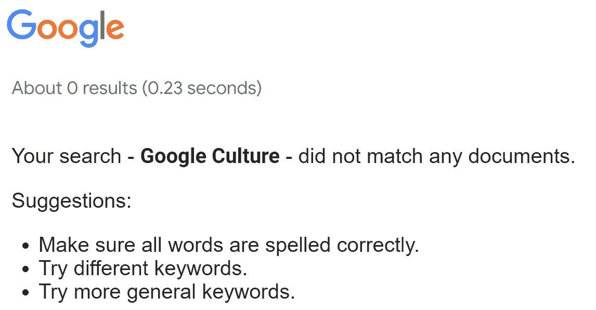

# 为 30 万美元在谷歌工作的丑陋真相

> 原文：<https://levelup.gitconnected.com/the-ugly-truth-working-at-google-for-300-000-1aee09f842b4>

没有谷歌文化这种东西。

# 谷歌梦

我不是唯一一个梦想在谷歌工作的人。当有免费的食物、疯狂的补偿和前所未有的声望时，谷歌梦想就自我推销了。

但是当这么多人想在谷歌工作时，它建立了一种文化，简单地说…

不存在。

# 谷歌的员工统计

谷歌不断从亚马逊和微软等许多科技公司吸引人才，你应该不会感到惊讶。你不知道的是，这些来自其他公司的谷歌人，或者说“移植者”，带来了他们的文化。

随着谷歌的招聘人数在 2022 年增长到+30，000，谷歌的文化变成了成千上万其他公司文化的网状结构，没有给谷歌文化留下独立生存的空间。

你不知道的是，普通的谷歌员工不是刚毕业的大学生，也不是 T2 在谷歌发展了他们的整个职业生涯。那些必须从别人过去的经历中学习文化的人。

公司的文化被自己的免费食物吞噬了。

# 拥有一种公司文化是什么样子的

照片由 [Redd](https://unsplash.com/@reddalec?utm_source=medium&utm_medium=referral) 在 [Unsplash](https://unsplash.com?utm_source=medium&utm_medium=referral) 拍摄

当普通员工不是公司的本地人时，你无法建立一种文化。但是有些公司做到了。

在我之前工作过的亚马逊和微软，不难找到新的毕业生。

以下是我注意到的在这些公司工作的人的类型。

## 亚马孙

亚马逊人比大多数其他员工更容易被发现。他们的交流方式没有闲聊的空间，并且有一种“直奔主题”的态度。这是因为亚马逊的领导原则和有压力的文化必须推动客户痴迷的结果。

如果这是新毕业生唯一知道的工作方式，他们会认为每个公司都是这样工作的。

## 微软

微软员工更放松，对幸福有更开放的对话。他们的环境感觉不到竞争，并且公平地期望他们的员工按照要求完成他们的工作。当你在工作中受到关心和尊重时，你会认为这是每个公司应该做的。

许多致力于微软事业的员工建立了包容和归属感的文化。那些从其他公司加入的人很快就适应了。

但是在谷歌，没有一种文化需要去适应。

# 没有公司文化的问题。

谷歌缺乏公司文化的原因是

*   大多数员工被移植
*   大多数员工都是为了谷歌梦想而来
*   大多数员工都没有可以借鉴的文化。

最终，谷歌的食物开始变得味道相同，对声望的兴奋逐渐消退，其他公司的薪酬也不相上下。

当这种情况发生时，谷歌了解到他们员工的这一点也不应该感到惊讶:

他们没有理由留下来。

有 600 人在推特上关注！

如果你喜欢这种体验，考虑成为[会员](https://medium.com/@alexcancode/membership)，获得更多类似的内容！

请考虑让[订阅](https://medium.com/subscribe/@alexcancode)成为第一个收到关于我经历的电子邮件的人。

 [## 我如何进入亚马逊，微软，谷歌。都来自于对这些资源的研究

### 每个人都有一个学习计划和他们喜欢使用的资源列表。不同的计划适合不同的人，而且…

alexcancode.medium.com](https://alexcancode.medium.com/how-i-got-in-to-amazon-microsoft-google-all-from-studying-these-resources-31724508ce0e) 

关注我在 LinkedIn 上的 100，000 名粉丝

# 分级编码

感谢您成为我们社区的一员！在你离开之前:

*   👏为故事鼓掌，跟着作者走👉
*   📰查看[升级编码出版物](https://levelup.gitconnected.com/?utm_source=pub&utm_medium=post)中的更多内容
*   🔔关注我们:[Twitter](https://twitter.com/gitconnected)|[LinkedIn](https://www.linkedin.com/company/gitconnected)|[时事通讯](https://newsletter.levelup.dev)

🚀👉 [**加入升级人才集体，找到一份神奇的工作**](https://jobs.levelup.dev/talent/welcome?referral=true)