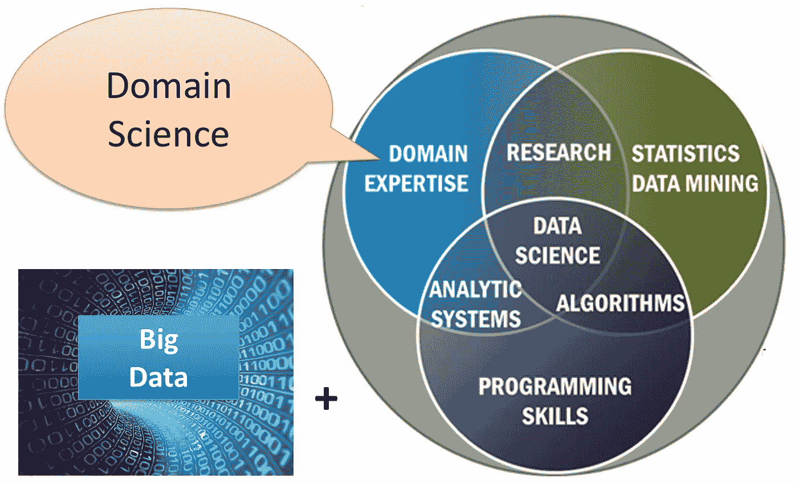

# 终极数据科学路线图

> 原文：<https://levelup.gitconnected.com/the-ultimate-data-science-roadmap-17c86d93dff0>

## 成为数据科学家的途径

在 [Unsplash](https://unsplash.com?utm_source=medium&utm_medium=referral) 上由[法扎德·纳齐菲](https://unsplash.com/@euwars?utm_source=medium&utm_medium=referral)拍摄的照片

[数据科学](https://en.wikipedia.org/wiki/Data_science)多年来一直是计算机科学领域的趋势。其实现在很多大学都在开设数据科学专业课。

随着各种服务和应用程序收集的数据不断增加，对数据科学和大数据专业人员的需求也在飙升。数据科学已经成为软件专业人员和痴迷于数据的人的一条很好的职业道路。

这常常让有志之士感到疑惑——“***要成为一名数据科学家，需要学习什么？*** ”

要了解要学什么，你首先应该了解数据科学的保护伞下有很多东西。

# 维恩图

图片来自维基百科[页面](https://commons.wikimedia.org/wiki/File:Data_science.png)

数据科学包含许多技能。如果你只是擅长编程或者有很好的统计学知识，你不可能成为一名数据科学家。

在统计学、数据挖掘、编程和领域专业知识等技能交汇的地方，数据科学应运而生。

这并不意味着你需要成为所有这些技能的专家。协作是关键。您可能在您的领域和数据挖掘方面有很好的专业知识，您可以与一位具有出色编程技能的团队成员合作，建立一个自动流程来检索您企业的决策数据。

有不同种类的数据科学角色—

*   **数据科学家** —数据科学家几乎了解数据科学范畴内的一切，如数据收集、处理、分析、数据呈现和决策信息提取。
*   **数据分析师** —这个术语已经成为数据科学家的同义词，但他们之间有很多不同。数据分析师分析数据仓库中存在的数据，创建查询，创建数据可视化，并与业务方通信以创建报告来发现见解。
*   **数据工程师** —数据工程师处理系统中最具技术性的部分。他们设计、建造和维护数据管道。他们设计了从各种信号中收集数据的系统，并以尽可能好的方式存储数据。它还涉及数据处理。
*   **机器学习工程师** — ML 工程师利用他们的统计、编程技能和 ML 算法来发现以其他方式不容易发现的见解和预测。

现在，我们将讨论成为一名数据科学家所需的技能—

# 从数学和统计学开始

> “统计学是科学的语法”——卡尔·皮尔逊

在开始开发数据科学的编程技能之前，明智的做法是了解数学和统计学。

数据科学家应该收集、分析和理解大型数据集。要做到这一点，你需要很好地掌握统计学。你必须知道统计概念，比如—

*   统计公式
*   统计结果分析
*   概率论

# Python 河

如果你是程序员，学习一门新语言没什么大不了的。如果您是编程领域的新手，请从 Python 开始。

Python 和 R 是数据科学中使用最多的两种语言。在大多数情况下，一个可以替换另一个，但是它们有独立的用例。

*   **Python:** 一种非常流行的通用编程语言。Python 广泛用于各种应用，从脚本编写到 web 应用，再到数据科学和机器学习。
*   **R:** 专门针对统计计算的编程语言。r 有助于数据的统计分析。

# 数据库和 SQL

数据是数据科学的核心。海量数据是数据科学的前提。

这使得与各种数据库系统的交互成为数据科学家最必要的技能之一。因为大多数数据库系统使用 **SQL** (结构化查询语言)作为从数据库中存储和检索数据的方式。

随着 SQL 成为查询数据库和数据仓库的标准语言，它已经成为数据科学的一项基本技能。

 [## 为什么在称自己为数据科学家之前应该掌握 SQL

### 我不称自己为数据科学家，但我非常了解 SQL

levelup.gitconnected.com](/why-you-should-master-sql-before-calling-yourself-data-scientist-5b2982b7ff97) 

# 数据管道和数据仓库

**数据管道**是将数据放入**数据仓库**的构建模块。数据可能来自内部或外部触发器、用户活动、应用程序使用情况或任何有助于分析的数据。

**数据管道**的工作不是将数据放入数据仓库，而是处理数据，和/或将数据转换成所需的结构。

**数据仓库**的目的是存储可用于支持业务相关决策(如分析)的数据。历史数据通常存储在数据仓库中。它支持对大型数据的查询，并针对扩展进行了优化。

# 形象化

SQL、R 和 Python 可以帮助您获取对业务决策有用的数据。但是以业务人员可以理解的方式来表示这些数据是一门艺术，叫做可视化。

我曾与精通 SQL 并能编写自己的查询和分析数据的决策者共事过。但是电子表格中的数据和图形表示之间有很大的区别。

从图形和图表中理解数据要比通过分析数据转储容易得多。你不必自己开发这些工具，有很多付费和免费的选择。我用过的最好的免费工具之一是 [Metabase](https://www.metabase.com/) 。

# 机器学习

[机器学习](https://en.wikipedia.org/wiki/Machine_learning)已经成为一个流行词很多年了。当你是计算机科学、统计学和数学领域的新手时，你认为你只需要给出正确的数据，算法就会完成剩下的工作。好吧，慢慢地你会明白事实并非如此。

编程、统计和数学技能来拯救你。慢慢地，你对你的数据有了更好的理解，你提取了更多的特征，在许多被拒绝的模型之后，你得到了一个对你的数据有益的模型。

首先，理解算法的基础和数学部分是很重要的。然后从回归开始，然后转移到朴素贝叶斯、SVM 和决策树。下一步将是学习神经网络。

你不必重新发明轮子，有各种各样的库内置了这些算法。更重要的是学习你如何清理你的数据，提取特征，分析更多的模型等等。为此，你需要亲自动手尝试一些项目。

# 结论

学习不止于此。像任何其他领域一样，学习也在数据科学中继续。这些技能将让你走上数据科学的道路，但还有很长的路要走。

*喜欢体验媒介的自己？考虑通过注册会员* *来支持我和其他作家* [***。会员每月只需 5 美元，它支持我们，作家，没有额外的费用。如果你这样做，我会收到一部分费用，不会多花你多少钱。谢谢大家！***](https://singhamrit.medium.com/membership)

[https://singhamrit.medium.com/membership](https://singhamrit.medium.com/membership)