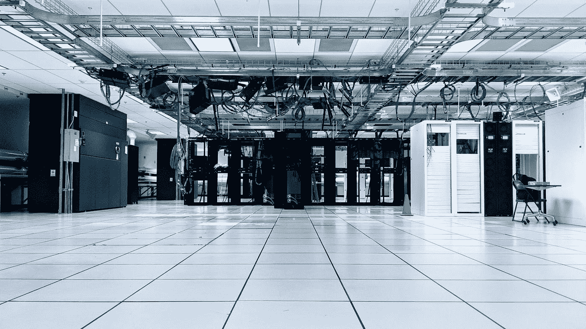

# 新手的终极 DevOps 路线图

> 原文：<https://levelup.gitconnected.com/the-ultimate-devops-roadmap-for-newbies-65ea10a0c115>

## 你需要学习的工具。

泰勒·维克在 [Unsplash](https://unsplash.com?utm_source=medium&utm_medium=referral) 上的照片

***DevOps*** 是开发运营的简称。DevOps 是当今最热门的话题之一。要成为 DevOps 工程师，你需要学习很多技能。

> DevOps 是开发和运营团队的共同责任。它是一种实践和工具，它们被组合在一起，以便在选定的基础设施上高效地运行服务和应用程序。它涵盖了供应和维护基础架构以及在其上运行的流程。

我已经和我的团队一起做 DevOps(以及开发)很多年了。我对这些工具一无所知，但慢慢地，我已经掌握了其中相当多的专业知识。

在这里，我展示了可以帮助您发展开发运维技能的路线图:

# 计算机和网络体系结构

**计算机和网络架构**是理解计算机系统的底层结构和网络如何工作。这包括 CPU、内存、外部设备、网络协议、路由协议等的功能。

了解这一点有助于您做出如下决策:

*   哪个服务需要什么样的资源(服务器)
*   像子网和安全组这样的网络结构应该是什么样的
*   开放哪些端口

# 脚本

对于任何需要你编程的领域来说，脚本是一项重要的技能。这是 DevOps 开发人员的必备技能。

DevOps 涉及需要工程师编写脚本的流程的自动化。脚本可以用不同的语言编写——shell、*python、javascript* 等等。

精通脚本可以轻松实现部署、流程和日常活动的自动化。

# git & Github/Bitbucket/Gitlab

Git 是开发者社区中最流行的版本控制。Github/[bit bucket](http://bitbucket.org/)/[git lab](https://gitlab.com/)是为你托管 git 服务器的仓库。在这些平台上，你将代码存储在 git 中，这些平台为你提供了许多管理工具。

DevOps 工程师应该熟悉 git 命令和这些平台提供的 DevOps 管道。这有助于他们建立 CI/CD 管道。

# 詹金斯

[Jenkins](https://www.jenkins.io/) 是最常用的自动化和 CI/CD 工具之一。它是一个开源的自动化服务器。

Jenkins 支持的各种插件在为您的项目构建自动化时会派上用场。这些插件从吉拉、JUint 等工具到 EC2、Docker 等基础设施插件，再到 Slack Notification 等通信插件。

# ansi ble/木偶/厨师/盐堆

[Ansible](https://www.ansible.com/) 、 [Puppet](https://puppet.com/) 、 [Chef](https://www.chef.io/) 和 [SaltStack](https://saltproject.io/) 都是基础设施自动化和配置管理工具。这些工具用于大规模部署、配置和管理服务器。

关于这些工具中哪一个是最好的争论已经持续了一段时间。

> Ansible 是我的选择，主要是因为它易于设置和管理。为部署创建可翻译的行动手册非常容易。

学习其中一项技能是 DevOps 开发人员的必备技能。

# 码头工人

使用 Docker 你可以将你的应用和服务容器化。您可以构建包含彼此隔离的不同应用程序的容器。每个容器都有自己的文件、安装的软件和库。

与 Ansible、Puppet、Chef 和 SaltStack 相比，Docker 也被认为是一种快速的部署方式。这些容器可用于在任何类型的服务器上托管应用程序。

# 云平台

要成为一名优秀的 DevOps 开发人员，你需要了解(几乎)关于云平台的一切以及它提供的所有服务。

了解云平台有助于您根据自己的目的选择合适的服务，并帮助您降低基础架构成本。

# 日志管理

为您的应用程序和服务创建有意义的日志是部署的一个重要方面。日志管理包括以下内容:

对您的软件进行适当的日志管理可以带来以下价值:

*   调试
*   分析 bug
*   帮助监控您的应用
*   用户行为

有许多管理日志的方法。云平台也提供了一些这样的工具，比如[AWS](https://docs.aws.amazon.com/AmazonCloudWatch/latest/logs/WhatIsCloudWatchLogs.html)的[cloud watch](https://aws.amazon.com/)。

[ELK](https://www.elastic.co/what-is/elk-stack) 是应用最广泛的日志监控和可视化工具。它是三个开源工具的组合:

*   [弹性搜索](https://www.elastic.co/elastic-stack/)
*   [Logstash](https://www.elastic.co/logstash/)
*   [基巴纳](https://www.elastic.co/kibana/)

您可以分析、搜索和过滤日志。Kibana 帮助您从日志中构建美丽的可视化。

# CI/CD

持续集成/持续部署是发布已经被自动验证和部署的软件的过程。

CI/CD 减少了从修改代码到交付软件的时间。

构建 CI/CD 管道是 DevOps 团队最重要的职责之一。有许多方法可以创建管道，如 Gitlab 管道、Bitbucket 管道、AWS 代码构建。

要建立 CI/CD 渠道，您需要与开发和 QA 团队合作。一个好的管道(伴随着好的实践)不需要任何人工干预，从代码提交到测试再到部署。

# 基础设施作为代码

从云平台提供的控制台创建和配置云基础设施很容易，并且适合于天真的人。

使用控制台很简单，建议小型基础架构使用。对于大型基础设施，您需要将基础设施作为代码。只需一个命令或点击一个按钮，您就可以调出或删除堆栈。

[CloudFormation](https://aws.amazon.com/cloudformation/) (来自 AWS)，和 [Terraform](https://www.terraform.io/) 是几个流行的“基础设施即代码”软件工具。

# 库伯内特斯

Kubernetes 是一个开源系统，用于在多个服务器上部署和管理容器。

如今，容器是首选的部署方式。Kubernetes 通过运行应用程序并确保不停机来大规模解决这个问题。

流行的云平台提供现成的 Kubernetes 服务，如

*   GCP 的《GKE》
*   AWS 的 EKS
*   Azure 的 AKS

# 最后的话

要成为 DevOps 工程师，不一定要掌握以上所有技能。你当然需要掌握其中的一些技能，并在需要的时候学习。

如果我错过了什么，请在评论中告诉我。

一个有用的链接—

[如何在六个月内成为 DevOps 工程师](https://spacelift.io/blog/how-to-become-devops-engineer)

我希望你喜欢读这篇文章。如果你愿意支持我当作家，可以考虑报名 [***成为中等会员***](https://singhamrit.medium.com/membership) ***。每月只需 5 美元，你就可以无限制地使用 Medium。***