# 终极对决:Flask vs. FastAPI

> 原文：<https://levelup.gitconnected.com/the-ultimate-face-off-flask-vs-fastapi-79b8e775552b>

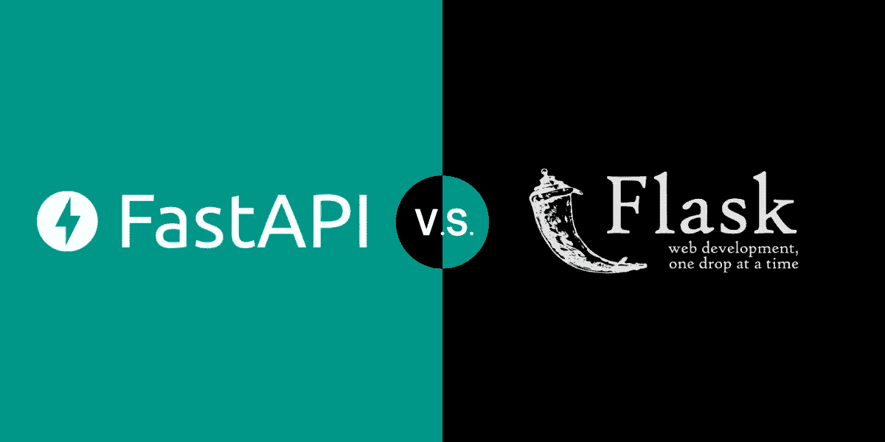

选择一个框架并不容易，这就是为什么我在这里帮助你摆脱头痛。

为什么我们还要比较[烧瓶](https://flask.palletsprojects.com/en/2.0.x/)和 [FastAPI](https://fastapi.tiangolo.com/) ？

他们是相似的。两者都是精简的 Python 微框架，没有臃肿的花里胡哨，这意味着更快的开发时间和更大的灵活性。此外，两者都用于构建 API 和 web 应用程序。

他们也不一样。Flask 经过了更多的战斗考验，因此稍微更可靠，并且被广泛使用。FastAPI 是一个更新、更现代的框架，以其速度和许多内置支持而闻名，如 Pydantic 和 SwaggerUI。

现在，您对每个框架都有了更好的理解，让我们开始面对面的交流吧！

# 装置

有时候学习新事物最具挑战性的部分实际上是开始。这就是我们从安装开始的原因。

使用 Python 最喜欢的安装程序 pip 安装 Flask 和 FastAPI 相对简单。将两者都安装在虚拟环境中也是一种很好的做法，虚拟环境是为每个 Python 项目提供的隔离环境，可以消除冲突错误。

**结论**:注意你是用 Uvicorn 安装 FastAPI 的。可以把 Uvicorn 想象成一个快如闪电的服务器，让你的应用程序执行得更快。

# Hello World 应用程序

如果你一生中只写过一行代码，我敢打赌是这样的:

`print("Hello World")`

这有点像你在学习另一种语言，比如说普通话。有一个叫做拼音的系统，它将汉字转换成英语，这样人们就可以发音了。它旨在让您快速启动并运行，就像 Hello World 应用程序一样。

让我们看看 hello world 应用程序在 Flask 和 FastAPI 中是什么样子的。

## Flask < 2.0

## Flask 2.0

## FastAPI

**结论**:在 Flask 的新版本中，您可以使用`@app.get()`和`@app.post()`装饰器作为路由的快捷方式。使用`@app.route()`的前一种方式要求您将 HTTP 动词传递给一个方法列表，如下所示:`methods=\["GET", "POST"]`。

> *注意:Flask 默认做一个* `*GET*` *，所以不需要在方法列表中指定。
> FastAPI 中也有这些方法，支持每个 HTTP 方法的以下修饰路由:*

*   `@app.get()`
*   `@app.post()`
*   `@app.put()`
*   `@app.delete()`

# 正在开发中运行

一旦你写好了你的“Hello World”应用程序，你会想在把它投入生产让全世界看到之前，先在开发中运行它——或者在你的机器上本地运行。如果你的应用程序不能按预期运行，人们肯定会抓狂。你想把这种怪癖减到最小。

因此，在您的终端中，运行以下命令:

## 瓶

## FastAPI

**结论** : FastAPI 使用热重载，在你修改代码的时候保持应用运行。因此，您不必一直重启开发服务器。使用 Flask，您需要一个额外的终端命令:`export FLASK_ENV=development`，它允许您在不重启开发服务器的情况下修改代码。

# HTTP 方法

在 Hello World 示例中，我们看到了 Flask 和 FastAPI 中的 GET 是什么样子，所以现在让我们更仔细地看看 POST 方法。

## Flask < 2.0

## Flask 2.0

## FastAPI

**结论** : Flask 2.0 和 FastAPI 在做 POST 方法的时候看起来很像。诀窍在于观察新数据是如何产生的。

使用 Flask，您必须使用类似 Postman 的工具作为客户端，这样您就可以看到您的 POST 请求和您以 JSON 格式创建的数据。
FastAPI 自带 Pydantic 和 SwaggerUI，允许您使用自动文档与来自浏览器的请求进行交互，包括 POST 请求。

Flask 也可以使用自动文档，但是您必须使用 flask-swagger 安装它。让它工作还需要很多配置。让我们在下一节看看如何在 FastAPI 中查看您的 POST 请求。

# 自动文档

如果你相信魔法，你肯定会喜欢自动文档。

FastAPI 基于 Pydantic，这是一个用于轻松建模和验证对象的框架。它从盒子里出来，所以不需要安装它。Pydantic 消除了编写构造函数的痛苦，您可以获得所有神奇的方法。Pydantic 还进行数据验证，显示更友好的错误并使用 python 类型提示，从而减少调试时间。要访问您的自动文档，请确保您的开发服务器正在运行，然后转到您的本地主机和您的应用程序正在运行的端口:

您将看到您的帖子请求，如下例所示；如果您正在使用其他 HTTP 方法，这些也将是可见的。

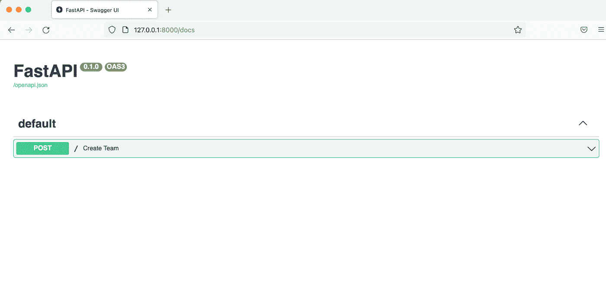

让我们做一些更酷的事情，这样我们就可以看到自动化文档的美妙之处。假设我们在 FastAPI 中有这样的代码:

## FastAPI

注意，为了使用 Pydantic，您必须导入`Player`类将继承的`BaseModel`。我们还在类中声明变量作为类型提示，并在 POST 请求中返回一个字典。

当您打开自动文档时，您会看到一个模式。这个模式是带有变量的模型的框架，从中可以看出哪些字段是必需的，哪些是可选的。

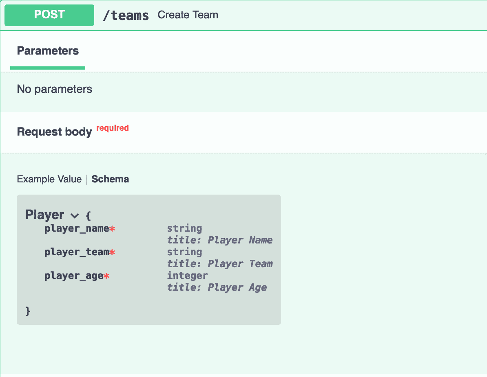

您还可以通过传入变量值来“尝试”和测试您的 API 端点。例如，在这里，我们为 String 类型的变量`player_name`传入`"Michael Jordan"`。

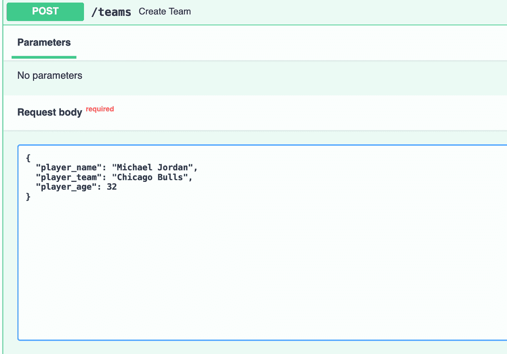

然后，当你点击执行，它会给你一个响应体。不需要使用邮差之类的额外工具。

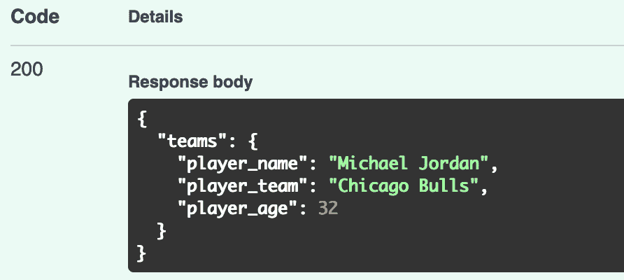

您的交互式文档还会为您生成一个 curl 命令，因此您不必从头开始编写:

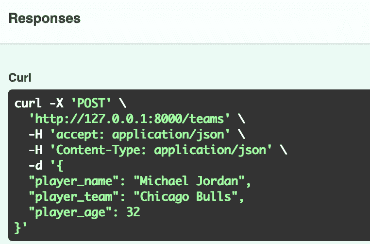

**结论**:由于自动化文档是与 FastAPI 以及 Pydantic 和 Swagger UI 一起开箱即用的，这些特性肯定会加快您的开发时间。您不必安装任何外部工具来测试您的请求。

# 数据有效性

由于我们可爱的朋友 Pydantic 在安装时附带了 FastAPI，当您的代码遇到问题时，它会给出一些非常友好的错误消息。

## FastAPI

这里我们创建了一个类登录，它继承了 Pydantic BaseModel，并在其中包含了类型提示变量。我们首先检查`username`是否是`janedoe`和`password`是否是`passworld12345`，然后我们相应地返回一个成功或失败的消息。

我们转向自动文档，通过将`None`传递给用户名来测试我们的请求体:

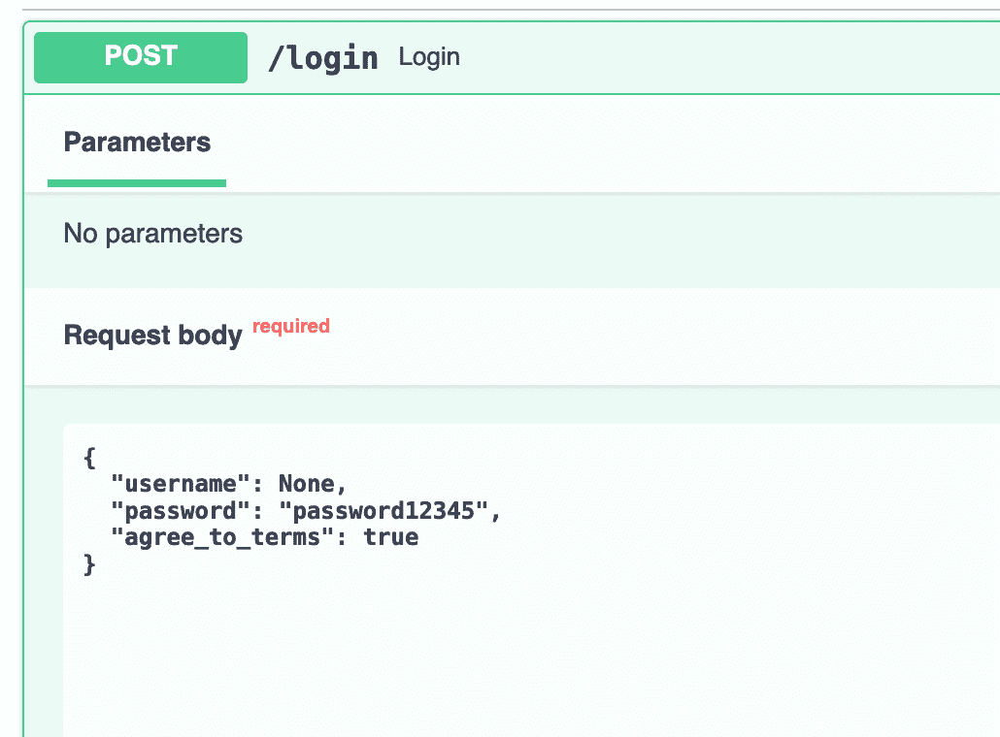

Pydantic 将发挥它的魔力，您将得到一条友好的消息，告诉您到底是什么错误。在这种情况下，它返回错误`Expecting Value`，这是正确的，因为我们将`None`传递给了`username`。

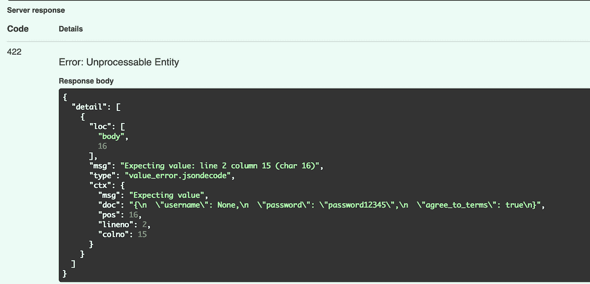

**结论** : Flask 没有任何内部数据验证支持。您可以通过安装 *Flask-Pydantic* 来使用强大的 Pydantic 包进行数据验证。

路径或 URL 参数获取一个单项。假设我们想要一个单一玩家。无论哪个玩家拥有我们传入 URL 的 id，都将被返回给用户。

# URL 或路径参数

假设我们有一个字典列表，我们想从这个 JSON 文件中获取一个播放器:

## 瓶

在这里，我们将 id 为 2 的路由传递到端口 5000 上的 localhost，并返回 id 为 2 的播放器。

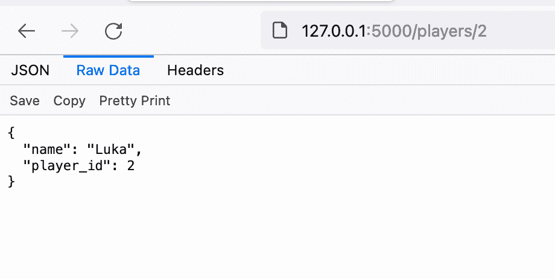

## FastAPI

在这里，我们将 id 为 1 的路由传递到端口 8000 上的 localhost，并返回 id 为 1 的播放器。

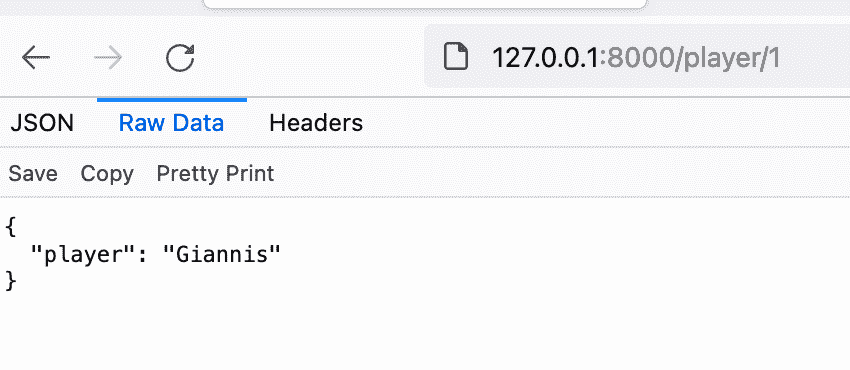

**结论**:有了 FastAPI，因为它使用 Python 类型提示，你可以把你的代码移植到其他框架，比如 Django。对于 Flask，它是不可移植的，因为我们使用的是特定于框架的类型提示，而不是 Python 提示。

# 模板文件夹

当你在 Flask 或 FastAPI 中构建一个 web 应用程序时，Templates 文件夹存储你的 HTML 文件，你必须使用 Jinja 在 HTML 中显示你的变量。Jinja 是一个模板引擎，允许你编写类似 Python 的代码来显示 HTML。

## 瓶

默认情况下，Flask 在“templates”文件夹中查找模板。您只需要在您的文件结构中创建一个。

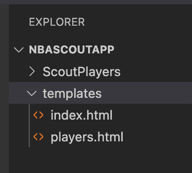

然后，您可以使用 Jinja 显示变量，方法是用双花括号将它们括起来:

**结论**:jinja 安装时自带烧瓶，这是一个巨大的优势。在 FastAPI 中，您必须安装 Jinja 并在代码中定义 templates 文件夹。

# 生产服务器

在某种程度上，您会想要部署您的应用程序并向全世界展示它。

## 瓶

Flask 使用名为 WSGI 的 web 服务器，它代表 Web 服务器网关接口，多年来一直是 Python 标准。缺点是同步的。这意味着，如果您有一堆请求，它们必须排队等待队列完成。

## FastAPI

FastAPI 使用一个叫做 ASGI 或异步服务器网关接口的 web 服务器，它速度很快，因为它——嗯，你猜对了——是异步的。因此，如果有一堆请求进来，它们不必等待其他请求完成后才被处理。

**结论** : ASGI 有助于提高 web 应用程序的性能，因为它们异步处理请求。

请击鼓。

获胜者是…嗯，看情况。

这是你可以选择的方式。

**如果需要，使用** [**烧瓶**](https://flask.palletsprojects.com/en/2.0.x/)**:**

*   久经考验的框架，因为它已经存在了很长时间
*   开发一个快速原型
*   进行 web 应用程序开发

**使用**[**FastAPI**](https://fastapi.tiangolo.com/)**如果你愿意:**

*   速度，如开发时间和性能
*   为了减少代码中的 bug 和错误
*   从头开始构建 API

好了，你已经看到了 Flask 和 FastAPI 的运行。现在你对两者都有了更好的理解，并且你已经知道哪一个更适合你的下一个项目。

那么你选择了哪个框架呢？发微博给我们 [@VonageDev](https://twitter.com/VonageDev) 或者 [@tonyasims](https://twitter.com/TonyaSims) 。

*原载于*[*https://learn . vonage . com/blog/2021/08/10/the-ultimate-face-off-flask-vs-fastapi/*](https://learn.vonage.com/blog/2021/08/10/the-ultimate-face-off-flask-vs-fastapi/)