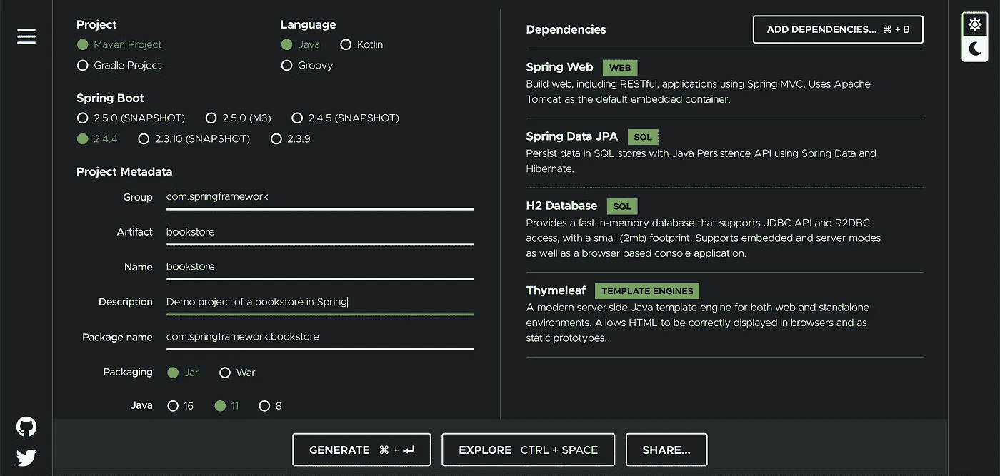
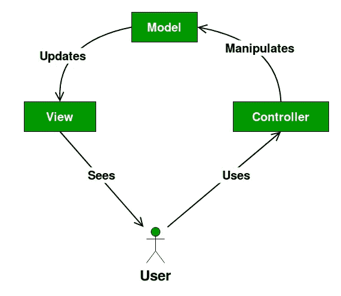

# 用 Spring 开发全栈 Java Web 应用程序的终极指南

> 原文：<https://levelup.gitconnected.com/the-ultimate-guide-for-developing-a-full-stack-java-web-application-with-spring-cd385759172>

在本文中，我们将使用 Spring framework 开发一个完整的 java web 应用程序:一个非常简单的在线书店。首先，我们将设置我们的开发环境。接下来，我们将构建我们的数据模型，Spring 将使用它来生成我们的数据库。之后，我们将实现一个控制器来从数据库中检索我们的数据，最后我们将使用 Thymeleaf 来格式化数据，并使用内置的 Tomcat 服务器将数据提供给客户端。

Spring 框架在工业中被广泛用于开发各种 web 应用程序。一些公司仅使用它来开发他们的后端，而另一些公司在他们的后端和前端都采用它。在本教程中，我们将探索如何使用 Spring 框架用 Java 为书店编写一个全栈 web 应用程序。这个应用程序将允许用户连接到服务器，并检索书籍的详细信息。所以事不宜迟，让我们从设置开发环境开始。

**设置开发环境**

要开始实现 Java 应用程序，您需要在开发和运行时环境中安装 Java 开发工具包。你可以从[官网](https://www.oracle.com/java/technologies/javase-downloads.html)下载 JDK 1.8 或更高版本。

接下来，您将使用以下两种构建工具之一:

*   [**Gradle 4+**](https://gradle.org/install/)
*   [**Maven 3.2+**](https://maven.apache.org/download.cgi)

在本教程中，我们将使用 Maven。这种选择是完全随意的，您可以用这两种工具获得相同的结果。Gradle 和 Maven 是主要用于 Java 项目的构建自动化工具。所以每次你想编译和启动你的 Spring 项目的时候，这些工具会解析所有的依赖，编译你的代码并打包。如果你想了解更多关于 Gradle 或 Maven 的知识，你可以参考他们写得非常好的官方文档。

您最不需要的就是 IDE。对于 Java，我建议您使用 IntelliJ IDE。你可以从 JetBrains 官网下载。您也可以使用其他 ide，如 Eclipse 或 NetBeans，它们与 Java 配合得非常好。

现在我们已经有了所有必要的工具，让我们开始创建我们的项目。

**使用 Spring Initializr 创建项目**

回溯几年，春天立项是很痛苦的。您必须手动包含所有依赖项，并正确设置项目目录。谢天谢地，现在我们有了一个叫做 Spring Initializr 的工具可以帮我们做到这一点。Initializr 是一个开源软件，所以你可以在 Github 的这里查看[。最棒的是有一个实现 Initializr 的 web 应用:](https://github.com/spring-io/initializr) [start.spring.io](http://start.spring.io)

使用 start.spring.io 生成 Spring 项目

选择 Maven 项目、Java 和您想要使用的 SpringBoot 版本。如上所示，填写您的项目的详细信息。我们将使用 Jar 打包和 Java 11。您仍然可以使用 Java 8，因为在本教程中我们不会使用任何新特性。您需要做的最后一件事是为您的项目选择依赖项。我们将在这个项目中使用 4 个依赖项:

*   Spring Web for web development:这种依赖来自一个内置的 Tomcat 服务器，它将简化很多服务器配置。它将帮助我们构建 web 路由并将其连接到我们的应用程序。
*   Spring Data JPA:这种依赖将帮助我们构建数据模型，并且在没有任何 SQL 的情况下轻松操作数据库查询。
*   H2 数据库:这是我们将存储数据的数据库。
*   这种依赖将帮助我们构建动态 HTML 页面，将查询结果提供给客户端。

我们现在可以点击 **Generate** 来下载包含我们的项目样本目录的归档文件。

**探索项目目录**

让我们从探索我们的目录开始，以便更好地理解我们的 Spring 项目的不同组件。

`.mvn`:这个目录包含将用于编译的特定于 Maven 的文件。

`src/main/java`:这个目录将包含我们应用程序的实际 Java 代码。

`src/main/resources`:这个目录将包含我们使用百里香叶构建的动态 HTML 文件

`mvn`和`mvnw.cmd`:这些文件分别是 Unix 和 Windows 的 Maven 可执行文件，以防我们想在命令行中使用 Maven。

`pom.xml`:这是 Spring 的配置文件，包含了所有的依赖项。如果您仔细检查它，您会看到我们之前在项目中包含的 4 个依赖项。如果以后想添加更多的依赖项，可以在这个配置文件中添加，Maven 将在下一次构建时解决这些依赖项。

现在我们对项目结构更加熟悉了，让我们从创建一个简单的 html 页面开始，并将其提供给我们的客户。

**为客户端提供静态 HTML 页面**

为了使用内置的 Tomcat 服务器提供一个简单的 html 页面，我们需要实现我们的后端和前端。

后端

我们将使用控制器将路线映射到我们的应用程序。控制器的目标是实现向用户提供数据背后的逻辑。Spring MVC 实现了 MVC 设计模式或模型、视图、控制器模式。该模式允许开发人员在开发过程中分离关注点，这意味着从数据库中检索数据的代码将完全独立于向用户提供数据的代码。同样，这两个单元将独立于向用户显示数据的前端或视图。

MVC 设计模式

要编写第一个控制器，请转到`src/main/java/com/springframework/bookstore`并创建一个名为`controllers`的包。在这个包中，创建下面的`HelloController`:

`@Controller`将告诉 Spring 考虑将`HelloController`类作为控制器。

`@RequestMapping`将把路线`'/'`映射到功能`helloMessage()`。所以每次一个 GET 请求被发送到`'/'`，函数`helloMessage()`就被调用。

返回值是一个名为`books/hello`的模板。这个字符串是对我们将在下一段中构建的 html 模板的引用。

前端

要创建提供给客户端的模板，请转到`src/main/resources/templates`并创建一个名为`books`的包。在此包中，添加以下 HTML 文件:

现在，在您的 IDE 中运行该应用程序，并检查日志以验证 Tomcat web 服务器已经在端口 8080 上启动。在您的浏览器中转至`localhost:8080/`，查看提供的 hello 模板！

**建立数据模型**

为了给我们的 web 应用程序添加更多的功能，我们想要创建一个数据模型。这是我们项目中上面讨论的 MVC 框架中缺失的部分。为此，我们首先为书籍和作者构建类。这些类将作为 H2 数据库的模型。然后，我们将使用依赖 Spring 数据 JPA 来构建我们的数据库，并在不使用任何 SQL 查询的情况下添加样本数据。

为了构建书籍和作者的模型，我们需要首先编写定义一个`Book`对象和一个`Author`对象的类。这些类将保存与相应对象相关联的字段的详细信息，例如:

*   **每个作者:**名、姓和写的书
*   **每本书:**书名、识别号和作者

你可以看到我们在书籍和作者之间有着多对多的关系。这意味着每本书可以有多个作者，每个作者可以写很多本书。

要创建这些类，请到`src/main/java/com/springframework/bookstore`并创建一个名为`domain`的包。在这个包中，为书籍和作者添加以下两个类。

这两个类都非常简单，因为它们不包含任何功能。他们只是为书籍和作者指定已经提到的有趣的领域。剩下的只是像 getters 和 setters 这样的实用函数。你必须注意的事情:

*   `@Entity`:这告诉 Spring 将下面的类视为数据模型
*   `@Id`和`@GeneratedValue`:我们添加字段`id`作为这两个对象插入数据库时的主键。该字段将自动生成。
*   `@ManyToMany`:这将在两个对象 Author 和 Book 之间创建一个关系，当我们开始向数据库中插入 authors 和 Book 时，这个关系最终将变成表。

正如我们定义的类一样，我们现在需要编写方法来插入、修改或删除数据库中的书籍和作者。幸运的是，Spring 自动做到了这一点。它为我们提供了完成所有数据库操作所需的所有方法。我们唯一需要做的事情是定义我们将用来查询数据库的对象。

转到`src/main/java/com/springframework/bookstore`并创建一个名为`repositories`的包。在这个包中，添加以下接口，我们将使用这些接口来查询我们的 H2 数据库。

现在让我们为测试目的向数据库添加几个字段。为此，转到`src/main/java/com/springframework/bookstore`并创建一个名为`bootstrap`的包。在这个包中，添加下面的 Java 类`BootStrapData`，它扩展了`CommandLineRunner`。这将告诉 Spring 在我们启动项目时执行`run`方法。在这个方法中，我们初始化一些作者和书籍，并将它们添加到数据库中。

**使用百里香叶创建动态 HTML 页面**

要创建动态 HTML 页面，请转到`src/main/resources/templates/books`并添加以下 HTML 文件。

在第 2 行，我们告诉 Spring 使用 Timeleaf 根据数据库查询结果生成动态 HTML。查询在第 14 行和第 16 行之间。对于`${books}`数据库中的每个`book`，Spring 都会创建一个包含`book.id`和`book.title`的行。

完成后，回到你的`components`包，创建一个`BookController`和`HelloController`一模一样，但是映射到路径`/books`。

启动您的 Spring 应用程序，并在浏览器中转至`localhost:8080/books`。您将看到您的表格，其中有我们添加到数据库中的两本书！

我希望这篇教程是进入 Spring 应用程序世界的一个简单的切入点。我们一起学习了如何将所有不同的部分组合在一起:模型、视图和控制器，以构建一个功能完整的全栈 Java 应用程序。