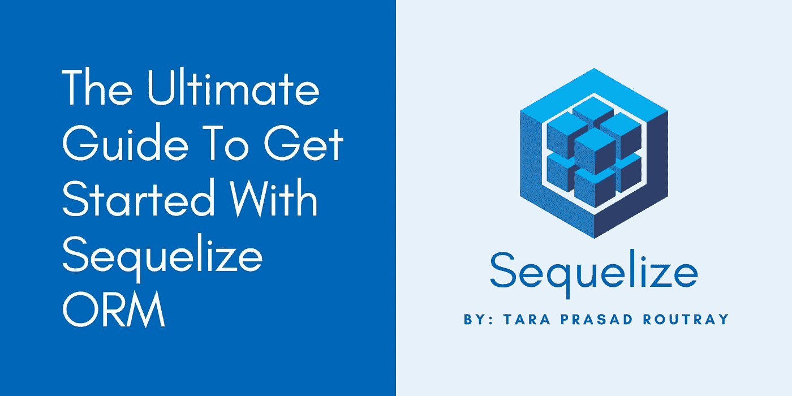
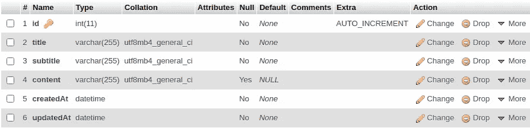

# Sequelize ORM 入门终极指南

> 原文：<https://levelup.gitconnected.com/the-ultimate-guide-to-get-started-with-sequelize-orm-238588d3516e>

## 了解 Sequelize 的基础知识，以及如何将其与 Node.js 或 Express 集成。



Sequelize 是 Node.js 的一个流行的 ORM，它允许轻松地管理 SQL 数据库。它支持各种数据库，如 Postgres、MySQL、MariaDB、SQLite 和 Microsoft SQL Server。它利用 Node.js 和 JavaScript 对象语法来完成与数据库的映射。它提供了可靠的事务支持、关系、急切和懒惰加载、读取复制等等。

在本文中，我将演示如何通过几个简单的步骤集成 Sequelize ORM。我们将在整个过程中使用 MySQL 数据库。

# 使用序列的好处

以下是使用 Sequelize 的好处:

1.  避免编写原始 SQL 查询。
2.  避免 SQL 注入漏洞。
3.  编写更加一致的代码。
4.  获得强大的迁移工具。

# 通过 NPM 安装 Sequelize

要将 Sequelize ORM 添加到 Node.js 或 Express 应用程序中，需要在应用程序根目录中执行以下命令。

```
npm install --save sequelize
```

这将安装 Sequelize 并将其作为一个依赖项添加到`package.json`文件中。

# 安装数据库驱动程序

由于我们将使用 MySQL 数据库，我们将只为 MySQL 安装驱动程序。您需要在应用程序根目录中运行以下命令来启用对数据库连接的支持。

```
npm install --save mysql2
```

对于其他数据库，您可以运行以下列表中的适当命令。

```
npm install --save pg pg-hstore # Postgres
npm install --save mariadb # MariaDB
npm install --save sqlite3 # Sqlite
npm install --save tedious # Tedious
```

# 建立数据库连接

要连接到数据库，您需要打开 Sequelize 和正在运行的 MySQL 守护进程之间的连接流。因此，在应用程序根目录下创建一个名为`config`的目录，并在`config`目录下创建一个名为`database.js`的文件。请参考下面的代码片段，了解如何导入 Sequelize，创建一个带有身份验证细节的实例，并导出它，以便它可以用于建立数据库连接。

在将上述代码添加到`database.js`文件之后，您必须将它导入到`app.js`文件中，这是用于启动和管理节点服务器的主要文件。参考下面的代码片段，了解如何导入`database.js`文件并建立数据库连接。

通过运行以下命令启动节点服务器。

```
node app.js
```

执行上述命令后，将建立数据库连接，节点服务器将启动并运行。类似的消息将显示在终端中。

```
Testing the database connection..
Executing (default): SELECT 1+1 AS result
Connection has been established successfully.
Server is up and running at: [http://localhost:3000](http://localhost:3000)
```

# 关闭数据库连接

默认情况下，Sequelize 将始终保持连接打开，并对所有查询使用相同的连接。如果需要关闭连接，可以运行以下命令。

```
db.close();
```

这里，`db`是在`app.js`文件中创建的常量(保存 Sequelize 实例)的名称。

# 创建模型和模式

模型是序列的核心。它是一种抽象，表示数据库中的一个表。模型提供了关于表的各种细节，例如表的名称、它所包含的列以及列的数据类型。

> 您可以为模型指定自定义名称。它不需要与表名相同。建议一个模型保持一个单数名称(如 **Post** )，而一个表可以有多个名称(如 **app_posts** )。

模型可以用两种方式表示:

*   通过调用 sequelize.define()
*   通过扩展模型类并调用 init()

现在，创建一个名为`models`的目录，并在`models`目录中创建一个名为`Post.js`的文件。

## 选项 1:通过调用 Sequelize.define()来定义发布模型

参考下面的代码片段，了解如何通过调用`sequeize.define()`函数来定义模型。

## 选项 2:通过扩展模型类并调用 Init()来定义 Post 模型

参考下面的代码片段，了解如何通过扩展模型类和调用`init()`函数来定义模型。

# 模型架构数据类型

对于添加到模型模式中的每一列，都必须提到数据类型。请参考下面的代码片段，查看 MySQL 数据库可用的所有数据类型。

## 字符串数据类型

```
DataTypes.STRING             // Type: VARCHAR(255)
DataTypes.STRING(1024)       // Type: VARCHAR(1024)
DataTypes.STRING.BINARY      // Type: BINARY
DataTypes.TEXT('tiny')       // Type: TINYTEXT
DataTypes.TEXT               // Type: TEXT
```

## **数字数据类型**

```
DataTypes.INTEGER            // Type: INTEGER
DataTypes.BIGINT             // Type: BIGINT
DataTypes.BIGINT(20)         // Type: BIGINT(20)DataTypes.FLOAT              // Type: FLOAT
DataTypes.FLOAT(11)          // Type: FLOAT(11)
DataTypes.FLOAT(11, 10)      // Type: FLOAT(11,10)DataTypes.DOUBLE             // Type: DOUBLE
DataTypes.DOUBLE(11)         // Type: DOUBLE(11)
DataTypes.DOUBLE(11, 10)     // Type: DOUBLE(11,10)DataTypes.DECIMAL            // Type: DECIMAL
DataTypes.DECIMAL(10, 2)     // Type: DECIMAL(10,2)
```

## 日期数据类型

```
DataTypes.DATE               // Type: DATETIME
DataTypes.DATE(6)            // Type: DATETIME(6) for MySQL 5.6.4+. Fractional seconds support with up to 6 digits of precision
DataTypes.DATEONLY           // Type: DATE
```

## 布尔数据类型

```
DataTypes.BOOLEAN            // Type: TINYINT(1)
```

## UUID 数据类型

```
DataTypes.UUID               // Type: CHAR(36)
```

要将一个列指定为类型`UUID`，您需要提供一个额外的`defaultvalue`参数，以便 Sequelize 可以为该列自动生成 UUID。

```
{
    type: DataTypes.UUID,
    defaultValue: DataTypes.UUIDV4
}
```

# 同步模型

模型同步是告诉 Sequelize 自动对数据库执行 SQL 查询，并检查模型模式中提到的列是否必须与目标表匹配的过程。通过调用`.sync()`函数，模型可以与数据库同步。

以下是同步模型的三种方法。这里我们将同步`Post`模型。

*   Post.sync()
*   Post.sync({force: true})
*   Post.sync({alter: true})

## 使用 Post.sync()函数同步模型

这将创建一个不存在的表。如果存在，则不执行任何操作。

## 使用 Post.sync({force:true})函数同步模型

这将删除该表(如果存在)，然后重新创建该表。

## 使用 Post.sync({alter:true})函数同步模型

这将首先检查数据库中的表(哪些列可用，它们的数据类型是什么，等等)，然后在数据库表中执行所需的更改，以确保表与模型的模式匹配。

在数据库连接建立之后，您可以在`app.js`文件中使用它。请参考以下代码片段，了解如何使用模型同步。

当您重启节点服务器时，将自动创建表`app_posts`。下面是表格的截图。

> 您会注意到添加了两个额外的列— `createdAt`和`updatedAt`。这些列是在执行 sync()操作时由 Sequelize 为表自动生成的。



> 您可以使用`app.js`文件中的`db.sync()`一次性同步所有模型。
> 
> **警告:**如果在生产环境中使用，sync({ force: true })和 sync({ alter: true })可能具有破坏性。因此，不建议在生产中使用。

# 放下桌子

要删除一个表，您可以在模型实例上使用`.drop()`函数。

```
Post.drop();
```

要删除所有表，可以在`db`实例上使用`.drop()`函数。

```
db.drop();
```

# 使用模型创建记录

要在表中创建/插入记录，您可以在模型实例上使用`.create()`函数。请参考下面的代码片段，了解如何在表中创建新记录。

# 使用模型读取记录

要从表中读取记录，可以在模型实例上使用`.findOne()`函数。请参考下面的代码片段，了解如何从表中读取记录。

要从表中读取所有记录，您可以在模型实例上使用`.findAll()`函数。请参考下面的代码片段，了解如何从表中读取所有记录。

# 使用模型更新记录

要更新表中的记录，您可以在模型实例上使用`.update()`函数。请参考下面的代码片段，了解如何更新表中的记录。

# 使用模型删除记录

要删除表中的记录，可以在模型实例上使用`destroy()`函数。请参考下面的代码片段，了解如何删除表中的记录。

这里是我创建的 GitHub 库的链接，它包括上面列出的 Sequelize ORM 的特性。

[](https://github.com/tararoutray/sequelize-demo) [## GitHub-tararoutray/sequelize-demo:演示 Sequelize 基础知识的项目

https://github.com](https://github.com/tararoutray/sequelize-demo) 

太棒了。您已经完成了对 Sequelize ORM 的基础学习。现在，您可以开始将它们集成到您当前或即将到来的项目中。

要阅读 Sequelize ORM 提供的完整特性，可以参考它的官方文档。

 [## 序列

### Sequelize 支持标准的关联:一对一、一对多和多对多。为此，Sequelize 提供了…

sequelize.org](https://sequelize.org/master/index.html) 

> 如果你喜欢读这篇文章，并且学到了一些新的东西，那么请鼓掌，与你的朋友分享，并关注我以获得我即将发布的文章的更新。你可以在 [LinkedIn](https://www.linkedin.com/in/tara-prasad-routray-b83027145/) 上和我联系。