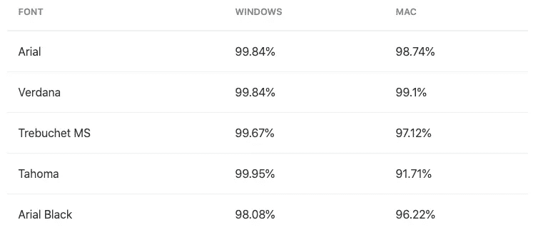
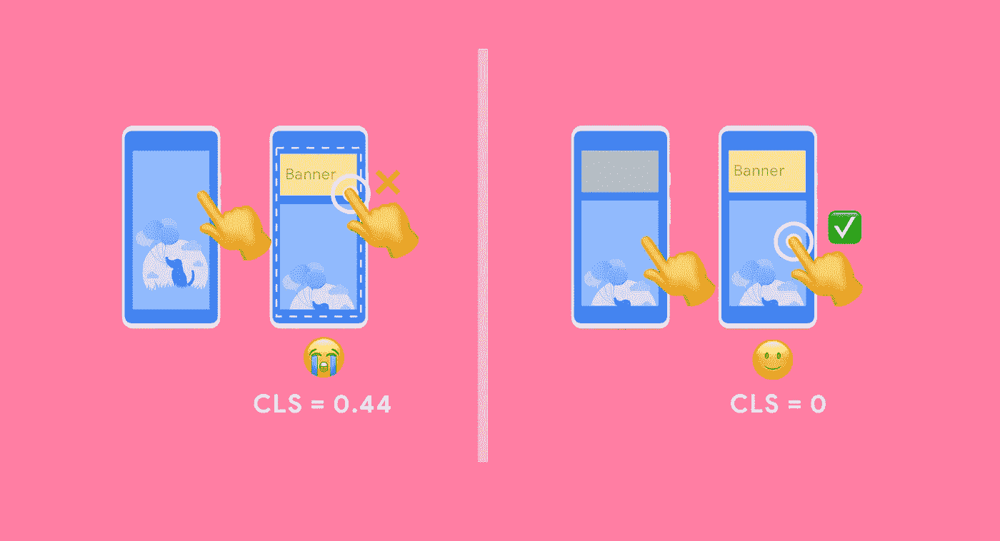

# 现代 web 应用程序性能的终极指南

> 原文：<https://levelup.gitconnected.com/the-ultimate-guide-to-modern-web-application-performance-ec4eec9939>


当我开始写这篇文章的时候，我没有想到它会这么长。无论如何，我希望它能帮助你提高应用程序的性能。祝你好运！

# 目录

*在这里，您只能找到主要部分，因为所有子部分的列表太长了，大约有 107 个。*

**1。压缩算法**

**2。代码拆分和延迟加载**

**3。懒惰或部分水合**

**4。树抖动—死码消除**

**5。Javascript 缩小和优化工具**

**6。库交换**

**7。图像**

**8。字体**

**9。布局重新计算**

**10。外部脚本**

11。前期战略

12。协议

13。缓存

14。有用的工具

# 1.压缩算法

为了最小化提供给客户端的文件的大小，你可以使用不同的压缩算法。在[灯塔](https://developers.google.com/web/tools/lighthouse)里面有一个叫做`Enable text compression`的部分。在这里，您可以找到您提供了额外压缩的文件，或者您的第三方脚本是否提供了压缩。


[https://web.dev/uses-text-compression/](https://web.dev/uses-text-compression/)

## 1.1.Gzip

[Gzip](https://tools.ietf.org/html/rfc1952) 采用了 [LZ77](https://docs.microsoft.com/en-us/openspecs/windows_protocols/ms-wusp/fb98aa28-5cd7-407f-8869-a6cef1ff1ccb) 和[霍夫曼编码](https://web.stanford.edu/class/archive/cs/cs106b/cs106b.1126/handouts/220%20Huffman%20Encoding.pdf)压缩技术。大多数 web 浏览器和客户端都支持它。您可以设置服务器使用动态或静态压缩。与动态压缩您的文件被压缩的飞。使用静态压缩，您需要在构建过程中压缩文件。

Gzip 的压缩率大约为 44%,如下一节所示。

## 无压缩

传输了 445.57 KB，加载时间为 329 毫秒


[https://www . pingdom . com/blog/can-gzip-compression-really-improve-web-performance/](https://www.pingdom.com/blog/can-gzip-compression-really-improve-web-performance/)

## **动态压缩**

传输 197.6 KB，加载时间为 281 毫秒


[https://www . pingdom . com/blog/can-gzip-compression-really-improve-web-performance/](https://www.pingdom.com/blog/can-gzip-compression-really-improve-web-performance/)

## 静态压缩

传输 197.2 KB，加载时间为 287 毫秒


[https://www . pingdom . com/blog/can-gzip-compression-really-improve-web-performance/](https://www.pingdom.com/blog/can-gzip-compression-really-improve-web-performance/)

为了实现更好的静态压缩，你可以使用像 [Zopfli](https://github.com/google/zopfli) 或 [7zip](https://www.7-zip.org/) 这样的高级压缩器来生成你的 gzip 文件。

## 1.2.布罗特利

[Brotli](https://tools.ietf.org/html/rfc7932) 是 Google 开发的无损数据压缩算法[，最适合文本压缩。它使用了 LZ77 算法的现代变体、霍夫曼编码和二阶上下文建模的组合。](https://github.com/google/brotli)

根据[证书样本](https://certsimple.com/blog/nginx-brotli)，

*   用 Brotli 压缩的 Javascript 文件比 gzip 小 14%。
*   HTML 文件比 gzip 小 21%。
*   CSS 文件比 gzip 小 17%。

浏览器对 Brotli 算法的支持有点有限，因为它不支持 IE11，但不要气馁，有一个解决方案。您可以设置一个回退到 gzip 的选项，如下一节所述。还有 NodeJs >11.7。在 [zlib](https://nodejs.org/api/zlib.html#zlib_zlib_createbrotlicompress_options) 模块中有对 brotli 压缩的本地支持。


[https://caniuse.com/#feat=brotli](https://caniuse.com/#feat=brotli)

## 在 NodeJs 服务器中实现静态 Brotli 压缩，并回退到 gzip

*所描述的功能目前对 express 服务器有用，在这些服务器中，我们在* [***压缩***](https://www.npmjs.com/package/compression) *包中没有启用动态 brotli 压缩的选项。* [***压缩***](https://www.npmjs.com/package/compression) *库中接受 brotli 压缩的 PR 仍然打开:*[*【https://github.com/expressjs/compression/pull/156】*](https://github.com/expressjs/compression/pull/156)*。*

为了实现这一功能，我们需要完成两个步骤:

1.  用 webpack 生成 **gzip** 和 **brotli** 压缩文件
2.  根据请求头发送正确的文件

第一步，我们需要使用两个 webpack 插件。[压缩-网络包插件](https://www.npmjs.com/package/compression-webpack-plugin)和[brotli-网络包插件](https://www.npmjs.com/package/brotli-webpack-plugin)。

[](https://www.npmjs.com/package/compression-webpack-plugin) [## 压缩-web pack-插件

### 准备资产的压缩版本，通过内容编码为它们服务。首先，您需要安装…

www.npmjs.com](https://www.npmjs.com/package/compression-webpack-plugin) [](https://www.npmjs.com/package/brotli-webpack-plugin) [## brot Li-web pack-插件

### 此插件使用 Brotli 压缩算法压缩资源，使用 zlib、iltorb 或 brotli.js 库提供…

www.npmjs.com](https://www.npmjs.com/package/brotli-webpack-plugin) 

设置如下:

现在我们需要完成第二步。根据我们使用的服务器，我们应该从以下工具中进行选择:

*   快递[https://www.npmjs.com/package/express-static-gzip](https://www.npmjs.com/package/express-static-gzip)
*   KOA[https://github.com/koajs/static](https://github.com/koajs/static)

以下示例显示了 [express-static-gzip](https://www.npmjs.com/package/express-static-gzip) 库的用法。

通过这两个步骤，我们现在能够根据请求头发送正确的压缩文件。

## 1.4.用于不同 nodeJS 服务器的压缩库

*   快递[https://www.npmjs.com/package/compression](https://www.npmjs.com/package/compression)支持 gzip 和 deflate
*   KOA[https://www.npmjs.com/package/koa-compress](https://www.npmjs.com/package/koa-compress)支持 gzip、deflate 和 brotli
*   fastify[https://www.npmjs.com/package/fastify-compress](https://www.npmjs.com/package/fastify-compress)支持 gzip、deflate 和 brotli

# 2.代码分割和延迟加载

通过代码分割，您的包可以被分割成更小的块。然后，您可以使用惰性加载技术来控制块加载。这也适用于 CSS 文件。

## 2.1.动态导入

如果你使用动态导入，默认情况下 web pack**支持代码分割**。这有助于您根据某些情况按需加载代码。动态导入返回一个承诺。

[](https://developer.mozilla.org/en-US/docs/Web/JavaScript/Reference/Statements/import) [## 进口

### 静态导入语句用于导入由另一个模块导出的只读活动绑定。已导入…

developer.mozilla.org](https://developer.mozilla.org/en-US/docs/Web/JavaScript/Reference/Statements/import) [](https://webpack.js.org/guides/code-splitting/#dynamic-imports) [## 代码分割| webpack

### 本指南扩展了入门和输出管理中提供的示例。请确保您至少…

webpack.js.org](https://webpack.js.org/guides/code-splitting/#dynamic-imports) 

如果你正在使用 **babel** ，你需要确保它能够通过使用[@ babel/plugin-syntax-dynamic-import](https://babeljs.io/docs/en/babel-plugin-syntax-dynamic-import)来解析**动态导入语法**。

 [## @ babel/plugin-syntax-dynamic-导入 Babel

### NPM install-save-dev @ babel/plugin-syntax-dynamic-import { " plugins ":[" @ babel/plugin-syntax-dynamic-import "]} babel…

babeljs.io](https://babeljs.io/docs/en/babel-plugin-syntax-dynamic-import) 

## 2.2.粒状组块

在 Webpack 3 中，引入了 [CommonsChunkPlugin](https://webpack.js.org/plugins/commons-chunk-plugin/) ,使得在单个块中输出不同入口点之间共享的模块成为可能。这是一个很好的特性，但是它也有一些缺点。没有在每个入口点共享的模块也会被下载，即使它们没有被使用。

出于这个原因，在 Webpack 4 中，他们移除了那个插件，取而代之的是一个名为 [SplitChunksPlugin](https://webpack.js.org/plugins/split-chunks-plugin/) 的新插件。这个插件的默认配置对大多数用户来说都很好。如果你喜欢实现更高级的配置，Next.js 团队推出了一个名为粒度分块的特定配置。这意味着:

*   大型第三方模块(大于 160 KB)被分割成各自独立的块
*   为框架依赖关系(`react`、`react-dom`等)创建一个单独的`frameworks`块。)
*   根据需要创建尽可能多的共享块(最多 25 个)
*   要生成的块的最小大小更改为 20 KB

[](https://github.com/vercel/next.js/pull/7696) [## 通过 at castle Pull Request # 7696 ver cel/next . js 实现粒度块

### 此 PR 在新的实验标志后面实现了#7631 中描述的新 Webpack SplitChunksPlugin 配置…

github.com](https://github.com/vercel/next.js/pull/7696) 

这一策略提供了以下好处:

*   **改进页面加载时间**。对于任何入口点来说，不需要的或重复的代码量被最小化。
*   **改进了导航时的缓存**。大型库和框架依赖项的缓存失效减少了，因为它们被分成了独立的块。

在 [Next.js](https://nextjs.org/) 团队成功整合这一配置后 [Gatsby](https://www.gatsbyjs.org/) 曾经遵循同样的方法。

`splitChunks`的 webpack 配置如下所示:

## 2.3.React 内置延迟加载

**React.lazy** 和**悬念**是您可以在 React 应用程序中使用的内置功能。React.lazy 接受一个函数，该函数应该返回动态导入的组件。那么这个懒惰组件应该呈现在悬念组件内部。

[](https://reactjs.org/docs/code-splitting.html#reactlazy) [## 代码拆分—反应

### 大多数 React 应用程序会使用 Webpack、Rollup 或 Browserify 等工具“捆绑”文件。捆绑是一个过程…

reactjs.org](https://reactjs.org/docs/code-splitting.html#reactlazy) 

例如，只有当用户登录时，您才可以使用它来加载应用程序，否则显示登录页面:

不幸的是，React.lazy 和带有动态导入的悬念不能用于服务器端渲染。为此，还有其他几个软件包。

## 2.4.用 SSR 应对延迟加载

React 官方文档推荐的包是[可加载组件](https://github.com/gregberge/loadable-components)库。

[](https://github.com/gregberge/loadable-components) [## gregberge/可加载组件

### React 代码分割变得简单。在没有压力的情况下减少你的包裹尺寸，✂️ ✨.npm install @loadable/component 参见…

github.com](https://github.com/gregberge/loadable-components) 

要使服务器端渲染工作，您需要安装以下软件包:

```
*npm* *install* @loadable/server && *npm* *install* --save-dev @loadable/babel-plugin @loadable/webpack-plugin*# or using yarn**yarn* *add* @loadable/server && *yarn* *add* --dev @loadable/babel-plugin @loadable/webpack-plugin
```

然后你需要设置 babel 配置，webpack 配置，服务器端渲染和客户端初始化。

**。babelrc**

```
{"plugins": ["@loadable/babel-plugin"]}
```

**webpack.config.js**

**服务器端设置**

**客户端设置**

其他类似的库—其中一些不再维护:

[](https://github.com/theKashey/react-imported-component) [## kashey/react-导入组件

### 它真的永远不会让你失望。一切都归功于你的 bundler。阅读有关此表显示的内容的更多信息关键…

github.com](https://github.com/theKashey/react-imported-component) [](https://github.com/faceyspacey/react-universal-component) [## 面空间/反应通用组件

### 🚀React 通用组件的最终答案:同步 SSR +代码拆分…

github.com](https://github.com/faceyspacey/react-universal-component) [](https://www.npmjs.com/package/react-loadable) [## 可反应加载的

### 用于加载动态导入组件的高阶组件。如果您的公司或项目正在使用 React…

www.npmjs.com](https://www.npmjs.com/package/react-loadable) [](https://www.npmjs.com/package/react-async-component) [## 反应异步组件

### 创建异步解析的组件，支持服务器端呈现和代码拆分。

www.npmjs.com](https://www.npmjs.com/package/react-async-component) 

## 2.5.本机 img 和 iframe 延迟加载

基于 chromium 的浏览器有**原生支持**屏幕外的图像延迟加载。它只从每个 img 加载 2Kb，以获取必要的信息。您可以通过将每个图像的`loading`属性设置为`lazy`来实现这一点。


[https://caniuse.com/loading-lazy-attr](https://caniuse.com/loading-lazy-attr)

`loading`属性支持三个值:

*   `lazy`:惰性加载内容
*   `eager`:马上加载内容
*   `auto`:浏览器将决定是否延迟加载内容

幸运的是，我们有一个**解决方案，适用于旧浏览器或者不基于 chromium 的浏览器**。我们需要做一个特征检测，并为此特征使用聚合填充。

当浏览器不支持`loading`属性时，为了防止加载文件夹上方的图像(不在视窗中),我们在图像上设置了`data-src`属性，而不是`src`属性。然后，我们检查`loading`特征，并决定加载所需的 polyfill 或从上述元素的`data-src`属性设置`src`属性。

作为聚合填充，您可以使用 [lazysizes](https://github.com/aFarkas/lazysizes) 库。

[](https://github.com/aFarkas/lazysizes) [## aFarkas/lazysizes

### lazysizes 是一个快速的(免费的)，搜索引擎友好的和自我初始化的 lazyloader，用于图像(包括响应图像…

github.com](https://github.com/aFarkas/lazysizes) 

假设您的代码中有这些图像:

然后，您可以执行以下操作:

## 2.6.图像自定义延迟加载

为此，你可以使用不同的库，比如 [react-simple-img](https://github.com/bluebill1049/react-simple-img) 或者 [react-lazyload](https://www.npmjs.com/package/react-lazyload) 。

[react-simple-img](https://github.com/bluebill1049/react-simple-img) 的用法非常简单:

开箱即用，它支持在文件夹下延迟加载图像——在用户视口之外。

## 2.7.交叉点观察器 API

当页面的某个部分进入用户视口时，您可以使用交叉点观察器 API 延迟加载资源——通常是通过滚动。

您可以在此处更深入地了解交叉点观察点的用法:

[](https://www.smashingmagazine.com/2018/01/deferring-lazy-loading-intersection-observer-api/) [## 现在你看我:如何推迟，偷懒和行动与跨部门观察-粉碎杂志

### 很多原因都需要交集信息，比如图像的延迟加载。但是还有更多。这是…

www.smashingmagazine.com](https://www.smashingmagazine.com/2018/01/deferring-lazy-loading-intersection-observer-api/) 

[https://caniuse.com/intersectionobserver](https://caniuse.com/intersectionobserver)

## 2.8.聚合填充延迟加载

如果您直接从 [core-js](https://github.com/zloirock/core-js) 导入您的 poly fill，或者您使用 [@babel/preset-env](https://babeljs.io/docs/en/babel-preset-env) 插件根据[浏览器列表](https://babeljs.io/docs/en/babel-preset-env#browserslist-integration)设置所需的 poly fill，您可以在您的包中找到您的 poly fill。即使它们不是每次都被执行，它们也会被解析——这意味着你的应用程序的启动被推迟了。对于如何避免加载不必要的代码，我们没有多少选择。

1.  您可以使用[https://polyfill.io/v3/](https://polyfill.io/v3/)来检查用户代理头，并提供专门针对浏览器的聚合填充
2.  或者你可以偷懒加载你的聚合填充

延迟加载聚合填充的设置如下:

## 2.9.CSS 延迟加载

CSS 文件仍然只是文件，因此您可以像处理聚合填充、模块、块等一样处理它们。您还可以使用一些 DOM 事件或交叉点观察器 API 来确定何时加载特定的 CSS 文件。

它可能看起来像这样:

或者，您可以使用如下库:

[](https://github.com/filamentgroup/loadCSS) [## 细丝组/负载

### 异步加载 CSS。在 GitHub 上创建一个帐户，为 filamentgroup/loadCSS 的开发做出贡献。

github.com](https://github.com/filamentgroup/loadCSS) 

## 2.10.CSS 代码分割

最佳实践之一是通过确定在折叠上方使用什么选择器来对 CSS 文件进行代码分割，这意味着为用户可见的页面部分加载 CSS 文件。之后，在用户交互中加载剩余的样式。

这种确定可以通过使用以下库之一来自动进行:

[](https://github.com/filamentgroup/criticalCSS) [## 纤维组/临界

### 找到你的页面的 CSS 文件夹，并输出到一个文件中

github.com](https://github.com/filamentgroup/criticalCSS) [](https://github.com/pocketjoso/penthouse) [## pocket joso/顶层公寓

### 关键路径 css 生成器 Penthouse 是原有的关键路径 CSS 生成器，帮助您加快出页速度…

github.com](https://github.com/pocketjoso/penthouse) [](https://github.com/addyosmani/critical) [## addyosmani/危急

### 从 HTML 中提取并内联关键路径(在文件夹之上)CSS。最新 1.x 版本的文档可以…

github.com](https://github.com/addyosmani/critical) 

# 3.懒惰或部分水合

服务器端呈现的 React 应用程序的水合可能很重。在某些情况下，你甚至不需要对应用程序的某些部分进行水化，因为只有静态内容，没有交互性。

例如，你有一个大菜单，因为搜索引擎优化需要渲染器，但它有超过 1500 个元素。这里唯一的交互是下拉式打开。这个功能可以重写，只使用 css 下拉菜单，跳过整个菜单的水合，或者只水合交互部分，但跳过链接本身的水合。

要做到这一点，你可以使用 [react-lazy-hydration](https://github.com/hadeeb/react-lazy-hydration) 库。

[](https://github.com/hadeeb/react-lazy-hydration) [## hadeeb/react-lazy-水合作用

### 服务器渲染反应组件的惰性水合作用 npm i 反应-惰性水合作用或纱线添加反应-惰性水合作用基于…

github.com](https://github.com/hadeeb/react-lazy-hydration) 

React 团队计划在库本身中实现这一功能:

*   https://github.com/facebook/react/pull/14717
*   【https://github.com/reactjs/rfcs/pull/46 

使用当前的 React 版本，您可以轻松实现这一点，如下所示:

通过这种设置，您可以跳过客户端 SSR 不匹配的警告，并且完全跳过水合作用。

如果你正在使用 Next.js，有一个 [next-super-performance](https://github.com/LukasBombach/next-super-performance) 库用于部分水合和一些其他特性来提高你的应用程序性能。

[](https://github.com/LukasBombach/next-super-performance) [## LukasBombach/next-超级性能

### 使用 Preact X 为 Next.js 进行部分水合。解释:在 spring，我们正在为报纸创建网站，我们…

github.com](https://github.com/LukasBombach/next-super-performance) 

# 4.树抖动—死代码消除

## 4.1.java 描述语言

树抖动是 javascript 中常用的一种方法或术语，意思是死代码消除。它依赖于静态代码分析。每个更大的模块捆绑器都实现了这一功能。

[](https://webpack.js.org/guides/tree-shaking/) [## 摇树|网络包

### webpack 是一个模块捆绑器。它的主要目的是捆绑 JavaScript 文件以便在浏览器中使用，但它也…

webpack.js.org](https://webpack.js.org/guides/tree-shaking/) [](https://medium.com/@devongovett/parcel-v1-9-0-tree-shaking-2x-faster-watcher-and-more-87f2e1a70f79) [## 摇树|包裹 v1.9.0

### 今天，我非常兴奋地发布了 package v 1 . 9 . 0，这是一个巨大的版本，包含了一些非常棒的特性！请查看…

medium.com](https://medium.com/@devongovett/parcel-v1-9-0-tree-shaking-2x-faster-watcher-and-more-87f2e1a70f79) [](https://rollupjs.org/guide/en/#tree-shaking) [## 树摇动|卷起

### Rollup 是 JavaScript 的一个模块捆绑器，它将小段代码编译成更大更复杂的代码…

rollupjs.org](https://rollupjs.org/guide/en/#tree-shaking) 

## 4.2.半铸钢ˌ钢性铸铁(Cast Semi-Steel)

为了消除死的 CSS 代码，你可以使用一些在线工具或库，它们可以很容易地与你的构建工具集成。

## 手动操作

1.  打开 [Chrome DevTools](https://www.keycdn.com/blog/chrome-devtools)
2.  点击右上角的三个点
3.  转至“更多工具”,然后选择“覆盖范围”
4.  单击重新加载图标
5.  从 Coverage 选项卡中选择一个 CSS 文件，这将在 Sources 选项卡中打开该文件


[https://www.keycdn.com/](https://www.keycdn.com/)

## 未使用的 CSS

[](https://unused-css.com/) [## 移除未使用的 CSS |未使用的 CSS

### 发现 UnusedCSS 如何帮助你的网站平均来说，大约 35%的 CSS 代码是完全不必要的。我们…

unused-css.com](https://unused-css.com/) 

*   带付费计划的在线工具
*   您应该手动配置所有页面，在这些页面中应该寻找使用过的 css 选择器

## 纯化 CSS

[](https://purifycss.online/) [## 在线净化 CSS 删除未使用的 CSS

### 关于这个工具使用 PurifyCSS，这是 Ilias Ismanalijev 制作的 JS 库，可以扫描你的源代码(HTML 和…

purifycss.online](https://purifycss.online/) 

*   这是一个免费的在线工具，而且它有一个构建时集成
*   您必须手动指定要逐一扫描的文件

## 采购

[](https://purgecss.com/) [## 移除未使用的 CSS —清除 CSS

### 提示该文档适用于 PurgeCSS 3.0 及更高版本。要查看 PurgeCSS 2.x 的文档，请单击此处 PurgeCSS 是…

purgecss.com](https://purgecss.com/) 

*   建立时间整合的免费图书馆

## JS 库中的 CSS

JS 库中有大量的 CSS，其中一些不再被维护。以下是一些例子:

*   [JSS](https://cssinjs.org/)
*   [风格化组件](https://styled-components.com/)
*   [镭](https://github.com/FormidableLabs/radium)
*   [阿芙罗狄蒂](https://github.com/Khan/aphrodite)
*   [情感](https://github.com/emotion-js/emotion)
*   [魅力](https://github.com/threepointone/glamor)
*   [光鲜亮丽](https://github.com/paypal/glamorous)
*   [费拉](https://github.com/robinweser/fela)
*   [电子管](https://github.com/styletron/styletron)
*   [反应 CSS 模块](https://github.com/gajus/react-css-modules)
*   [对风格做出反应](https://github.com/airbnb/react-with-styles)
*   [利纳瑞](https://github.com/callstack/linaria)
*   等等。

通过在 JS 库中使用 CSS，你可以从你的页面中消除所有死的 CSS 代码，但是请记住，其中一些库可能会有大量的运行时代码，这些代码会降低你的应用程序的速度。

# 5.Javascript 缩小和优化工具

以下工具通过删除不必要的字符、重命名变量甚至执行应用程序的某些部分来生成更高效的代码，从而减小 javascript 文件的大小。

## 5.1.预先包装

[](https://prepack.io/) [## 预先包装

### 开箱即用，Prepack 并不完全建模浏览器或 node.js 环境:Prepack 没有内置的知识…

prepack.io](https://prepack.io/) 

*   通过在构建时运行 javascript 代码来优化它
*   Webpack 插件:[https://github.com/gajus/prepack-webpack-plugin](https://github.com/gajus/prepack-webpack-plugin)

## 5.2.关闭

[](https://github.com/google/closure-compiler) [## google/closure 编译器

### 闭包编译器是一个让 JavaScript 下载和运行更快的工具。这是一个真正的 JavaScript 编译器…

github.com](https://github.com/google/closure-compiler) 

*   它从 javascript 编译成更好的 javascript
*   删除死代码，重写并最小化剩下的代码
*   Webpack 插件:【https://github.com/webpack-contrib/closure-webpack-plugin 

## 5.3.包装工人

 [## /packer/

### Javascript 压缩器。

迪安·爱德华兹名字](http://dean.edwards.name/packer/) 

*   缩小您的 javascript 代码
*   复制粘贴服务

## 5.4.丑陋的 JS

[](https://www.npmjs.com/package/uglify-js) [## 丑陋-js

### JavaScript 解析器、处理器/压缩器和美化工具包

www.npmjs.com](https://www.npmjs.com/package/uglify-js) 

*   CLI 和节点 API 工具包
*   缩小和压缩您的 javascript 代码
*   Webpack 插件:【https://www.npmjs.com/package/uglifyjs-webpack-plugin 

## 5.5.简洁的

[](https://github.com/terser/terser) [## 特塞尔/特塞尔

### 用于 ES6+ - terser/terser 的🗜 JavaScript 解析器、处理器和压缩器工具包

github.com](https://github.com/terser/terser) 

*   webpack 的默认生产尺寸
*   [https://webpack.js.org/plugins/terser-webpack-plugin/](https://webpack.js.org/plugins/terser-webpack-plugin/)

## 5.6.使变小

[](http://coderaiser.github.io/minify/) [## 使变小

### js，css，html 和 img 的 Minifier 找错别字？帮忙修一下。一个 js，css，html 和 img 文件的缩小器，用在…

coderaiser.github.io](http://coderaiser.github.io/minify/) 

*   js，css，html 和 img 文件的迷你化

## 5.7.巴别塔迷你化

[](https://github.com/babel/minify) [## 巴别塔/迷你

### 一个基于巴别塔工具链的 ES6+感知迷你器。babel-minify 可通过 API、CLI 或 babel 预设来使用。试试看…

github.com](https://github.com/babel/minify) 

*   巴别塔迷你机
*   尚未做好生产准备

## 5.8.生产

 [## 生产

### 安装命令行工具:NPM-g I Prodi fy 它将在您的终端上显示“Prodi fy”命令。

producify.js.org](https://producify.js.org/) 

*   CLI 和节点 API 工具包

## 5.9.时髦的

[](https://www.npmjs.com/package/snappy) [## 时髦的

### Nodejs 绑定到 snappy compression 库压缩输入，它可以是一个缓冲区或字符串。回拨…

www.npmjs.com](https://www.npmjs.com/package/snappy) 

*   压缩和解压缩库

# 6.图书馆交换

## 6.1.预先行动而不是反应

[](https://preactjs.com/) [## 提前

### 快速 3kB 替代方案，可与相同的现代 API 一起使用开始切换到 Preact 函数 Counter ( ) { const…

preactjs.com](https://preactjs.com/) 

Preact 基本上是 react 的轻量级版本。当性能、速度和尺寸是优先考虑的因素时，您可以选择使用它。

**优点:**

*   压缩后只有 3KB 大小
*   比反应更快(见这些[测试](https://developit.github.io/preact-perf/))
*   它在很大程度上与 React 兼容，因此出于性能原因，很容易将 React 与 p React 替换为现有项目
*   官方网站上有很好的文档和示例
*   它有一个强大的官方命令行界面

**缺点:**

*   仅支持无状态功能组件和基于 ES6 类的组件定义
*   不支持上下文
*   不支持属性类型
*   比 React 小的社区

## 6.2.Linaria 而不是 styled-components

[](https://github.com/callstack/linaria) [## 调用堆栈/linaria

### JS 库中的零运行时 CSS。在 GitHub 上创建一个帐户，为 callstack/linaria 开发做贡献。

github.com](https://github.com/callstack/linaria) 

样式化组件可能需要很长时间才能将页面与大量样式融合在一起:


CPU i9 2,4Ghz 6x 倍减速

styled-components 库附带了一个开销和运行时代码，它会降低页面解析水合过程的速度，如上所示。

幸运的是，这个包有一个类似 API 的替代品。它叫做 [Linaria](https://github.com/callstack/linaria) 。这些包之间的主要区别是 Linaria 在构建时将 CSS 提取到单独的文件中，而样式化组件在运行时提取 CSS。这意味着 Linaria 的运行时间**为零。**

**优点**:

*   缩短了加载时间，因为 CSS 和 JavaScript 可以并行加载，不像 JS 库中的运行时 CSS，CSS 和 JS 在同一个包中
*   提高运行时性能，因为在运行时不需要做额外的工作，如解析 CSS
*   服务器端呈现的 CSS 和 JavaScript 包之间没有样式重复
*   因为 Linaria 在构建时工作，所以不需要通过 SSR 设置来缩短首次绘图的时间，也不需要在没有 JS 的情况下让页面工作

**限制**:

*   在使用`styled`的组件中使用动态样式时不支持 IE11，因为它使用 CSS 自定义属性
*   `css`标签不支持动态样式
*   CSS 规则中使用的模块不能有副作用。例如:

```
import { css } from 'linaria';
import colors from './colors';const title = css`
  color: ${colors.text};
`;
```

在`colors.js`文件或者它导入的任何文件中应该没有副作用。您应该在没有任何副作用的情况下将助手和共享配置移动到文件中。

## 6.4.lodash-es 代替 lodash

[](https://www.npmjs.com/package/lodash-es) [## 洛达什-埃斯

### Lodash 作为 ES 模块导出。

www.npmjs.com](https://www.npmjs.com/package/lodash-es) 

通过更多的实用程序，我们可以使用[**lodash-es**](https://www.npmjs.com/package/lodash-es)**而不是 [**lodash**](https://www.npmjs.com/package/lodash) 来节省大小。下面是一个表格，对提到的包进行了比较。**

**此外，一些包使用了这样或那样的方法，所以在 webpack 配置中创建一个别名来在任何地方使用 **lodash-es** 来防止两次捆绑这些库。**

```
module.exports = {
  resolve: {
    alias: {
      'lodash-es': 'lodash',
    },
  },
};
```

## **6.5.解开而不是腋窝，等等。**

**[](https://www.npmjs.com/package/unfetch) [## 放开

### Tiny 500b fetch“勉强填充”Minimal:仅 fetch()带有熟悉的头和文本/json 响应:是…

www.npmjs.com](https://www.npmjs.com/package/unfetch) 

[**Axios**](https://www.npmjs.com/package/axios) 可能为我们提供了很多功能，但在大多数情况下我们甚至都没有使用它。另一方面，这个包的未压缩大小接近 350Kb。如果你只使用它的基本功能，这就太多了。

这个包的替代方案是 [**unfetch**](https://www.npmjs.com/package/unfetch) ，它只有大约 **30Kb** 未压缩，可以提供我们需要的一切。这个包的大小节省了大约 90%。

对于那些使用 [**同构获取**](https://www.npmjs.com/package/isomorphic-fetch) 为节点环境和前端实现相同功能的人来说，有一个 [**同构解锁**](https://github.com/developit/unfetch/tree/master/packages/isomorphic-unfetch) 包。

## 6.6.date-fns 代替 moment.js

[](https://www.npmjs.com/package/date-fns) [## 日期-fns

### 现代 JavaScript 日期实用程序库

www.npmjs.com](https://www.npmjs.com/package/date-fns) 

第一眼看上去，如果你检查缩小的文件，你可以说 date-fns 比 moment.js 大。

*   [date-fns.min.js](https://cdnjs.cloudflare.com/ajax/libs/date-fns/1.29.0/date_fns.min.js) — 68 Kb
*   [moment.min.js](https://cdnjs.cloudflare.com/ajax/libs/moment.js/2.22.2/moment.min.js) — 50 Kb

是的，这是正确的，但在现实世界的应用程序中，你不会使用这些软件包提供的所有功能，所以树抖动和丑化可以完成这项工作。

如果我们从 moment.js 中取出一些常用函数，比如说`format()`、`duration()`、`humanize()`和`utc()`，并将其替换为 date-fns 中的等效函数，我们将得到如下块大小:

*   日期-fns.js — 29.3 Kb
*   moment.js — 57.1 Kb


示例代码为[的回购此处为](https://github.com/artemdemo/date-fns-vs-moment)。

# 7.形象

根据 HTTP 存档，图片占所有请求的 30%。那么我们来谈谈如何优化这些资源。

## 7.1.正确的图像尺寸

你应该总是使用完全填满其容器的图像，没有溢出的确切尺寸。因此，对于 200 像素宽 200 像素高的容器，使用相同尺寸的重新调整图像。使用这种方法，浏览器不需要在调整图像大小时做额外的工作。

## 7.2.使用 srcset、大小和媒体属性


【https://caniuse.com/srcset】

这些属性允许您根据显示器的大小提供不同比例的图像。没有必要为手机和电脑提供相同的图像。

## srcset

`srcset`属性可以用在``和`<source>`元素中。在这种情况下，我们只依赖浏览器的视窗。

## 大小

属性定义了一组媒体条件，它告诉浏览器如果某些条件成立，应该选择什么样的图像尺寸。可以和`srcset`结合使用。

## 媒体

`media`属性类似于`sizes`属性。当`<source>`元素是`<picture>`元素的子元素时，可以在该元素上使用它。不同之处在于，使用`media`属性，您可以定义媒体条件，而无需定义视窗宽度。然后，如果满足条件，则使用正确的图像大小。

## 像素密度描述符

除了视窗之外，还可以根据显示器的像素密度来定义使用什么图像。使用`1x`、`2x`和`3x`定义这些描述符。因此，您可以使用比原始图像更大的图像，同时保持相同的尺寸。

## 7.3.正确的图像格式

有很多图像格式可以使用。我将描述最常见的几种。

## **JPEG**

*   不支持透明
*   可以支持大约 1600 万种颜色
*   将它用于包含自然场景的所有图像或颜色和强度变化平滑的照片

## PNG

*   支持透明度
*   PNG8 最多可支持 256 种颜色
*   PNG24 可以处理多达 1600 万种颜色
*   将它用于需要透明度的图像或带有鲜明对比边缘(如徽标)的图像

## GIF 格式

*   图像支持透明
*   仅限于 256 种颜色
*   支持动画
*   将它用于包含动画的图像

## WEBP


[https://caniuse.com/webp](https://caniuse.com/webp)

*   试图将已经提到的格式中最好的部分与更好的压缩率结合起来
*   比巴布亚新几内亚小约 26%
*   比 JPEG 小 25% — 34%

为了用 HTML 提供 WEBP 格式，你可以使用`<picture>`和`<source>`元素。不支持这些元素的浏览器会跳过它们，只读取``元素。

## AVIF


[https://caniuse.com/avif](https://caniuse.com/avif)

AVIF 图像格式还不被真正支持。这是因为这是一个真正的新技术，你可以感到兴奋。相应于 [ctrl.blog](https://www.ctrl.blog/entry/webp-avif-comparison.html) AVIF 是:

*   比 WEBP 小约 20%
*   比 JPEG 小约 50%

这种格式是由开放媒体联盟开发的。它被创建为一种开源且免版税图像格式。

尽管支持很差，我们仍然可以使用带有`<picture>`元素的原生 HTML 格式。`<picture>`元素允许渐进式支持，因此浏览器将从提供的列表中加载它支持的第一个。

## 渐进 JPEG

JPEG 图像的**基线渲染**是从上到下高质量的加载。

**渐进式渲染**意味着首先加载一个低质量的 JPEG 图像，然后不断添加更多像素，直到加载完整质量的图像。这可以显著改善你的网站的用户体验。


您可以通过转换标准 JPEG 图像来实现渐进式 JPEG 格式。

## 挽救（saving 的简写）

*   可缩放矢量格式
*   非常适合徽标、图标、文本和简单图像
*   与 JPEG 或 PNG 相比，简单的 SVG 图像(可以转换为矢量)的大小可以小 90%


节省高达 90%的示例图像

## 7.5.压缩您的图像

即使选择了正确的图像格式或尺寸，仍有压缩的空间。一种方法是从图像中删除所有不必要的元数据，而不改变图像质量。这叫做**无损压缩**。

另一方面，也可以使用**有损**压缩，这可以移除几乎所有的元数据并降低图像质量。对于人眼来说，这种质量降低在大多数情况下是不明显的，并且尺寸上的节省可以高达 25%。

一些压缩算法包括:

*   [充气/放气](https://www.prepressure.com/library/compression-algorithm/flate-deflate)
*   [JPEG](https://www.prepressure.com/library/compression-algorithm/jpeg)
*   [JPEG2000](https://www.prepressure.com/library/compression-algorithm/jpeg2000)
*   [霍夫曼](https://www.prepressure.com/library/compression-algorithm/huffman)
*   [LZW](https://www.prepressure.com/library/compression-algorithm/lzw)
*   [RLE](https://www.prepressure.com/library/compression-algorithm/rle)

## 7.6.从无 cookie 域传送图像

静态图像文件应该从不使用 cookies 的不同域或子域(例如*static.your-domain.com*)交付。

这种方法有两个好处:

*   有效缓存
*   传输的数据较少

## 7.7.从 CDN 传送图像

内容交付网络(cdn)是分布在世界各地的多台服务器，您的静态文件就存储在这里。根据需要，它从离用户最近的服务器上传送文件。

通常 cdn 是付费服务。几乎所有这些都为您提供了图像处理选项。这意味着它们会自动优化您的图像以获得更好的性能。

例如，在 [Cloudflare](https://www.cloudflare.com/) 上，你可以启用[抛光选项](https://support.cloudflare.com/hc/en-us/articles/360000607372-Using-Cloudflare-Polish-to-compress-images)来压缩你的图像。

## 7.8.图像修改工具

*   [像素化器](https://www.pixelmator.com/pro/)
*   [Irfanview](https://www.irfanview.com/)
*   [Xnview](https://www.xnview.com/en/xnconvert/)
*   [优化器](https://imagecompressor.com/)
*   [暴乱](https://riot-optimizer.com/)
*   [Adobe Photoshop](http://www.photoshop.com/)
*   [Gimp](http://www.gimp.org/)
*   [Paint.NET](http://www.getpaint.net/index.html)
*   [礼品](http://www.lcdf.org/gifsicle/)
*   [JPEGtran](http://jpegclub.org/jpegtran/)
*   [JPEG Mini](http://www.jpegmini.com/)
*   [选项](http://optipng.sourceforge.net/)
*   [pngquant](http://pngquant.org/)
*   [文件优化器](http://netm.ag/optimize-263)
*   [ImageOptim](http://imageoptim.com/)
*   [三位一体](http://trimage.org/)
*   [ImageResize.org](https://imageresize.org/compress-images)
*   [图像优化器](https://kinsta.com/blog/optimize-images-for-web/#imagify)
*   [短像素图像优化器](https://kinsta.com/blog/optimize-images-for-web/#shortpixel)
*   [最佳摩尔](https://kinsta.com/blog/optimize-images-for-web/#optimole)
*   [EWWW 图像优化器云](https://kinsta.com/blog/optimize-images-for-web/#ewww-cloud)
*   [Optimus 图像优化器](https://kinsta.com/blog/optimize-images-for-web/#optimus)
*   [WP Smush](https://kinsta.com/blog/optimize-images-for-web/#wp-smush)
*   [TinyPNG](https://kinsta.com/blog/optimize-images-for-web/#tinypng)
*   [图像回收](https://kinsta.com/blog/optimize-images-for-web/#imagerecycle)

## 7.9.Webpack 加载器

有几个工具可以包含在您的构建过程中。下面就来说说其中的一些。

## 图像网络包加载器

[](https://www.npmjs.com/package/image-webpack-loader) [## 图像-网络包-加载器

### webpack Minify PNG、JPEG、GIF、SVG 和 WEBP 图像的图像加载器模块，带有 imagemin 输出问题，应该…

www.npmjs.com](https://www.npmjs.com/package/image-webpack-loader) 

把这个加载器放在你的 [url 加载器](https://github.com/webpack-contrib/url-loader)或[文件加载器](https://www.npmjs.com/package/file-loader)前面，它会压缩和优化你的图像。

## SVG URL 加载程序

[](https://www.npmjs.com/package/svg-url-loader) [## svg-url-loader

### 一个 webpack 加载器，它以 utf-8 编码的 DataUrl 字符串的形式加载 SVG 文件。现有始终为…进行 Base64 编码

www.npmjs.com](https://www.npmjs.com/package/svg-url-loader) 

标准的 [url 加载器](https://github.com/webpack-contrib/url-loader)总是对数据 uri 使用 base64 编码。base64 编码的资源平均比原始资源大 37%。svg-url-loader 使用 UTF-8 编码对 svg 进行编码。好处如下:

*   结果更小(最多小 2 倍)
*   使用 gzip 压缩可以更好地压缩结果
*   浏览器解析器 UTF-8 编码字符串速度更快

# 8.字体

## 8.1.自定义 web 字体

如果您从自己的服务器提供字体，您可以创建您正在使用的字符的子集。这将有助于加载你的字体更快。为此，可以使用以下库:

*   [子字体](https://www.npmjs.com/package/subfont)
*   [glyphhanger](https://github.com/filamentgroup/glyphhanger)

## 8.2.福伊特

网页字体加载时间过长时，可能会出现不可见文本闪烁。

## 字体显示属性

为了支持用户体验和第一次内容丰富的绘画，如果您使用自定义字体，请使用`font-display: swap;` CSS 属性。这将确保在加载自定义字体时显示默认字体。Google fonts 也支持这个特性，只需在 fonts URL 中添加`&display=swap`查询参数。这将导致无样式文本的闪烁( *FOUT* )，但这是为更好的 UX 所付出的小小代价。

## 字体加载事件

这个问题还有另一个解决方案，就是检测你的字体何时被加载，并控制显示过程。可以通过使用 [CSS 字体加载 API](https://developer.mozilla.org/en-US/docs/Web/API/CSS_Font_Loading_API) 来完成。由于不是每个浏览器都支持它，您可以使用一些替代方法:

*   [fontfaceobserver](https://github.com/bramstein/fontfaceobserver)
*   webfontloader


[https://caniuse.com/mdn-api_fontfacesetloadevent](https://caniuse.com/mdn-api_fontfacesetloadevent)

为了展示一些例子，我将使用 [fontfaceobserver](https://github.com/bramstein/fontfaceobserver) 库。

*   首先——加载你的字体，不做任何修改
*   第二步—创建 CSS 类:

*   第三，为每个使用的字体系列设置字体外观观察器，并在它们加载后设置正文类:

## 将字体保存到本地存储

由于本地缓存经常刷新，尤其是在移动设备上，一个好的方法是将你的字体存储到客户端`localStorage`。

我们将使用与字体观察者相同的 CSS 类。那么我们将使用下面的代码:

这里我们检查对`localStorage`的支持，以及是否有自定义键`webFonts`的值。如果是，我们用该值注入一个样式标签，如果不是，我们用该字体加载 CSS，并将该值插入本地存储。


[https://caniuse.com/mdn-api_window_localstorage](https://caniuse.com/mdn-api_window_localstorage)

## 8.3.字体预加载

当你预加载你的字体时，使用链接标签的`crossorigin=anonymous`属性。没有该属性，预装的字体将被忽略([https://github.com/w3c/preload/issues/32](https://github.com/w3c/preload/issues/32))。

## 8.4.Google 字体预加载

如果你使用谷歌字体更好地自托管这些字体，以更快地加载它们——因为浏览器不必建立新的连接。您可以使用[Google-fonts-web pack-plugin](https://www.npmjs.com/package/google-fonts-webpack-plugin)在构建期间下载这些字体。

## 8.5.字体格式

**TrueType 字体(TTF)** 由苹果和微软在 80 年代后期开发。这是最常见的字体格式。


[https://caniuse.com/ttf](https://caniuse.com/ttf)

**Web 开放字体格式(WOFF)** 于 2009 年开发，用于网页。 *WOFF* 基本上就是 *OpenType* 或者 *TrueType* 加上压缩和额外的元数据。


[https://caniuse.com/woff](https://caniuse.com/woff)

**Web Open Font Format 2(woff 2)**比 *WOFF 有更好的压缩效果。*


[https://caniuse.com/woff2](https://caniuse.com/woff2)

**嵌入式开放字体(EOT)** 是微软设计的 *OpenType* 字体的精简形式，用作网页上的嵌入式字体。


[https://caniuse.com/eot](https://caniuse.com/eot)

## 选什么？

这里最好的选择是为 WOFF 和 WOFF2 格式提供 web 安全字体的后备。web 安全字体是用户计算机上预先安装的字体。你可以在[cssfontstack.com](https://www.cssfontstack.com/)上查看报道。

前 5 种**无衬线字体** web 安全字体是:



前 5 种**衬线字体** web 安全字体是:


用 CSS 提供 WOFF 和 WOFF2 格式:

还有退路:

# 9.布局重新计算

在 Firefox 的世界里，他们称之为 **DOM reflow** ，在 Chrome/Opera/IE/Safari 的世界里，这是**布局转移**。

这些术语指的是同一个东西—布局重新计算。这是一个用户阻塞操作，它重新计算元素的尺寸和在文档中的位置。

这种事经常发生:

*   移动，动画，删除，插入，更新一个 DOM 元素
*   修改页面内容，例如在输入框中写入内容
*   更改 CSS 样式
*   滚动，调整窗口大小
*   测量一个元素——例如`offsetHeight`

有关触发布局重新计算的 javascript 操作的详细列表，请查看此[列表](https://gist.github.com/paulirish/5d52fb081b3570c81e3a)。还有一个 CSS 属性的列表。

## 9.1.如何避免它的一些提示

*   对于变化太频繁的元素，使用`fixed` / `absolute`位置
*   把`display`换成`visibility`
*   对布局使用伸缩框
*   使用`cssText`进行多个布局更改
*   用`textContent`代替`innerText`

## 9.2.`contain` CSS 属性

如果有很多样式重新计算，请使用`container: content` CSS 属性。它告诉浏览器，该元素与周围的文档是隔离的，所以如果其中有什么变化，就不需要重新计算整个布局。

## 9.3.累积布局偏移— CLS

下图非常恰当地描述了累积布局偏移的含义:



[https://web.dev/optimize-cls/](https://web.dev/optimize-cls/)

CLS 是谷歌定义的[核心网络要素](https://web.dev/vitals/)之一。它衡量视觉稳定性和意想不到的布局变化量。每当一个可见实体在两个框架之间改变其起始位置时，就会发生布局移动。

如图所示，这会让用户体验变得非常糟糕。它可能由以下原因引起:

*   不可见文本的闪烁
*   FOUT —无样式文本的闪现
*   FOUC —未样式化内容的 flash
*   使用图像、嵌入、横幅广告等。没有具体的尺寸
*   任何动态注入的内容

为了提高 CLS 或将其从您的第一次装载中完全移除，您可以使用以下策略:

*   显示白页，直到应用程序完全加载
*   实现框架屏幕——页面中填充了具有预定义尺寸和一些加载指示器的框
*   对于字体，使用`display: swap;`属性并通过链接标签预加载它们


媒体主页骨架屏幕的实现

# 10.外部脚本

在页面解析过程中，当浏览器遇到一个`<script>`元素时，它开始下载并执行它。这将停止 HTML 页面的解析过程。这可能导致两个主要问题:

*   在这些脚本加载和执行之前，用户可能只能看到白页
*   被执行的脚本不能访问它下面的 DOM 元素，因为它们还没有被解析
*   该页面在很长一段时间内是不交互的

在现代网页上，通常 javascript 是最重要的东西——就其大小和执行时间而言。对于 GTM、Adobe 发布会、营销脚本、A/B 测试库、嵌入视频等第三方脚本来说更是如此。

## 10.1.延迟和异步脚本标记

为了避免 HTML 解析的阻塞，可以在外部脚本标签上使用`defer`和`async`属性。它们不适用于内联脚本。

## 正常(同步)执行

默认情况下，javascript 文件会中断 HTML 文档的解析，以便获取和执行它们。

避免白页和 DOM 元素访问问题的一个方法是，你可以把你的脚本放在`</body>`标签之前，但另一方面，页面加载时间仍然会更长。


[https://flaviocopes.com/javascript-async-defer/](https://flaviocopes.com/javascript-async-defer/)

## 异步ˌ非同步(asynchronous)

```
<script **async** src="script.js"></script>
```


异步属性[https://caniuse.com/script-async](https://caniuse.com/script-async)

`async`属性向浏览器指示脚本可以与 HTML 解析并行提取，但是在提取之后开始执行——在执行期间，HTML 解析暂停。


[https://flaviocopes.com/javascript-async-defer/](https://flaviocopes.com/javascript-async-defer/)

因为获取和执行是异步的，所以不保留`async`脚本的顺序。

## 推迟

```
<script **defer** src="script.js"></script>
```


延期属性[https://caniuse.com/script-defer](https://caniuse.com/script-defer)

`defer`属性在获取方式上与`async`属性类似，但是下载的脚本只有在 HTML 解析完成之后，就在`domInteractive`事件之后执行。它还确保了这些脚本的执行顺序。


[https://flaviocopes.com/javascript-async-defer/](https://flaviocopes.com/javascript-async-defer/)

## 选什么？

我的建议是对您自己的脚本使用`defer`属性。它确保您更快的页面加载和保持脚本执行的顺序。

## 可供选择的事物

有一个凯尔·辛普森写的小库叫做 [LABjs](https://github.com/getify/LABjs) 。

[](https://github.com/getify/LABjs) [## getify/labj

### 重要:这个项目正在经历一个完整的 3.0 重写。请跟踪进度。LABjs 是一个动态脚本…

github.com](https://github.com/getify/LABjs) 

这个库通过全面的跨浏览器支持对加载过程提供了更多的控制，并试图并行下载尽可能多的代码。

## 10.2.自定义延迟脚本

为了允许页面完全加载并具有交互性，我们可以为 GTM、Adobe launch 等第三方创建自定义的延迟脚本。

目标很明确——只有在页面加载后才加载第三方脚本。这可以通过以下脚本实现:

## 10.3.第三方资源阻止

对于更高级的脚本加载操作，您可以结合不同的技术。

首先，您可以使用一些库来阻止第三方脚本，如 [yett](https://github.com/elbywan/yett) ，然后，当用户进行交互时或在 TTI(交互时间)后，您可以取消阻止这些脚本。

[](https://github.com/elbywan/yett) [## 埃尔比万/耶特

### 只需将 yett 放在 html 的顶部，它将允许您阻止和延迟其他脚本的执行。[ ❓]…

github.com](https://github.com/elbywan/yett) 

TTI 是通过监控性能 API 和 CPU 活动周期在客户端计算的。这样做的好处是，谷歌灯塔不会监控 TTI 之后执行的代码。对于 TTI 活动，您可以使用谷歌的 [tti-polyfill](https://github.com/GoogleChromeLabs/tti-polyfill) 库或其他一些库，例如[互动时间](https://github.com/gauravbehere/time-to-interactive)库。

[](https://github.com/GoogleChromeLabs/tti-polyfill) [## GoogleChromeLabs/tti-polyfill

### 用于交互时间度量的聚合填充。有关深入的实施细节，请参见指标定义。你可以…

github.com](https://github.com/GoogleChromeLabs/tti-polyfill) [](https://github.com/gauravbehere/time-to-interactive) [## gauravbehere/互动时间

### 为 web 应用程序演示的真实用户监控(RUM)报告交互时间(tti)的实用程序…

github.com](https://github.com/gauravbehere/time-to-interactive) 

## 10.4.适应性计算

另一种方法是自适应计算。与 TTI 类似，您可以获得设备容量和网络速度。根据这些指标，您可以解锁被阻止的第三方资源。


[https://caniuse.com/mdn-api_networkinformation](https://caniuse.com/mdn-api_networkinformation)

为了获得所需的度量，可以使用[网络信息 API](https://developer.mozilla.org/en-US/docs/Web/API/Network_Information_API) 。不幸的是，它在浏览器中的支持很差。解决方法是使用聚合填料:

 [## 网络信息 API poly fill MattSnider.com

### 浏览器正在慢慢实现许多新的 HTML5 APIs，其中之一是网络信息 API。它暴露了…

mattsnider.com](https://mattsnider.com/network-information-api-polyfill/) 

React 还有一个名为 [react-adaptive-hooks](https://github.com/GoogleChromeLabs/react-adaptive-hooks) 的库。通过这种方式，您可以控制在连接速度较慢的设备上加载组件，或者根据设备速度进行加载。

在这里，您可以查看 google 开发人员提供的一些自适应加载示例:

[](https://github.com/GoogleChromeLabs/adaptive-loading) [## Google chrome labs/自适应加载

### 探索如何基于暴露于 web 的信号加载和呈现最合适的组件版本…

github.com](https://github.com/GoogleChromeLabs/adaptive-loading) 

# 11.前期战略

让我们看看如何在解析期间预加载、预取一些资源，甚至是用户将来可能导航的整个页面，以改善用户体验和未来页面的速度指标。

## 11.1.链接标签前置属性

应用预策略最简单的解决方案是对 link 元素的`rel`属性使用特定的值。

## DNS 预取

```
<link **rel="dns-prefetch"** href="//example.com">
```

DNS 预取用于指示将用于获取所需资源的来源，并且用户代理应该尽早解析该来源。这确保了当浏览器需要开始下载一些资源时，DNS 查找将会完成，或者至少已经在进行中。


[https://caniuse.com/link-rel-dns-prefetch](https://caniuse.com/link-rel-dns-prefetch)

## **预连接**

```
<link **rel="preconnect"** href="https://example.com">
```

类似于 *dns 预取*，但是当*预连接*时，它将执行 dns 查找、TLS 协商和 TCP 握手。


[https://caniuse.com/link-rel-preconnect](https://caniuse.com/link-rel-preconnect)

## 事先装好

```
<link **rel="preload"** href="image.png">
```

告诉浏览器*预加载*特定的静态资产(js、css、图片等)。)您知道它将需要它们，但是在解析期间浏览器对此一无所知。


[https://caniuse.com/link-rel-preload](https://caniuse.com/link-rel-preload)

有一个用于生成预加载标签的 webpack 插件叫做 [webpack-preload-plugin](https://www.npmjs.com/package/preload-webpack-plugin) 。

## 预取

```
<link **rel="prefetch"** href="image.png">
```

*预取*也仅适用于静态资产，因为*预载*。这里的主要区别是，它预取未来页面所需的资源。这意味着当用户导航到使用先前预取的资产的特定页面时，它会被立即交付。

在不同的浏览器中，此功能的实现可能会有所不同。例如，Firefox 只会在浏览器空闲时预取资源。链接预取也没有同源限制。

使用这种类型的功能时要小心。因为它是下载一些网页所需的资源，而浏览你的网站的用户可能不会访问这些网页。这只会为它们创造额外的带宽。


[https://caniuse.com/link-rel-prefetch](https://caniuse.com/link-rel-prefetch)

## 前置放大器

```
<link **rel="prerender"** href="https://example.com">
```

*预渲染*比其他提到的选项更强大。你可以把它想象成一个隐藏的标签，预先呈现整个页面——下载静态资产，应用 CSS，执行 JS。因此，当用户导航到该页面时，它会立即出现。

至于预取，同样的规则也适用于此——额外的带宽有时是不必要的。当涉及到 google analytics 时，这也很棘手——事件被触发，但用户可能不会访问该网站。


[https://caniuse.com/link-rel-prerender](https://caniuse.com/link-rel-prerender)

## 11.2.预测预取

预测抓取是一种加速导航的技术，它巧妙地预测用户未来将去的页面，并根据该信息下载下一页资源。为了实现这一功能，您可以使用我们将要深入研究的一些库的组合。

## 瞬间点击

[](https://github.com/dieulot/instantclick) [## 死亡/瞬间点击

### 使用 InstantClick 所需的所有信息都在上面的链接中。本自述文件的目的是关于如何使用和…

github.com](https://github.com/dieulot/instantclick) 

*InstantClick* 是一个不再维护的库。它的主要概念是预加载用户悬停的链接。通常在悬停和点击之间是 200 毫秒到 300 毫秒。

不幸的是，如果服务器在 300 毫秒内没有响应，那么 TTFB(到第一个字节的时间)比这个时间长，用户可能不会注意到任何差异。

## 即时页面

[](https://github.com/instantpage/instant.page) [## instantpage/instant.page

### ℹ️信息在网站上。📜源代码在 instantpage.js 中。🌟启动该存储库以跟踪其发展。与……

github.com](https://github.com/instantpage/instant.page) 

*Instant.page* 在做和 *InstantClick* 库一样的事情，但是这个项目还是被保留了下来。它应用了 65 毫秒的延迟——正如他们所说的，如果用户在页面上停留的时间超过 65 毫秒，用户很有可能也会点击它。TTFB 的规则在这里也适用。

## 快速链接

[](https://github.com/GoogleChromeLabs/quicklink) [## Google chrome labs/快速链接

### 通过在空闲时间预取视窗内链接来加快后续页面加载速度快速链接尝试进行导航…

github.com](https://github.com/GoogleChromeLabs/quicklink) 

*快速链接*略有不同。它预加载了视口中的所有链接，因此用户不必将鼠标悬停在任何链接上。*快速链接*的功能如下:

*   通过使用交叉点观察器 API，它检测视口内的链接
*   使用 requestIdleCallback 等待浏览器空闲
*   检查用户是否不在慢速连接上(*navigator . connection . effective type*)或者是否启用了数据保护程序(*navigator . connection . savedata*)
*   将 URL 预取到链接( *< link rel=prefetch >或 XHR* )

由于这在某些情况下很有用，如果视窗中有大量链接，请小心，因为*快速链接*告诉浏览器同时预取所有链接。这将造成高服务器负载。

假设你有 100 个活跃用户，比如说在 viewport 中有 20 个链接。服务器将在那时加载 2000 页——如果你的服务器没有准备好，它将崩溃，这不是你想要的。

此外，它不预取动态注入的链接，因为*快速链接*仅在初始加载期间找到网页上的所有链接。

对于 React，你可以使用 [react-quicklink](https://github.com/ibrahimcesar/react-quicklink) 库。

## 飞扬的书页

[](https://github.com/gijo-varghese/flying-pages) [## gijo-varghese/飞行页面

### 快速入门:带选项:飞行页面注入一个微小的 JavaScript 代码(1KB gzipped)，等待直到浏览器变成…

github.com](https://github.com/gijo-varghese/flying-pages) 

*Flying pages* 试图结合来自 *Quicklink* 和 *Instant.page.* 的最佳链接，它检测视窗中的所有链接，然后将它们添加到队列中。队列中的链接每秒最多处理 3 个请求，这可以防止服务器崩溃。类似于 *Instant.page* 它在悬停时预加载链接。当它检测到一个缓慢的连接或崩溃的服务器，它停止预加载过程。


## Guess.js

[](https://github.com/guess-js/guess) [## guess-js/guess

### 用于在 web 上实现数据驱动的用户体验的库和工具。安装和配置 GuessPlugin - the…

github.com](https://github.com/guess-js/guess) 

*Guess.js* 是 Google 在 2018 年宣布开发的用于自动化*预测预取*的专用库。文件上说:

> Guess.js 提供了一个库集合，用于为 Web 提供机器学习驱动的体验。

它使用谷歌分析 API 和机器学习模型来预测用户可能从当前页面进入的未来页面。

它还有一个 webpack 插件:

[](https://github.com/guess-js/guess/tree/master/packages/guess-webpack) [## guess-js/guess

### 🔮用于在 web 上实现机器学习驱动的用户体验的库和工具

github.com](https://github.com/guess-js/guess/tree/master/packages/guess-webpack) 

## 11.3.预热

其概念是将代码获取与其执行分离开来。这种策略缩短了初始绘制和渲染时间，因为主线程不需要在同一个节拍上执行代码。

这可能会使你的绘画和渲染时间低于 50 毫秒。

# 12.协议

## 12.1.HTTP/1.1

该协议较旧，有更新的替代协议。缺点是:

*   文本协议—应使用文件串联来跟上
*   浏览器在每个原点打开 4 到 8 个连接
*   每个连接一个客户端-服务器请求
*   没有压缩的较大标题

## 12.2.HTTP/2

更喜欢使用这个协议。相对于 *HTTP/1.1* 的好处是:

*   二进制协议—无需连接文件
*   支持多路复用—可以同时发送多个请求和响应
*   使用比称为 [HPACK](https://tools.ietf.org/html/rfc7541) 的 *HTTP/1.1* 更高级的头压缩
*   每个原点使用一个连接
*   启用服务器推送
*   不要求使用加密(例如 TLS)，但是没有浏览器支持未加密的 *HTTP/2*


[https://caniuse.com/http2](https://caniuse.com/http2)

如果你喜欢自己动手看看 HTTP/1.1 和 HTTP/2 有什么不同，你可以在这里查看一下:

 [## Go + HTTP/2

### 欢迎来到 Go 语言的 HTTP/2 演示和互操作服务器。恭喜你，你现在正在使用 HTTP/2。此服务器…

http2.golang.org](https://http2.golang.org/) 

## 12.3.HTTP 上的 QUIC(HTTP/3 草案)

与之前版本的主要区别在于 *HTTP/3* 使用了 [*QUIC*](https://tools.ietf.org/html/draft-ietf-quic-http-29) 而不是 *TCP* 。这提高了同时获取多个对象的性能。

有了 *HTTP/2* ，在 *TCP* 连接中的任何丢包都会阻塞所有流(这被称为*线头阻塞*)。因为 *HTTP/3* 是基于 [UDP 的](https://www.cloudflare.com/learning/ddos/glossary/user-datagram-protocol-udp/)，如果一个包被丢弃，那只会中断一个流，而不是所有的流。

它还提供 0 次往返(0-RTT)恢复，这意味着后续连接在建立连接时消除了来自服务器的 TLS 确认，因此它们可以更快地启动。


由于 HTTP/3 的好处听起来很大，目前几乎没有对它的支持。


[https://caniuse.com/http3](https://caniuse.com/http3)

## 12.4.HTTPS 和 HSTS

如前所述，没有浏览器支持不加密的 HTTP/2，因此需要启用它。

另一方面，浏览器默认使用 HTTP 协议而不是 HTTPS。通常，这可以通过重定向用户服务器端以使用 HTTPS 协议来解决。

为了提高性能，应该避免这种重定向。而不是重定向使用 HSTS，它代表 HTTP 严格传输安全 T21。您可以使用响应头来实现它。这告诉浏览器将协议从 HTTP 更改为 HTTPS 有效，并要求浏览器对每个请求都这样做。

你也可以在 hstspreload.org 注册你的网站，这将确保如果一个新用户来到你的页面，它会使用 HTTPS 服务。


[https://caniuse.com/stricttransportsecurity](https://caniuse.com/stricttransportsecurity)

# 13.贮藏

缓存很重要，原因如下:

*   有助于减轻数据库—服务器缓存—的压力
*   提供更好的 UX，因为缓存的资源或内容会立即提供给最终用户—浏览器缓存

## 13.1.服务器缓存

服务器缓存是一种主要用于动态页面的技术。你应该缓存整个 HTML 页面，把它保存到某个数据库中，而不是在服务器上呈现并从数据库中接收所有需要的信息，你只需要加载保存的模板并把它提供给用户。

为此，您可以使用支持此功能的不同开源工具。其中一些是:

*   [Redis](https://redis.io/)
*   [Memcached](https://memcached.org/)
*   [阿帕奇点燃](https://ignite.apache.org/)
*   [Couchbase 服务器](https://www.couchbase.com/)
*   [哈泽卡斯特 IMDG](https://hazelcast.org/)
*   [Mcrouter](https://github.com/facebook/mcrouter)
*   [上光液缓存](https://varnish-cache.org/)
*   [鱿鱼](http://www.squid-cache.org/)
*   [NGINX](https://nginx.org/en/)
*   [阿帕奇交通服务器](https://trafficserver.apache.org/)
*   [阿皮亚吉](https://cloud.google.com/apigee)

## 13.2.HTTP 缓存头

使用缓存头，您可以通过建立确保内容新鲜度的最佳缓存策略来控制您的缓存策略。

## **缓存控制指令**

*   **public** —资源可以被任何缓存器缓存
*   **private** —表示资源是特定于用户的，因此仍然可以缓存，但只能在用户的设备上缓存
*   **无缓存** —浏览器可以缓存响应，但必须首先提交验证请求
*   **无存储** —完全禁用缓存，每次请求时都必须下载资源
*   **max-age=[seconds] —** 设置缓存资源需要刷新后的时间限制(秒)
*   **必须重新生效** —表示必须严格遵守*最大年龄*和*过期*标头—禁止为过期资源提供服务
*   **无转换—** 告知任何边缘服务器(缓存、代理)不要对原始资产进行任何修改—例如，如果资源是以未压缩的形式接收的，则不允许边缘服务器以压缩的形式发送

## 扩展缓存控制指令

*   **不可变**——一旦资源被缓存，浏览器将永远不会发送条件请求来检查更改
*   **stale-while-re validate =[seconds]—**浏览器使用缓存的文件，但在以秒为单位的过期时间过后在后台更新它们
*   **stale-if-error** —类似于 *stale-while-revalidate* ，但它仅在源服务器返回错误代码时返回陈旧内容


[https://developer . Mozilla . org/en-US/docs/Web/HTTP/Headers/Cache-Control](https://developer.mozilla.org/en-US/docs/Web/HTTP/Headers/Cache-Control)

## `**Expires**`

类似于 *Cache-Control: max-age，*但是这里你需要设置一个具体的日期，而不仅仅是秒。它指示内容过期和删除的时间。然而，当提供了*缓存控制:最大年龄*指令时，将忽略*过期*头。

## ETag

根据哈希或令牌标识所提供内容的版本。如果令牌或哈希发生变化，缓存将失效。

例如 [Express](http://expressjs.com/) 库自动生成 [*ETag* 头](http://expressjs.com/en/5x/api.html#etag.options.table)。

## 最后修改的

该头指定了上次修改资源的时间。这可用作验证策略的一部分，以确保内容新鲜。

## 变化

这最常用于告诉缓存也通过`Accept-Encoding`头进行键操作，以便缓存知道如何区分压缩和未压缩的内容。如果使用得当，Vary 可以成为管理多个文件版本交付的强大工具。例如，标题`Vary: Accept-Language, User-Agent`指定对于用户代理和语言的每种组合，必须存在一个缓存版本。

## 13.3.有哪些标题使用建议？

*   不要对静态资产使用动态生成的 URL
*   尽可能使用 CSS 图像精灵——它减少了往返次数，并允许浏览器长时间缓存图像
*   为您的文件添加唯一标识符—就像 webpack 生成块或模块时所做的那样，您可以为其设置文件/块名模板。这有助于您最大化缓存持续时间，并且当文件内容改变时，标识符也会改变，因此浏览器将下载该新文件
*   对所有公共资产使用`public`缓存控制指令
*   允许浏览器也缓存用户特定的资产
*   如果您有时间敏感的内容，如购物车，请为它破例，因为您不想在关键情况下提供过时的内容。这可以通过`no-cache`或`no-store`指令来实现。
*   总是提供验证器作为`ETag`或`Last-Modified`头

## 13.4.服务人员


[https://caniuse.com/mdn-api_serviceworker](https://caniuse.com/mdn-api_serviceworker)

服务工作者与渐进式 web 应用程序略有关联，因为它们提供了良好的缓存功能，可以预加载内容并在用户离线时提供服务。服务人员实际上是一个在浏览器后台运行的脚本，因此它在执行时不会影响用户体验。

下图描述了服务工作者生命周期的工作方式。


[https://developers . Google . com/web/fundamentals/primers/service-workers](https://developers.google.com/web/fundamentals/primers/service-workers)

1.  要安装服务人员，您需要注册它——这是通过 javascript 完成的
2.  注册之后，浏览器开始安装步骤——这里您想要缓存静态资产
3.  如果缓存失败，将不会安装该工作进程
4.  如果所有东西都被成功缓存，浏览器将进入激活步骤——这里您需要重新验证您的旧缓存
5.  在它被激活后，服务工作者将控制其范围内的所有页面——这仅发生在第二次页面加载之后

为了简化配置和生成服务工作者的过程，google 提出了一个名为 Workbox 的 javascript 库集合。

[](https://github.com/GoogleChrome/workbox/tree/master) [## 谷歌浏览器/工具箱

### Workbox 是一个用于渐进式 Web 应用程序的 JavaScript 库集合。npm 上提供工具箱。我们有…

github.com](https://github.com/GoogleChrome/workbox/tree/master) 

它主要用于创建一个渐进式 web 应用程序，但是您可以只使用几个包来实现您的目标。

另一方面，你也可以使用他们的 webpack 插件包，[工具箱-webpack-plugin](https://github.com/GoogleChrome/workbox/tree/master/packages/workbox-webpack-plugin) ，在那里你可以找到两个插件。一个( *GenerateSW* )用于生成一个完整的服务工作器来缓存所有的 webpack 资产，另一个( *InjectManifest* )用于只生成预缓存的资产列表。

# 14.有用的工具

*   绩效预算[https://web.dev/use-lighthouse-for-performance-budgets/](https://web.dev/use-lighthouse-for-performance-budgets/)
*   得分计算器[https://googlechrome.github.io/lighthouse/scorecalc/](https://googlechrome.github.io/lighthouse/scorecalc/)
*   业绩描述[https://web.dev/performance-scoring/](https://web.dev/performance-scoring/)
*   通过确定代码重复调整代码分割[https://www.npmjs.com/package/bundle-buddy](https://www.npmjs.com/package/bundle-buddy)
*   自动网页性能推荐[https://varvy.com/](https://varvy.com/)
*   https://tools.pingdom.com/[监控服务](https://tools.pingdom.com/)
*   webpack 性能提示【https://webpack.js.org/configuration/performance/ 
*   检查您的包裹大小[https://github.com/siddharthkp/bundlesize](https://github.com/siddharthkp/bundlesize)
*   测量 JS 尺寸[https://github.com/ai/size-limit](https://github.com/ai/size-limit)
*   负载测试工具[https://github.com/loadimpact/k6](https://github.com/loadimpact/k6)

性能和速度测试:

*   [https://www.uptrends.com/tools/website-speed-test](https://www.uptrends.com/tools/website-speed-test)
*   [https://gtmetrix.com/](https://gtmetrix.com/)
*   [https://tools.keycdn.com/speed](https://tools.keycdn.com/speed)
*   [https://www.webpagetest.org/](https://www.webpagetest.org/)
*   [https://developers.google.com/speed/pagespeed/insights/](https://developers.google.com/speed/pagespeed/insights/)
*   [https://www.dotcom-tools.com/website-speed-test.aspx](https://www.dotcom-tools.com/website-speed-test.aspx)
*   [https://yellowlab.tools/](https://yellowlab.tools/)
*   [https://developer.chrome.com/devtools](https://developer.chrome.com/devtools)
*   [https://performance.sucuri.net/](https://performance.sucuri.net/)
*   [http://pagelocity.com/](http://pagelocity.com/)
*   [http://yslow.org/](http://yslow.org/)
*   [https://github.com/devbridge/Performance](https://github.com/devbridge/Performance)

非常感谢你的阅读！**