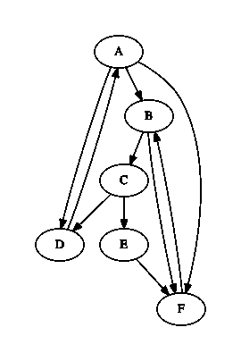

# Python 集合的终极指南

> 原文：<https://levelup.gitconnected.com/the-ultimate-guide-to-sets-in-python-c7556402726c>

## 计算机编程语言

## 你需要知道的一切。

由 [Jacob Ferus](https://medium.com/@dreamferus) 使用 Midjourney 生成。

set 类是 Python 中的关键数据结构之一。这是一个无序的元素集合，没有重复。在某种程度上，它表示一个数学集合，许多常用的集合数学运算都存在于 Python 中。通常集合的操作比列表的操作要快得多，因此，要编写有效的代码，集合是必不可少的。在本文中，我将解释 set 类的来龙去脉。我们开始吧。

# 初始化

在 Python 中有两种创建 set 对象的方法:使用`set(iterable)`或将元素放在花括号`{ ... }`中，用逗号分隔。例外情况是，如果花括号是空的，即`{}`，那么将创建一个字典，而不是一个空集。对于空集，使用`set()`。请注意，元素的顺序无关紧要，重复的元素将被删除。

集合中可以包含哪些元素？答案是只有**不可变*** 类型的对象。这些类型包括 float、int、string、bool 等。这与**易变的**类型相反，比如列表、字典和集合本身。如果你想学习更多关于 Python 中不同类型变量的知识，我推荐你阅读这篇文章。因此，以下内容将导致错误:

但是，当您需要存储(例如)一个集合中的唯一序列时，该怎么办呢？我将在本文的最后一节详细讨论这一点。

# *关于不变性的说明

不变性只是内置类型的一个约束。实际上，对象只需要是*可散列的*就可以插入到集合中，或者是字典中的关键字。默认情况下，自定义类有一个基于其 id 的散列，相等性由它们的 id 定义。这意味着两个属性相同的对象在进行相等性检查时是不相等的，除非它们是同一个对象或者已经定义了一个自定义的`__eq__`操作符。

如果定义了一个自定义`__eq__`操作符，它们将不再可用*，除非定义了一个自定义`__hash__`操作符*。这里很重要的一点是，如果两个对象相等，它们的哈希值也必须相等。否则，将对象添加到字典或字典集时会出现问题，因为在检查字典键和字典集是否存在时，会测试哈希值和相等性。

将可变对象放在集合中或作为字典键有意义的唯一情况是，它没有基于其可变属性的相等运算符。如果您确实有一个基于对象属性的相等运算符和相应的散列函数，那么如果您首先将它添加到一个集合，然后更改它，则用于将其保存在集合中的散列值将与当前散列值不同。这是不好的做法。

# 添加元素

向集合中添加元素有多种方式。为了*变异*一个集合，你使用`.add()`添加单个元素，使用`.update()`或等价的`|=`添加可迭代的元素:

通过变异，我的意思是改变原来的对象。您也可以添加不会修改原始集的元素。这可以通过使用`union()`或等效地使用`|`来完成:

使用`.update()`和`.union()`在行为上的明显差异可以在下面的例子中看出:

最后，您还可以使用析构来连接两个集合:

这将像一个`union()`的功能，但我会推荐`union()`代替它。

注意，我在上面的例子中使用了`.update()`，但是你也可以使用`|=`。这意味着`a |= b` ( `.update()`)是**而不是**与`a = a | b` ( `.union()`)是一回事，因为第一个对`a`中的对象进行变异，而第二个给`a`赋值。

# 删除元素

就像添加元素一样，*移除*元素也有等效的操作。下面我将向您展示前面显示的加法运算符的相应删除运算符:

*   `.add()`是`.remove()`
*   `.update()`是`.difference_update()`还是`-=`
*   `.union()`是`.difference()`还是`-`

示例:

再次，要注意`a -= b`(突变)和`a = a — b`(未突变)的区别。

还有一些其他有用的删除方法:

*   `.clear()`将删除列表中的所有元素。
*   如果存在的话`.remove()`只移除一个元素*(否则抛出一个错误)，如果元素不存在的话`.discard()`将什么都不做。*
*   `.pop()`将从集合中移除并返回一个随机元素。

# 其他修改操作

Python 中集合的强大之处之一是为它们提供了大量的内置操作。您已经看到了添加和删除元素，但是您还可以执行以下操作:

## 交集

两个集合之间的*交集*是包含在两个集合中的元素集合。它的操作符是:

*   非突变:`.intersection()`或`&`，即`a.intersection(b)`或`a & b`
*   变异:`.intersection_update`或`&=`

示例:

## 对称差或析取并

交集的反义词，即只属于集合中的*一个*而不属于两个集合的所有元素称为*对称差*或*析取并*。它的操作符是:

*   非突变:`.symmetric_difference()`或`^`，即`a.symmmetric_difference(b)`或`a ^ b`
*   突变:`.symmetric_difference_update()`或`^=`

示例:

# 比较方法

我已经向您展示了如何修改集合，但是集合主要用于检查它们内部的元素是否**快，** 否则使用列表会比较慢。让我们看看哪些操作可以做到这一点。

## 检查集合中是否存在

这可能是您对器械包执行最多的操作。通过使用`in`-操作符检查元素的存在或`not in`检查元素的不存在。与在列表中查找元素相反，时间复杂度是常数，O(1)。也就是说，即使您添加越来越多的元素，操作仍然会一样快。

## 检查一个集合是否是另一个集合的子集

如果第一个集合中的所有元素都存在于第二个集合中，那么这个集合就是另一个集合的子集。例如，(A，B，C)是(A，B，C，D)的子集。在 Python 中，这可以用`.issubset`或`<=`来检查。要检查一个集合是否是另一个集合的*真子集*，即它是一个子集并且它们不相等，可以使用`<`。但是注意也可以用`>=, >`。

## 检查集合是否没有共享元素

如果集合不共享任何元素，它们被称为*不相交*，在 Python 中，这可以用`.isdisjoint()`来计算。

# 集合理解

就像列表和字典一样，你可以使用*理解力。*这是通过在花括号内添加理解表达式并在每个循环中返回一个可变元素来实现的:`{ <element> for ... in ... }`。示例:

# 存储更复杂的类型

想象一下，你在独立的迭代中从一个节点走到另一个节点。例如，假设您在图中走了两次，并获得了路径:

*   `A -> B -> D`
*   `D -> C -> E -> B`

之后，如果您已经走过了某条路径，您可能想要快速查找，由于它的查找速度，set 是一个自然的选择。现在，当列表因为是可变的而不能被插入时，如何做到这一点呢？幸运的是，**元组**类**，**本质上是一个列表的不可变版本，可以在这些情况下使用。让我们看一个例子。

首先，我将使用字典生成一个图。每个键代表一个节点，值将列出该节点所有可能的目的地。

这将生成下图:

如果您想知道我是如何生成该图的，它是使用`graphviz`和以下代码完成的:

现在，我将执行长度为 1-10 的所谓的*随机漫步*，然后将结果路径作为元组存储在一个集合中。让我们看看在 100 次行走中我们能产生多少条独特的路径:

在 100 次随机漫步中，有 83 次是不同的。

现在，如果我们不关心节点的顺序，而只想存储访问过的节点，会怎么样呢？那么使用集合是有意义的，但是集合也是可变的。相反，我们可以使用 **frozenset** 类，一个不可变的集合。让我们为此添加一个新的循环:

# 摘要

由于某些操作的速度，集合是很有用的，它可以大大提高代码的效率。此外，Python 中有许多简洁而有用的方法来简化代码。感谢阅读。

如果您有兴趣阅读更多关于 Python 的文章，请查看我下面的阅读列表:

雅各布·费罗斯

## 计算机编程语言

[View list](https://medium.com/@dreamferus/list/python-c8e4719d93da?source=post_page-----c7556402726c--------------------------------)32 stories

如果你想成为中级会员，你可以使用我的[推荐链接](https://medium.com/@dreamferus/membership)。祝你有愉快的一天。