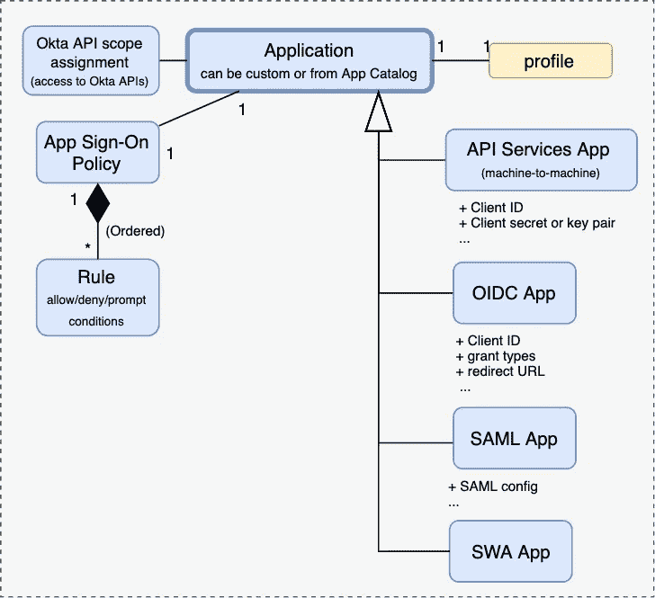

# Okta 概念的最终图解参考

> 原文：<https://levelup.gitconnected.com/the-ultimate-illustrated-reference-of-okta-concepts-cae1ef0bcd59>

## 给它命名驯服它。OIDC 和奥特在里面。

最近，我[注意到，当谈到我们的身份和访问管理解决方案时，我变得很困惑](https://www.rationality.org/resources/updates/2013/when-do-you-notice-confusion)。我们经常需要在我们的身份平台 [Okta](https://okta.com) ，OAuth 和 OIDC 标准，以及我们的俚语之间进行转换。事实上，Okta 有时对不同的概念使用相同的名称，或者对相同的概念使用不同的名称，这也没有帮助。

这就是为什么我想出了一个消除歧义的**地图，上面有 Okta、**中所有重要概念，以及它们**如何与 OAuth 2.0 和 OpenID Connect 用例相关联。你说出它的名字，你驯服它——希望不再有困惑！**

*   我们将从围绕目录、应用程序和安全性的重要概念开始。每一个都有一个图表，有简短的概念描述，潜在混淆的解释，以及文档链接。
*   然后，我们将看看这一切是如何组合在一起的——在一张图片中展现事物的宏伟蓝图。
*   最后，我们将深入探讨 Okta 配置如何与 [OpenID Connect SSO 和 OAuth 2.0 授权](https://developer.okta.com/docs/concepts/oauth-openid/#oauth-2-0)相关联。

这篇文章非常密集，是我认为最有用的部分的参考资料。它并不打算涵盖所有的复杂性，也不创建一个介绍性的指南。**没有耐心的人可以直接跳到“把所有东西绑在一起”部分**来看我认为最有价值的图表。

# 所有的积木

一开始会很乱……(图片由[里克·梅森](https://unsplash.com/@egnaro?utm_source=medium&utm_medium=referral)在 [Unsplash](https://unsplash.com?utm_source=medium&utm_medium=referral) 上拍摄)

## *目录*

两个关键概念是 [**用户**](https://help.okta.com/oie/en-us/Content/Topics/users-groups-profiles/usgp-people.htm) **和** [**群体**](https://help.okta.com/oie/en-us/Content/Topics/users-groups-profiles/usgp-about-groups.htm) 。希望这里没有歧义(除了用户也被称为“人”)。用户可以手动[创建、实时创建或导入](https://help.okta.com/oie/en-us/Content/Topics/users-groups-profiles/usgp-people.htm)。也可以根据 [**规则**](https://help.okta.com/en-us/Content/Topics/users-groups-profiles/usgp-about-group-rules.htm) 自动填充组。

另一个重要的概念是 [**简介**](https://help.okta.com/oie/en-us/Content/Topics/users-groups-profiles/usgp-user-profiles-main.htm) 。这就是困惑的开始。有一个*配置文件*定义了 [*属性*](https://help.okta.com/en-us/Content/Topics/users-groups-profiles/usgp-user-profile-attributes-main.htm) (名称、类型)，有一个对应的*配置文件*(图中黄色)与一个实体(用户、组、应用程序……)相关联，具有这些属性的实际*值*。我会用第一个字母的大写来区分这两个。

有几种类型的*配置文件* —用于用户、组、应用程序、目录或身份提供者(IdP)。它们定义了具体实体的相应*配置文件*可以编辑或访问的属性。

profile 值从何而来？目录和 IdP 配置文件是对存储在外部(例如，在 Active Directory 中)的数据的视图。用户简档可以手动编辑，也可以从 [**简档源**](https://help.okta.com/en-us/Content/Topics/users-groups-profiles/usgp-about-profile-sourcing.htm#:~:text=A%20profile%20source%20is%20an,the%20source%20for%20all%20profiles.) (目录或 IdP)中填写。组和应用程序配置文件可以手动编辑，但后者只能通过 Okta API 进行编辑。

一个 [**映射**](https://help.okta.com/oie/en-us/Content/Topics/users-groups-profiles/usgp-about-attribute-mappings.htm) 决定了不同配置文件之间的值如何传递。例如，当创建或更新用户时，可以根据映射从简档源简档中填充用户简档属性。当 Okta 需要更新外部系统中的帐户时，它也可以在另一个方向上工作。

有趣的事实:一个*应用配置文件并不对应一个应用配置文件🤯？*

除了 Okta 用户配置文件之外，在每个分配的应用程序的上下文中，所有用户都有一个单独的应用程序用户配置文件(称为[应用程序配置文件](https://help.okta.com/en-us/Content/Topics/users-groups-profiles/usgp-about-profiles.htm#App)或 [appuser](https://developer.okta.com/docs/reference/okta-expression-language/#application-user-profile) )。应用程序配置文件定义用户配置文件和应用程序用户配置文件之间的属性和映射。现在，Okta *中表示的应用程序*也有自己的[配置文件](https://developer.okta.com/docs/reference/okta-expression-language/#application-properties)。虽然这与用户完全无关，但它只是一堆与应用程序相关的值；这些甚至不能在 UI 中编辑，只能通过 Okta API 编辑[。底线是*应用简档*仅与应用相关，而*应用简档*和*应用用户简档*(*应用简档*)与应用和用户之间的映射相关。](https://developer.okta.com/docs/reference/api/apps/#request-example-25)

*迷茫？现在你知道我为什么有写这篇文章的冲动了。*

## 应用程序

下一组概念是围绕 [**应用**](https://help.okta.com/en-us/Content/Topics/Apps/apps-overview-get-started.htm) 展开的。如果首先想到的是从客户端接收令牌的后端服务，请三思🤔。应用在 Okta 是一个可以*请求*令牌的东西。它更接近 OAuth 2 中的客户端或 OIDC 的依赖方。

一个应用程序拥有关于它希望 Okta 通信的协议(流、授权类型)、凭证、可以使用该应用程序的用户等信息。还使用了术语 App 或应用程序集成，后者主要是在预构建([相对于定制](https://help.okta.com/en-us/Content/Topics/Apps/apps-overview-get-started.htm))应用程序的上下文中。

不幸的是，另一个模糊之处需要澄清。Okta 将术语*应用*用于不同的概念——个人资料来源:

> 配置文件源是一个应用程序，它充当用户配置文件属性的真实来源。一个用户一次只能由一个应用程序或目录提供。

根据上下文，我假设他们实际上指的是身份提供者，但也许有一个隐藏的关系我还没有弄清楚🤷。

有几种类型的应用程序(应用程序集成？)根据预期的交互类型——OIDC、SAML……对于机器对机器的集成，可以使用 [API 服务](https://developer.okta.com/docs/guides/implement-oauth-for-okta-serviceapp/main/#create-a-service-app-integration)应用。

除非应用程序旨在进行机器对机器的交互，否则它会将[分配给用户和组](https://help.okta.com/en-us/Content/Topics/Apps/apps-assign-applications.htm)，以确定哪些用户可以与该应用程序进行交互(例如，向其发放它所请求的身份令牌)。该应用程序还有一个 [**应用程序登录策略**](https://developer.okta.com/docs/guides/archive-configure-signon-policy/main/) 。稍后我们将讨论 *Okta* 登录策略，该策略控制允许用户如何登录 Okta(例如，MFA 要求)。*应用*登录策略可以进一步限制对每个应用的访问(例如，要求重新认证的频率)。

## 安全性

我们最后一组概念位于 Okta UI 的 Security 下。

关键概念是 [**授权服务器**](https://developer.okta.com/docs/concepts/auth-servers/)**——**一个用于生成 OIDC 身份令牌或 OAuth 2.0 访问/刷新令牌的引擎。它代表一个安全边界，有自己的签名密钥、发行者 URI 和受众(最终令牌接收者的标识符)。有一个内置的 *Org* 授权服务器用于访问 Okta 本身，并且可以为自定义应用程序提供多个*自定义*授权服务器。

可以为每个授权服务器定义一组自定义的 [**范围**](https://developer.okta.com/docs/guides/customize-authz-server/main/#create-scopes) (授权期间请求的访问权限)和 [**声明**](https://developer.okta.com/docs/guides/customize-authz-server/main/#create-claims) (关于令牌主体的声明)。

所有这些都通过 [**访问策略**](https://developer.okta.com/docs/guides/customize-authz-server/main/#create-access-policies) 与应用程序捆绑在一起。它们决定应用程序可以请求哪些范围*和*令牌生命周期。他们可以通过策略限制授权类型和允许获得令牌的用户，即，只有在给定条件下存在允许令牌的访问策略时，才能为用户颁发令牌。每个策略可以分配给一个或多个应用程序(Okta 在这个上下文中称为“客户端”)🤦).

另一个概念是 [**身份提供者**](https://help.okta.com/oie/en-us/Content/Topics/Security/Identity_Providers.htm#:~:text=Identity%20Providers%20(IdPs)%20are%20services,account%20or%20a%20smart%20card.)——一种管理用户帐户的服务，可以用作前面讨论的用户和用户配置文件的来源。 [**路由规则**](https://help.okta.com/oie/en-us/Content/Topics/Security/Identity_Provider_Discovery.htm) 控制用户在什么情况下会被转发到什么 IdP。

身份提供者充当 Okta 实例用户的来源，但是注意 Okta 本身可以充当另一个系统的身份提供者。这甚至可能是另一个 Okta 实例。如果源 Okta 实例 *S* 为目标实例 *T* 提供身份，那么 *T* 将在 *S* 中表示为一个(例如 SAML)应用，而 *S* 将在 *T* 中表示为一个身份提供者。

[**Okta 登录策略**](https://help.okta.com/en-us/Content/Topics/Security/policies/about-signon-policies.htm) 和 [**密码策略**](https://help.okta.com/en-us/Content/Topics/Security/policies/about-password-policies.htm) 控制属于所选群组的用户如何登录 Okta。安全性部分的其他概念超出了本文的范围。

# 把这一切联系在一起

照片由 [Mohamed Ziyaadh](https://unsplash.com/@ziyaadhphotos?utm_source=medium&utm_medium=referral) 在 [Unsplash](https://unsplash.com?utm_source=medium&utm_medium=referral) 上拍摄

事情的大计划来了。我强调了将所有部分结合在一起的**关键概念:用户/组—应用程序—访问策略—授权服务器。**所有的概念都存在于一个 [Okta 组织](https://developer.okta.com/docs/concepts/okta-organizations/)中，作为实体的隔离容器。

我们可以看到 Okta 为不同的用例提供的杠杆:

*   一个神奇之处是维护用户目录——除了手动创建用户和组之外，还可以从配置文件源(IdP 或目录)导入用户和组，使用规则将其分配给组，并根据配置文件属性定义和映射填充其配置文件。
*   第二个魔术是关于通过身份和/或访问令牌进行委托身份或访问验证。授权服务器根据访问策略向应用程序代表的客户端发放令牌。
*   剩下的主要是对 Okta 和应用程序的细粒度访问控制。

## 与 OpenID 连接和 OAuth 的关系

委托身份验证的用例，如 OIDC 单点登录，或 OAuth 2.0 的委托授权，值得更多的细节。以下是相关概念的简化部分:

典型的流程可能如下所示:

1.  在 Okta 中表示为应用的客户端(例如，OAuth 客户端或 OIDC 依赖方，*发起对令牌的请求*。它既可以代表用户，也可以独自进行机器对机器的交互。在前一种情况下，令牌只能颁发给(直接或通过群组)将分配给应用程序的用户*，并且可以进一步受到应用程序登录策略的限制。允许的流(授权类型)由应用程序确定，该应用程序还持有相关凭证(例如，客户端 ID/秘密)。*
2.  令牌请求*被转发到授权服务器*。只有在访问策略允许的情况下，才会授予该权限。访问策略还控制在为授权服务器配置的范围中可以请求哪些范围。
3.  如果允许的话，一个*令牌被发布*，它包含所请求的作用域、像受众和发布者这样的属性(这是授权服务器配置的一部分)以及其他声明。声明可以来自不同的[来源](https://developer.okta.com/docs/reference/okta-expression-language/#organization-properties)，比如用户档案、appuser 档案或应用程序档案。
4.  最后，*令牌到达发起请求的客户机*(应用程序)。客户端可以使用身份令牌来验证用户的身份和配置文件信息(例如，用于 SSO 目的)，或者使用访问令牌来访问受保护的资源。为了验证令牌，客户端可以使用由授权服务器[端点](https://developer.okta.com/docs/concepts/auth-servers/#custom-authorization-server-discovery-endpoints)之一公开的信息(比如公钥)。

# 结论

如你所见，可能会有很多歧义。当有人说“应用程序”时，他们实际上是指 OAuth 客户机吗？后端服务？Okta App 集成？或者甚至是身份提供者？

当我们不能清楚地说出事物的名称时，我们就失去了清晰地思考我们正在建造什么的能力。另一方面，给事物起个好名字，并始终如一地创造出对目标的共同理解。我希望这篇文章能帮助你像我一样建立这样的理解。

PS:想看更多概念图吗？关于什么话题？我想听听你的意见！

# 分级编码

感谢您成为我们社区的一员！在你离开之前:

*   👏为故事鼓掌，跟着作者走👉
*   📰查看[升级编码出版物](https://levelup.gitconnected.com/?utm_source=pub&utm_medium=post)中的更多内容
*   🔔关注我们:[Twitter](https://twitter.com/gitconnected)|[LinkedIn](https://www.linkedin.com/company/gitconnected)|[时事通讯](https://newsletter.levelup.dev)

🚀👉 [**软件工程师的顶级工作**](https://jobs.levelup.dev/jobs?utm_source=pub&utm_medium=post)