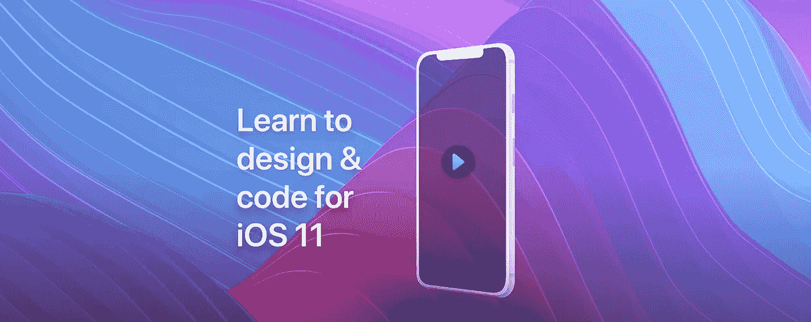
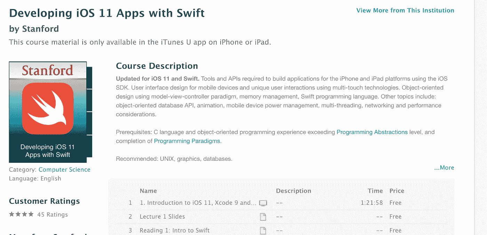
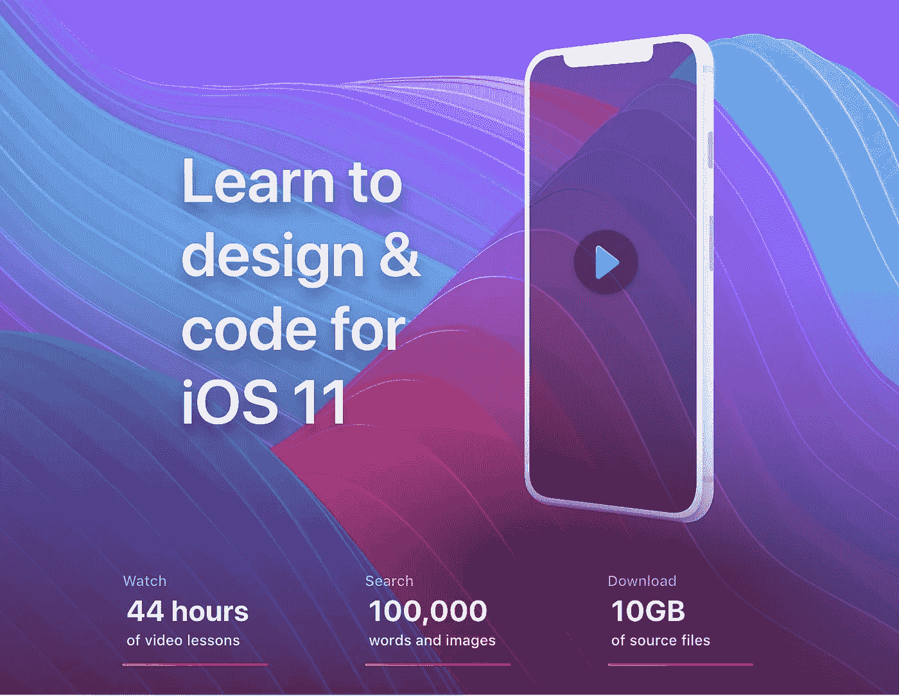
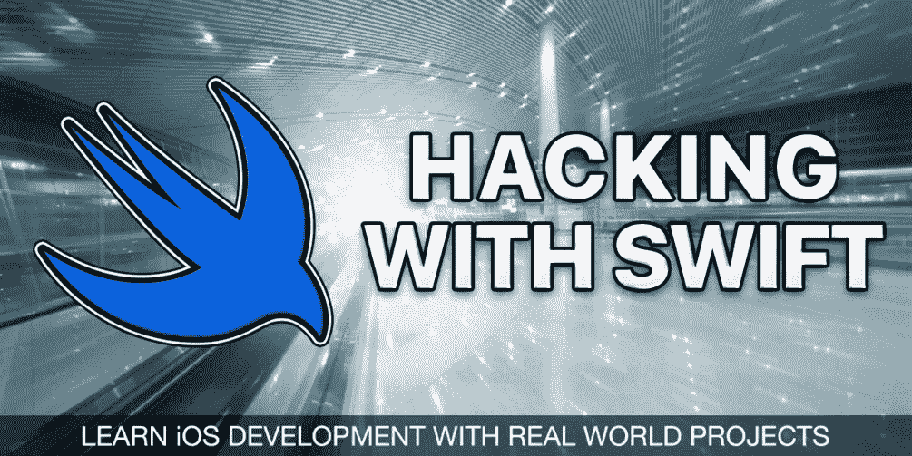
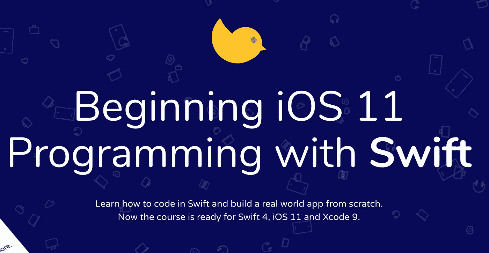
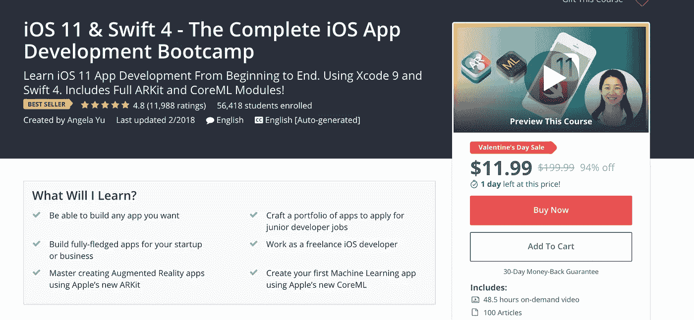
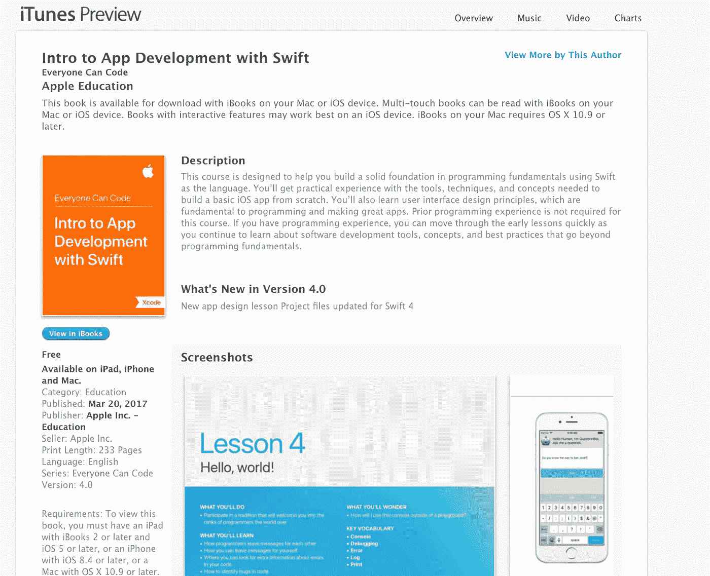
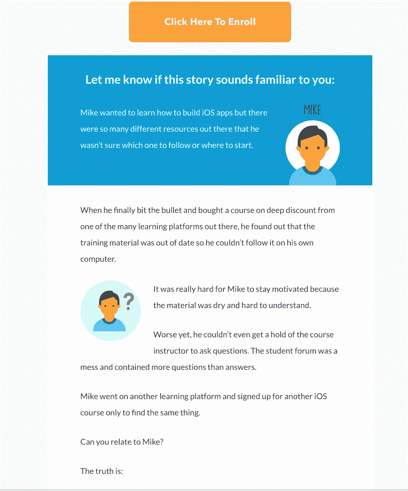
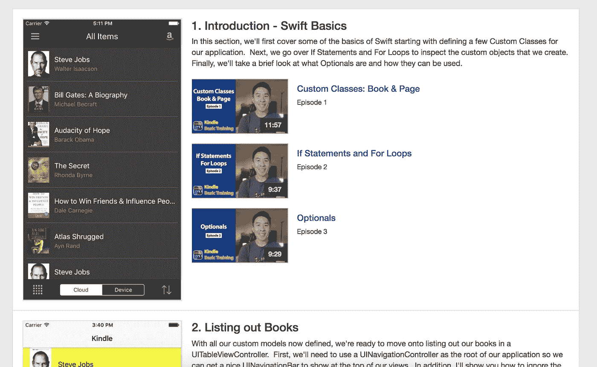
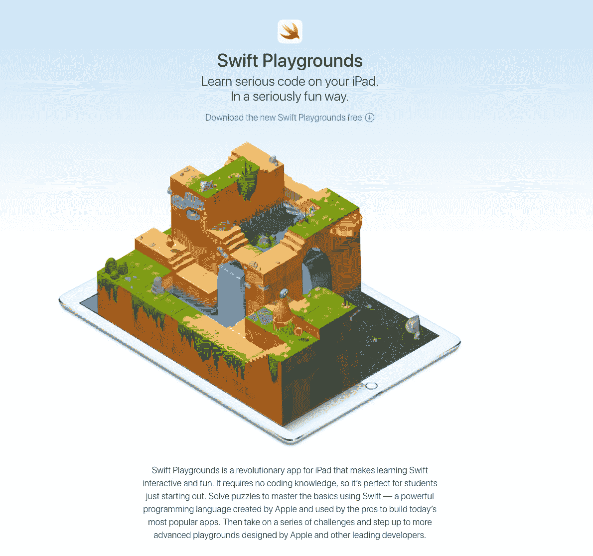

# 掌握 Swift 和 iOS 开发的终极资源列表— 2018 版

> 原文：<https://levelup.gitconnected.com/the-ultimate-list-of-resources-to-mastering-swift-and-ios-development-2018-edition-3bd2a87ff400>

[图像来源](https://designcode.io/)

[**Swift**](https://en.wikipedia.org/wiki/Swift_(programming_language)) 是由[苹果公司](https://en.wikipedia.org/wiki/Apple_Inc.)为 [iOS](https://en.wikipedia.org/wiki/IOS) 、 [macOS](https://en.wikipedia.org/wiki/MacOS) 、 [watchOS](https://en.wikipedia.org/wiki/WatchOS) 、 [tvOS](https://en.wikipedia.org/wiki/TvOS) 和 [Linux](https://en.wikipedia.org/wiki/Linux) 开发的通用、多范式、编译型编程语言。

***学习 Swift 从未如此容易*** 。这里是我收集的一些奇妙的资源——从初学者到专家！

**更新:**在这里抢一本 Swift 编程书[。在这里找到 kindle 版本](https://amzn.to/2NXHMS8)。

*这些课程都是最新的:* **Swift 4** ， **Xcode 9** ， **iOS 11**

## [用 Swift 开发 iOS 11 应用——斯坦福](https://itunes.apple.com/us/course/developing-ios-11-apps-with-swift/id1309275316)——免费

**:等级:初级—中级**

## 你将学到什么；

*   从对 Swift、Xcode 和 iOS 开发一无所知开始，您将掌握使用 Swift、MVC 架构等的基础知识！
*   绘画和动画。
*   多点触摸
*   核心运动和摄像机
*   面向对象编程基础。

## [学会为 iOS 11 设计&代码](https://designcode.io/) — 9$月

**等级:初级—中级—高级—专家**

## 你将学到什么；

*   设计 iOS，苹果电视，iPad 应用程序。
*   运送您的产品。
*   从初级到高级 Swift 编程。
*   排印
*   Xcode

## [用 Swift 进行黑客攻击](https://www.hackingwithswift.com/) —免费

**等级:初级—中级**

使用 Swift 进行黑客攻击是学习 Swift 的必备书籍。

## 你将学到什么；

*   常量和变量，UITableView，UIImageView，FileManager，故事板
*   资产目录，UIButton，CALayer，UIColor，UIAlertController
*   UIBarButtonItem，UIActivityViewController，URL
*   loadView()，WKWebView，URLRequest，UIToolbar，UIProgressView，键值观察
*   更多！

# [使用 Swift 开始 iOS 11 编程](https://www.appcoda.com/swift/) — 39 美元

**等级:中级**

## 你将学到什么；

*   自动布局
*   堆栈视图
*   表格视图、标签栏和导航控制器
*   动画和视觉效果
*   使用地图、3D 触控和用户通知
*   支持多种语言
*   在原生 iOS 应用上嵌入/显示网页内容。

## [iOS 11 & Swift 4 —完整的 iOS 应用开发训练营](https://www.udemy.com/ios-11-app-development-bootcamp/learn/v4/overview) — 9.99 美元— 49.99 美元

**等级:初学者**

## 你将学到什么；

*   面向对象编程(OOP)的概念:类型系统、变量、函数和方法、继承、类和协议。
*   控制结构:使用 If/ Else 子句、Switch 语句和逻辑来控制执行流程。
*   数据结构:如何使用集合，如数组和字典。
*   软件设计:如何组织和格式化代码以提高可读性，以及如何实现模型视图控制器(MVC)设计模式。
*   联网:如何进行异步 API 调用，从云中存储和检索数据，以及使用 JSON 格式进行服务器通信。
*   机器学习:如何使用 iOS 11 的新 CoreML 框架制作人工智能 app。
*   增强现实:如何在增强现实中创建 3D 对象，并使用苹果最新的 ARKit 框架创建令人难以置信的动画和现实生活中的交互。
*   核心数据、领域和其他形式的持久数据存储。

## 【Swift 应用开发简介(苹果教育)——免费

**等级:初学者**

## 你将学到什么；

*   您将获得从头构建基本 iOS 应用程序所需的工具、技术和概念的实践经验
*   您还将学习用户界面设计原则，这是编程和制作优秀应用程序的基础。

# 如何制作一个没有编程经验的应用程序——197.00 美元

**等级:初学者**

虽然有点贵，但如果你觉得没用，他们会很乐意给你退款。

> 你有 30 天的时间来尝试我的课程，没有风险！即使你告诉我你没有时间尝试或者你改变了主意，只要在 30 天内给我发电子邮件，我会很乐意给你全额退款。

## 你将学到什么；

*   6 个成熟的视频培训模块将释放你的潜力，帮助你越过“驼峰”
*   您将在 Swift、Xcode 和应用程序开发最佳实践方面拥有坚实、实用的**基础**
*   你将拥有一个由 4 个真实应用组成的**组合**，你可以用它来接受采访或向你的朋友展示

## [用 Swift](https://www.letsbuildthatapp.com/basic-training) 打造 Kindle——20 美元

**等级:初学者**

## 你将学到什么；

*   自定义类别
*   If 语句和 for 循环，可选-基本运算符。
*   导航和 UITableView。
*   自动布局
*   手动音量调节

## Swift playgrounds (苹果)——免费！(仅限 iPad)

**等级:初学者**

# 出色的 iOS、Swift、Mac OS 资源和时事通讯

[**Awesome iOS**](https://github.com/vsouza/awesome-ios)—Awesome iOS 生态系统的策划列表，包括 Objective-C 和 Swift 项目([http://awesomeios.com](http://awesomeios.com/))

[**Awesome Swift**](https://github.com/matteocrippa/awesome-swift)**—Awesome Swift 库和资源的协作列表。请随意投稿！**

**[**raywenderlich.com**](https://www.raywenderlich.com/)**——**大量 Swift、iOS、MacOS 教程。**

**[**AppCoda 周刊**](http://digest.appcoda.com/)**——**必读 Swift & iOS 编程文章，让你的技能更上一层楼。每周二送！**

******——**最受欢迎的 iOS 新闻、文章和库的每周概述****

# ****真棒快速 Youtube 频道检查出来****

****[letsbuildthaapp](https://www.youtube.com/channel/UCuP2vJ6kRutQBfRmdcI92mA/videos)——[贾里德·戴维森](https://www.youtube.com/user/Archetapp)——[极客柠檬](https://www.youtube.com/user/GeekyLemon)——[布莱恩降临](https://www.youtube.com/channel/UCysEngjfeIYapEER9K8aikw)——[CodeWithChris](https://www.youtube.com/user/CodeWithChris)****

# ****挑战****

****有什么比用 Swift 实际构建东西更好的学习方法呢？这里有一些挑战值得一试。****

****[Swift 30 天](https://github.com/allenwong/30DaysofSwift) —每天构建一个 Swift 应用，持续 30 天！没有例外！****

****大量的信息，希望对你有用！如果你有这篇文章中没有的很酷的链接/教程，请把它们添加到评论中，我可能会把它们添加到这篇文章中。****

## ****以下是我之前的一些文章；****

**** [## 成为顶级开发人员的秘诀是构建东西！这里有一个有趣的应用程序列表！

### 只有付出努力，你才能成为伟大的开发者。想象一下——你不可能身体健康…

medium.freecodecamp.org](https://medium.freecodecamp.org/the-secret-to-being-a-top-developer-is-building-things-heres-a-list-of-fun-apps-to-build-aac61ac0736c)  [## 最好的前端黑客备忘单—都在一个地方。

### 记住所有的 API 是相当不可能的。这时，小抄就出现了！这里是最好的前端…

medium.freecodecamp.org](https://medium.freecodecamp.org/modern-frontend-hacking-cheatsheets-df9c2566c72a)****