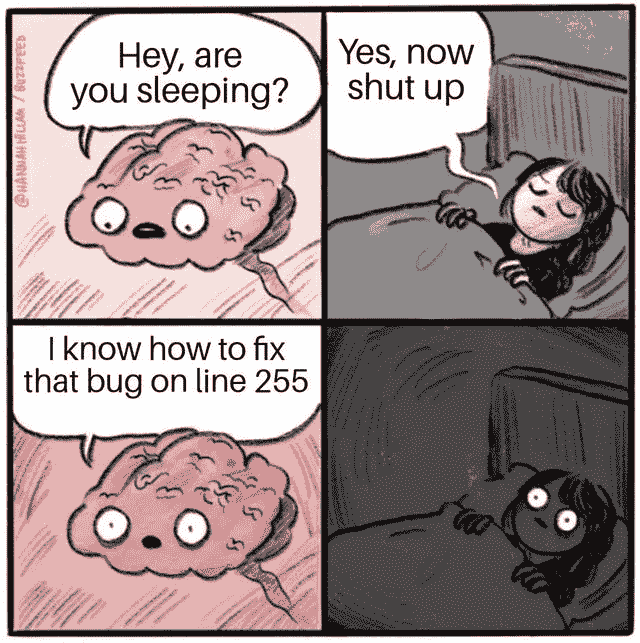
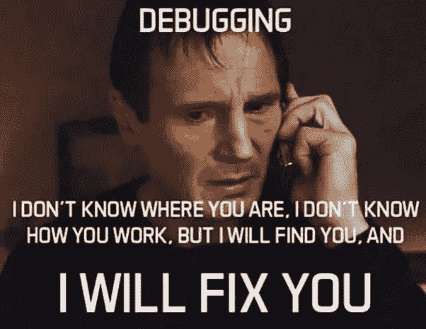
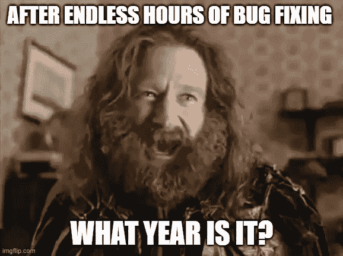

# 解决 bug 的最终方法是小睡一会儿

> 原文：<https://levelup.gitconnected.com/the-ultimate-solution-for-fixing-bugs-is-to-take-a-nap-23a3fd6d5b2f>

## 高效，但难以执行

被内森·考利捕获

我算不上什么艺术家，但让我给你画一幅画吧。

你坐在椅子上，喝着咖啡，用你最喜欢的编程语言编写代码。但是突然，发生了一些事情，你的代码停止工作。

错误就在你面前，但是 StackOverflow 上的人并不热衷于帮助你。你自己被困住了，需要想办法解决。

你无缝地盯着屏幕。但是你花的时间越多，你就越沮丧。

越来越烦了，但是在这个节骨眼上，你无法把它从脑海中抹去。你所能想到的就是如何解决这个问题。好像不修好就无法继续前进。

[原始来源](https://pbs.twimg.com/media/EUrAlPbUEAAjqel.jpg)

这种情况你听着耳熟吗？如果是这样，这意味着**你修复漏洞的能力太差了。**

不过不用担心，我会教你怎么改进的。

# 修复 bug 的终极解决方案

如果你曾经想变得更擅长修复错误，你做了一些关于这个主题的研究。你可能找到了一些*“快速修复 bug 的 X 技巧”*文章。

这些帖子提供的建议听起来不错，但在现实世界中几乎没有应用。

事实是，你要么马上修复一个 bug，要么花无数个小时去做。

[原始来源](https://qph.cf2.quoracdn.net/main-qimg-7953d829cd2895da486d51ceddbd7c7e-lq)

如果你已经花了一个多小时解决这个问题，10 条建议对你没有帮助。解决方案实际上要简单得多。

你需要休息一下！

尽可能远离你的电脑。小睡一会儿，或者散散步。做任何让你不去想你正在试图解决的问题的活动。

> 远离一个问题可以帮助你以更客观的方式面对它。

# 让阿基米德教我们

阿基米德是这个星球上最聪明的人之一。他仍然被认为是有史以来最伟大的科学家之一。两千年前，他面临着一项艰巨的任务。

一个国王给了他一顶金冠，有被欺骗的嫌疑。国王认为王冠不是纯金做的，他相信他被金匠欺骗了。

然而，国王无法证明他的怀疑。他让阿基米德自己证明，但不要损坏皇冠。

阿基米德花了几天时间试图解决这个问题。他几乎放弃了，声称这是不可能的。但突然，他在洗澡时想到了一个绝妙的主意。

阿基米德原理就这样诞生了。利用这个原理，阿基米德能够证明国王确实被金匠欺骗了。

> 当一个物体部分或全部浸没在液体中时，它的重量明显减少，减少的重量等于该物体浸没部分所排开的液体重量。—阿基米德原理

人类最伟大的发现之一是在洗澡时诞生的。

谁知道呢？也许那天阿基米德不洗澡，就永远想不出他的发现。除此之外，他很可能会臭气熏天。

# 离开是很难的

几天前，我在做日常编程工作。突然弹出错误，和我之前看到的完全不一样。

几个小时过去了，我仍然粘在椅子上，无法解决问题。在这一点上，我变得非常沮丧，我知道我可能应该休息一下。

但是因为某些原因，我不能。我有一种感觉，我非常接近解决这个错误。我觉得离开会毁掉我今天取得的所有进步。

最终，我处于崩溃的边缘，我知道我现在必须离开。我去厨房喝了些水。但是，我的脑子还是快疯了。我能想到的就是这个愚蠢的错误。

我几乎能听到我的电脑在敲[巨满记](https://www.imdb.com/title/tt0113497/)鼓。我越来越清楚我不能呆在家里。

[原始来源](https://imgflip.com/i/6ptdm5)

我去尽可能远的地方，一直到海滩，在海里游一会儿泳。最终，我的心灵放松了，我能够忘记这个问题。

当我神清气爽地回来时，我坐下来，尝试了几件事，几分钟内，错误就消失了。

经过这次经历，我明白了一些事情。

> 修正错误很容易，但放手却很难。

开发人员的大脑是为解决问题而设计的。当我们不能马上做到时，它会让我们发疯。最重要的是，当你不能当场修复错误时，你会有一种感觉，你将来也不能这样做。

这种感觉让我们粘在椅子上。这最终会让我们变得有点疯狂。处理这种感觉的唯一方法就是相信自己。要知道无论你面临什么问题，你最终都会解决它。

只有当你意识到这一点，你才能放开那些虫子。以后再解决。

# 结束语

你不能总是控制生活(或你的代码库)扔给你什么。但是你可以控制自己的反应。当某件事让你感到压力和愤怒时，后退一步，远离这个问题是有帮助的。

当你这样做时，你会更客观地看待形势。最重要的是，当你回来面对问题时，你更有可能想出一个不同的方法。

最终，你会找到处理它的方法。

*如果想多读书，* ***通过使用*** [***这个链接***](https://bernardbad.medium.com/membership) ***成为中等会员。*** *如果你想获取我的优质内容，* [***加入我的快讯***](https://upbeatcode.substack.com/) *。*

# 分级编码

感谢您成为我们社区的一员！在你离开之前:

*   👏为故事鼓掌，跟着作者走👉
*   📰查看[升级编码出版物](https://levelup.gitconnected.com/?utm_source=pub&utm_medium=post)中的更多内容
*   🔔关注我们:[Twitter](https://twitter.com/gitconnected)|[LinkedIn](https://www.linkedin.com/company/gitconnected)|[时事通讯](https://newsletter.levelup.dev)

🚀👉 [**加入升级人才集体，找到一份惊艳的工作**](https://jobs.levelup.dev/talent/welcome?referral=true)